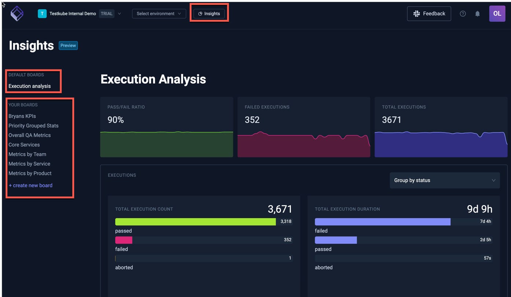
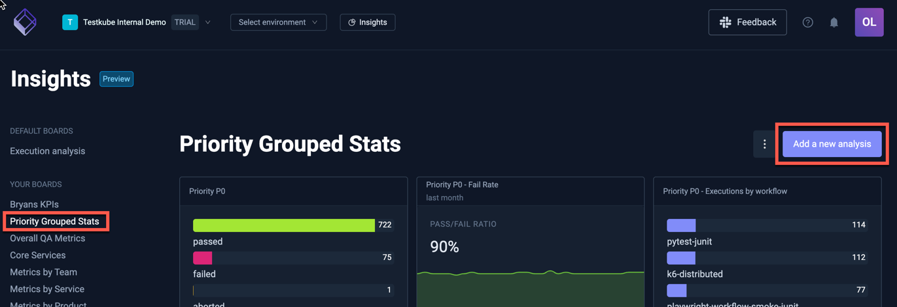
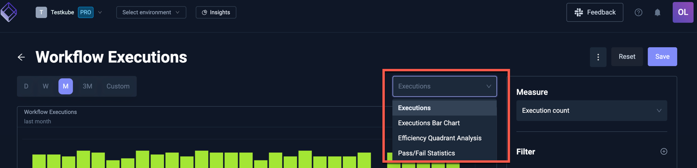
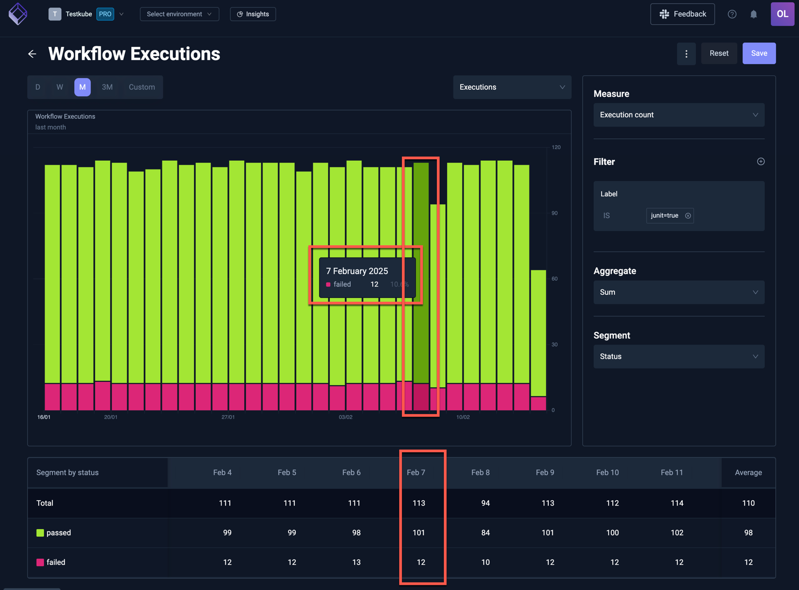
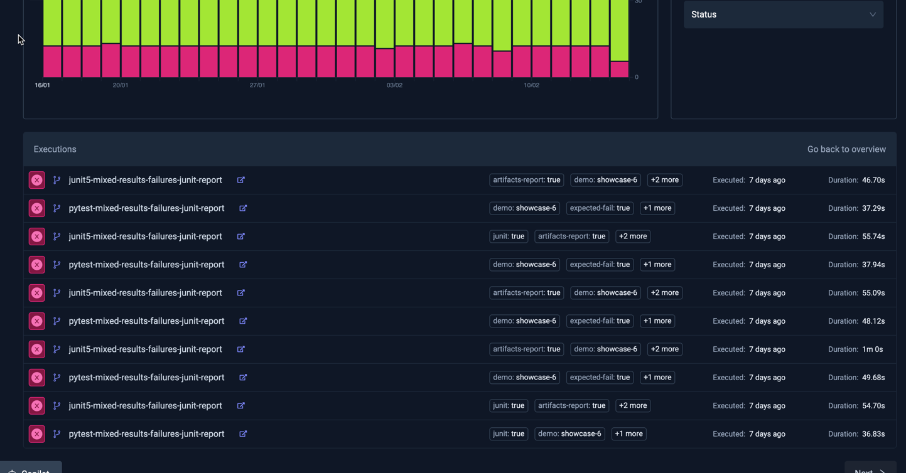
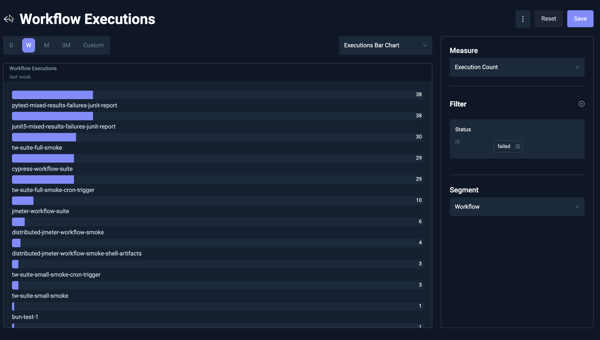

# Test Insights

Insights turns your Testkube executions into a real-time dataset you can analyze to better understand how you work.
This feature allows teams to track key performance indicators including the number
of test executions, pass/fail rates, execution durations, and more, all within a user-friendly Dashboard.

With Test Insights, DevOps and QA managers can quickly answer crucial questions that impact the testing
cycle and overall software quality, such as:

- Which tests take the longest to execute and why?
- Which tests have the highest failure rates?
- How do test performance metrics vary by type of test or by the tools used?
- How do key test execution metrics change over time?

By integrating Test Insights into your testing workflow, your team can leverage several benefits:

- **Enhanced Visibility:** Gain a clear overview of testing activities and outcomes, helping
  you manage and prioritize testing resources more effectively.
- **Data-Driven Decisions:** Make informed decisions about where to allocate efforts for improving
  test efficiency and reliability.
- **Improved Test Efficiency:** Identify and address inefficiencies in your testing process, leading
  to faster development cycles and higher quality software releases.

## Using Test Insights

Test Insights are available from the top menu, which will take you to a default "Execution Analysis" Board with 
premade charts.

The "Your Boards" section contains all Boards created within your organisation. 

:::note
There is currently no way to limit access to individual boards for organisation members; everyone has access
to all boards and can thus see all data within (which is read-only). 

If this is a concern you can disable Insights entirely for from the [Product Features Panel](/testkube-pro/articles/organization-management#product-features).
:::

## Boards

### Default Board: Execution Analysis

The default Execution Analysis board has three sections which all show data over the last month:

The top part of the Execution Analysis module shows high-level execution metrics.

Underneath you can find you can find a quick overview of execution count duration.
You can either group your executions by status or workflow by using the selector.

Lastly, the execution efficiency analysis shows tests by execution time and frequency. Tests that
frequently run and take longer to execute appear in the top right quadrant, highlighting them as prime
candidates for optimization to reduce testing bottlenecks, improve cycle times and optimize infrastructure costs

### Managing Custom Boards

You can add as many boards as you need to Insights under an Organisation and each board can in turn contain
as many analysis charts as needed, allowing you to group your analysis in any way that aligns
with your testing activities.

You can manage a board as follows:

- **Create Board**: You can create a board by clicking on "Create new board".
After filling in details such as name and description, you can add your first analysis.

- **Rearrange board**: Hover an analysis insight and in the top-right corner you can find a handle to drag and drop your analysis.
You can move it around to a new row or put it in front or behind another analysis. You can only add up to three analysis per row.
Responsiveness of boards are limited to larger screen sizes.

- **Update Board**: You can go to the board's setting by clicking on the dotted menu. Here you can update both the name and the description.

- **Delete Board**: You can go to the board's setting and delete the board in the danger zone at the bottom.
Your board and all analysis will be removed, no execution data will be deleted.

## Working with Analyses

You can add as many analyses to a board as needed; use the "Add a new analysis" button on the top right to do so:

Adding a board takes you to the Analysis editor where you can configure what data to show and how to show it.

### The anatomy of the Analysis Editor

At the top you can see a Period Selector for selecting the last day, week, month, quarter or any custom period.
The interval is automatically inferred depending on the size of the period.
A period less than two days will have an hourly interval, then daily, and up to weekly when looking at a quarter.

More to the right, you can see the Analysis Selector: it defaults to **Executions** time series, but you can also 
select **Executions Bar Chart**, **Efficieny Quadrant Analysis** and **Pass/Fail Statistics** (all described below)

Under the period and analysis selector, you will find your selected chart with its controls on the right side.
The controls vary depending on the selected chart and include the ability to filter executions on workflow name, environment, status and labels.
The workflow names support regexes, so you could perfectly filter all workflows prefixed with `performance` by adding a `performancy.*` filter.
One limitation is that you currently cannot negate a filter literal yet.

### Executions Time Series

The execution time series allows you to analyse your executions over time.

The x-axis will always be the time, whereas the y-axis is defined by your **Measure**. Currently, you can measure the execution count, duration or the JUnit case count.

You can use the **Aggregate** to decide how to treat multiple executions of the same workflow within each interval. For example, for the duration you can take the sum, average, minimum or maximum.

Lastly, you can set a **Segment** which will break down your executions.
You can do this by the status to see which executions passed or failed,
by workflow name or by any of the labels found on the executions.

### Executions Table and Drill Down

Besides a graph view, the Executions time series analysis also comes with a table view.
This is useful to see trend across a single segment.
Currently, segmentation within a graph is also limited to 25 largest segments.
For segmentation with a high cardinality, you can view the remaining segments within the table, which are 
most often too tiny to see within the Graph View.

You can click on either the segment name or a table cell value to drill down on the execution references that relate to this.
Imagine that you filter on failed executions for a certain label, and you wonder which executions are failing.
Drilling down easily allows you to analyse and troubleshoot these executions.

For example - the following Analysis shows all Executions labeled `junit=true`, with February 7th highlighted when there 
were 12 failed executions:

Clicking on the "12" in the table will show those 12 executions in a table:

- Selecting an execution will open the corresponding [Workflow Execution Details](/articles/testkube-dashboard-execution-details) panel.
- Selecting the "Back to overview" link on the top right of the table will take you back to the metric view above.

### Executions Bar Chart

This shows a bar chart with the number of executions for each selected segment. For example, the below Analysis
shows the top failing Workflows over the last week:

### Efficiency Quadrant Analysis

The execution efficiency analysis shows tests by execution time and frequency. Tests that
frequently run and take longer to execute appear in the top right quadrant, highlighting them as prime
candidates for optimization to reduce testing bottlenecks, improve cycle times and optimize infrastructure costs:

Hovering a marker in the chart reveals the corresponding Workflow.

The table below the chart shows plotted Workflows sortable by a number of attributes.

### Pass/Fail Stats

The pass/fail stats shows details about workflow executions that failed or passed.
These analysis are useful to quickly understand if certain workflows need attention.

