# Test Insights

Insights turns your Testkube executions into a real-time dataset you can analyze to better understand how you work.
This feature allows teams to track key performance indicators including the number
of test executions, pass/fail rates, execution durations, and more, all within a user-friendly Dashboard.

With Test Insights, DevOps and QA managers can quickly answer crucial questions that impact the testing
cycle and overall software quality, such as:

- Which tests take the longest to execute and why?
- Which tests have the highest failure rates?
- How do test performance metrics vary by type of test or by the tools used?
- How do key test execution metrics change over time?

By integrating Test Insights into your testing workflow, your team can leverage several benefits:

- **Enhanced Visibility:** Gain a clear overview of testing activities and outcomes, helping
  you manage and prioritize testing resources more effectively.
- **Data-Driven Decisions:** Make informed decisions about where to allocate efforts for improving
  test efficiency and reliability.
- **Improved Test Efficiency:** Identify and address inefficiencies in your testing process, leading
  to faster development cycles and higher quality software releases.

## Using Test Insights

Test Insights are available from the top menu. The Insights sidebar helps you navigate between boards:

- **All Boards** — a searchable grid of every board you can access in the Organization
- **Execution Analysis** — the default board with premade charts
- **Pinned Boards** — boards you have pinned for quick access
- **Shared Boards** — boards shared across the Organization
- **Private Boards** — boards visible only to you

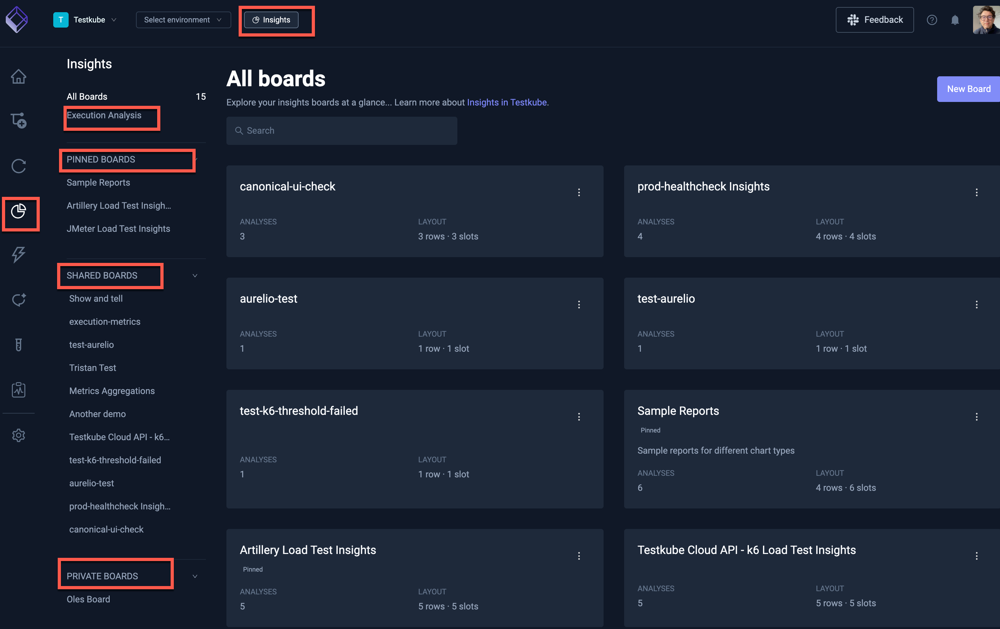

Use **All Boards** to browse, search, and paginate through every board at a glance. Each card shows the board name,
description, analysis count, and layout summary. Click a card to open the board.

You can create a board from **+ Create a new board** at the bottom of the sidebar or from the **New Board** button on
the All Boards page.

:::note
Boards can be **shared across the Organization** or kept **private**. Private boards are visible only to their
creator. Shared boards are visible to all Organization members, but only the creator or an Organization admin can
edit or rearrange them. Deleting a shared board requires Organization admin permissions.

Pinning a board is personal — it adds the board to your **Pinned Boards** section without changing who can access it.

If Insights should not be available in your Organization, disable it from the
[Product Features Panel](/articles/organization-management#product-features).
:::

## Boards

### Default Board: Execution Analysis

The default Execution Analysis board has three sections which all show data over the last month:

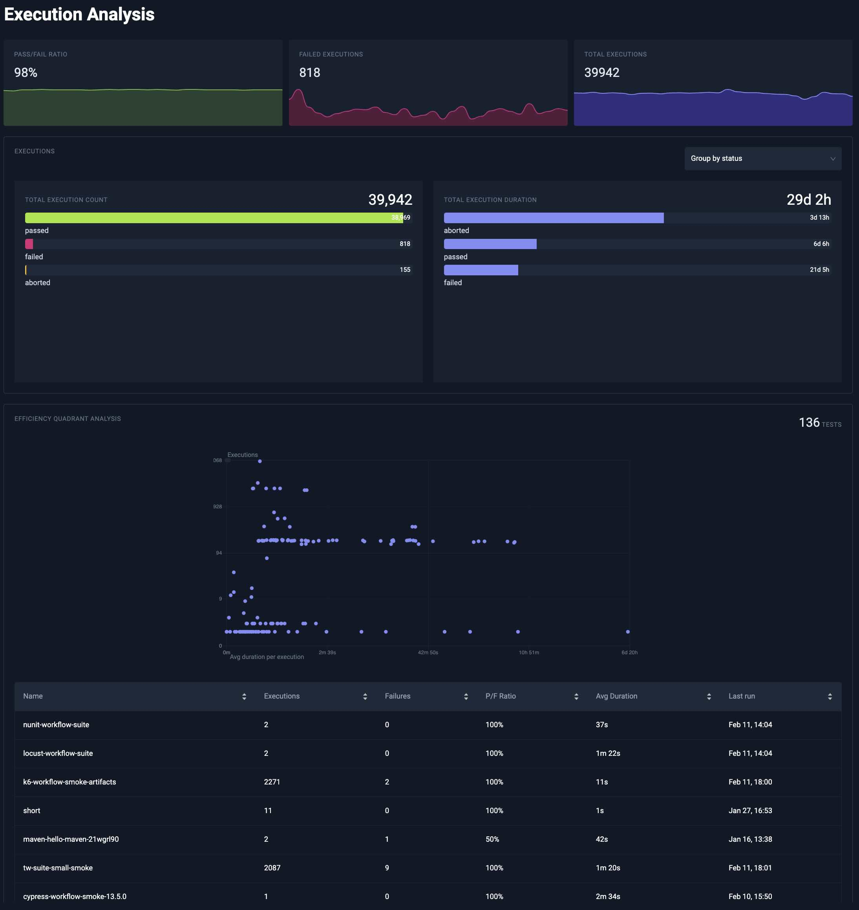

The top part of the Execution Analysis module shows high-level execution metrics.

Underneath you can find a quick overview of execution count and duration.
You can either group your executions by status or workflow by using the selector.

Lastly, the execution efficiency analysis shows tests by execution time and frequency. Tests that
frequently run and take longer to execute appear in the top right quadrant, highlighting them as prime
candidates for optimization to reduce testing bottlenecks, improve cycle times and optimize infrastructure costs

### Board Visibility

When you create or edit a board, you can choose its visibility:

- **Shared across organization** — visible to all Organization members. The creator and Organization admins can edit
  the board and its analyses. Organization admins can also reorder shared boards in the sidebar.
- **Private** — visible only to you. You can edit and delete your private boards.

Private and pinned boards show **Private** and **Pinned** badges on the board page and on cards in All Boards.

### Managing Custom Boards

You can add as many boards as you need to Insights under an Organization and each board can in turn contain
as many analysis charts as needed, allowing you to group your analysis in any way that aligns
with your testing activities.

You can manage a board as follows:

- **Create Board**: Click **+ Create a new board** in the sidebar or **New Board** on the All Boards page.
  In the creation dialog, set the name, slug, description, and visibility, then add your first analysis.

- **Pin Board**: Pin a board from its actions menu (on the board page or on a card in All Boards) or from the pin
  icon next to a board in the sidebar. Pinned boards appear under **Pinned Boards** for quick access.

- **Reorder shared boards**: Organization admins can drag shared boards in the sidebar to change their order for
  everyone in the Organization.

- **Rearrange analyses**: Hover an analysis and use the handle in the top-right corner to drag and drop it.
  You can move it to a new row or place it before or after another analysis. You can only add up to three analyses
  per row. Board layouts are optimized for larger screen sizes.

- **Duplicate analysis**: Open an analysis actions menu and choose **Duplicate Analysis** to copy its configuration
  onto the same board.

- **Update Board**: Click the board title on the board page to rename it inline, or open **Settings** from the actions
  menu to update the name, slug, description, and visibility.

- **Delete Board**: Use **Delete** in the board actions menu, or open **Settings** and delete the board in the danger
  zone at the bottom. Your board and all analyses will be removed; no execution data will be deleted.

## Working with Analyses

You can add as many analyses to a board as needed; use the "Add a new analysis" button on the top right to do so:

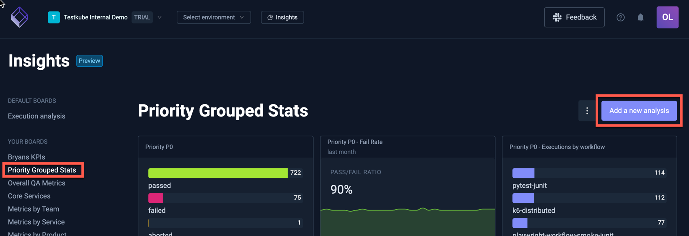

Adding an analysis takes you to the Analysis editor where you can configure what data to show and how to show it.

### The anatomy of the Analysis Editor

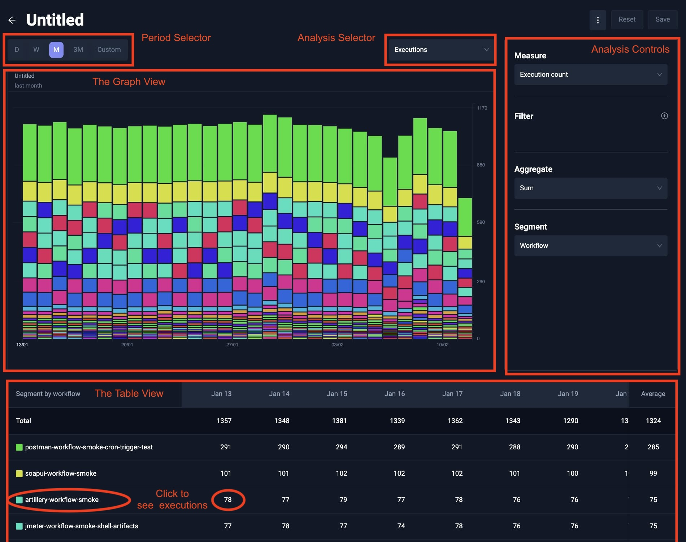

At the top you can see a Period Selector for selecting the last day, week, month, quarter or any custom period.
The interval is automatically inferred depending on the size of the period.
A period less than two days will have an hourly interval, then daily, and up to weekly when looking at a quarter.

More to the right, you can see the Analysis Selector: it defaults to **Executions** time series, but you can also
select **Executions Bar Chart**, **Efficiency Quadrant Analysis** and **Pass/Fail Statistics** (all described below)

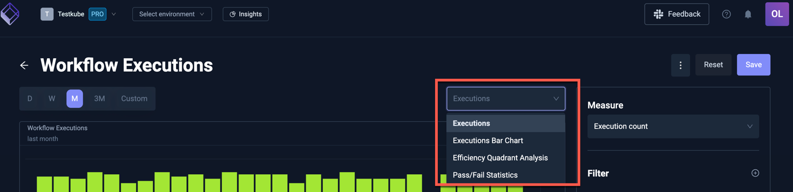

Under the period and analysis selector, you will find your selected chart with its controls on the right side.
The controls vary depending on the selected chart and include the ability to filter executions on **Workflow name**,
**environment**, **status** and **labels** (both existence or specific label values).

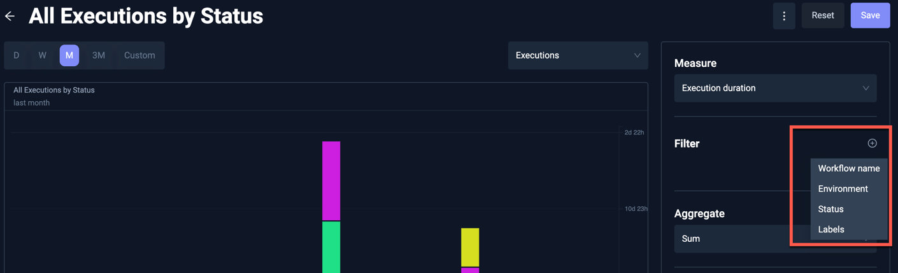

:::tip
Filtering on workflow name support regexes, so you could perfectly filter all workflows prefixed with `performance`
by adding a `performancy.*` filter.
:::

One limitation is that you currently cannot negate a filter literal yet.

## Executions Time Series

The execution time series allows you to analyse your executions over time.

### Executions Measure

The x-axis will always be the time, whereas the y-axis is defined by your **Measure**. There are three categories of measures that are supported.

- **Execution measures**: These measures give high level summary information about your executions.
  - **Execution count**: Use this to see how many Workflows were executed
  - **Execution duration**: Use this to understand how much time your tests are taking.
  - **JUnit Case count**: The number of JUnit tests execution based on extracted [JUnit Reports](/articles/test-workflows-reports).
- **Resource measures**: See resource usage across executions. Read more about [Resource Aggregates in Insights](/articles/resource-metrics#resource-aggregates-in-insights).
  - **CPU Usage**: Use this to analyze CPU consumption of your Workflow executions.
  - **Memory Usage**: Use this to analyze Memory consumption of your Workflow executions.
  - **Network Usage**: Use this to analyze Network usage of your Workflow executions.
  - **Disk Usage**: Use this to analyze Disk usage of your Workflow executions.
- **Granular Metrics**: When [granular metrics](/articles/granular-metrics) are enable you will see additional measure options depending on the types of reports your workflows produce.

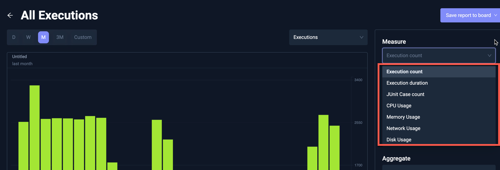

### Executions Aggregate

You can use the **Aggregate** to decide how to treat multiple executions of the same workflow within
each interval. For example, for the **Execution duration** you can aggregate on **sum**, **average**, **minimum** or **maximum**.

:::note
The actual aggregate(s) available will depend on which Executions Measure you selected.
:::

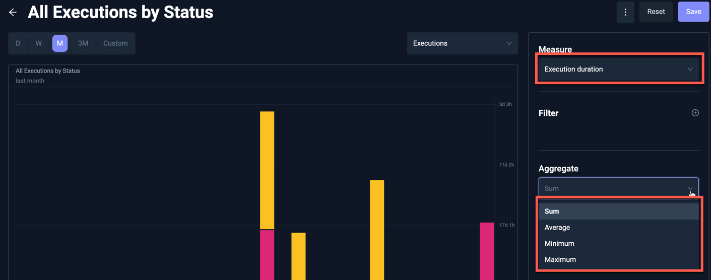

### Executions Segment

Lastly, you can set a **Segment** which will break down your executions.
You can do this by the **status** to see which executions passed or failed,
by **workflow name** or by any of the **labels** found on the executions.

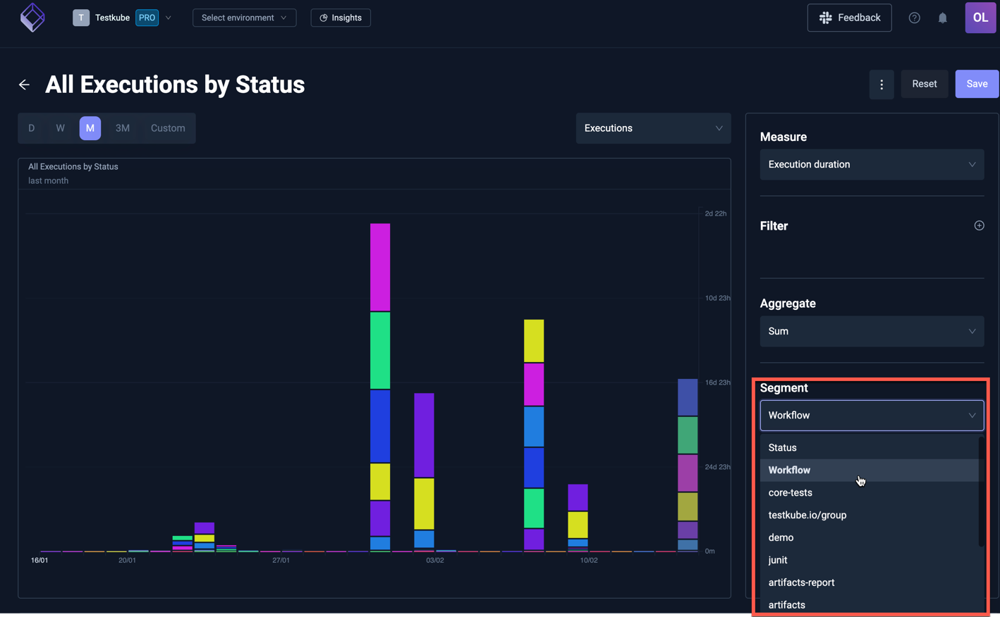

### Executions Table and Drill Down

Besides a graph view, the Executions time series analysis also comes with a table view.
This is useful to see trend across a single segment.
Currently, segmentation within a graph is also limited to 25 largest segments.
For segmentation with a high cardinality, you can view the remaining segments within the table, which are
most often too tiny to see within the Graph View.

You can click on either the segment name or a table cell value to drill down on the execution references that relate to this.
Imagine that you filter on failed executions for a certain label, and you wonder which executions are failing.
Drilling down easily allows you to analyse and troubleshoot these executions.

For example - the following Analysis shows all Executions labeled `junit=true`, with February 7th highlighted when there
were 12 failed executions:

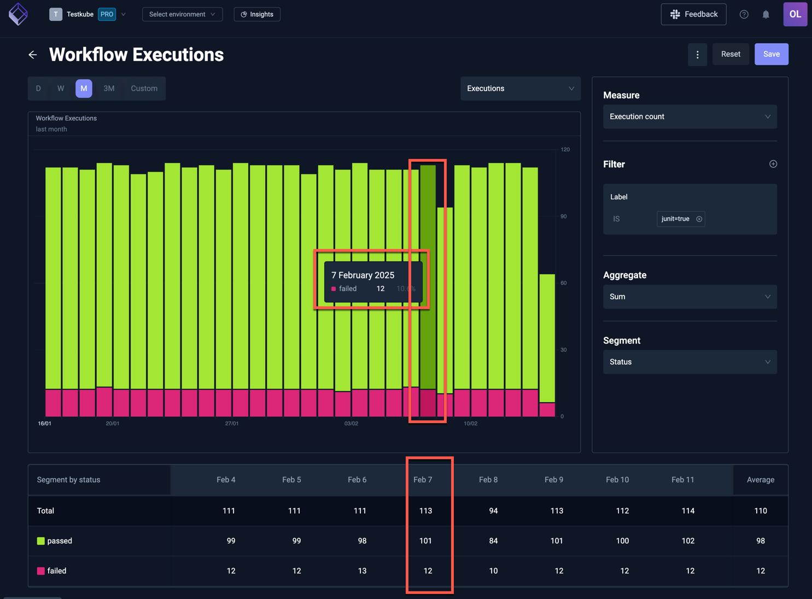

Clicking on the "12" in the table will show those 12 executions in a table:

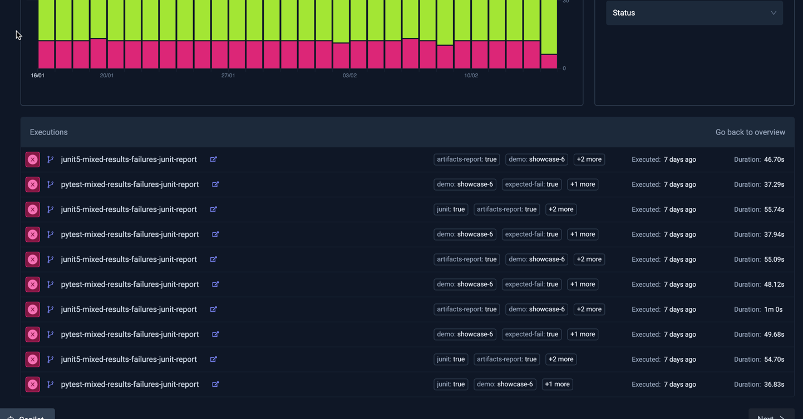

- Selecting an execution will open the corresponding [Workflow Execution Details](/articles/testkube-dashboard-execution-details) panel.
- Selecting the "Back to overview" link on the top right of the table will take you back to the table view above.

## Executions Bar Chart

This shows a bar chart with the number of executions for each selected segment. For example, the below Analysis
shows the top failing Workflows over the last week:

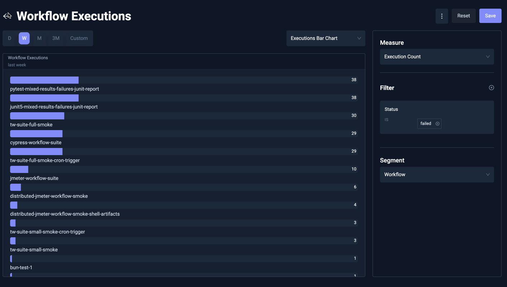

## Efficiency Quadrant Analysis

The execution efficiency analysis shows tests by execution time and frequency. Tests that
frequently run and take longer to execute appear in the top right quadrant, highlighting them as prime
candidates for optimization to reduce testing bottlenecks, improve cycle times and optimize infrastructure costs:

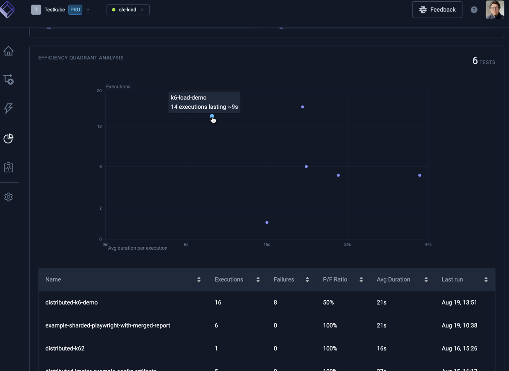

Hovering a marker in the chart reveals the corresponding Workflow.

The table below the chart shows plotted Workflows sortable by a number of attributes.

## Pass/Fail Stats

The pass/fail stats shows details about workflow executions that failed or passed.
These analysis are useful to quickly understand if certain workflows need attention.

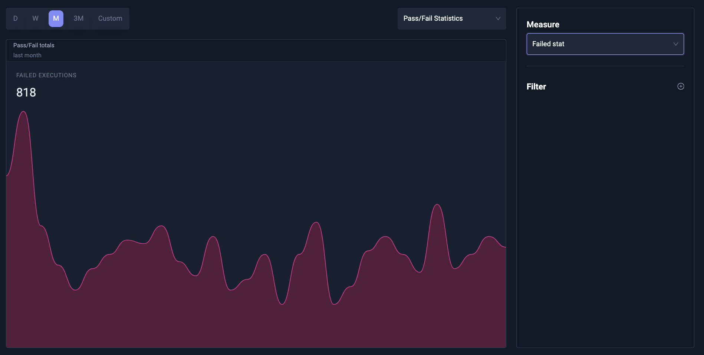
