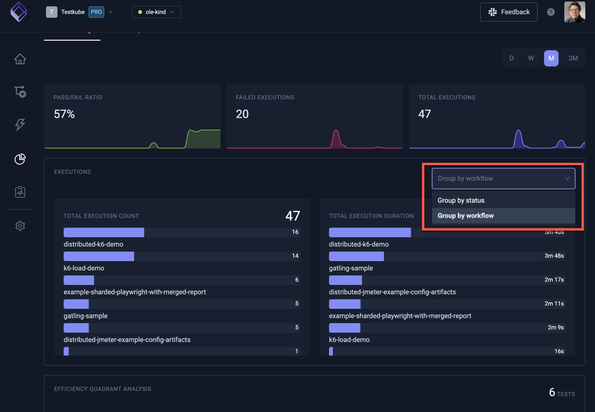

# Test Insights

Test Insights is an analytics tool integrated into Testkube that provides detailed metrics about the
execution of your tests. This feature allows teams to track key performance indicators including the number
of test executions, pass/fail rates, execution durations, and more, all within a user-friendly Dashboard.

With Test Insights, DevOps and QA managers can quickly answer crucial questions that impact the testing 
cycle and overall software quality, such as:

- Which tests take the longest to execute and why?
- Which tests have the highest failure rates?
- How do test performance metrics vary by type of test or by the tools used?
- How do key test execution metrics change over time?

By integrating Test Insights into your testing workflow, your team can leverage several benefits:

- **Enhanced Visibility:** Gain a clear overview of testing activities and outcomes, helping 
  you manage and prioritize testing resources more effectively.
- **Data-Driven Decisions:** Make informed decisions about where to allocate efforts for improving 
  test efficiency and reliability.
- **Improved Test Efficiency:** Identify and address inefficiencies in your testing process, leading 
  to faster development cycles and higher quality software releases.

## Using Test Insights

Test Insights is available in the left menu and provides two modules as shown in the screenshot below:

- **Execution Analysis** - for operational metrics of your test executions
- **Test Reports** - for strategic reporting of test results over time

## Execution Analysis

The top part of the Execution Analysis module shows high-level execution metrics for the time frame
selected on the top right (see screenshot above).

The drop-down on the middle right allows you to select grouping of execution metrics either by status (as shown
in the screenshot) or by Workflow:

### Efficiency Quadrant Analysis

Scrolling down reveals a quadrant chart to visualize tests by execution time and frequency. Tests that 
frequently run and take longer to execute appear in the top right quadrant, highlighting them as prime 
candidates for optimization to reduce testing bottlenecks, improve cycle times and optimize infrastructure costs:

Hovering a marker in the chart reveals the corresponding Workflow. 

The table below the chart shows plotted Workflows sortable by a number of attributes.

## Test Reports

This module shows the total number of test executions over a given period, along with their status 
outcomes (passed and failed), helping teams understand the impact of their applications evolution on quality 
and where they should focus their testing and bug-fixing efforts going forward.

The selector on the top right allows for narrowing down which timeframe to visualise.

There are a number of reports available:

### Advanced Report Filtering

The "Advanced filters" option in the screenshot above allows you to specify specifically which aggregate 
you want to apply to which measurement and segment of the underlying data.

### JUnit Report analysis

As seen in the screenshots above, Testkube parses JUnit Reports found in 
[Workflow artifacts](/articles/test-workflows-artifacts) and makes their specific Testcase counts and 
statuses available for analysis also.

