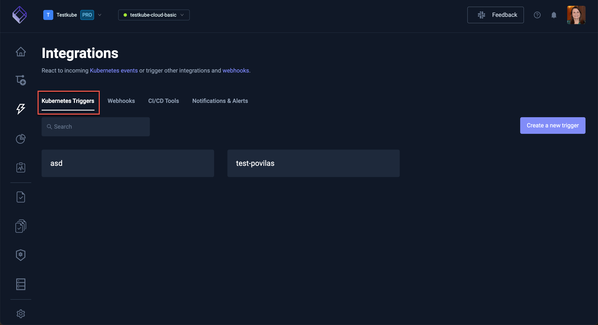

# Kubernetes Event Triggers

Testkube allows you to automate running Test Workflows by defining triggers on certain events for various Kubernetes resources.

## What is a Testkube Event Trigger?

In generic terms, a _Trigger_ defines an _action_ which will be executed for a given _execution_ when a certain _event_ on a specific _resource_ occurs.
For example, we could define a _TestTrigger_ which _runs_ a _Test_ when a _ConfigMap_ gets _modified_.

In Testkube, Event Triggers allow you to trigger the execution of a Workflow based on Kubernetes Events - for example when a Deployment is updated
or an Ingress gets deleted.

You can currently create/manage Event Triggers in the Testkube Dashboard or by interacting with corresponding Trigger custom resources
via `kubectl`.

## Creating Test Triggers in the Testkube Dashboard

Select the Integrations tab (lightning bolt icon) on the left on the Testkube Dashboard to access the "Triggers"
panel which shows a list of Triggers in your Environment. 

The "Create a new trigger" on the right allows you create a new 
trigger as described at [create Test Triggers](/articles/integrations-triggers#creating-a-new-trigger).



## Custom Resource Definition Model

Triggers are ultimately defined as Customer Resources in your cluster - [TestTrigger Reference](/articles/crds/tests.testkube.io-v1#testtrigger)

### Selectors

Triggers use Selectors to specify which events to listen for.

The `resourceSelector` and `testSelector` fields support selecting resources either by name or using
the Kubernetes [Label Selector](https://kubernetes.io/docs/concepts/overview/working-with-objects/labels/#resources-that-support-set-based-requirements).

Each selector should specify the `namespace` of the object, otherwise the namespace defaults to `testkube`.

```
selector := resourceSelector | testSelector
```

#### Name Selector

Name selectors are used when we want to select a specific resource in a specific namespace.

```yaml
selector:
  name: Kubernetes object name
  nameRegex: Kubernetes object name regex (for example, "testworkflow.*")
  namespace: Kubernetes object namespace (default is **testkube**)
  namespaceRegex: Kubernetes object namespace regex( for example, "test.*")
```

:::note
The `namespace` property is only supported for resourceSelectors, and not for testSelectors.
:::

#### Label Selector

Label selectors are used when we want to select a group of resources in a specific namespace.

```yaml
selector:
  namespace: Kubernetes object namespace (default is **testkube**)
  labelSelector:
    matchLabels: map of key-value pairs
    matchExpressions:
      - key: label name
        operator: [In | NotIn | Exists | DoesNotExist
        values: list of values
```

### Resource Conditions

Resource Conditions allows triggers to be defined based on the status conditions for a specific resource.

```yaml
conditionSpec:
  timeout: Duration in seconds the test trigger waits for conditions, until its stopped.
  delay: Duration in seconds the test trigger waits between condition checks.
  conditions:
    - type: test trigger condition type
      status: test trigger condition status, supported values - True, False, Unknown
      reason: test trigger condition reason
      ttl: test trigger condition ttl
```

### Resource Probes

Resource Probes allows triggers to be defined based on the probe status.

```yaml
probeSpec:
  timeout: Duration in seconds the test trigger waits for probes, until its stopped.
  delay: Duration in seconds the test trigger waits between probes.
  probes:
    - scheme: test trigger condition probe scheme to connect to host, default is http
      host: test trigger condition probe host, default is pod ip or service name
      path: test trigger condition probe path to check, default is /
      port: test trigger condition probe port to connect
      headers: test trigger condition probe headers to submit
```

#### Action Parameters

Action parameters are used to pass config and tag values to the test execution workflow. You can specify either text values or 
jsonpath expression in a form of `jsonpath={.metadata.name}`. The data will be taken from the resource object of the trigger event. 
Check the kubernets docs [JsonPath Expression](https://kubernetes.io/docs/reference/kubectl/jsonpath/).
Also you can use Golang template syntax we support for Webhook processing and take data from Golang object fields.

```yaml
actionParameters:
  config: map of key-value pairs
  tags: map of key-value pairs 
```

for example:

```yaml
actionParameters:
  config:
    environment: production
    datavalue: jsonpath={.data.test} # if the resource object is a configmap with key `test`
    labels: "{{ .ObjectMeta.Labels }}"
  tags:
    workflow: core
    trigger: jsonpath={.metadata.namespace} # namespace of the resource object
    name: "{{ .ObjectMeta.Name }}"
```

### Supported Values

- **Resource** - `pod`, `deployment`, `statefulset`, `daemonset`, `service`, `ingress`, `event`, `configmap`
- **Action** - `run`
- **Event** - `created`, `modified`, `deleted`
- **Cause** (can be used instead of **Event**)
  - For deployments - `deployment-scale-update`, `deployment-image-update`, `deployment-env-update`, `deployment-containers-modified`,
    `deployment-generation-modified`, `deployment-resource-modified`
  - For Testkube events - `event-start-test`, `event-end-test-success`, `event-end-test-failed`, `event-end-test-aborted`, `event-end-test-timeout`, 
    `event-start-testsuite`, `event-end-testsuite-success`, `event-end-testsuite-failed`, `event-end-testsuite-aborted`, `event-end-testsuite-timeout`, 
    `event-queue-testworkflow`, `event-start-testworkflow`, `event-end-testworkflow-success`, `event-end-testworkflow-failed`, `event-end-testworkflow-aborted`, 
    `event-created`, `event-updated`, `event-deleted`
- **Execution** - `test`, `testsuite`, `testworkflow`
- **ConcurrencyPolicy** - `allow`, `forbid`, `replace`

:::info
Events and values related to Tests and Test Suites have been deprecated and will be removed - [Read More](/articles/legacy-features)
:::

## Examples

### On Deployment Update

Here is an example for a **Test Trigger** _default/testtrigger-example_ which runs the **TestSuite** _frontend/sanity-test_
when a **deployment** containing the label **testkube.io/tier: backend** gets **modified** and also has the conditions **Progressing: True: NewReplicaSetAvailable** and **Available: True**.

```yaml
apiVersion: tests.testkube.io/v1
kind: TestTrigger
metadata:
  name: testtrigger-example
  namespace: default
spec:
  resource: deployment
  resourceSelector:
    labelSelector:
      matchLabels:
        testkube.io/tier: backend
  event: modified
  conditionSpec:
    timeout: 100
    delay: 2
    conditions:
      - type: Progressing
        status: "True"
        reason: "NewReplicaSetAvailable"
        ttl: 60
      - type: Available
        status: "True"
  probeSpec:
    timeout: 50
    delay: 1
    probes:
      - scheme: http
        host: testkube-api-server
        path: /health
        port: 8088
        headers:
          X-Token: "12345"
      - host: testkube-dashboard
        port: 8080
  action: run
  execution: testworkflow
  concurrencyPolicy: allow
  testSelector:
    name: sanity-test
    namespace: frontend
  disabled: false
```
### On Testkube Cluster Event

You can define **Test Trigger** for Testkube cluster events.
In below example, if **TestWorkflow** `k6-executor-smoke` is completed succesfully, then we run **TestWorkflow** `postman-smoke-tests`

```yaml
apiVersion: tests.testkube.io/v1
kind: TestTrigger
metadata:
  name: testtrigger-event
  namespace: testkube
spec:
  resource: event
  resourceSelector:
    name: k6-smoke-test
  event: event-end-test-success
  action: run
  actionParameters:
     config:
      environment: production
    tags:
      trigger: jsonpath={.metadata.name}
 execution: testworkflow
  testSelector:
    name: postman-smoke-tests
    namespace: testkube
```

## Disabling Test Triggers

Disabling test triggers can be helpful to test your configuration during the development. Testkube lets you disable them via
the API or modifying the CRD directly specifying `disabled` field value as `true`.

By default, test triggers are enabled on creation.

## Architecture

Testkube uses [Informers](https://pkg.go.dev/k8s.io/client-go/informers) to watch Kubernetes resources and register handlers
on certain actions on the watched Kubernetes resources.

Informers are a reliable, scalable and fault-tolerant Kubernetes concept where each informer registers handlers with the
Kubernetes API and gets notified by Kubernetes on each event on the watched resources.

## API

Testkube exposes CRUD operations on test triggers in the REST API. Check out the [OpenAPI docs](../openapi/overview) for more info.

## Injected Environment Variables

The following environment variables are automatically injected into each triggered test pod:

- `WATCHER_EVENT_RESOURCE`: resource type
- `WATCHER_EVENT_NAME`: resource name
- `WATCHER_EVENT_NAMESPACE`: resource namespace
- `WATCHER_EVENT_EVENT_TYPE`: event type
