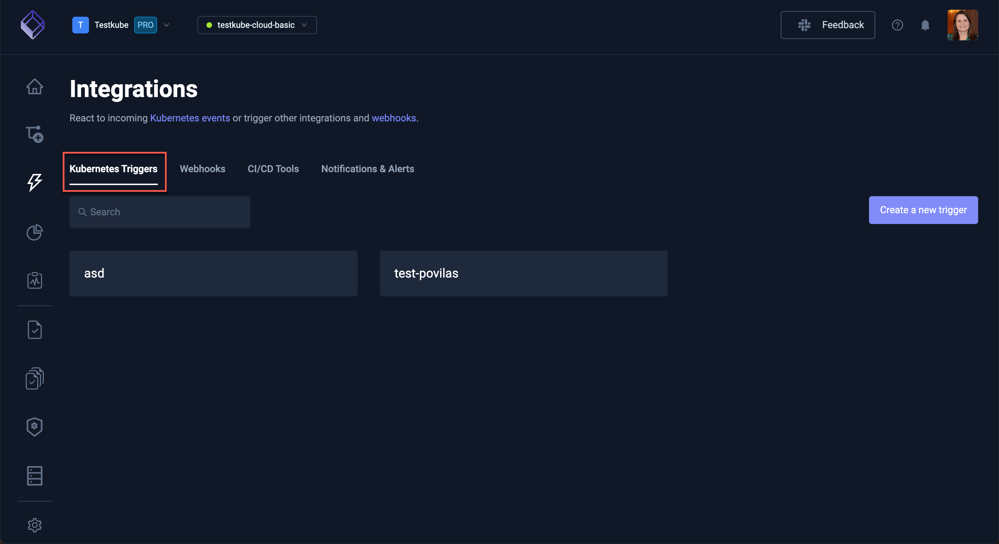

# Kubernetes Event Triggers

Testkube allows you to automate the execution of Test Workflows by defining triggers on certain events for various Kubernetes resources.

## What is a Testkube Event Trigger?

In generic terms, a _Trigger_ defines an _action_ which will be executed for a given _execution_ when a certain _event_ on a specific _resource_ occurs.
For example, we could define a _TestTrigger_ which _runs_ a _Test_ when a _ConfigMap_ gets _modified_.

In Testkube, Event Triggers allow you to trigger the execution of a Workflow based on Kubernetes Events - for example, when a Deployment is updated
or an Ingress gets deleted.

Beyond these built-in resources and events, a trigger can also watch your own
custom resources, fire only when a specific field changes, and run on just the
listener agents you choose.

You can currently create/manage Event Triggers in the Testkube Dashboard or by interacting with corresponding Trigger custom resources
via `kubectl`.

## Creating Test Triggers 

Select the Integrations tab (lightning bolt icon) on the left on the Testkube Dashboard to access the "Triggers"
panel which shows a list of Triggers in your Environment.

The "Create a new trigger" on the right allows you to create a new
trigger as described at [create Test Triggers](/articles/integrations-triggers#creating-a-new-trigger).



:::tip
Triggers are ultimately defined as Customer Resources in your cluster - [TestTrigger Reference](/articles/crds/tests.testkube.io-v1#testtrigger)
:::

## Listener Agents with TestTriggers

Testkube uses [Listener Agents](/articles/agents-overview#listener-agents) 
to listen for Kubernetes events that will be matched against your TestTriggers. Your Testkube Environment can have any number of 
Listener Agents, deployed to whichever namespaces/clusters you need to listen for events.

The Listener Agent and Standalone Agent by default behave somewhat differently when it comes to listening for events:
- Listener Agents by default listen for events only in the namespace they are deployed to, if you need to listen for events from 
  additional namespaces, you can configure this as described at [Listening in additional namespaces](/articles/multi-agent-runner-helm-chart#listening-in-additional-namespaces).
- The Standalone Agent listens for events in all namespaces, you can configure this as described at 
  [Multi-namespace Agent Installation](/articles/install/advanced-install#multi-namespace-agent-installation).

### Listener Agent Event Labels

Events captured by a specific Listener Agents are annotated with a number of testkube.io specific labels:

- `testkube.io/agent-name` - the name of the Listener Agent
- `testkube.io/agent-namespace` - the namespace of the Listener Agent
- `testkube.io/resource-name` - the name of the resource triggering the event
- `testkube.io/resource-namespace` - the namespace of the resource triggering the event
- `testkube.io/resource-kind` - the kind (i.e. `Deployment`) of the resource triggering the event
- `testkube.io/resource-group` - the API group (i.e. `apps`) of the resource triggering the event
- `testkube.io/resource-version` - the API version (i.e. `v1`) of the resource triggering the event

See below how you can select on these labels to define Listener-specific trigger rules.

### Custom Event Labels

During agent installation one can also specify custom labels which will be emitted with each event from the
Listener Agent by using the following values in the `testkube-runner` Helm chart:

```yaml
listener:
  eventLabels:
    # highlight-next-line
    deployment-location: eastern-usa
```

## Pinning Listener Agents

By default every Listener Agent in your environment evaluates a trigger, and
whichever one sees a matching event fires it. That is usually what you want. To
have a trigger handled by specific listeners only, pin it with `spec.listener`:

```yaml
spec:
  listener:
    match:
      id:
        - <listener-agent-id>   # one or more listener agent IDs
```

Leave `listener` out to keep the default broadcast behavior. If you author YAML
directly you reference a listener by its agent ID; in the dashboard you pick
listeners by name instead (see below).

Pinning starts to matter once a trigger uses [match conditions](#match-conditions)
or watches a [custom resource](#triggering-on-custom-resources-crds). Testkube
checks your match paths against the schema the pinned listener reported for that
resource, and a listener only knows about resources its ServiceAccount is allowed
to watch (see [Granting Testkube access to your CRDs](#granting-testkube-access-to-your-crds)).
So a trigger with match conditions has to name at least one listener, and it
should be one that can actually see the resource you are matching on.

In the dashboard this is the **Listener(s)** field at the top of the trigger
form. Choosing a listener there also narrows the Custom Resource dropdown and the
field autocomplete to what that listener can see.

## Selectors

Triggers use selectors to determine which events should trigger the action and which workflows should be the target of the trigger action.

### Event Selector

Each event that is emitted by a listener agent has labels on it which could be
used for selection of a triggering event using the `selector` field:

```yaml
selector:
  matchLabels: map of key-value pairs
  matchExpressions:
    - key: label name
      operator: [In | NotIn | Exists | DoesNotExist
      values: list of values
```

### Resource Selector

:::warning

The `resource` and `resourceSelector` will be deprecated eventually but are still supported for now, please use the
`selector` field to match on the builtin labels such as `teskube.io/resource-kind` and `testkube.io/resource-name` to achieve similar
outcomes.

:::

Using the fields `resource` and `resourceSelector` one can select the triggering
event by the source resource.

```yaml
resource: Kinds of resources to match (possible values, `pod`, `deployment`, `statefulset`, `daemonset`, `service`, `ingress`, `event`, `configmap`)
resourceSelector:
  name: Kubernetes object name
  nameRegex: Kubernetes object name regex (for example, "app.*")
  namespace: Kubernetes object namespace (default is agent's namespace)
  namespaceRegex: Kubernetes object namespace regex( for example, "test.*")
  labelSelector:
    matchLabels: map of key-value pairs
    matchExpressions:
      - key: label name
        operator: [In | NotIn | Exists | DoesNotExist
        values: list of values
```

### Triggering on Custom Resources (CRDs)

Use `resourceRef` to trigger on any Kubernetes resource — including custom
resources like Argo Rollouts, Crossplane claims, Strimzi `KafkaTopic`, or
your own CRDs. You select the resource by its API Group, Version, and Kind:

```yaml
resourceRef:
  group: argoproj.io       # the API group; use "" for core resources like Pod or Service
  version: v1alpha1        # the API version
  kind: Rollout            # the resource kind
```

`resourceRef` and the older `resource` field both pick what the trigger
watches — set one, not both. Use `resource` for common built-ins (`pod`,
`deployment`, etc.) and `resourceRef` for everything else.

In the dashboard, first pick the listener(s) that should watch the resource
(see [Pinning Listener Agents](#pinning-listener-agents)), then choose **Custom
Resource** in the K8s resource dropdown. The Group / Version / Kind selectors
are populated from what those listeners can actually watch, so a resource only
appears once a listener with access to it is selected.

To narrow a custom-resource trigger to specific names, namespaces, or labels,
use the same [selectors](#selectors) you would for a built-in resource.

#### Granting Testkube access to your CRDs

Testkube's listener watches a curated set of built-in Kubernetes resources
out of the box. To trigger on a custom resource, you need to grant the
listener `get`, `list`, and `watch` access to it.

The easiest way is to add the resources to your Helm values when you install
or upgrade the `testkube-api` chart:

```yaml
# values.yaml
rbac:
  extraWatchedResources:
    - apiGroups: ["argoproj.io"]
      resources: ["rollouts"]
    - apiGroups: ["cert-manager.io"]
      resources: ["certificates", "certificaterequests"]
    - apiGroups: ["kafka.strimzi.io"]
      resources: ["kafkatopics"]
```

`resources` takes the lowercase, plural API name (`rollouts`), which is not the
same as the `kind` you set in `resourceRef` (`Rollout`). Run
`kubectl api-resources` if you are unsure of the right name.

Each entry follows the same shape as Kubernetes RBAC `rules`. `verbs` is
optional and defaults to `["get", "list", "watch"]` — the listener never
modifies the watched resource, only observes it. The chart applies these
rules to every namespace it watches, so single-namespace, multi-namespace,
and cluster-wide installations all work without extra configuration.

If you manage RBAC outside Helm, create an equivalent `ClusterRole` (or
namespace-scoped `Role`) granting `get,list,watch` on the resource and bind
it to the listener's `ServiceAccount` — by default `testkube-api-server` in
the `testkube` namespace.

### Test Selector

The `testSelector` field could be used to select the target Workflow of the
trigger action.

```yaml
testSelector:
  name: TestWorkflow name
  nameRegex: TestWorkflow name regex (for example, "test.*")
  labelSelector:
    matchLabels: map of key-value pairs
```

Note: labelSelector.matchExpressions will be supported in a future release.

## Resource Conditions

Resource Conditions allows triggers to be defined based on the status conditions for a specific resource.

```yaml
spec:
  conditionSpec:
    timeout: Duration in seconds the test trigger waits for conditions, until its stopped.
    delay: Duration in seconds the test trigger waits between condition checks.
    conditions:
      - type: test trigger condition type
        status: test trigger condition status, supported values - True, False, Unknown
        reason: test trigger condition reason
        ttl: test trigger condition ttl
```

## Resource Probes

Resource Probes allows triggers to be defined based on the probe status.

```yaml
spec:
  probeSpec:
    timeout: Duration in seconds the test trigger waits for probes, until its stopped.
    delay: Duration in seconds the test trigger waits between probes.
    probes:
      - scheme: test trigger condition probe scheme to connect to host, default is http
        host: test trigger condition probe host, default is pod ip or service name
        path: test trigger condition probe path to check, default is /
        port: test trigger condition probe port to connect
        headers: test trigger condition probe headers to submit
```

## Match Conditions

Sometimes you only want a trigger to fire when a specific field changes — not
on every event for the resource. **Match conditions** let you do that. Each
entry inspects a single field on the watched object; the trigger fires only
when *all* entries are satisfied.

:::info
Match conditions are validated against the schema a specific listener
discovered, so a trigger that uses them must [pin at least one
listener](#pinning-listener-agents).
:::

For example, "fire when `.status.phase` becomes `Healthy`" or
"fire when `.spec.paused` is `true`":

```yaml
spec:
  match:
    - path: .status.phase
      operator: changed_to
      value: Healthy
```

Each entry has three parts:

- **`path`** — a dot-path to the field, like `.status.phase` or `.spec.replicas`.
- **`operator`** — how to compare the field (see the table below).
- **`value`** — the value to compare against (required by some operators, not by others).

### Operators

| Operator       | Fires when…                                                                |
|----------------|----------------------------------------------------------------------------|
| `equals`       | the field currently equals `value`                                         |
| `not_equals`   | the field currently does not equal `value`                                 |
| `exists`       | the field is present on the object (no `value` needed)                     |
| `not_exists`   | the field is absent from the object (no `value` needed)                    |
| `changed`      | the field changed from any value to any other (requires `event: modified`) |
| `changed_to`   | the field changed to `value` (requires `event: modified`)                  |
| `changed_from` | the field changed away from `value` (requires `event: modified`)           |

`changed`, `changed_to`, and `changed_from` are only meaningful on update
events, so they require `event: modified` on the trigger.

### Tips

- **Paths use dot notation** and start with a leading dot — `.status.phase`,
  `.spec.template.spec.containers`. Array indexing (`containers[0]`,
  `containers[*]`) is not supported yet — match on scalar fields under arrays
  for now.
- **`equals` and `not_equals` only work on scalar fields** (strings, numbers,
  booleans). Use `exists`, `not_exists`, or `changed` for arrays and objects.
- **Numbers and booleans are compared as strings** — `value: "5"` matches
  `.spec.replicas: 5`; `value: "true"` matches `.spec.paused: true`.
- **Not sure which fields a resource has?** The dashboard autocompletes paths
  from its live schema. When writing YAML by hand, inspect a live object with
  `kubectl get <resource> <name> -o yaml`.

## Targeting specific Runner Agents

With the introduction of [Runner Agents](/articles/agents-overview#runner-agents) you can optionally specify
which Runner Agent(s) a Triggered execution should run on. For example

```yaml
spec:
  ...
  target:
    match:
     - application: accounting
...
```

Will trigger an Execution on any Global Runner Agent with the `application: accounting` label, For more details,
see our guide on [Runner Agent Targeting](/articles/test-workflows-running#runner-agent-targeting).

### Template-based target selection

You can resolve values in `target.match` at runtime using Go templates or JSONPath.

- Run on the same agent that handled the event:

```yaml
spec:
  action: run
  actionParameters:
    target:
      match:
        name:
          - '{{ .Agent.Name }}'
```

- Target by agent labels (e.g., environment):

```yaml
spec:
  action: run
  actionParameters:
    target:
      match:
        group:
          - '{{ index .Agent.Labels "env" }}'
```

Note: Add/update agent labels via CLI: `testkube update agent <agent-name> --label env=eu-west1`.

- Provide custom event labels via environment variable and reference them in templates:

```yaml
env:
  - name: EVENT_LABELS
    value: cluster:dev
```

Then reference in a template as `{{ index .EventLabels "cluster" }}`.

Tip: To inspect the full event data, run the agent with `DEBUG=true`.

Available template fields (Go templates and JSONPath):

- `Agent.Name` (string)
- `Agent.Labels` (map) — access with `{{ index .Agent.Labels "<key>" }}`
- `EventLabels` (map) — includes auto-populated keys:
    - `testkube.io/agent-name`, `testkube.io/agent-namespace`
    - `testkube.io/resource-name`, `testkube.io/resource-namespace`
    - `testkube.io/resource-kind`, `testkube.io/resource-group`, `testkube.io/resource-version`
    - plus any pairs from `EVENT_LABELS`, e.g., `cluster:dev` → `{{ index .EventLabels "cluster" }}`
- `Namespace` (string) — namespace of the resource that emitted the event
- `Object` — the full Kubernetes object for the event

JSONPath scope:

- In `actionParameters`, JSONPath is evaluated against the resource object, so fields can be referenced directly, e.g., `jsonpath={.metadata.name}`.
- In `target.match`, JSONPath is evaluated against the full event. To reach resource fields, prefix with `.Object`, e.g., `jsonpath={.Object.metadata.name}`. To reach agent or labels: `jsonpath={.Agent.Name}` or `jsonpath={.EventLabels.cluster}`.

## Action Parameters

Action parameters are used to pass config and tag values to the workflow execution. You can specify either text values or
jsonpath expression in a form of `jsonpath={.metadata.name}`. The data will be taken from the resource object of the trigger event.
Check the Kubernetes docs [JsonPath Expression](https://kubernetes.io/docs/reference/kubectl/jsonpath/).
Also you can use Golang template syntax we support for Webhook processing and take data from Golang object fields.

```yaml
spec:
  actionParameters:
    config: map of key-value pairs
    tags: map of key-value pairs
```

for example:

```yaml
spec:
  actionParameters:
    config:
      environment: production
      datavalue: jsonpath={.data.test} # if the resource object is a configmap with key `test`
      labels: "{{ .ObjectMeta.Labels }}"
    tags:
      workflow: core
      trigger: jsonpath={.metadata.namespace} # namespace of the resource object
      name: "{{ .ObjectMeta.Name }}"
```

### Supported Values

- **Resource** - `pod`, `deployment`, `statefulset`, `daemonset`, `service`, `ingress`, `event`, `configmap`
- **Action** - `run`
- **Event** - `created`, `modified`, `deleted`
  - For deployments - `deployment-scale-update`, `deployment-image-update`, `deployment-env-update`, `deployment-containers-modified`,
    `deployment-generation-modified`, `deployment-resource-modified`
  - For Testkube events - `event-queue-testworkflow`, `event-start-testworkflow`, `event-end-testworkflow-success`, 
    `event-end-testworkflow-failed`, `event-end-testworkflow-aborted`, `event-created`, `event-updated`, `event-deleted`
- **Execution** - `testworkflow`
- **ConcurrencyPolicy** - `allow`, `forbid`, `replace`

## Examples

### On Deployment Update

Here is an example for a **Test Trigger** _default/testtrigger-example_ which
runs the **TestWorkflow** _frontend/sanity-test_ when a **deployment** containing
the label **testkube.io/tier: backend** gets **modified** and also has the
conditions **Progressing: True: NewReplicaSetAvailable** and **Available:
True**.

```yaml
apiVersion: tests.testkube.io/v1
kind: TestTrigger
metadata:
  name: testtrigger-example
  namespace: default
spec:
  selector:
    matchLabels:
      testkube.io/resource-kind: Deployment
      testkube.io/tier: backend
  event: modified
  conditionSpec:
    timeout: 100
    delay: 2
    conditions:
      - type: Progressing
        status: "True"
        reason: "NewReplicaSetAvailable"
        ttl: 60
      - type: Available
        status: "True"
  probeSpec:
    timeout: 50
    delay: 1
    probes:
      - scheme: http
        host: testkube-api-server
        path: /health
        port: 8088
        headers:
          X-Token: "12345"
      - host: testkube-dashboard
        port: 8080
  action: run
  execution: testworkflow
  concurrencyPolicy: allow
  testSelector:
    name: sanity-test
    namespace: frontend
  disabled: false
```
### On an Argo Rollout becoming Healthy

A common pattern with [Argo Rollouts](https://argoproj.github.io/argo-rollouts/)
is to run smoke tests every time a Rollout finishes a successful update. The
trigger below watches the `Rollout` custom resource and runs the
`rollout-smoke-tests` workflow whenever a rollout transitions to the
`Healthy` phase:

```yaml
apiVersion: tests.testkube.io/v1
kind: TestTrigger
metadata:
  name: testtrigger-rollout-healthy
  namespace: default
spec:
  resourceRef:
    group: argoproj.io
    version: v1alpha1
    kind: Rollout
  listener:
    match:
      id:
        - <listener-agent-id>   # a listener that can watch Rollouts
  event: modified                # changed_to / changed_from / changed require this
  match:
    - path: .status.phase
      operator: changed_to
      value: Healthy
  action: run
  execution: testworkflow
  testSelector:
    name: rollout-smoke-tests
    namespace: default
  disabled: false
```

Because it uses match conditions, the trigger pins a listener via
`spec.listener` (see [Pinning Listener Agents](#pinning-listener-agents)); use
the ID of a listener that can watch Rollouts. Before the trigger can fire,
grant that listener access to watch Rollouts by adding the resource to your
Helm values:

```yaml
# values.yaml
rbac:
  extraWatchedResources:
    - apiGroups: ["argoproj.io"]
      resources: ["rollouts"]
```

See [Granting Testkube access to your CRDs](#granting-testkube-access-to-your-crds)
for more on this field.

### On Testkube Cluster Event

You can define **Test Trigger** for Testkube cluster events. In below example,
if **TestWorkflow** `k6-executor-smoke` is completed successfully, then we run
**TestWorkflow** `postman-smoke-tests`

```yaml
apiVersion: tests.testkube.io/v1
kind: TestTrigger
metadata:
  name: testtrigger-event
  namespace: testkube
spec:
  selector:
    matchLabels:
      testkube.io/resource-kind: Event
      testkube.io/resource-name: k6-smoke-test
  event: event-end-test-success
  action: run
  actionParameters:
     config:
      environment: production
    tags:
      trigger: jsonpath={.metadata.name}
 execution: testworkflow
  testSelector:
    name: postman-smoke-tests
    namespace: testkube
```

## Disabling Test Triggers

Disabling test triggers can be helpful to test your configuration during the development. Testkube lets you disable them via
the API or modifying the CRD directly specifying `disabled` field value as `true`.

By default, test triggers are enabled on creation.

## Architecture

Testkube uses [Informers](https://pkg.go.dev/k8s.io/client-go/informers) to watch Kubernetes resources and register handlers
on certain actions on the watched Kubernetes resources.

Informers are a reliable, scalable and fault-tolerant Kubernetes concept where each informer registers handlers with the
Kubernetes API and gets notified by Kubernetes on each event on the watched resources. Only the super-agent is able to register handlers with a Kubernetes API server, limiting our watched resources to the cluster in which the super-agent is deployed.

## API

Testkube exposes CRUD operations on test triggers in the REST API. Check out the [OpenAPI docs](../openapi/overview) for more info.
