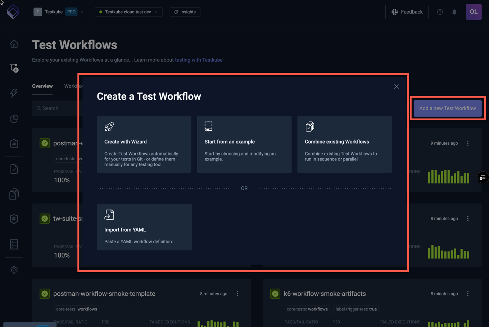
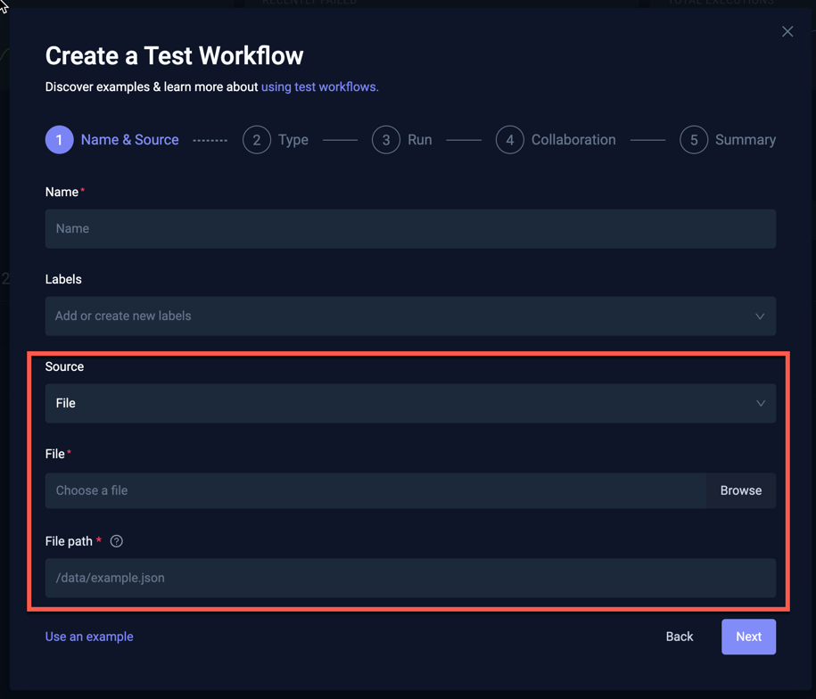
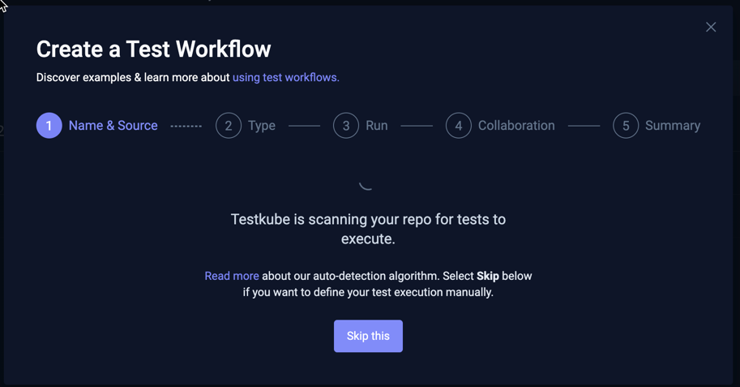
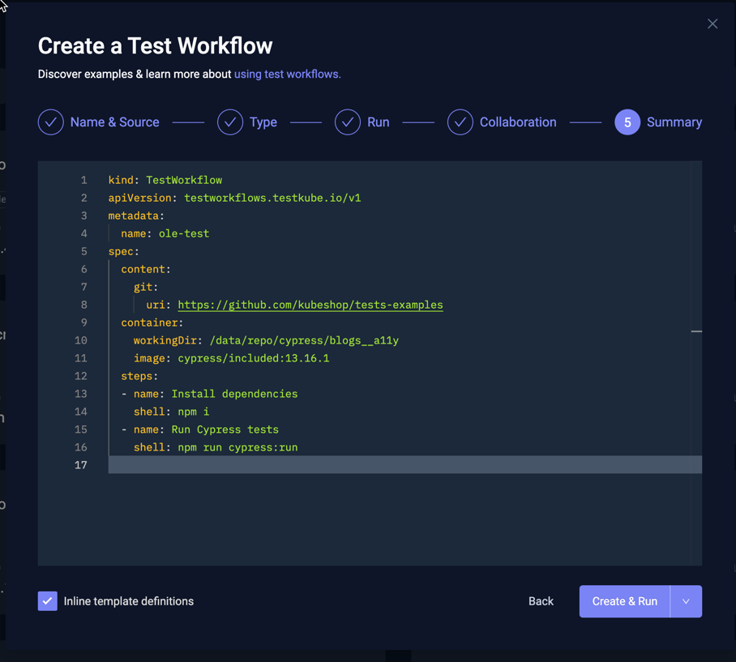

# Workflow Wizard

Selecting the "Add a new test workflow" button on the top right of the [Workflows Overview](testkube-dashboard-workflows-overview) 
opens the following dialog:

The different options are described below.

## Create with Wizard

This option will walk you through 5 steps for creating a Workflow to run your tests:

1) The **Name and Source** for your test.
2) The **Type** and version of testing tool to use to run the test.
3) The **Run** configuration for how to run the test.
4) The **Collaboration** settings for the generated Workflow
5) A **Summary** showing the underlying Workflow YAML for your test.

### Workflow Name & Source

The first page of the wizard will ask you for the name, labels (optional) and source of the test you want to run with Testkube. 

There are three source options:

- **Git**: prompts for Git repository details
- **File**: allows you to upload a file containing the test you want to run
- **String**: allows you to specify the test directly in the dialog

:::tip
Read more about how to work with content in your Workflows at [Test Workflows - Content](/articles/test-workflows-content)
:::

#### Git Source

Selecting Git as the source for your test will prompt as follows:

- **Git Repository URI**: Testkube supports checking out repositories via HTTPS or SSH.
- **Scan my repository for tests**: Enables the [Test Discovery functionality](#automatic-test-discovery)
- **Git Token** / **Git Username**: can be specified using
  - **Secret**: Testkube will automatically create a Kubernetes Secret for the specified value.
  - **Secret Reference**: Allows you to specify both the Kubernetes Secret Name and Key to use.
  - **Plain-text**: Allows you to specify the value in plain-text (not recommended!). 
- **Branch**: Which branch to use (optional).
- **Path**: Which path (relative to the repository root) that contains your tests (optional).

#### File Source

Selecting File as the source for your test will prompt as follows:

- **File**: Choose the file to upload
- **File path**: The path where the file content will be mounted in the container that will be used to run your test. 
You can use either relative or absolute paths.

#### String Source

Selecting String as the source for your test will prompt as follows:

- **File Path**: The path where the file content will be mounted in the container. You can use either relative or absolute paths.
- **File Content**: the actual test script that will be written to the file.

### Automatic Test Discovery

Selecting the "Scan my repository for tests" option for Git Sources on the [first page of the Workflow wizard](#git-source) will result in
Testkube automatically scanning for supported tests in the specific repo/branch/folder.

Testkube currently attempts to identify the following test types:

- K6 scripts
- Postman Collections
- Playwright Projects
- Cypress Projects
- JMeter Projects
- Maven Projects
- Gradle Projects

:::tip
Is Testkube not finding your tests? Or are you missing a common testing tool in this list? Let us know on [Slack](https://bit.ly/testkube-slack) so we can improve our algorithms!
:::

You will see the below panel while Testkube is scanning your repository:

Once finished, Testkube will show the number of found tests for each type of test in the next step of the wizard, together
with a selector for a test.

Selecting the "Skip this" button will abort the ongoing Test Discovery process and take you straight to the Type step
in the Wizard.

:::note
Testkube will cache the Test Discovery result for your repository as long as you stay within the Wizard. If you want to rescan
the repository (for example if you have updated its contents), you will need to close the Wizard entirely and start over.
:::

### Workflow Type

The second page prompts you for the type of Test you want to run:

In the screenshot above, Testkube has detected a number of tests for each type in the specified repository (via the
Test Discovery functionality described above), indicated with a green number for each of the tools (Cypress: 90, Postman: 29, etc.).

Selecting a tool type that has detected tests will show a corresponding selector allowing you to select which of 
the found tests you want to run. For example, when selecting the Cypress type in the screenshot above, the following
Cypress projects are available:

Depending on the testing tool discovered, Testkube will also attempt to extract the correct version of the tool to use, which
can be seen and modified in the "Cypress version to use" field below the selector. 

Selecting a tool for which Testkube has not found any tests will prompt you for the version and command to use to run the tool, 
for example for Artillery below:

### Run 

This page allows you to specify/modify the run command and execution working directory for the selected testing tool. 
If your test was discovered with Test Discovery, these values will be pre-filled accordingly, otherwise you will have
to specify the run command and path to your test script manually.

:::tip
When using a Git Source, the repository is cloned and mounted under the `/data/repo` folder into your container, the execution
working directory needs to be set accordingly. When using a File/String source, the file is written to the `/data` folder instead.
Make sure your command and execution directory are configured accordingly.
:::

Here you can also specify:

- **Artifacts**: Where Testkube can find artifacts created by your testing tool (reports, videos, etc.). [Read More about Artifacts](/articles/test-workflows-artifacts)
- **Environment Variables**: Any environment variables that need to be passed to your testing tool for test execution

### Collaboration

This page allows you to add the Workflow to a [Resource Group](/articles/resource-groups) for further collaboration and access control:

### Summary

This shows the generated Workflow YAML based on all the input provided in the previous steps. You can
make adjustments to the YAML as needed, or go back to the previous steps to update accordingly.

Use the "Inline Template Definitions" checkbox in the bottom left to inline any used Templates into the generated YAML

:::tip

Use this option if you want to make more detailed changes to how the underlying testing tool is used and that won't
affect other workflows using the same template.

:::

When you're happy with the created Workflow select either "Create & Run" or just "Create" from the button in the bottom
right to create your Workflow.

## Creating a Workflow from an Example

Use the "Start from Example" option if you want to start from one of Testkubes many example Workflows which you can then further modify
for your specific needs.

- The selector at the top allows you to filter which examples are shown
- The list in the middle shows the available examples
- The YAML at the bottom shows the selected example

You can edit the selected example before using either the Create or Create & Run option to create it.

:::tip

You will most likely want to change the name of the created workflow, do this by updating the
`metadata.name` property in the YAML example before creating the Workflow.

:::

## Creating a Workflow by Combining Existing Workflows

The "Combine existing Workflows" option allows you to create a Workflow that orchestrates multiple existing Workflows to run either in sequence or parallel.

Start by specifying the name and optional labels that you want to add to this workflow, then select the
"Add the first workflow" button to select an initial workflow. Once added you can add more existing Workflows
and organize them to execute in any desired order/combination:

Once done, select the Next button to see the corresponding YAML for your Workflow.

Select either the Create or Create & Run option to create your workflow accordingly.

:::tip

Read more about how to create Composite Workflows at [Test Workflows - Test Suites](/articles/test-workflows-test-suites)

:::

## Creating a Workflow from YAML

This final "Import from YAML" option allows you to paste/edit your Workflow YAML from scratch:

Once done, select either the Create or Create & Run option to create your workflow accordingly.

:::tip

The [Examples and Guides](/articles/examples/overview) section in the documentation contains many
Workflow examples that you can paste here to try out and refine.

:::
