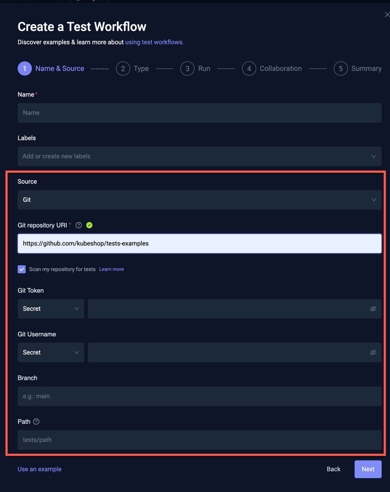
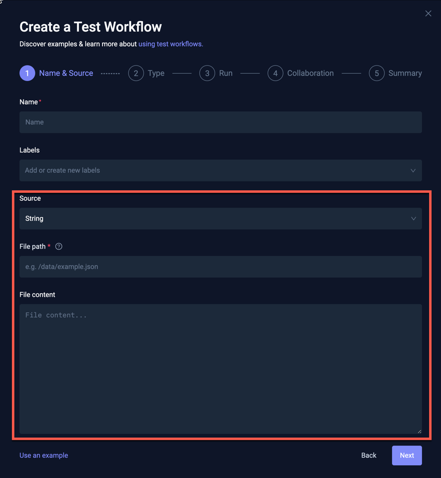
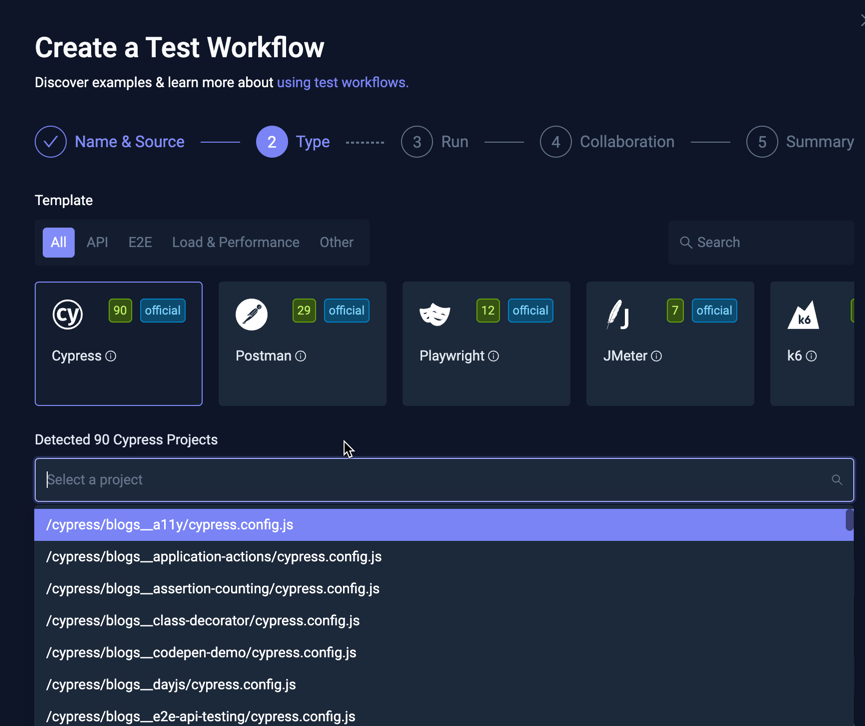

# Workflow Wizard

The **Workflow Wizard** guides you through creating and managing Testkube Workflows – streamlining test setup
by automatically discovering tests, generating configurations, and producing YAML files. The Wizard improves onboarding
speed, reduces configuration errors, and offers several options that allow you to create Workflows.

You initiate the Wizard by accessing **Test Workflows** and selecting **Add a new Test Workflow**.

Upon selection of **Add a new Test Workflow**, the **Create a Test Workflow** modal opens. You can start a new Workflow via **Create with Wizard**, 
**Start from an example**, **Combine existing Workflows**, and **Import from YAML**.

## Create with Wizard

**Create with Wizard** includes five steps:

1. **Name & Source** – Allows you to identify and distinquish your test by providing **Name**, **Labels**, and **Source**.
1. **Type** – Allows you to select a project and indicate the testing tool version number.
1. **Run** – Enables you to specify the configuration for how to run the test.
1. **Collaboration** – Allows you to establish the settings for the generated Workflow.
1. **Summary** – Displays the underlying Workflow YAML for your test.

### Step 1 – Name & Source

Complete the fields in **Name & Source**.

You must enter a **Name**. **Labels** and **Source** are optional. In the drop-down list box, **Source** contains:

* **Git** – Prompts for Git repository details.
* **File** – Allows you to upload a file containing the test you want to run.
* **String** – Allows you to specify the test directly in the dialog.

:::tip
For additional information about how to work with Workflow content, read [Test Workflows – Content](/articles/test-workflows-content)
:::

#### Git Source

When you select **Git** as the **Source**, your test prompts as follows:

* **Git Repository URI** – Allows you to enter the URI. Testkube supports checking out repositories via HTTPS or SSH.
* **Scan my repository for tests** – Enables [Automatic Test Discovery](#automatic-test-discovery) via this default checkbox selection.
* **Git Token** / **Git Username** – Allows you to choose **Secret Reference**, **Secret**, **Plain-Text**, **Credential**, or **Credential Reference**.
  * **Secret Reference** – Allows you to specify both the Kubernetes Secret Name and Key to use.
  * **Secret** – Testkube automatically creates a Kubernetes Secret for the specified value.
  * **Plain-text** – Allows you to specify the value in plain-text (**not recommended**). 
  * **Credenital** – Allows you to enter the credential name.
  * **Credential Reference** – Allows you to enter the credential reference.
* **Branch** – Allows you to specify the branch name.
* **Path** – Allows you to specify a path (relative to the repository root) that contains your tests.

#### Automatic Test Discovery

Default selected checkbox – **Scan my repository for test** (with [Git Source selection](#git-source)) – triggers
Testkube's automatic scan for supported tests in the specific repository/branch/folder.

Testkube attempts to identify the following test types:

* Cypress Projects
* Gradle Projects
* JMeter Projects
* K6 scripts
* Maven Projects
* Playwright Projects
* Postman Collections

:::tip
Testkube not finding your tests? Common testing tool missing from this list? Let us know on [Slack](https://bit.ly/testkube-slack). We can improve our algorithms!
:::

The panel depicted below displays as Testkube scans your repository. Selecting **Skip this** aborts the ongoing **Test Discovery** process and launches you to the next step in the Wizard, **Type**.

Scan completion also moves you forward to **Type**.

:::note
Testkube caches the **Test Discovery** result for your repository while you are within the Wizard. If you want to rescan
the repository (for example if you have updated its content), you must close the Wizard and restart the process.
:::

#### File Source

When you select **File** as the **Source**, your test prompts as follows:

* **File** – Allows you to choose the file to upload.
* **File path** – Allows you to denote the path where the file content will be mounted, which is the container that will be used to run your test. 
You can use relative or absolute paths.

#### String Source

When you select **String** as your **Source**, your test prompts as follows:

* **File Path** – The path where the file content will be mounted in the container. You can use relative or absolute paths.
* **File Content** – The actual test script that will be written to the file.

### Step 2 – Type

This step prompts you for the test **Type**:

The image above depicts Testkube's detection of a number of tests for each **Type** in the specified repository via
**Test Discovery**. The green value represents the number for each test using tools such as Cypress: 90, Postman: 29, Playwright: 12, and K6: 5.

Selecting a tool type that has detected tests displays a corresponding Selector that allows you to choose which of 
the tests you want to run. For example, when selecting the **Cypress** as depicted above, the following
Cypress projects are available:

Depending on the testing tool discovered, Testkube attempts to extract the correct version of the tool to use. You can view and modify
this tool version in **Cypress version to use**, which resides below the Selector. 

Selecting a tool for which Testkube has not found any tests prompts you for the version and command to use to run the tool:

### Step 3 – Run 

**Run** allows you to specify and modify the run command along with the Execution working directory for the selected testing tool. 
If your test was discovered via **Test Discovery**, these values will be pre-filled; otherwise, you must
manually enter the run command and path to your test script.

:::tip
When using a **Git Source**, the repository is cloned and mounted under the `/data/repo` folder in your container. The Execution
working directory must be set accordingly. When using a **File** or **String** **Source**, the file is written to the `/data` folder instead.
Ensure your command and Execution directory are configured appropriately.
:::

You can also specify:

* **Artifacts** – Location where Testkube can find artifacts created by your testing tool (such as reports and videos). For additional information, read [Artifacts](/articles/test-workflows-artifacts).
* **Environment Variables** – Any environment variables that must be passed to your testing tool for test Execution.

### Step 4 – Collaboration

**Collaboration** allows you to add the Workflow to a [Resource Group](/articles/resource-groups) for further collaboration and access control:

### Step 5 – Summary

This step displays the generated Workflow YAML based on the input provided in previous steps. You can
modify the YAML (as needed), or you can return to the previous steps for update.

Select the **Inline template definitions** checkbox to *inline* any used templates into the generated YAML.

:::tip

Select this checkbox to make detailed changes to how the underlying testing tool is used; changes **will not**
affect other Workflows using the same template.

:::

When you are satisfied with the created Workflow, select **Create & Run** or **Create**.

## Start from an Example

**Start from an example** allows you to launch a test with one of Testkube's example Workflows, which you can modify
to align with your requirements.

Selecting **Start from an example** opens:

* The Selector (top) allows you to filter the examples that are visible and available for selection.
* The List (middle) displays the available examples.
* The YAML (bottom) displays the example you selected.

You can edit the example before selecting **Create & Run** or **Create**.

:::tip

You can change the **Name** of the Workflow you created by updating the
`metadata.name` property in the YAML example before creating the Workflow.

:::

## Combine Existing Workflows

**Combine existing Workflows** allows you to create a Workflow that orchestrates multiple existing Workflows to run in sequence or in parallel.

Selecting **Combine existing Workflows** opens:

Enter the **Name** and **Labels** (optional) that you want to add to this Workflow. Next, select
**+Add the first workflow** to choose an initial Workflow. Once added, you can include more existing Workflows
and organize them to execute in any preferred order or combination:

Upon completion, select **Next** to view the corresponding YAML for your Workflow.

Select **Create & Run** or **Create**.

:::tip

For additional information about **Combine existing workflows**, read [Workflow Orchestration](/articles/test-workflows-test-suites).

:::

## Import from YAML

**Import from YAML** allows you to paste and edit your YAML Workflow definition.

Selecting **Import from YAML** opens:

Upon completion, select **Create & Run** or **Create**.

:::tip

[Examples and Guides](/articles/examples/overview) contains Workflow examples that you can paste here, try, and refine.

:::
