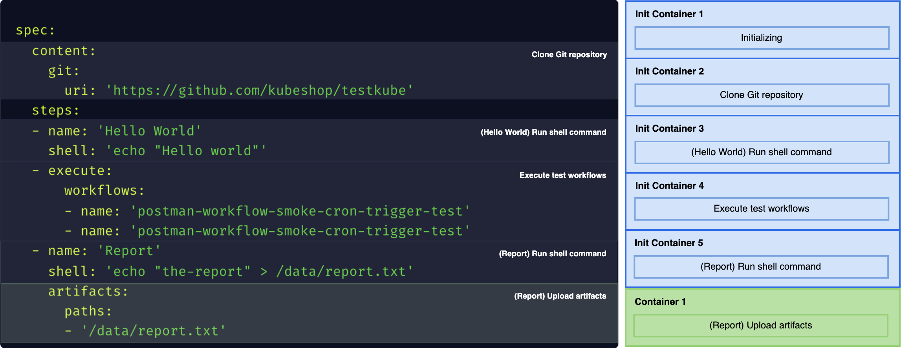

# Test Workflows - High-Level Architecture

Test Workflows analyze the expected operations and images, and build all the required native Kubernetes resources,
like [**ConfigMaps**](https://kubernetes.io/docs/concepts/configuration/configmap/) and [**Secrets**](https://kubernetes.io/docs/concepts/configuration/secret/) for data, and, most importantly, [**Jobs**](https://kubernetes.io/docs/concepts/workloads/controllers/job/), and [**Pods**](https://kubernetes.io/docs/concepts/workloads/pods/) for the actual execution.

After the Test Workflow execution is finished, all the created resources are deleted from the Kubernetes cluster.


## Components

### Controller

The Agent Server is responsible for controlling the Test Workflow execution. It:

* creates all the required resources,
* watches for their status and sends all the results to the storage or the Control Plane,
* and, destroys resources after they are no longer needed.

The Test Workflows are resilient to Agent Server downtime. After the Agent Server is restarted,
you are able to recover all Test Workflow information, as long as the execution Kubernetes resources are still intact.

### Job

For every execution, there is a [**Job**](https://kubernetes.io/docs/concepts/workloads/controllers/job/) created,
that is used to schedule the actual execution pod. It is prepared specifically for Test Workflow, and only small set of properties is configurable.

You can control part of the Job specification, [**using `spec.job` property**](./test-workflows-job-and-pod#job).

### Pod

The [**Pod**](https://kubernetes.io/docs/concepts/workloads/pods/) is actual execution unit in the Kubernetes.
Based on the Test Workflow, we are building the Pod that will execute all the requested operations and return all the information within its logs.

Besides the automatically configured options, you are able to adjust [**most of the Pod specification**](https://kubernetes.io/docs/reference/generated/kubernetes-api/v1.23/#podspec-v1-core)
in the [**`spec.pod` property**](./test-workflows-job-and-pod#pod).

## Execution

The Test Workflow may have nested steps, but they must be executed one after one, so we need to flatten the steps into sequential operations.

All the sequential steps need to be run inside the same pod to access the shared file system.
General [**Containers**](https://kubernetes.io/docs/concepts/workloads/pods/#using-pods) in Kubernetes are running in parallel (and don't split workload resources),
so to achieve a sequential execution we are using [**Init Containers**](https://kubernetes.io/docs/concepts/workloads/pods/init-containers/) and the last container is in the `containers`.



### Merging Containers

Using Init Containers has a flaw - often, in your cluster, there may be an Operator that is adding some container to every Pod.
That container (i.e. in [**Istio**](https://istio.io/)), may be required for the routing.

Such containers are often added in the `containers` section, so they would be started **after** the Init Containers are completed.

:::note

Newer Kubernetes supports [**sidecar containers**](https://kubernetes.io/docs/concepts/workloads/pods/sidecar-containers/) which are accessible for Init Containers too,
and tools like Istio are already using it in newer versions.

:::

To mitigate the problem, we try to merge multiple operations into a single container, when possible,
to reduce the scope where it's not accessible. It reduces the isolation a bit, but also reduces the cluster overhead and mitigates similar serious issues.

:::info

Merging containers is a default behavior. To opt-out, you can use system flag in the Test Workflow or [**Global Template**](./test-workflow-templates#global-templates):

```yaml
spec:
  system:
    isolatedContainers: true
```

:::

To avoid issues with the reduced isolation, by default we are merging together only the internal operations that won't suffer from it.


### Pure Steps

If you want part of your `shell` or `run` steps to allow merging with other `shell`/`run` steps, you have to specify `pure: true` for them.
This way, they will be acknowledged as free of side effects and will be merged with next or previous step when it is possible.

When the steps are marked as pure, they are merged as long as they can live in the same container. It means that they need to have the same volumes mounted, same security context (user), and **most importantly the same image**. 

```yaml
spec:
  steps:
  # container 1
  - shell: echo 'Hello world 1'
    pure: true
  - shell: echo 'Hello world 2'
  # container 2
  - shell: echo 'Hello world 3'
  - shell: echo 'Hello world 4'
    pure: true
  - shell: echo 'Hello world 5'
```

:::info

If you wish to have that behavior by default for all steps, you can use a system flag in the Test Workflow or [**Global Template**](./test-workflow-templates#global-templates):

```yaml
spec:
  system:
    pureByDefault: true
```

:::


## Init Process

To perform advanced orchestration, Test Workflows are using their own [**Init Process**](https://en.wikipedia.org/wiki/Init).
That process is an actual command run in the container, where the environment is prepared, and executing the actual command to run.

Whenever you run a container with some command, like `command: [ "curl", "http://testkube.io" ]`,
we are actually doing something similar to `command: [ "/init", "curl", "http://testkube.io" ]`.
The `/init` process is responsible for all the preparation, execution of actual command, and cleanup.

## Fetching Image Metadata from the Container Registry

To build the proper Pod and Init Process, we need to know the most important details of the image, like:
* **Working Directory (`workingDir` / [`WORKDIR`](https://docs.docker.com/reference/dockerfile/#workdir)):** to change current working directory between operations in a single container.
* **Command (`command` / [`ENTRYPOINT`](https://docs.docker.com/reference/dockerfile/#entrypoint) and `args` / [`CMD`](https://docs.docker.com/reference/dockerfile/#cmd)):** to wrap with the Init Process.
* **User and Group (`securityContext.runAsUser/runAsGroup` / [`USER`](https://docs.docker.com/reference/dockerfile/#user)):** to configure the file system.

Kubernetes doesn't have a direct mechanism to get this metadata. To obtain it, we need to fetch the data from the Container Registry when it is needed.

### Private Container Registries

When the image you are using is stored in the private registry, you may need to add [`pod.imagePullSecrets`](https://docs.testkube.io/articles/test-workflows-examples-basics#configuring-the-pod) to the specific Test Workflow or [**Global Template**](./test-workflow-templates#global-templates).

#### Using Private AWS Elastic Container Registry

:::note

Supported only for Testkube Agent API version `2.1.162` or higher, and Testkube Helm Chart version `2.1.254` or higher.

:::

In the case you are using private AWS Elastic Container Registry (ECR), as its [authorization tokens](https://docs.aws.amazon.com/AmazonECR/latest/userguide/registry_auth.html#registry-auth-token) are only valid for 12 hours, you can ensure persistent Testkube access by configuring a Service Account with IAM Role or Environment Variables, follow these steps:

If you are running agent into AWS Elastic Kubernetes Service (EKS):

* Configure your EKS cluster to manage [IAM roles for service accounts](https://docs.aws.amazon.com/eks/latest/userguide/iam-roles-for-service-accounts.html).
* Create a [IAM Role](https://docs.aws.amazon.com/IAM/latest/UserGuide/id_roles_create_for-idp_oidc.html#idp_oidc_Create) allowing the following actions over your private registry: `ecr:GetAuthorizationToken`, `ecr:CreateRepository`, `ecr:BatchImportUpstreamImage`, `ecr:BatchGetImage`, `ecr:BatchCheckLayerAvailability`, `ecr:CompleteLayerUpload`, and `ecr:GetDownloadUrlForLayer`.

:::note

The actions `ecr:CreateRepository` and `ecr:CompleteLayerUpload` are only needed when AWS ECR is mirroring Docker Hub with a pull through cache rule. If not, pulling and pushing of images to AWS ECR must be done manually or with another automated mechanism.

:::

* Assign IAM Role to `testkube-api-server` service account with annotation: `eks.amazonaws.com/role-arn=<iam-role-arn>`. 

    ```yaml
    testkube-api:
      serviceAccount:
        annotations:
          eks.amazonaws.com/role-arn=<iam-role-arn>
    ```

* If you want to force Testkube Agent to use your custom service account, 

    ```yaml
    testkube-api:
      serviceAccount:
        create: false
        name: <custom-service-account-name>
    ```

If you are running agent from any other Kubernetes distribution than EKS:

* Create an [IAM User](https://docs.aws.amazon.com/IAM/latest/UserGuide/id_users_create.html), create and assign an [IAM Role](https://docs.aws.amazon.com/IAM/latest/UserGuide/id_roles_create_for-idp_oidc.html#idp_oidc_Create) allowing the following actions over your private registry: `ecr:GetAuthorizationToken`, `ecr:CreateRepository`, `ecr:BatchImportUpstreamImage`, `ecr:BatchGetImage`, `ecr:BatchCheckLayerAvailability`, `ecr:CompleteLayerUpload`, and `ecr:GetDownloadUrlForLayer`.

:::note

The actions `ecr:CreateRepository` and `ecr:CompleteLayerUpload` are only needed when AWS ECR is mirroring Docker Hub with a pull through cache rule. If not, pulling and pushing of images to AWS ECR must be done manually or with another automated mechanism.

:::

* Generate an access key for that user.
* Save key ID and access key in your Secret Management tool that syncs values to your Kuberenetes cluster, or directly create the Kubernetes Secret in the Testkube Agent namespace.
* Finally, configure Testkube agent to take those values as environment variables form secret:

    ```yaml
    testkube-api:
      extraEnvVars:
        - name: AWS_ACCESS_KEY_ID
          valueFrom:
            secretKeyRef:
              name: <secret-name>
              key: AWS_ACCESS_KEY_ID
        - name: AWS_SECRET_ACCESS_KEY
          valueFrom:
            secretKeyRef:
              name: <secret-name>
              key: AWS_SECRET_ACCESS_KEY
        - name: AWS_DEFAULT_REGION
          valueFrom:
            secretKeyRef:
              name: <secret-name>
              key: AWS_DEFAULT_REGION
    ```

#### Using Google Cloud Artifact Registry

:::note

Supported only for Testkube Agent API version `2.1.162` or higher, and Testkube Helm Chart version `2.1.254` or higher.

:::

In the case you are using Google Cloud Artifact Registry (GCAR), as its [authorization tokens](https://cloud.google.com/docs/authentication/token-types#at-lifetime) cannot be valid for more than 12 hours, you can ensure persistent Testkube access by configuring a Google Service Account link with Kubernetes Service Account or Access Key, follow these steps:

In any of both solution you first must have the Google Service Account with right role or permission:

* Create a Google [Service Account](https://cloud.google.com/iam/docs/service-accounts-create), it must belong to the Google project in which the Artifact Registry is located.
* Assign the role Artifact Registry Reader to your Google Service Account:

    ```bash
    gcloud artifacts repositories add-iam-policy-binding <artifact-repository-name> \
        --location=<region-id> --project=<project-id> \
        --member=serviceAccount:<service-account-email> \
        --role="roles/artifactregistry.reader"
    ```

To link with a Kubernetes Service Account you must be running Testkube Agent into a Google Cloud Kubernetes Engine (GKE), then follow these instructions:

* Ensure [Workload Identity](https://cloud.google.com/kubernetes-engine/docs/how-to/workload-identity#enable_on_clusters_and_node_pools) is enabled in your cluster.
* Link Google [Service Account to the Testkube Agent Service Account](https://cloud.google.com/kubernetes-engine/docs/how-to/workload-identity#kubernetes-sa-to-iam), by default it creates one called `testkube-api-server`, but ensure your Testkube Agent installation is not customizing that behavior.
* Annotate Testkube Agent Service Account, use the snippet below as reference to update your `values.yaml`:

    ```yaml
    testkube-api:
      serviceAccount:
        annotations:
          iam.gke.io/gcp-service-account: <google-service-account-email>
    ```

If you prefer to use Service Account Access Key then:

* Create [Service Account Access Key](https://cloud.google.com/iam/docs/keys-create-delete#creating) and download credential JSON.
* Create a Kubernetes Secret with the credential JSON.
* Finally configure Testkube Agent to mount credential JSON, use the following snippet to update your `values.yaml`:

    ```yaml
    testkube-api:
      extraEnvVars:
        - name: GOOGLE_APPLICATION_CREDENTIALS
          value: /google/credentials.json
      additionalVolumes:
        - name: google-credentials
          secret:
            secretName: <google-credentials-secret-name>
      additionalVolumeMounts:
        - name: google-credentials
          mountPath: /google/
          readOnly: true
    ```

### Avoid Fetching Image Metadata

Companies may have a strict policy of not storing the credentials for the Container Registry in the Kubernetes' Secret, or disallow Secrets at all.

When Testkube does not have access to the Container Registry, it may revoke running the Test Workflow with errors about not being able to access the private image metadata.

To overcome this issue, you need to make sure that every step has the above data (`workingDir`, `securityContext.runAsUser/runAsGroup`) provided,
and you cannot use the `run` operation without specifying the `command`. As an example, you may set the default container configuration as follows:

```yaml
spec:
  container:
    workingDir: /data
    securityContext:
      runAsUser: 1001
      runAsGroup: 1001
```

It can be added as part of specific Test Workflow, or globally in the [**Global Template**](./test-workflow-templates#global-templates).

:::note

Some images may be prepared to work correctly only with selected user/group IDs.
In that case, the container may fail using the common one, and you will need to specify the expected one for this step.

:::

## Parallelization and Services

When you are scheduling [**Parallel Steps**](http://localhost:3000/articles/test-workflows-parallel) or [**Services**](http://localhost:3000/articles/test-workflows-services),
the main Test Workflow execution Pod is communicating directly with Kubernetes to create, monitor, and destroy the Jobs and Pods for each of requested parallel operations, similar to the actual execution.
