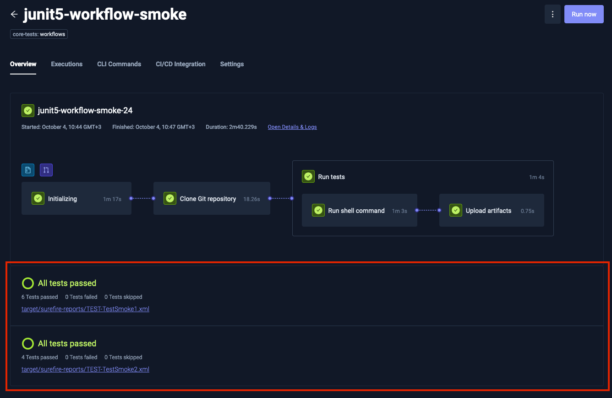
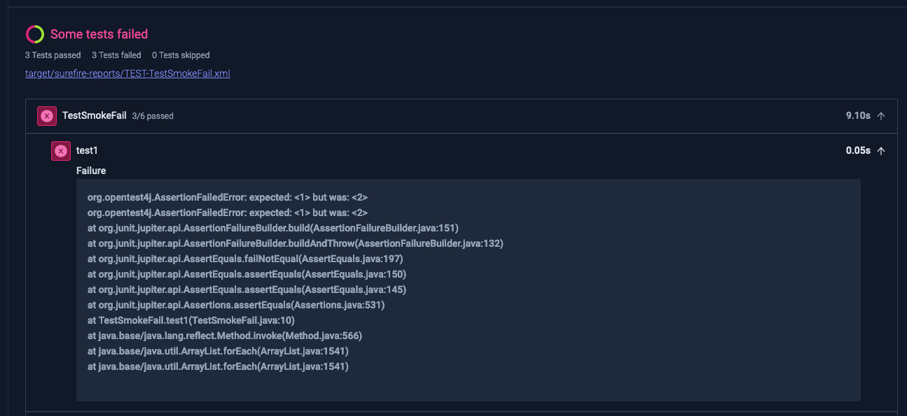
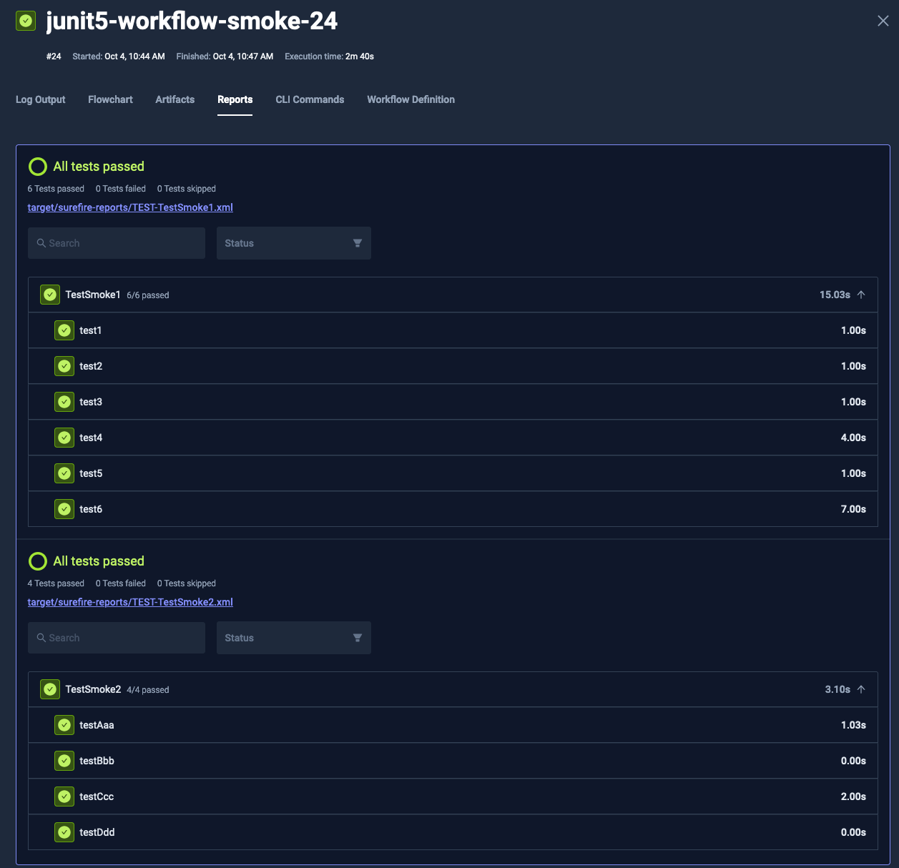
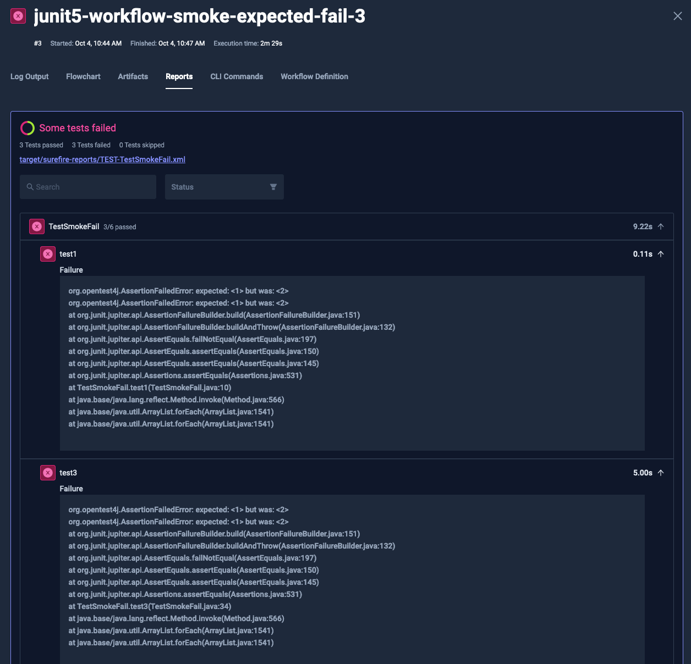

# JUnit Processing and Visualization

Testkube provides comprehensive support for processing and visualizing JUnit XML reports generated during Test Workflows.  
This page explains how Testkube handles these reports and presents the information to users.

## JUnit Report Extraction

Testkube automatically scans all artifacts for `.xml` files that are valid [JUnit XML reports](https://github.com/testmoapp/junitxml).  
It then parses their contents to make them available for various reporting and visualization features. [Read more](/articles/test-workflows-artifacts#junit-report-extraction).

## Artifact Collection

To ensure that your JUnit reports are processed, you need to collect them as artifacts.  
For detailed information on artifact collection in Test Workflows, please refer to our [Test Workflows Artifacts](/articles/test-workflows-artifacts) page.

## Visualization Features

Testkube provides multiple ways to visualize and interact with the processed JUnit reports:

### 1. Execution Overview Tab

On the Overview tab of an Execution page, you'll find a new section dedicated to JUnit reports. This section is located below the execution flowchart and provides:

- A summary of all processed JUnit reports
- The overall status of the tests
- Immediate visibility of any errors and their associated logs

This at-a-glance view allows for quick assessment of test results and easy identification of any issues that require attention.





### 2. Reports Tab

For a more detailed examination of your JUnit reports, navigate to the Reports tab of the execution. Here, you'll find:

- A comprehensive view of all processed reports
- A search bar for filtering test suites and test cases
- Options to filter results by "passed" or "failed" status

This detailed view allows for in-depth analysis of test results and easy navigation through large sets of test data.





## Benefits of JUnit Report Visualization

The enhanced visualization of JUnit reports in Testkube offers several advantages:

1. **Quick Overview**: Easily assess the overall health of your tests from the Execution Overview tab.
2. **Detailed Analysis**: Dive deep into test results using the comprehensive Reports tab.
3. **Efficient Troubleshooting**: Quickly identify and focus on failed tests or error messages.
4. **Improved Workflow**: Seamlessly integrate JUnit report analysis into your testing and development process.

By leveraging these visualization features, teams can more effectively monitor test outcomes, identify issues, 
and maintain the quality of their software throughout the development lifecycle.

## Creating JUnit Reports

See the examples below for how to create JUnit reports with some of the most common functional testing tools.

:::info
Always make sure that the generated reports are also included in the corresponding [`artifacts`](/articles/test-workflows-artifacts) property for Testkube to find and process
them as described above.
:::

### Playwright

Add the `--reporter=junit` argument:

```
npx playwright test --reporter=junit
```

Read more in the [Playwright Docs](https://playwright.dev/docs/test-reporters#junit-reporter).

### Postman

Add the `junit` reporter to the `-r` argument and specify the output file with `--reporter-junit-export`:

```
newman run my-collection.json -r cli,junit --reporter-junit-export /data/artifacts/junit-report.xml
```

Read more in the [Newman Docs](https://learning.postman.com/docs/collections/using-newman-cli/newman-built-in-reporters/)

### Cypress

Add the `--reporter` and `--reporter-options` arguments:

```
cypress run --reporter junit --reporter-options "mochaFile=results/my-test-output-[hash].xml"
```

Read more in the [Cypress Docs](https://docs.cypress.io/guides/tooling/reporters).

### Pytest

Add the `--junit-xml` argument:

```
pytest tests --junit-xml=/data/artifacts/pytest-report.xml
```

Read more in the [Pytest docs](https://docs.pytest.org/en/stable/how-to/output.html#creating-junitxml-format-files).

### JUnit / TestNG with Maven

Make sure you have the surefire plugin added to your pom.xml file:

```xml
    <build>
        <plugins>
            <plugin>
                <groupId>org.apache.maven.plugins</groupId>
                <artifactId>maven-surefire-plugin</artifactId>
                <version>3.5.0</version>
            </plugin>

            ...
        </plugins>
    </build>
```

When you run the test goal the corresponding junit xml files will be generated into the target/surefire-reports folder:

```
mvn test
```

Read more in the [Surefire Plugin docs](https://maven.apache.org/surefire/maven-surefire-plugin/)

### Go

Install the `go-junit-report` tool to convert Go test output to JUnit format:

```
go install github.com/jstemmer/go-junit-report/v2@latest
```

Run your tests and pipe the output through `go-junit-report` to generate the JUnit XML file:

```
go test -v 2>&1 ./... | go-junit-report -iocopy -set-exit-code -out /data/artifacts/junit-report.xml
```

The flags used above:

- `-iocopy`: Copies stdin to stdout, useful for seeing test output in real-time
- `-set-exit-code`: Exits with non-zero code if tests fail
- `-out`: Specifies the output file location

Read more in the [go-junit-report docs](https://github.com/jstemmer/go-junit-report).

### Jest

Add the `jest-junit` reporter package to your project:

```
npm install --save-dev jest-junit
```

Configure the reporter in your Jest config:

```
{
  "reporters": [ "default", "jest-junit" ]
}
```

Then run Jest normally to generate the report:

```
jest
```

For CI environments, you can explicitly specify the reporters:

```
jest --ci --reporters=default --reporters=jest-junit
```

Read more in the [jest-junit docs](https://www.npmjs.com/package/jest-junit).

### Mocha

Install the Mocha JUnit reporter either locally:

```
npm install mocha-junit-reporter --save-dev
```

or globally:

```
npm install -g mocha-junit-reporter
```

Run Mocha with the JUnit reporter:

```
mocha test --reporter mocha-junit-reporter
```

By default, this creates `test-results.xml` in the current directory. You can specify a custom location for the report file in several ways:

Using an environment variable:

```
MOCHA_FILE=./path_to_your/file.xml mocha test --reporter mocha-junit-reporter
```

Using reporter options:

```
mocha test --reporter mocha-junit-reporter --reporter-options mochaFile=./path_to_your/file.xml
```

Or programmatically:

```javascript
var mocha = new Mocha({
  reporter: "mocha-junit-reporter",
  reporterOptions: {
    mochaFile: "./path_to_your/file.xml",
  },
});
```

Read more in the [mocha-junit-reporter docs](https://www.npmjs.com/package/mocha-junit-reporter).

## Conclusion

Testkubes JUnit report processing and visualization features provide a powerful toolset for managing and analyzing test
results. By automatically extracting data from JUnit XML reports and presenting it in both summary and detailed views, 
Testkube enables teams to gain valuable insights into their test workflows quickly and efficiently.

:::tip
For more information on Testkubes reporting features, check out [Test Insights](/articles/test-insights).
:::
