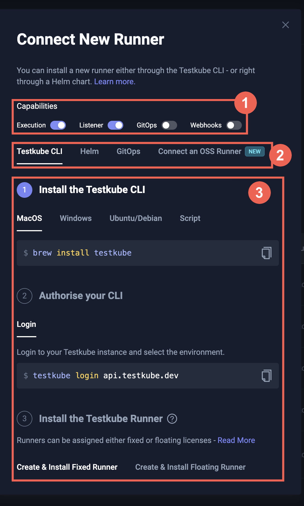
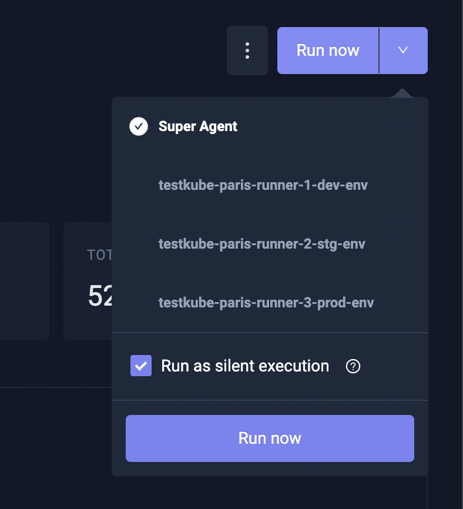

# Running Test Workflows

import Tabs from "@theme/Tabs";
import TabItem from "@theme/TabItem";

## Overview

Workflows can be triggered to execute in any of the ways described in [Triggering Test Workflows](/articles/triggering-overview). When triggered,
Workflows execute either on the default Standalone Runner or dedicated runners connected to an Environment - [Read More about Runners](/articles/agents-overview),

Check out the [High-level Architecture](/articles/test-workflows-high-level-architecture) to understand how Workflows
are used to create Kubernetes Jobs and Pods during execution.

## Targeting runners {#targeting-runner-agents}

If you want to run a Workflow on a specific Runner instead of the default Standalone Runner, you can do so in several ways:

- Via the Dashboard as described at [Running a Workflow](/articles/testkube-dashboard-workflow-details#running-a-workflow).
- Via the CLI by using the `--target` argument for the `testkube run testworkflow` command (see below).
- By targeting specific runner(s) directly in your Testkube Resource as [described below](#targeting-runner-agents-in-testkube-resources).

When a Workflow has been executed on multiple runners, the Dashboard provides an expandable section for the corresponding
executions, see [Multi-runner Executions](/articles/testkube-dashboard-workflow-details#multi-agent-executions).

## Runner Quickstart {#runner-agent-quickstart}

If you don't want to run your Workflows on the default Standalone Runner, you can install and run them on a specific
runner as described below:

### 1. Install your first runner {#1-install-your-first-runner-agent}

<Tabs groupId="install-runner-runner">
  <TabItem value="cli" label="From the CLI" default>

After installing the [Testkube CLI](/articles/cli) and using `testkube login` to log in to your
Testkube Environment, use the `testkube install runner <name> --create --execution` command to install your first runner:

```sh
$ testkube install runner staging-runner --create --execution
```

This will create and install a runner named `staging-runner` that can now be used to run your Workflows.

:::tip
Alternatively, you can [install runner using Helm Charts](/articles/multi-agent-runner-helm-chart).
:::

  </TabItem>
  <TabItem value="dashboard" label="From the Dashboard">

Open the Testkube Dashboard and navigate to the **Runners** page for your Environment (see [Adding Runners to an Environment](/articles/agents-overview#adding-agents-to-an-environment) for more details). Click the **Connect New Runner**
button to open the installation dialog:



In the dialog:

1. Choose the **Runner** capability for the new Runner.
2. Select your preferred installation tool - **Testkube CLI**, **Helm**, or **GitOps**.
3. Copy and run the generated commands (or YAML) against the cluster/namespace where you want the runner to execute Workflows.

Once the Runner connects successfully, it will appear in the list of Runners and is ready to run your Workflows.

  </TabItem>
</Tabs>

### 2. Run your Workflows

Run your Workflows on a specific runner by specifying the name of the runner with the `--target` argument:

```sh
testkube run testworkflow my-k6-test --target name=staging-runner
```

This schedules the `my-k6-test` Workflow to run on the `staging-runner` runner we created above.

:::tip
Check out the [Multi-runner CLI Overview](/articles/multi-agent-cli) for an overview of all available CLI
commands related to Multi-runner Environments.
:::

## Runner modes {#runner-agent-modes}

Runners can be created in one of three different modes, impacting how they are selected for execution:

- **Independent runners** (default) need to be targeted explicitly by name to run a Workflow (as in the Getting Started above).
- **Grouped runners** can be targeted/filtered by labels/groups - allowing you to run a Workflow on either a single available
  runner (of several) or on multiple runners at once.
- **Global runners** do not need to be targeted by name but can be filtered by labels, the default Standalone Runner works as a Global runner.

:::note
A runner's mode (`--global` / `--group`) can be changed in two ways: with `testkube update runner` /
the Dashboard, or by setting `runner.register.global` / `runner.register.groupName` in the runner's Helm
values and restarting the pod. Demoting a Global or Grouped runner back to Independent must be done via
the CLI — clearing the Helm value alone will not demote it. See
[Updating runner labels and mode](/articles/agents-overview#updating-runner-agent-labels-and-mode).
:::

### Independent runners {#independent-runner-agents}

A runner not defined as either Grouped or Global as described below, will work as an "Independent runner" and thus
_needs_ to be targeted explicitly by name to for Workflow execution.

For example, the following command runs the `my-k6-test` Workflow on the runner named `staging-runner`:

```sh
testkube run testworkflow my-k6-test --target name=staging-runner
```

Specifying multiple `--target name=XXX` arguments will run your Workflow on one of the selected runners, if you want to
run on all of them use the `--target-replicate` argument [described below](#running-on-multiple-runner-agents).

:::tip
Independent runners are useful for ephemeral use-cases when you need to target specific Workflow Executions - [Read More](/articles/ephemeral-environments#multi-agent-approach).
:::

### Grouped runners {#grouped-runner-agents}

Grouped runners are defined by a `--group` argument when creating/installing:

```sh
# install grouped runner
$ testkube install runner staging-runner --create --group staging-runners
```

Grouped runners _need_ to be either targeted by name (as the independent runners above), or by group, which will
use any available runner in that group for execution:

```sh
# run Workflow on an available runner in the staging-runners group
testkube run testworkflow my-k6-test --target group=staging-runners
```

If you want to run on _all_ runners in a group, use the `--target-replicate name` argument:

```sh
# run Workflow on all runners in the staging-runners group
testkube run testworkflow my-k6-test --target group=staging-runners --target-replicate name
```

:::tip
You can use `--target-replicate` to enable execution across multiple runners as described [below](#running-on-multiple-runner-agents).
:::

### Global runners {#global-runner-agents}

Global runners are created with the `--global` argument:

```shell
# install Global runners
$ testkube install runner global-runner --create --global
```

Global runners will be used either when no target is specified to the run command or when a corresponding
label-filter (see below) applies to them.

```sh
# Run Workflow on an available Global runner
testkube run testworkflow my-k6-test
```

:::info
The required Standalone Runner always works as a Global runner.
:::

## Runner Targeting {#runner-agent-targeting}

Once you have created runners in your Environment, you can select them both implicitly and explicitly when
executing your Workflows. Selection of runners can be done both at runtime when executing a
Workflow via the CLI or Dashboard, or at design-time when defining Workflows, CronJobs, Triggers, etc.

### Using labels for runner selection {#using-labels-for-runner-agent-selection}

Labels can be added to any type of runner with the `-l <name=value>` argument during creation, these
can then be used to filter out runners that are used for execution.

Labels can be updated either with `testkube update runner <name> -l <key>=<value>` or by setting
`runner.register.labels` in the runner's Helm values — see
[Updating runner labels and mode](/articles/agents-overview#updating-runner-agent-labels-and-mode)
for when each method takes effect.

```sh
# run Workflow on a runner in the staging-runners group with the region=europe label
testkube run testworkflow my-k6-test --target group=staging-runners --target region=europe
```

```sh
# run Workflow on a Global runner with the region=europe label
testkube run testworkflow my-k6-test --target region=europe
```

:::note
Since Independent runners always need to be targeted by name, adding labels to them provides no added benefit
in regard to targeting/execution.
:::

### Running on Multiple runners {#running-on-multiple-runner-agents}

If your target argument(s) selects multiple runners as shown above, Testkube will by default execute your Workflow
on only _one_ of the selected runners (randomly selected).

If you instead want to execute your Workflow on _all_ selected runners simultaneously you can add `--target-replicate <label>`
to the `testkube run testworkflow` command, which will "shard" the Workflow Execution across all unique matches for the
specified `label` (which could be `name`).

For example:

```
testkube run testworkflow my-k6-test --target name=runner1 --target name=runner2 --target-replicate=name
```

will run the specified Workflow on both runners since their names are unique.

A more advanced use-case: For Grouped runners created with these arguments:

```
name=runner-1 group=my-group team=users
name=runner-2 group=my-group team=users
name=runner-3 group=my-group team=something
```

When executing a Workflow with

```
testkube run testworkflow my-k6-test --target group=my-group --target-replicate=team
```

This makes two groups, sharded by team:

- The `users` team: `name=runner-1 group=my-group team=users` and `name=runner-2 group=my-group team=users`
- The `something` team: `namerunner-=3 group=my-group team=something`

Because of that, the execution will be run twice:

- any (1) of: `name=runner-1 group=my-group team=users` and `name=runner-2 group=my-group team=users`
- any (1) of: `name=runner-3 group=my-group team=something`

### Targeting runners in Testkube Resources {#targeting-runner-agents-in-testkube-resources}

There are several situations where you might want to target specific runners in your actual Testkube Resource
definitions:

- **Workflows** - you might want to ensure that a Workflow always runs on a runner with a specific name or label - [Read More](/articles/test-workflows#runner-agent-target).
- **WorkflowTemplates** - you might want to ensure that a set of Workflows uses the same runner - [Read More](/articles/test-workflows#runner-agent-target).
- **Workflow CronJobs** - you might want to target scheduled Workflow Executions to specific runner(s) - [Read More](/articles/test-workflows#targeting-specific-runner-agents-in-cronjobs).
- **Workflow `execute` Steps** - you might want Composite Workflows to execute Workflows on specific runner(s) - [Read More](/articles/test-workflows-test-suites#targeting-specific-runner-agents).
- **Triggers** - you might want Kubernetes Event Triggers to trigger Workflow Executions on specific runner(s) - [Read More](/articles/test-triggers#targeting-specific-runner-agents).
- **Execution CRDs** - you might want an `WorkflowExecution` CR to trigger Workflow Executions on specific runner(s) - [Read More](/articles/test-executions#targeting-specific-runner-agents).

Each of these definitions supports a corresponding `target` property:

```yaml
target:
  schedulerPolicy: OnlyWhenMatches # optional
  match: [<label>: <values>]
  not: [<label>: <values>]
  replicate: [<labels>]
```

`schedulerPolicy: OnlyWhenMatches` is available anywhere this shared `target` structure is accepted, including Workflows,
WorkflowTemplates, Workflow CronJobs, Triggers, execution CRDs, and API execution requests. It prevents creation of an
execution when no existing, non-deleted runner in that environment matches the normalized target. Without the field,
targeted executions retain their existing queueing behavior.

The following targets a specific runner by name:

```yaml
target:
  match:
    name:
      - staging-runner
```

or run on a Grouped runner:

```yaml
target:
  match:
    group:
      - region-us
```

Add `replicate` to mimic `--target-replicate` behavior described above, and `not` to exclude specific runners, for example:

Run on all runners in the `region-us` group, except the `k8s-1.21-spain` runner:

```yaml
target:
  match:
    group: [region-eu]
  not:
    name: [k8s-1.21-spain]
  replicate:
    - name
```

### Targeting the Default (Full-Capability) Runner {#targeting-the-default-full-capability-agent}

Environments that were migrated from pre-2.7 or created with a single default runner have one runner with all capabilities (Runner, Listener, GitOps, Webhook), which provides core functionality for Triggers, Webhooks, Prometheus metrics, etc. - [Read More](/articles/agents-overview). That runner is shown in the list of Runners with the label `runnertype: superagent`.

The default (full-capability) runner works as a Global runner (described above) and can also be explicitly targeted in several ways:

- By Label: `testkube run tw my-k6-test --target runnertype=superagent`
- By Name: `testkube run tw my-k6-test --target name=tkcenv_xxxxxxxxxx`
- By ID: `testkube run tw my-k6-test --target id=tkcroot_xxxxxxxxxx`

The ID is shown in the list of Runners (see below), the Name is the same `xxxx` prefixed with tkcenv instead.

### Queuing of Workflow Executions

When requesting to run a Workflow on a specific runner, either by name or label(s), and no
matching runner is available, Testkube will queue the execution of the Workflow indefinitely; once a corresponding
runner is available, the queued Workflow will be executed accordingly (barring Floating license restrictions - [Read More](/articles/agents-overview#licensing-for-runner-agents)).

You can abort queued executions using the corresponding [CLI Command](/cli/testkube-cancel-testworkflowexecution) or from the Dashboard.

## Silent Executions

Silent Executions let you run Workflows and Tests without recording the execution in Insights,
generating metrics, triggering CDEvents or Webhooks, or affecting Workflow health.
This is useful when you want to test or debug your pipelines without polluting analytics dashboards, reports, or automated signals.

Silent Execution mode is available both in the Dashboard and CLI.

> Note: Silent Executions are currently not support for nested Workflows which are run via `execute` command.

### When to use Silent Executions

Silent Executions are ideal when you want to run tests without leaving traces in your analytics or automation pipeline, such as:

- Local development and debugging
- Trial runs before production usage
- Internal verification or smoke checks
- CI experimentation without affecting dashboards

Silent Executions behave exactly like normal executions — they run on Runners, respect targeting rules, and produce logs — but execute "quietly."

### Running Silent Executions in the Dashboard

You can run a Workflow silently from the Workflow details page.
Click the dropdown button next to the **Run now** button and select the **Run as silent execution checkbox**,
then click on the **Run now** button.



### Running Silent Executions via CLI

To execute a Workflow silently using the CLI, add the `--silent` flag:

```sh
testkube run testworkflow my-k6-test --silent
```

### Silent Workflows

Introduced with Testkube 2.6.0, you can also set a Workflow to always run executions silently instead of having to flag each individual execution.

Simply add the following to your Workflow definition:

```yaml

...
spec:
  execution:
    silent: true
...
```

:::tip
Use this when you want to silence/mute a Workflow temporarily, for example if you know it will fail or is flaky for some reason that
can't be handled at the moment.
:::
