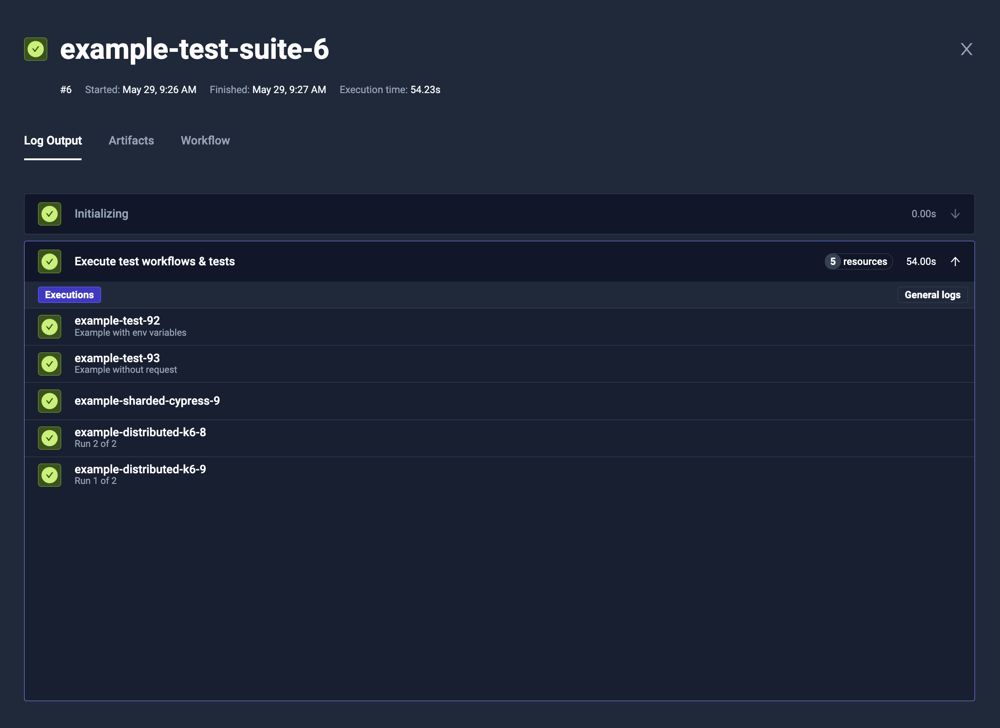
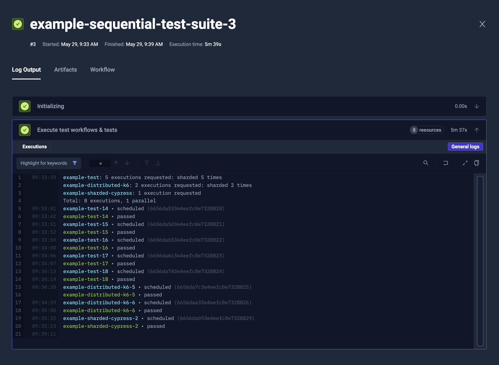

import Tabs from "@theme/Tabs";
import TabItem from "@theme/TabItem";

# Advanced Workflow Orchestration

import RequiresCommercialWorkflows from "./_commercial-workflows-note.mdx"

<RequiresCommercialWorkflows/>

With Test Workflows it is possible to run downstream Test Workflows and Tests with `execute` operation, allowing you
to create a Workflow that orchestrates the execution of other Workflows, both in sequence and parallel.

## Advantages over original Test Suite

As it is a regular Test Workflow, where a single step is dispatching downstream Test Workflows and Tests,
the execution is very flexible. You can:

* Fetch input data before (i.e. by using `curl`/`wget` to download data, or fetching Git repository).
* Run setup operations (i.e. start shared instance of database, or generate API key).
* Process the results (i.e. by notifying about the status).
* Run other tests based on the previous results.
* Trigger Workflows in other environments.
* Nest Workflows - Workflow triggering Workflow(s), triggering other Workflow(s).
* Run any number of Workflows both in sequence or parallel.
* Run Workflows based on labels - for dynamic selection of which Workflows to run.

:::warning
Test Workflows are our long-term solution, so keep in mind that the original Test Suites are being deprecated - [Read More   ](/articles/legacy-features).
:::

## Syntax

You have to use `execute` operation in the step, and provide definition of the Test Workflows to run - [Schema Reference](/articles/crds/testworkflows.testkube.io-v1#stepexecute).

:::tip

The Testkube Dashboard contains a visual builder for creating Composite Workflows -
[Read More](/articles/test-workflows-create-wizard#combine-existing-workflows)

:::

<Tabs>
<TabItem value="yaml" label="YAML" default>

```yaml
apiVersion: testworkflows.testkube.io/v1
kind: TestWorkflow
metadata:
  name: example-test-suite
spec:
  steps:
  - execute:
      workflows:
      - name: example-distributed-k6
        description: Run {{ index + 1 }} of {{ count }}
        count: 2
        config:
          vus: 8
          duration: 1s
          workers: 2
      - name: example-sharded-cypress
      tests:
      - name: example-test
        description: Example without request
      - name: example-test
        description: Example with env variables
        executionRequest:
          variables:
            SOME_VARIABLE:
              type: basic
              name: SOME_VARIABLE
              value: some-value
```

</TabItem>
<TabItem value="log" label="Log Output">



</TabItem>
</Tabs>

### Running Test Workflows with `execute`

To run Test Workflow as part of the `execute` step, you have to add its reference in the `workflows` list.

You need to provide `name`, along with optional `config` values for parametrization.

### Running Tests with `execute`

:::warning
Tests are being deprecated from Testkube - so only use this possibility if/while transitioning to Workflows
- [Read More](legacy-features.md).
:::

To run Tests as part of the `execute` step, you have to add its reference in the `tests` list.

You need to provide `name`, along with optional `executionRequest` values for parametrization,
that are similar to the regular Test execution request.

### Controlling the concurrency level

You can use `parallelism` property to control how many Test Workflows and Tests will be running at once.

In example, to run all the downstream jobs sequentially, you can use `parallelism: 1`.
It affects jobs instantiated by [**matrix and sharding**](./test-workflows-matrix-and-sharding.mdx) properties (like `count`) too.

<Tabs>
<TabItem value="yaml" label="YAML" default>

```yaml
apiVersion: testworkflows.testkube.io/v1
kind: TestWorkflow
metadata:
  name: example-sequential-test-suite
spec:
  steps:
  - execute:
      parallelism: 1
      workflows:
      - name: example-distributed-k6
        count: 2
        config:
          vus: 8
          duration: 1s
          workers: 2
      - name: example-sharded-cypress
      tests:
      - name: example-test
        count: 5
```

</TabItem>
<TabItem value="log" label="Log Output">



</TabItem>
</Tabs>

## Parallel / Sequential Execution

Using multiple `execute` steps in your Workflow allows you to orchestrate the execution of other Workflows both in parallel and in sequence. For example,
the below Workflow first runs the `cure-with-nginx-service` and `junit5-junit` Workflows in parallel, then the `cypress-browsers-matrix` and
`nunit-junit-report` workflows in sequence.

```yaml
apiVersion: testworkflows.testkube.io/v1
kind: TestWorkflow
metadata:
  name: composite-workflow
spec:
  steps:
    - execute:
        workflows:
          - name: curl-with-nginx-service
          - name: junit5-junit
    - execute:
        workflows:
          - name: cypress-browsers-matrix
    - execute:
        workflows:
          - name: nunit-junit-report
```

## Nesting workflows
Workflows can be nested, a Workflow can execute other Workflow(s) executing other Workflow(s). [**Parallelism**](#controlling-the-concurrency-level) can then be used to control the execution flow.

Example:

Tool-specific workflow (in this case k6 - executing multiple workflows for different cases)
```yaml
apiVersion: testworkflows.testkube.io/v1
kind: TestWorkflow
metadata:
  name: k6-workflow-suite
spec:
  steps:
  - execute:
      parallelism: 2
      workflows:
      - name: k6-workflow-smoke
      - name: k6-workflow-smoke-template
      - name: k6-workflow-smoke-template-without-checkout-step
      - name: k6-workflow-smoke-artifacts
      - name: distributed-k6-workflow-smoke
      - name: distributed-k6-workflow-smoke-artifacts
```

That can be executed from another workflow
```yaml
kind: TestWorkflow
apiVersion: testworkflows.testkube.io/v1
metadata:
  name: tw-suite-full
spec:
  steps:
  - execute:
      parallelism: 2
      workflows:
      - name: artillery-workflow-suite
      - name: cypress-workflow-suite
      - name: gradle-workflow-suite
      - name: jmeter-workflow-suite
      - name: k6-workflow-suite # workflow from the example
      - name: maven-workflow-suite
      - name: playwright-workflow-suite
      - name: postman-workflow-suite
      - name: soapui-workflow-suite
```

## Dynamic workflow selection
In case you don't know an exact list of workflows to be excuted inside of the suite, you can define it dynamically using test workflow labels.
This list will be generated during test workflow execution. You have 2 options to choose:

Either using labels themselves
```yaml
kind: TestWorkflow
apiVersion: testworkflows.testkube.io/v1
metadata:
  name: tw-suite-dynamic-labels
spec:
  steps:
  - execute:
      parallelism: 2
      workflows:
        - selector:
            matchLabels:
              core-tests: workflows
```

Or using Kubernetes label expressions
```yaml
kind: TestWorkflow
apiVersion: testworkflows.testkube.io/v1
metadata:
  name: tw-suite-dynamic-expressions
spec:
  steps:
  - execute:
      parallelism: 2
      workflows:
        - selector:
            matchExpressions:
            - key: core-tests
              operator: In
              values:
              - workflows
```

## Passing input from files

It may happen that you will need to pass information from the file system. You can either pass the files using Test Workflow expressions (like `file("./file-content.txt")`) or using a `tarball` syntax.

### Specific files

You can easily use Test Workflow expressions to fetch some files and send them as a configuration variable:

```yaml
apiVersion: testworkflows.testkube.io/v1
kind: TestWorkflow
metadata:
  name: example-test-suite-with-file-input
spec:
  content:
    git:
      uri: https://github.com/kubeshop/testkube
      revision: main
      paths:
      - test/k6/executor-tests/k6-smoke-test-without-envs.js
  steps:
  - execute:
      workflows:
      - name: example-distributed-k6
        config:
          vus: 8
          duration: 1s
          workers: 2
          script: '{{ file("/data/repo/test/k6/executor-tests/k6-smoke-test-without-envs.js") }}'
```

### Multiple files transfer

To transfer multiple files, similarly to `transfer` in [**Parallel Steps**](./test-workflows-parallel.mdx#copying-content-inside),
you can use a `tarball` syntax that will pack selected files and return the URL to download them:

```yaml
apiVersion: testworkflows.testkube.io/v1
kind: TestWorkflow
metadata:
  name: example-test-suite-with-file-input-packaged
spec:
  content:
    git:
      uri: https://github.com/kubeshop/testkube
      revision: main
      paths:
      - test/k6/executor-tests/k6-smoke-test-without-envs.js
  steps:
  - execute:
      workflows:
      - name: example-test-reading-files
        tarball:
          scripts:
            from: /data/repo
        config:
          input: '{{ tarball.scripts.url }}'
```

You can later use i.e. `content.tarball` to unpack them in destination test:

```yaml
apiVersion: testworkflows.testkube.io/v1
kind: TestWorkflow
metadata:
  name: example-test-reading-files
spec:
  config:
    input: {type: string}
  content:
    tarball:
    - url: "{{ config.input }}" # extract provided tarball
      path: "/data/repo"        # to local /data/repo directory (or any other)
  steps:
  - shell: tree /data/repo
```

### Matrix and sharding

The `execute` operation supports matrix and sharding, to run multiple replicas and/or distribute the load across multiple runs.
It is supported by regular matrix/sharding properties (`matrix`, `shards`, `count` and `maxCount`) for each Test Workflow or Test reference.

You can read more about it in the general [**Matrix and Sharding**](./test-workflows-matrix-and-sharding.mdx) documentation.
