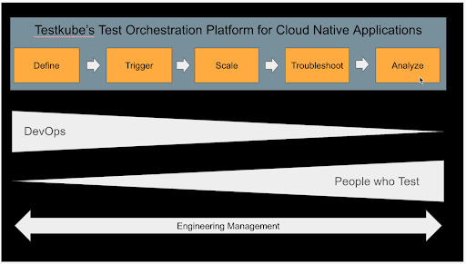

# Testkube Testing Pipeline

## Testkube in the STLC

The [Software Testing Lifecycle](https://www.geeksforgeeks.org/software-testing-life-cycle-stlc/) (STLC) is a well-established approach for testing software applications to ensure that they meet the requirements of their stakeholders and are free from defects. The STLC follows a series of steps or phases, each phase with its specific objectives and deliverables. These phases are:

- Requirements Analysis - Understanding what needs to be tested.
- Test Planning - Plan how the requirements will be tested.
- Test Case Development - Authoring of actual test cases.
- Test Environment Setup - Preparing the test environment.
- Test Execution - Executing your tests in your test environment.
- Test Closure - Ensure that all testing activities are completed.

## Testkube for Test Execution

Testkube focuses entirely on the Test Execution phase of the STLC, integrating with tools in the other phases as applicable. To further explain how Testkube supports Test Execution and how it fits into your CI/CD/Testing infrastructure, we can break down Test Execution into the following 5 steps:

- Define: Configuring the actual executing of your tests in your environment.
- Trigger: Triggering of the the actual execution of your test.
- Scale: Scaled execution of your tests in your infrastructure.
- Analyze: Analysis of test results, both from a tactical and strategic point of view.
- Troubleshoot: Understanding why your test failed by looking at logs, artifacts, etc.

The stakeholders vary across the pipeline, depending on the organization and its processes. DevOps are generally more focused on getting the execution of tests into place (steps 1-3), while Dev/QA needs to be able to analyze and troubleshoot test results (steps 4-5). 

Management needs to ensure that applications are tested thoroughly before they go into production, so they are indirect stakeholders in the process at large.

This can all be visualized as follows:

Let’s dig into each of these steps in the following sections and understand how Testkube supports all of them.

## Define

To be able to run your tests you’ll need to somehow define your test executions, i.e., which testing tool, test repository and script/file, arguments/parameters, infrastructure, etc. This is commonly done in one of the following ways:

- Using a declarative mechanism, for example a YAML Workflow in GitHub.
- Using a scripting language, for example a Jenkin pipeline script (groovy).
- Using visual tools/plugins specific to your testing tool(s) and CI/CD systems.
- Any combination of the above - i.e., your CI/CD system might have a native plugin/action for one testing tool but require you to create custom scripts/YAMLs for another.

It’s not uncommon to have multiple CI/CD tools in your infrastructure, for example Jenkins for building your backend microservices and GitLab or a GitOps tool for building/deploying your front-end applications, which of course adds to the complexity of defining and maintaining (and running!) your test executions in a consistent way. 

Defining test executions is most commonly done by DevOps/Build engineers, based on requirements put forward but dev and QA teams.

## Defining Test Execution in Testkube

Testkube uses Test Workflows as a generic abstraction for defining how your tests are executed. Test Workflows uses a declarative YAML vocabulary specifically designed for executing tests, with built-in functionality for:

- Retrieving tests from Git repositories, inline files and external volumes.
- Executing any test or testing tool available as a Docker image.
- Passing variables and arguments.
- Collecting results, artifacts and logs.
- Customizing the underlying pod/job resource configuration. 
- Orchestrating multiple test executions in sequence and parallel.
- Parallel execution of testing tools to 
generate massive load.
- Distribute executions to save time. 
- Setup/teardown of services your tests depend on.
- And others.

Testkube also provides [Workflow Templates](../articles/test-workflow-templates.md) that can be used to define common traits for any of the above mentioned features, which can then be shared across multiple workflows, allowing you to ensure consistent usage of these features. For example you might define templates for accessing Git repositories, setting resource allocations or defining Docker images for your tests.

Testkube allows you to label your Test Workflows however needed, for example: by target release, application or tool, allowing for flexible management of Workflows via a single dashboard where all workflows and their executions are available.

