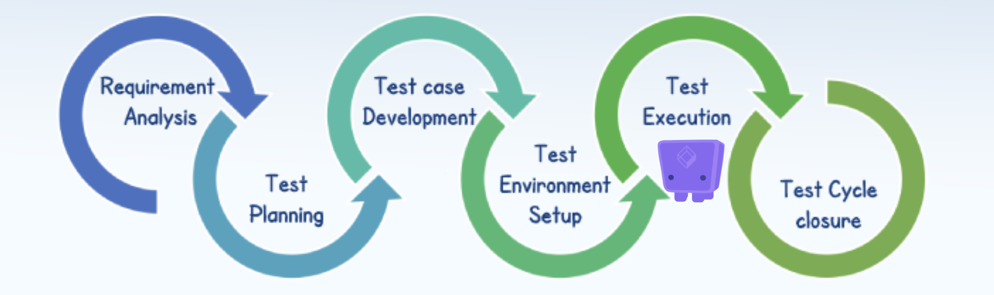

# Testkube in the STLC

## Overview of the STLC

The [Software Testing Lifecycle (STLC)](https://www.geeksforgeeks.org/software-testing-life-cycle-stlc/) is a well-established process used to ensure that software applications meet stakeholder requirements and are free from defects. The lifecycle comprises several phases, each with its specific objectives and deliverables.

## Phases of the STLC

- **Requirements Analysis:**  
  Understanding what needs to be tested.

- **Test Planning:**  
  Planning how the requirements will be tested.

- **Test Case Development:**  
  Authoring the actual test cases.

- **Test Environment Setup:**  
  Preparing the test environment.

- **Test Execution:**  
  Executing your tests in the test environment.

- **Test Closure:**  
  Ensuring that all testing activities are completed.

## Testkube for Test Execution

Testkube focuses entirely on the **Test Execution** phase of the STLC, while integrating with tools involved in the other phases as needed. It breaks down Test Execution into the following five key steps:

### Five Steps in Test Execution

- **[Define](defining-tests):**  
  Configuring how your tests are executed in your environment.

- **[Trigger](triggering-tests):**  
  Initiating the actual execution of your tests.

- **[Scale](running-scaling-tests):**  
  Managing the scaled execution of tests across your infrastructure.

- **[Troubleshoot](troubleshooting-tests):**  
  Investigating test failures by analyzing logs, artifacts, etc.

- **[Analyze](analyzing-results):**  
  Reviewing test results from both tactical and strategic perspectives.

### Stakeholders

- **DevOps:**  
  Focus on setting up and executing tests (steps 1-3).

- **Dev/QA:**  
  Concentrate on troubleshooting and analyzing test results (steps 4-5).

- **Management:**  
  Indirect stakeholders who ensure applications are thoroughly tested before production.

## Visual Overview

The following diagram visualizes the Test Execution pipeline supported by Testkube:

## Further Reading

Learn more about how to configure and manage your tests by exploring additional topics:

- [Defining Tests](../articles/defining-tests.md)
