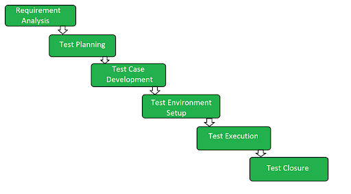
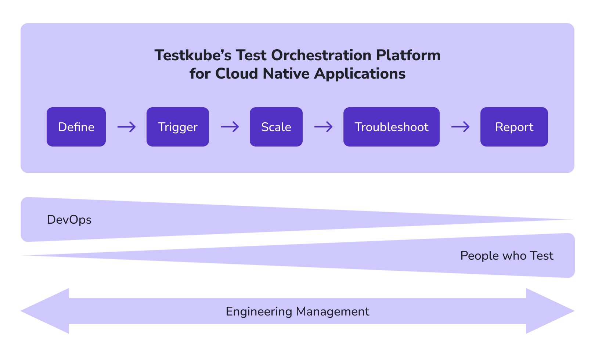

# Testkube in the STLC

The [Software Testing Lifecycle](https://www.geeksforgeeks.org/software-testing-life-cycle-stlc/) (STLC) is a well-established approach for testing software applications to ensure that they meet the requirements of their stakeholders and are free from defects. The STLC follows a series of steps or phases, each phase with its specific objectives and deliverables. These phases are:

- Requirements Analysis - Understanding what needs to be tested.
- Test Planning - Plan how the requirements will be tested.
- Test Case Development - Authoring of actual test cases.
- Test Environment Setup - Preparing the test environment.
- Test Execution - Executing your tests in your test environment.
- Test Closure - Ensure that all testing activities are completed.

## Testkube for Test Execution

Testkube focuses entirely on the Test Execution phase of the STLC, integrating with tools in the other phases as applicable. To further explain how Testkube supports Test Execution and how it fits into your CI/CD/Testing infrastructure, we can break down Test Execution into the following 5 steps:

- [Define](defining-tests): Configuring the actual executing of your tests in your environment.
- [Trigger](triggering-tests): Triggering of the the actual execution of your test.
- [Scale](running-scaling-tests): Scaled execution of your tests in your infrastructure.
- [Troubleshoot](troubleshooting-tests): Understanding why your test failed by looking at logs, artifacts, etc.
- [Analyze](analyzing-results): Analysis of test results, both from a tactical and strategic point of view.

The stakeholders vary across the pipeline, depending on the organization and its processes. DevOps are generally more focused on getting the execution of tests into place (steps 1-3), while Dev/QA needs to be able to analyze and troubleshoot test results (steps 4-5). 

Management needs to ensure that applications are tested thoroughly before they go into production, so they are indirect stakeholders in the process at large.

This can all be visualized as follows:

Let’s dig into each of these steps in the following sections and understand how Testkube supports all of them.

Read on about [Defining Tests](../articles/defining-tests.md).
