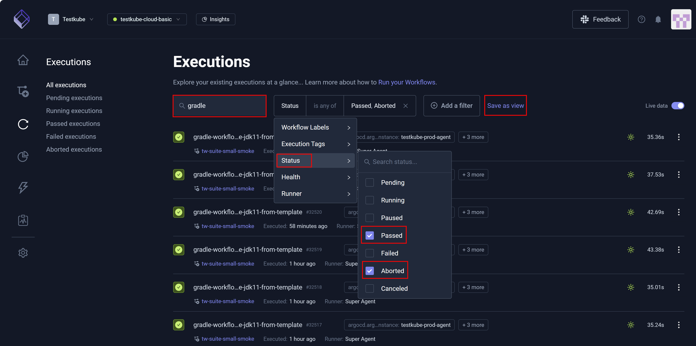
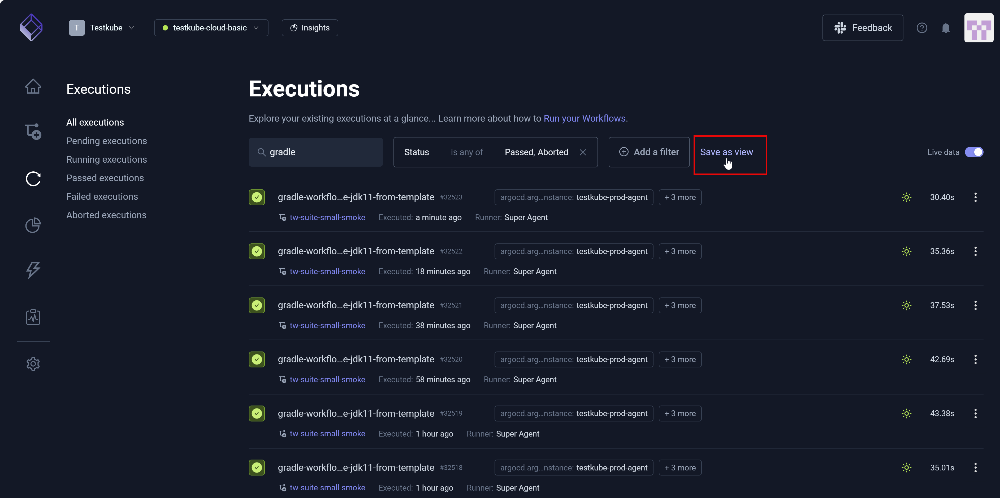
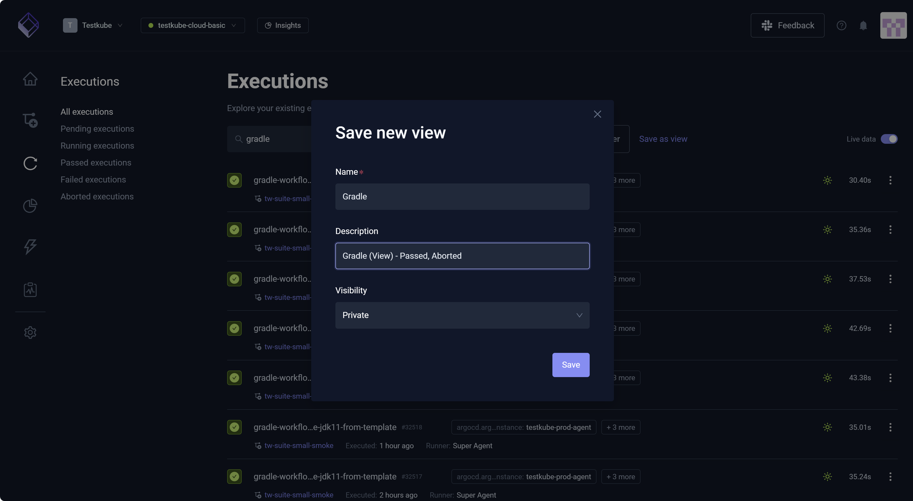
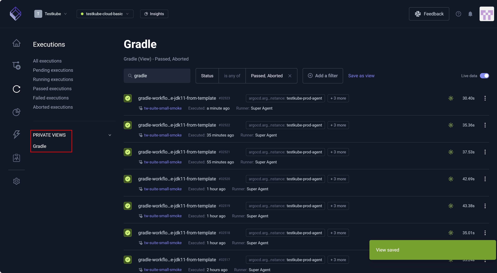
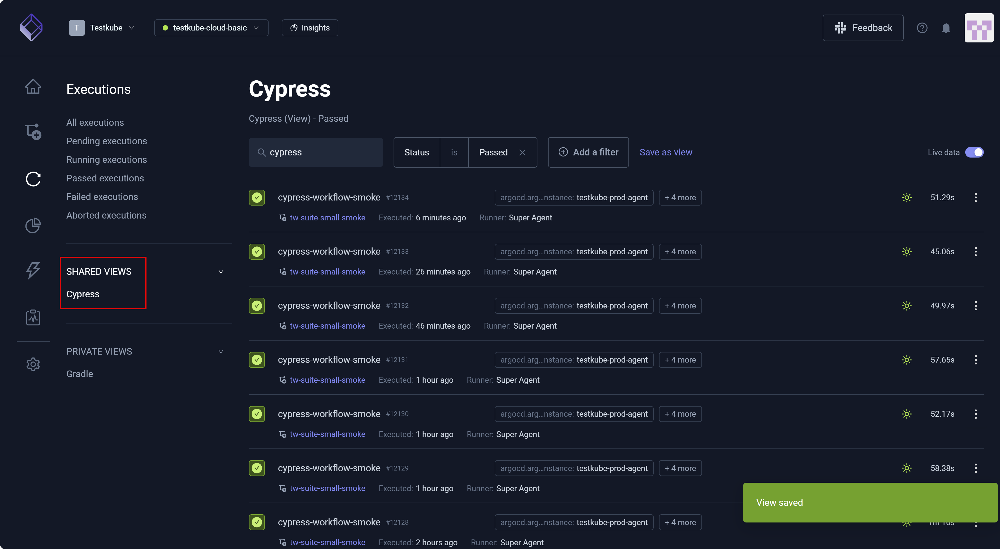

# Custom Views

Custom Views allow you to save reusable sets of search criteria and filters such that you do not need to repeatedly
enter the same information. When you enter frequently used search or filter criteria, you can save
those settings. 

Saved views appear in the left navigation pane under **PRIVATE VIEWS** (for your use only) or **SHARED VIEWS** (available to team members).
This feature helps you work more efficiently by reducing repetitive steps and allowing you to streamline how you
access commonly used search criteria and filters.

Custom Views are available in the **Workflow Catalog** and the **Executions** dashboard.

To establish a Custom View:

1. Enter a **Search** criterion.  
   **Save as view** becomes visible.
1. Click **Add a filter** to enter one or more filters.
   
1. Click **Save as view**.  
   **Save new view** opens – allowing you to designate your view parameters.
   
1. Enter information in the **Name**, **Description**, and **Visibility** fields.
   
1. Click **Save**.  
   The view becomes visible in the left navigation pane and associated with the **Visibility** you designated.
   
1. Perform and save another view, changing **Visibility** to **Shared across environment**. 
   The view becomes visible in the left navigation pane and associated with the **Visibility** you designated. You
   can hover over the view in the left pane, select the vertical dots (More Options), and choose **Delete** to remove.
   
   