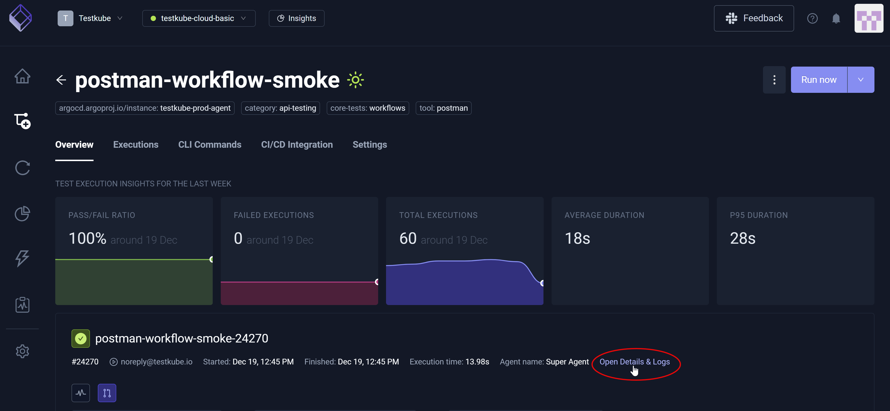
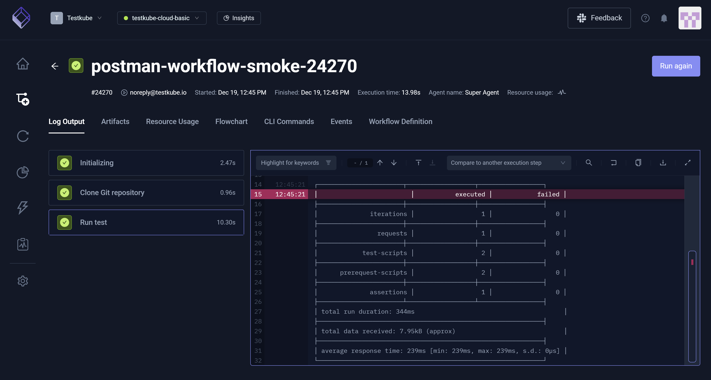
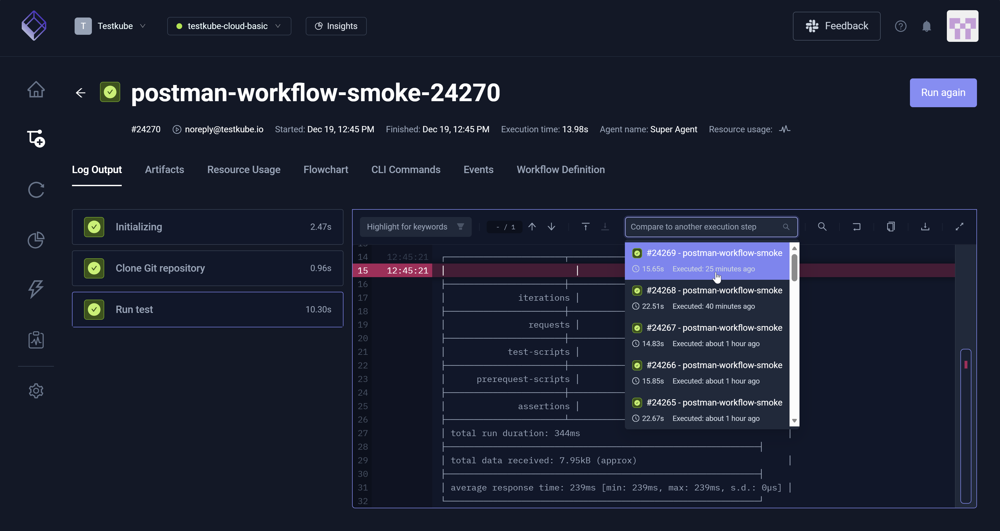
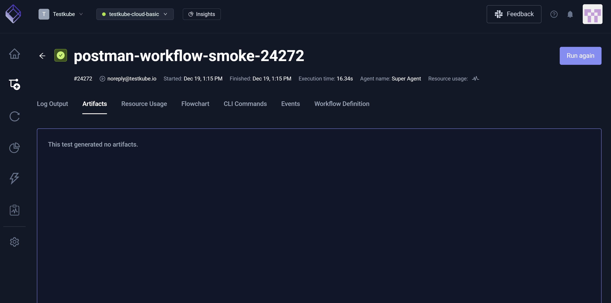
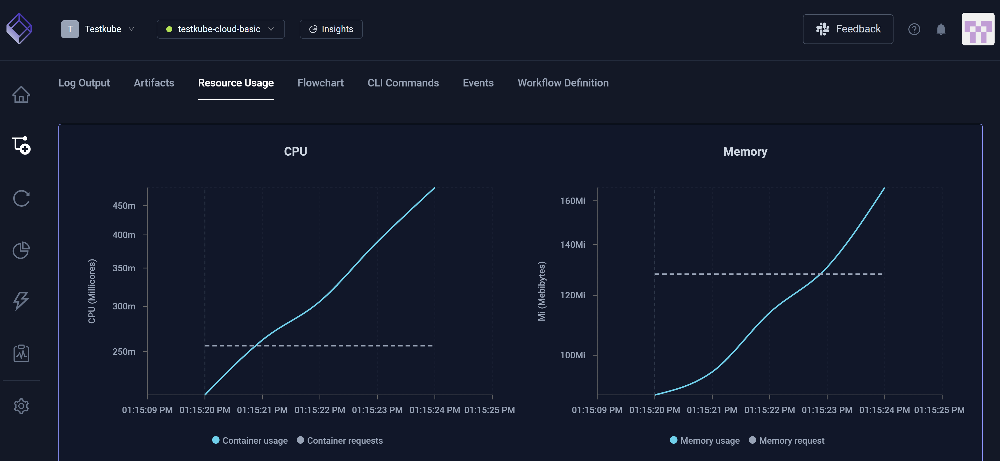
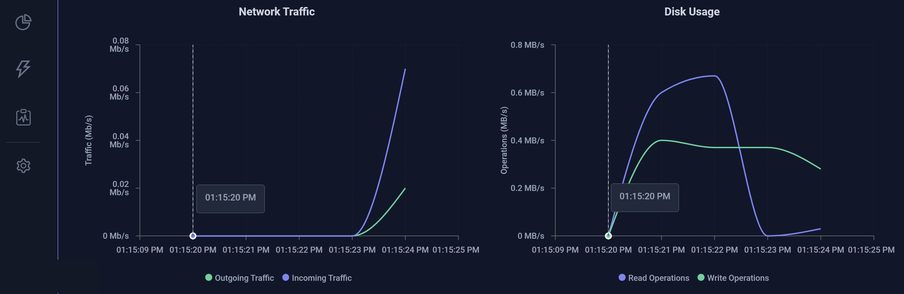
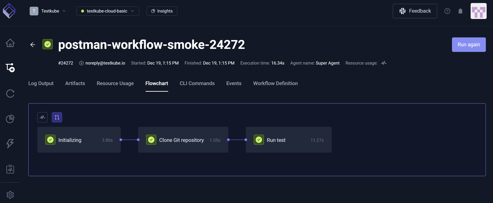
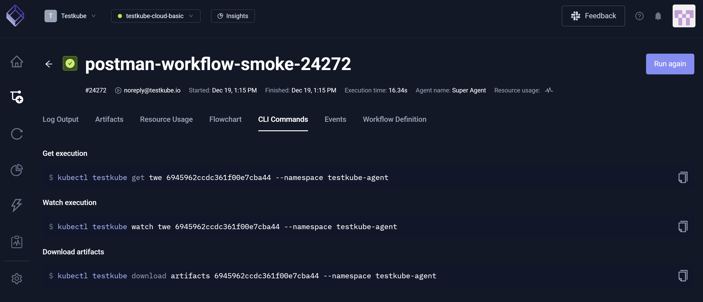
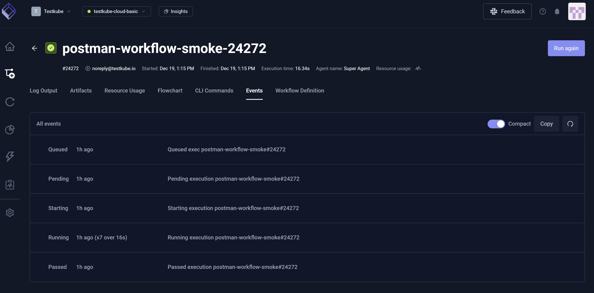
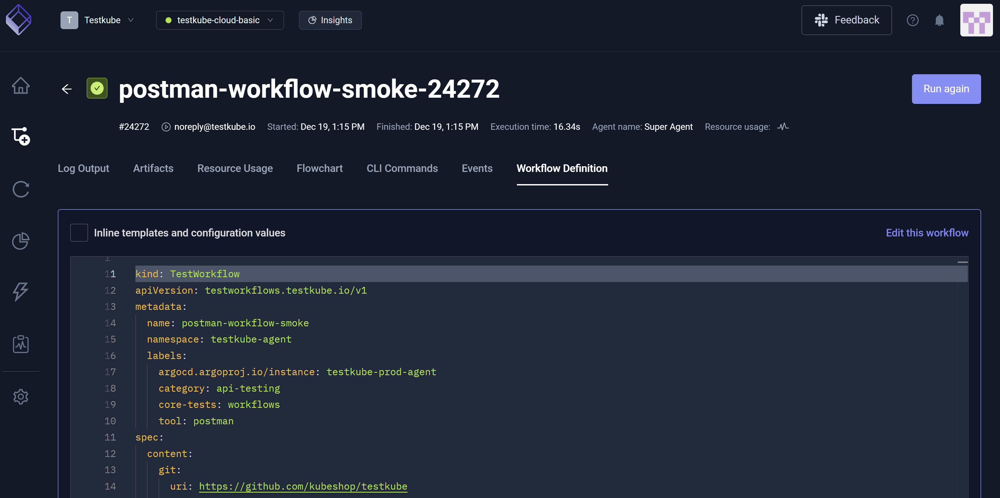

# Workflow Execution Details

**Workflow Execution Details** provides a comprehensive view of a Workflow execution to include the steps, logs, artifacts, and configuration – helping you understand
outcomes and troubleshoot any potential issues.

To view **Workflow Execution Details**, you must choose a Workflow execution then select **Open Details & Logs**. Selecting a single step/runtime instance or the entire execution 
facilitates your ability to view progress and pinpoint any failures within the overall Workflow.

After you select **Open Details & Logs**, you have access to the **Log Output**, **Artifacts**, **Resource Usage**, **Flowchart**, **CLI Commands**, 
**Events**, and **Workflow Definition** tabs that – upon selection – provide additional insight specific to the Workflow execution you selected. There will also be a **JUnit Reports** tab 
when Testkube detects corresponding JUnit reports. For additional information, read [Reports](../articles/test-workflows-reports#1-execution-overview-tab).

## Log Output

This tab displays the **Log Output** for this execution, providing runtime messages such as *Initializing*, *Clone Git Repository*, and *Run Test*. 
For additional information, read [Log Collection](../articles/logs-and-artifacts.md#log-collection).

## Comparing Logs across Executions

You can select the **Compare to another execution step** drop-down list box to choose another execution, comparing a second execution step to the first one you selected.

Upon selection of a second comparison execution step, you can view the highlighted differences between the two.

## Artifacts

This tab displays artifacts the execution created such as reports, charts, and images. In some cases, there are artifacts; in other cases, artifacts do not exist.
For additional information, read [Artifacts](/articles/logs-and-artifacts#artifact-collection).

## Resource Usage
This tab displays **CPU** and **Memory** consumption during execution, which helps you both identify performance issues and optimize resource allocation. You can hover
over each graph to gain additional insight, such as **CPU** *Container Usage* and *Container Requests* along with *Outgoing Traffic* and *Incoming Traffic* relative 
to **Network Traffic**.

**CPU** and **Memory**

**Network Traffic** and **Disk Usage**

## Flowchart

This tab displays a visualization of the Workflow structure and execution path, which helps you understand dependencies, order of operations, and failure points.

## CLI Commands

This tab shows CLI commands that you can use to interact with this Workflow execution with [Testkube CLI](../articles/cli.mdx).

## Events

This tab captures significant lifecycle actions (such as *Start*, *Completion*, and *Failure*) that occurred during execution runtime. 

:::note
You must enable this feature under **Organization Management**/**Product Features**/**Scheduler Events**.
:::

## Workflow Definition

This tab displays the YAML that allows you to configure the Workflow.

