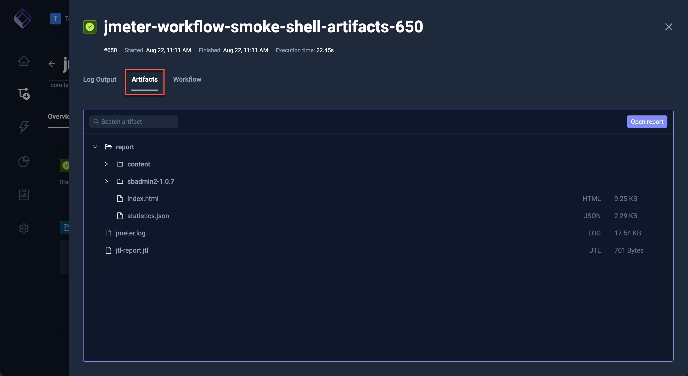

# Workflow Execution Details

When selecting a specific Workflow Execution the modal that opens has the following tabs:

## Log Output

This tab shows the log output for each executed step - [Read More](/articles/logs-and-artifacts#log-collection).

Select from the **Compare to another execution step** drop down to compare two steps from the selected workflow.

The next screen will show the differences between the two steps:

## Artifacts

This tab shows artifacts created by your test executions - [Read More](/articles/logs-and-artifacts#artifact-collection)

## Executed Workflow

This tab shows the actual Workflow that was executed, selecting the "Inline templates" option will expand any 
used Workflow Templates and specified configuration properties also.

