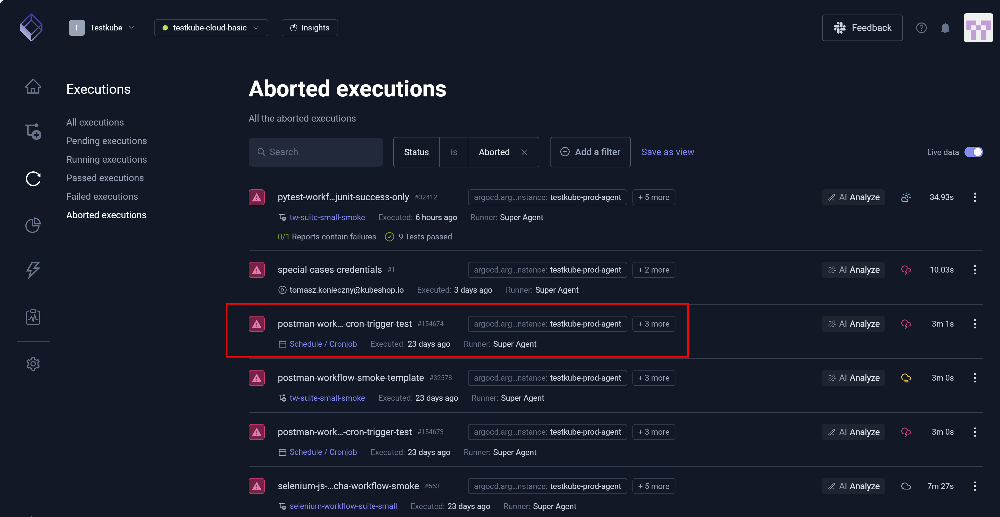
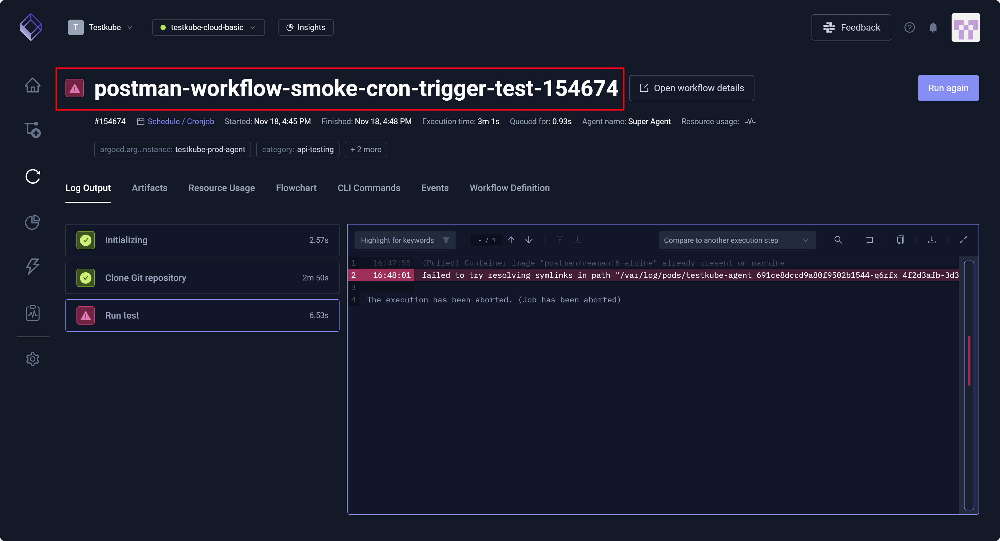

# Aborted Execution Details

A Testkube **Aborted execution** is a test purposely interrupted or stopped before completion.

After you select a test from the **Aborted executions** page, you can view its details, determine why the test
was interrupted, and choose to **Run again**.

