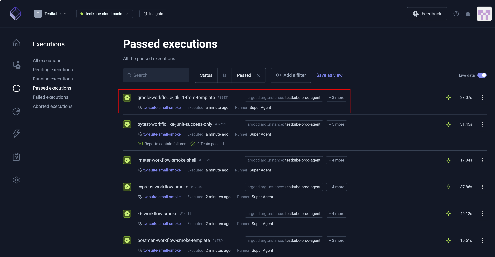
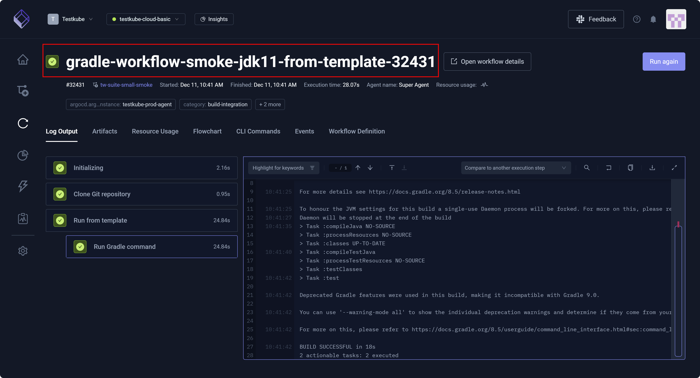

# Passed Execution Details

A Testkube **Passed execution** is a test that has run, satisfied required checks, and completed successfully.

After you select a test from the **Passed executions** page, you can view details and analyze data. You can also **Run again**.

