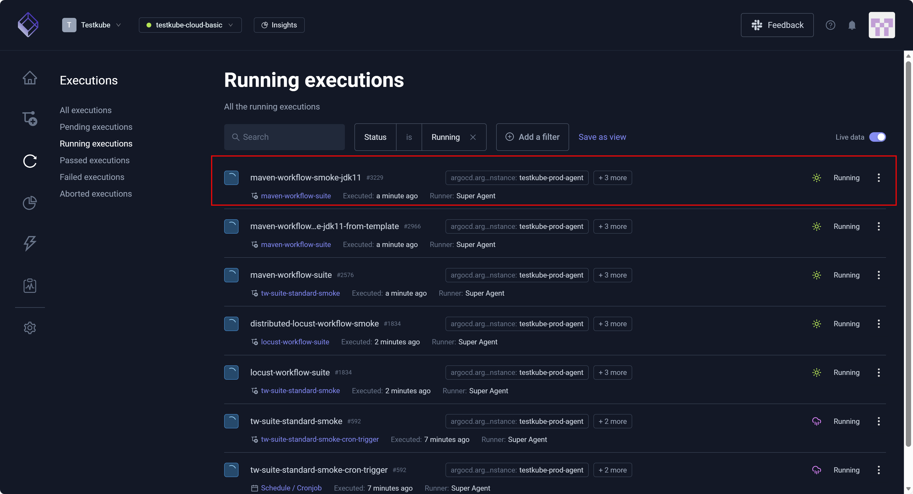
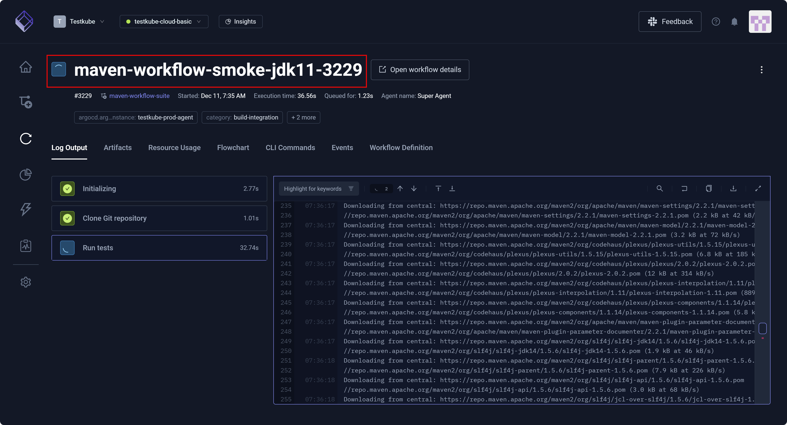

# Running Execution Details

A Testkube **Running execution** is a test in progress.

After you select a test from the **Running executions** page, you can view details such as **CLI Commands**,
**Events**, and **Workflow Definition**.

