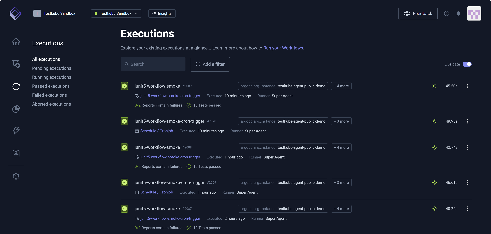
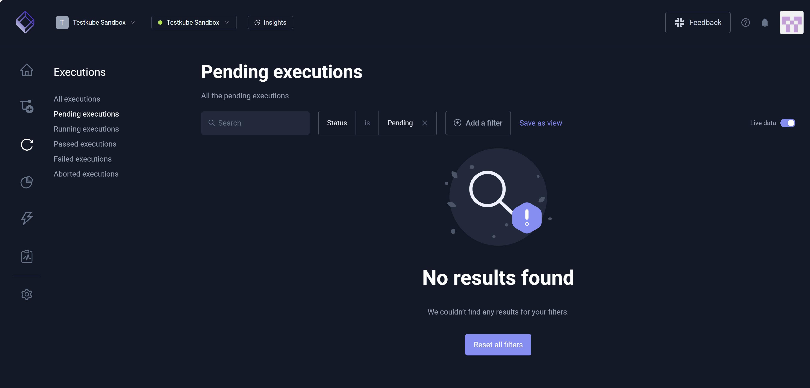
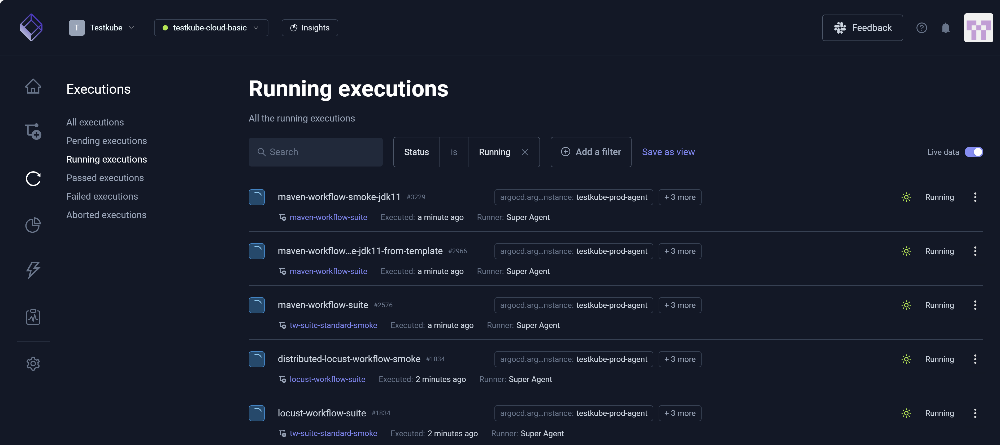
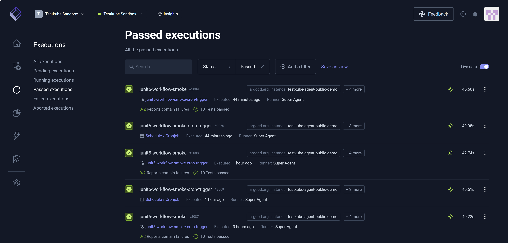
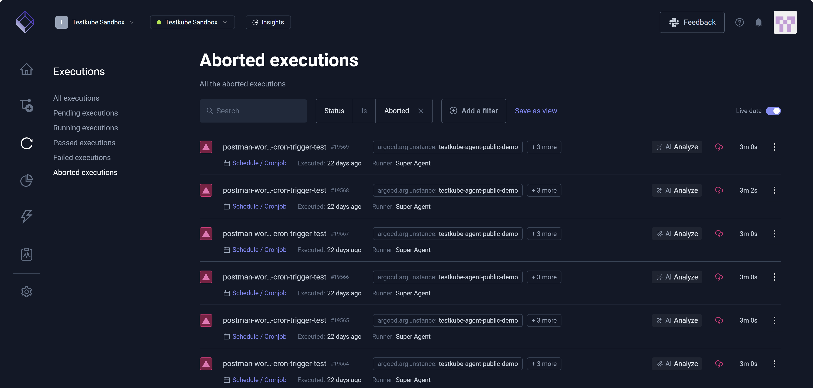

# Testkube Executions

A Testkube execution is an automated test (via tools such as Cypress, JMeter, Playwright, and Postman) that consists 
of a script that runs in a Pod within the Kubernetes environment. The Pod comprises the dependencies the script 
requires to run successfully. The Pod runs each test and returns results Testkube.

You can click each test to view its details.

Test execution status symbols:

* A green checkmark denotes a successful execution.
* An encircled red 'x' represents a failed execution.
* A group of revolving circles depicts a current run.
* A red warning sign (exclamation mark enclosed in a triangle) indicates an aborted execution.

The **Live data** toggle, if ON or toggled right, sends real-time data to the dashboard even as a test runs or is in progress.
Alternatively, if the **Live data** toggle is OFF or toggled left, the test data remains on a local server and is not sent
to the dashboard until test execution completion.

Each **Executions** page includes **Search** and **Add a filter**, which allow you to narrow the output.

## Pending Executions

A Testkube **pending execution** is a test that is slated to run. There could be several reasons
a test execution has a pending status. For example, the test could be awaiting other executions because 
there are too many tests running. There might also be resource issues specific CPU space or memory.

## Running Executions

A Testkube **running execution** is a test in progress. 

## Passed Executions

A Testkube **passed execution** is a test that has run, finished any required checks, and completed successfully.

## Failed Executions

A Testkube **failed execution** is a test that has completed but did not pass all required checks.

## Aborted Executions

A Testkube **aborted execution** is a test purposely interrupted or stopped before completion.

