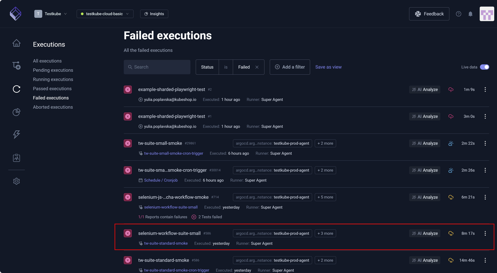
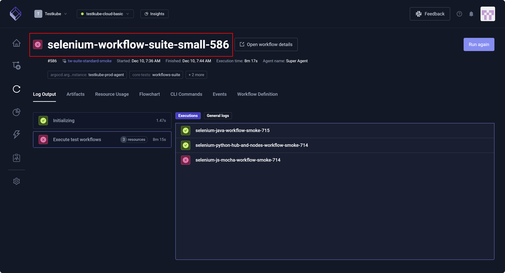

# Testkube Executions

The **Executions** dashboard is the central repository for all executions that run in your **Environment**. Since insight specific to executions is contained in a single location, 
the dashboard allows you to troubleshoot issues more quickly. The dashboard also allows you to **Search** and **Add a filter** – collectively enabling you to create Custom Views. 
These views allow you to quickly identify executions based on filters such as **Workflow Labels**, **Execution Tags**, **Status**, **Health**, and **Runners**. For additional information, 
read [Custom Views](../articles/testkube-dashboard-custom-views.md). Leveraging the **Executions** dashboard ensures less clicks through less pages to access the information you need. 
This increased efficiency also extends itself to an improved user experience.

**Live data** allows you to view running executions. ON is the default setting. Toggle the setting left or OFF to operate 
in a seemingly offline mode, where you will not see running executions. This mode is helpful if, for example, you are debugging or analyzing
a specific execution and need to focus solely on this test without visual distractions from running executions. Toggle the setting
right or ON to resume viewing live data.

The three vertical dots associated with each test – More Options/Quick Actions – provide immediate access to details such as **Download Logs**, 
**Open Execution Logs**, and **View Artifacts**.

As its name suggests, **Workflow health** (**Perfect**, **Excellent**, **Good**, **Fair**, **Poor**, **Critical**) provides insight into the fitness or state of each workflow. 
These symbols mirror a weather forecast. While the sun aligns with **Perfect** workflow health, a cloud with a bolt of thunder aligns with **Critical** workflow health.
After execution completion, calculations track flakiness (pass/fail flip rate or inconsistency) and other metrics that combine to determine 
the workflow's overall health. As a matter of information, flakiness is not *test* specific. For example, there could be flakiness in your infrastructure.

Test execution **Status** symbols:

* A green checkmark denotes a successful execution.
* An encircled red 'x' represents a failed execution.
* A group of revolving circles depicts a current run.
* A red warning sign (exclamation mark enclosed in a triangle) indicates an aborted execution.

You can select an execution to examine its details, view logs, and troubleshoot issues.

## Pending Executions

A Testkube **Pending execution** is a test that is slated to run. There could be several reasons
a test execution has a **Pending** status. For example, the test could be awaiting other executions because 
there are too many tests running. There might also be resource issues specific CPU space or memory. 

You can **Reset all filters** to remove filters.

## Running Executions

A Testkube **Running execution** is a test in progress. 

## Passed Executions

A Testkube **Passed execution** is a test that has run, satisfied required checks, and completed successfully. 

## Failed Executions

A Testkube **Failed execution** is a test that has completed but did not pass all required checks. 

As with any execution on the dashboard, you can select to view details and, if necessary, debug.

## Aborted Executions

A Testkube **Aborted execution** is a test that is interrupted or stopped before completion. 

Execution details provide additional insight into aborted tests.

