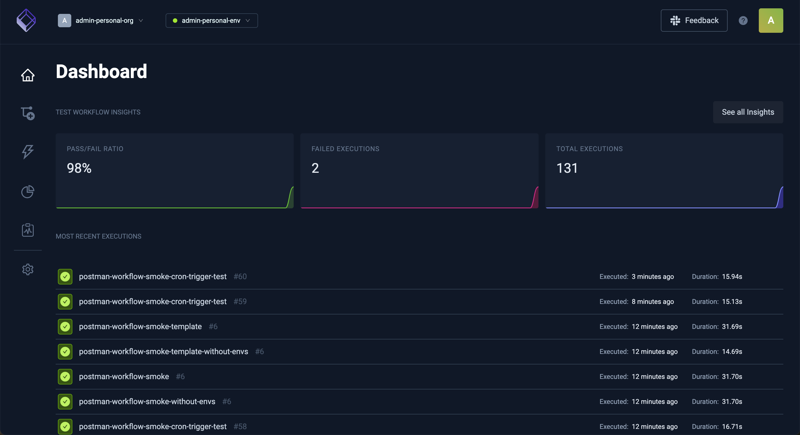
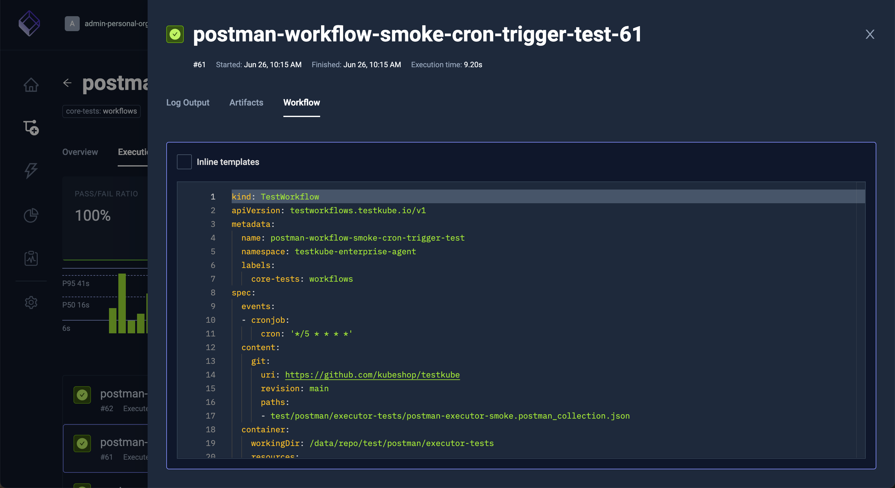
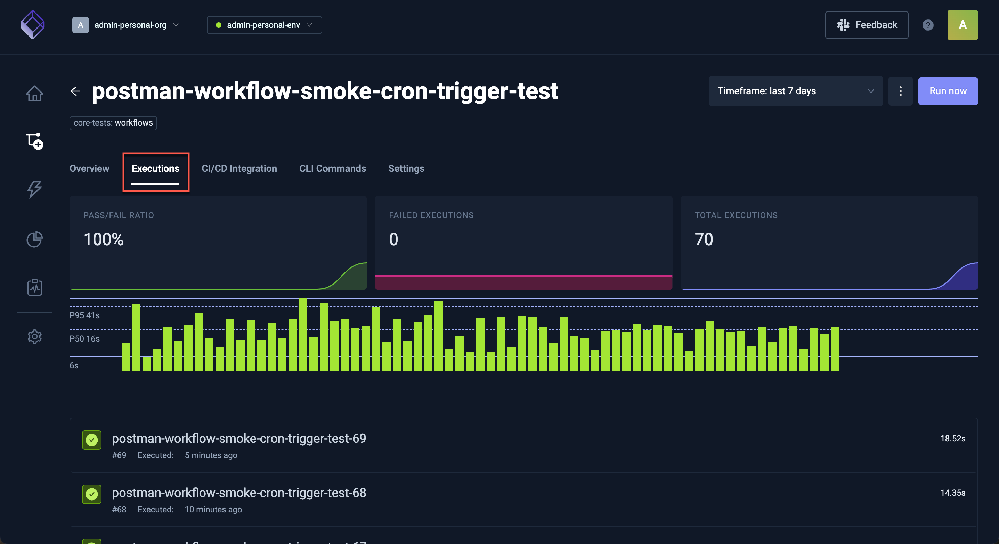
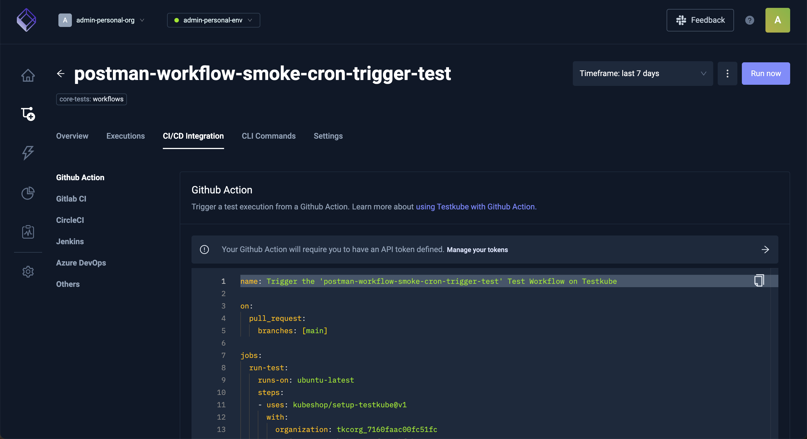
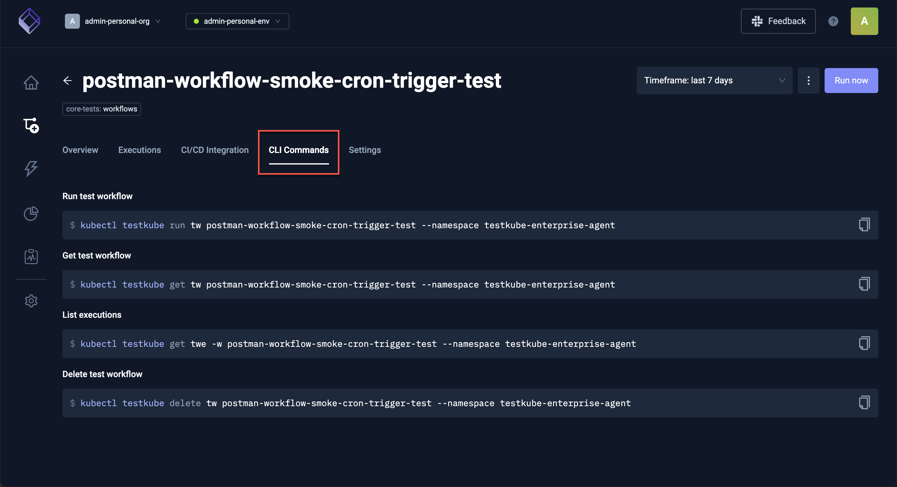
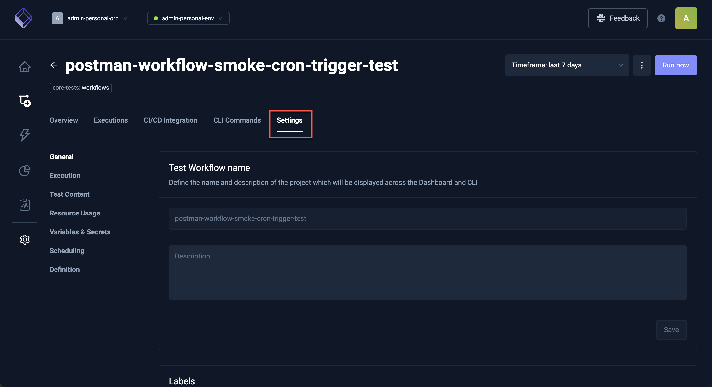

# Explore the Testkube Dashboard

The Testkube Dashboard displays the current status of Tests executed in your environment.

Select any Test to see the recent executions and their details.

The modal that opens has the following tabs:

**Log Output:**

**Artifacts:**

**Workflow:**

Closing the modal reveals additional details about the workflow.

The **Overview** tab outlines the steps of the selected workflow.

The **Executions** tab has the list of executions. A green checkmark denotes a successful execution, a red 'x' denotes a failed execution and circling dots denotes a current run.

The **CI/CD Integration** tab shows any integrations used in the workflow.

The **CLI Commands** tab shows the commands used to perform the selected test:

Use the **Settings** tab to view or change the local settings of the workflow.

