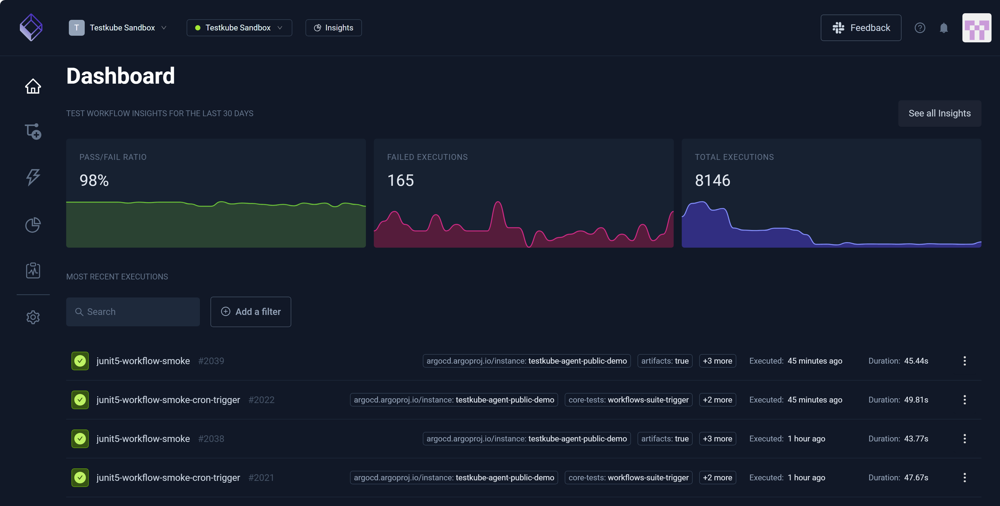

# Testkube Dashboard

The Testkube dashboard offers a centralized user interface for managing Testkube deployments. The dashboard is part of the 
Testkube control plane and is available after installation via local port-forwarding using the 
`testkube dashboard` command or through use of the NGINX Ingress Controller. For more information, 
read [Production Installations](/articles/install/install-with-helm). 

**Dashboard**:

**Testkube Sandbox** appears in the **Organization** and **Environment** drop-down list boxes near the dashboard (top left). 
You can click the arrows associated with each to view a list of options, allowing you to change these selections.
**Insights** and **See all insights** launch you to visual analytics specific
to system performance and test results.

:::info
For more information on how to manage your Testkube instance, read [Organizations](/articles/organization-management) and [Environments](/articles/environment-management).
:::

The left navigation pane contains:

* [Home](/articles/testkube-dashboard-explore)
* [Workflows](/articles/testkube-dashboard-workflows-overview)
* [Integrations](/articles/integrations-dashboard-explore)
* [Insights](/articles/test-insights)
* [Status Page](/articles/status-pages)
* [Settings](/articles/settings-dashboard-explore)

## Environment Overview

**Workflow Insights** dashboard (top middle) provides an overview of the **Environment** you selected and includes:

* **Pass/Fail Ratio**
* **Failed Executions**
* **Total Executions**

The dashboard (center) contains a scrollable list of your **Recent Executions**. You can **Search** for specific executions or click **Add a Filter** to narrow your search.
Selecting an execution provides access to its corresponding [Execution Details](testkube-dashboard-execution-details).
