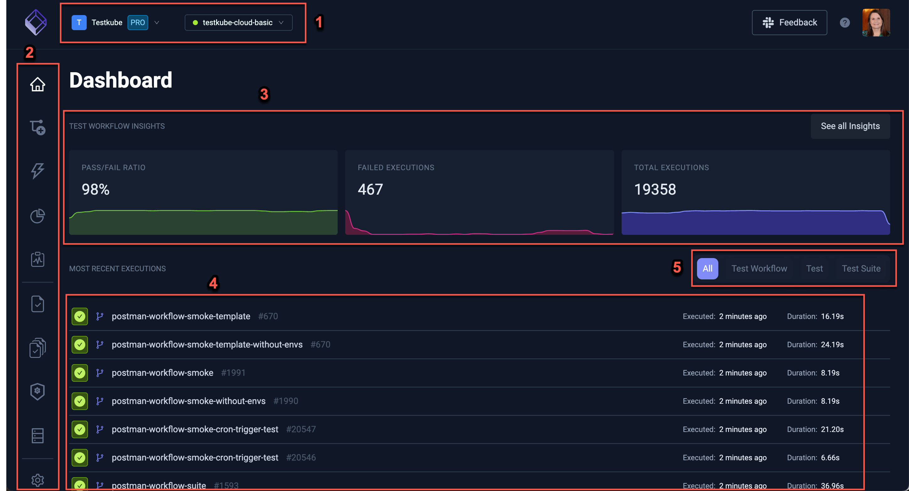

# The Testkube Dashboard

The Testkube Dashboard provides a centralized user interface for managing your Testkube deployment. The Dashboard
is included in the Testkube Control Plane and available after installation either via local port-forwarding using the 
`testkube dashboard` command or via the NGINX Ingress Controller - [Read More](/articles/install/install-with-helm). 

When opening the Dashboard you will be presented with the following layout:

The toggles at the top of the screen (1) allow you to choose the Organization and Environment 
currently shown in the Dashboard.

:::info
See the documentation on [Organizations](/articles/organization-management) and [Environments](/articles/environment-management)
for more information on how to manage your Testkube Instance.
:::

The navigation on the left (2) of the screen contains buttons for (in top-to-bottom order):

- Environment Overview - see below.
- Test Workflows - [Read More](/articles/testkube-dashboard-workflows-overview)
- Integrations - [Read More](/articles/integrations-dashboard-explore)
- Test Insights - [Read More](/articles/test-insights)
- Status Pages - [Read More](/articles/status-pages)
- Tests *
- Test Suites *
- Executors *
- Sources *
- Settings - [Read More](/articles/settings-dashboard-explore)

(* are deprecated and not shown if you have them disabled, [Read More](/articles/legacy-features#enabling-legacy-tests-dashboard-functionality))

## Environment Overview

The top left icon takes you to an overview of the currently selected environment, as shown above. 

It contains:

- An overview of the Pass/Fail Ratio, the number of Failed Executions and the Total Executions (3).
- A scrollable list of most recent executions (4).
- Filters for narrowing down on specific types of executions (5).

Selecting an execution opens the corresponding [Execution Details](testkube-dashboard-execution-details)
