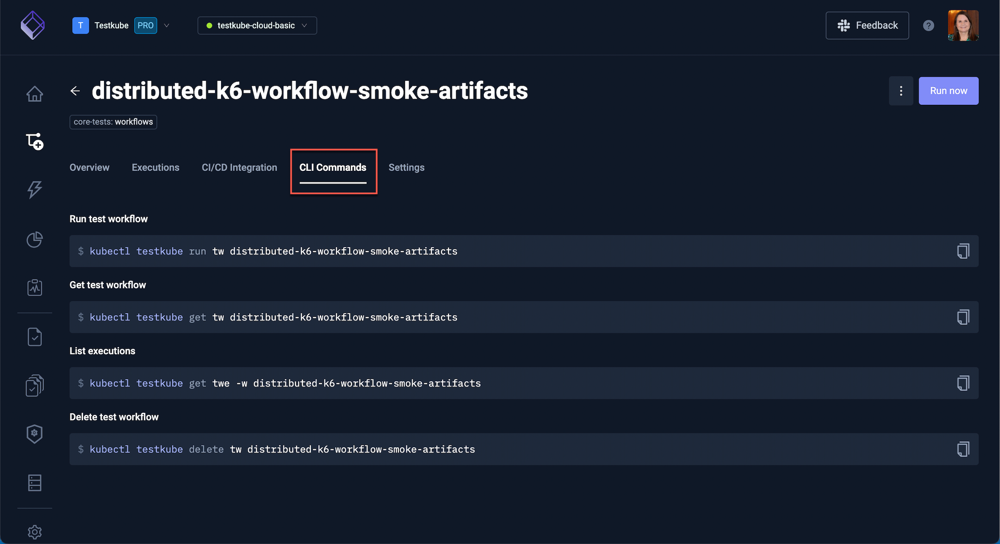

# Explore the Testkube Dashboard

The Testkube Dashboard displays the current status of tests workflows executed in your environment.

The toggles a the top of the screen (1) make it easy to choose the Organization and Environment you are working in.

The navigation on the left (2) of the screen includes links to toggle between:

- Home
- Test Workflows
- Integrations
- Insights
- Status Page
- Tests
- Test Suites
- Executors
- Sources
- Settings

Each of these will be described further in other pages.

You will see an overview of the Pass/Fail Ratio (3), the number of Failed Executions and the Total Executions.

Scroll to see the list of most recent executions (4).

These can be filtered by Test Workflow, Test and Test Suite (5).

Select a test from the list to see its details.

The modal that opens has the following tabs:

**Log Output:**

**Artifacts:**

**Workflow:**

Closing the modal reveals additional details about the workflow.

The **Overview** tab outlines the steps of the selected workflow.

The **Executions** tab has the list of executions. A green checkmark denotes a successful execution, a red 'x' denotes a failed execution and circling dots denotes a current run.

The **CI/CD Integration** tab shows any integrations used in the workflow.

The **CLI Commands** tab shows the commands used to perform the selected test:

Use the **Settings** tab to view or change the local settings of the workflow.

