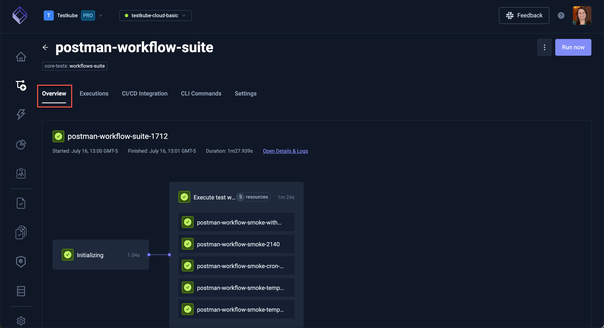
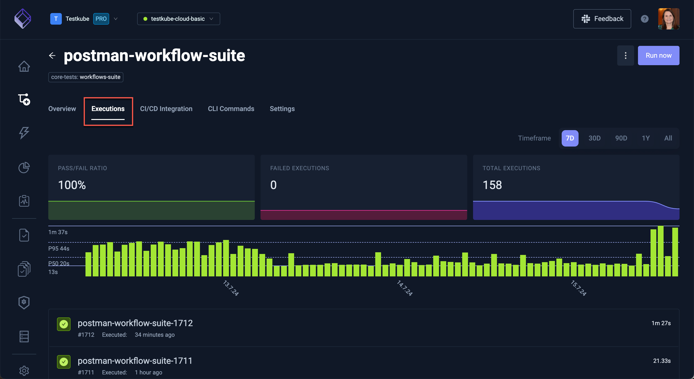
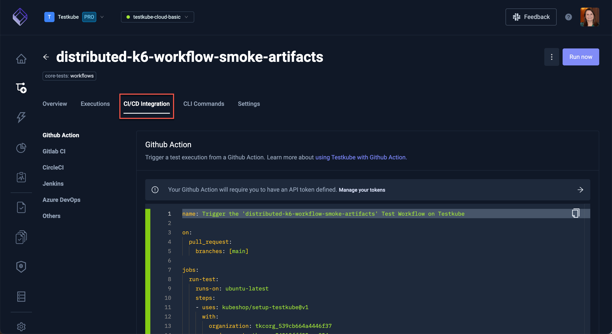
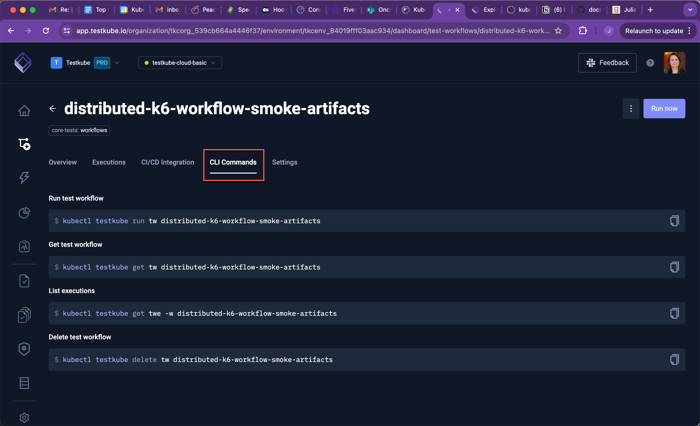
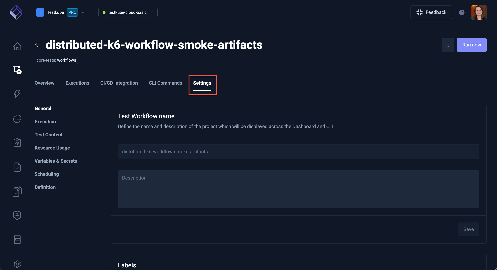

# Workflow Details

Selecting a Workflow in the Workflows Overview reveals a number of tabs to work with the selected Workflow.

### Overview Tab

Shows details for the latest execution of the Workflow, selecting an item will open the corresponding log tab in 
the [Execution Details](testkube-dashboard-execution-details).

Click **Open Detail & Logs** to see the [Execution Details](testkube-dashboard-execution-details)

### Executions Tab

The **Executions** tab has the list of the workflow executions together with corresponding high-level
execution metrics. 

A green checkmark denotes a successful execution, a red 'x' denotes a failed execution and circling dots denotes a current run.

Selecting a specific execution will open the corresponding [Execution Details](testkube-dashboard-execution-details):

### CI/CD Integrations Tab

The **CI/CD Integration** tab shows how to integrate the Workflow with common CI/CD tools, with 
ready-to-use examples for each tool.

### CLI Commands Tab

The **CLI Commands** tab shows commands you can run to interact with the Workflow using the [Testkube CLI](/articles/install/cli):

### Workflow Settings Tabs

The **Settings** tab contains a number of panels for configuring your Workflow:

### Workflow Definition Panel

### Workflow Definition Panel
