# Workflow Details

**Workflow Details** provides a central location to run, monitor, and configure the Workflows in your **Environment**.

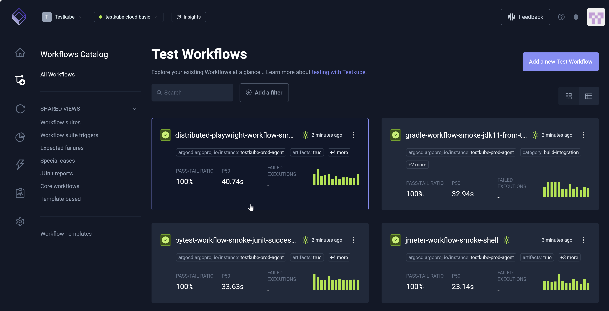

## Running a Workflow

After you select a Workflow, you can view its details via the **Overview**, **Executions**, **CLI Commands**, **CI/CD Integration**, and **Settings** tabs.
You can also access **Run now** (top right) to run the Workflow immediately. The **Run now** drop-down list box
includes **Run as silent execution**. You can select this checkbox to run silent Executions, which do not trigger webhooks, events, or metrics collection. Therefore, the Execution completes normally; however, 
it is excluded from integrations, notifications, and monitoring systems that would otherwise respond to this run.

While you can select **Run now** from various tabs, it is common to run Workflows via **CI/CD Integration** and from **Scheduling** located within the **Settings** tab.

Workflows execute one or more tests; Composite Workflows execute one or more Workflows, with one orchestrating the others. The number of tests or Workflows that run
is based on the testing tool you use.

:::info
A **Runner Agent** acts as the test Execution engine and runs within the Kubernetes cluster to spin up pods, facilitate the testing defined in Testkube, 
and report results. You can use multiple **Runner Agents** in your **Environment**. For additional information, read [Runner Agents](/articles/agents-overview#runner-agents).
:::

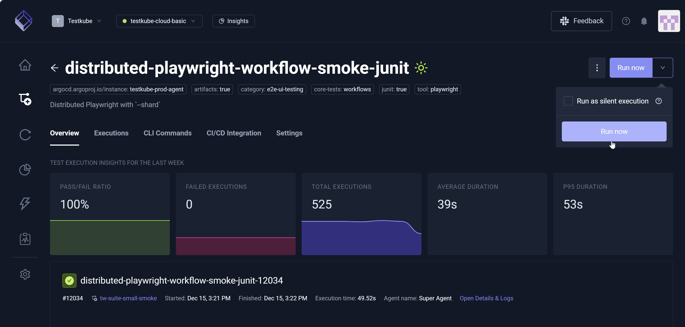

## Overview Tab

The **Overview** tab displays **Test Execution Insights for the Last Week** to include the **Pass/Fail Ratio**, **Failed Executions**, **Total Executions**, **Average Duration**, and **P95 Duration**.

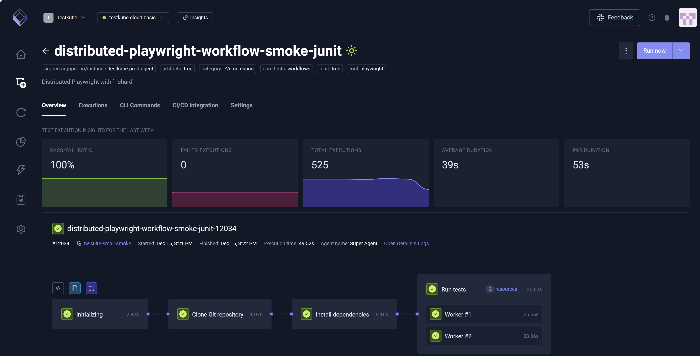

Upon selection, the **Resource Usage**, **Artifacts** and **Content Sources** icons (middle page) display additional Workflow details.

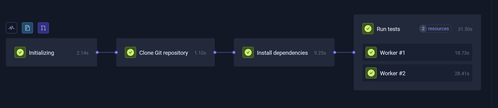

More results are available (lower page) along with a Reports visualization option. JUnit Reports, for example, generate based on the content of your YAML file. Adding arguments 
specific to JUnit reports trigger this report generation.

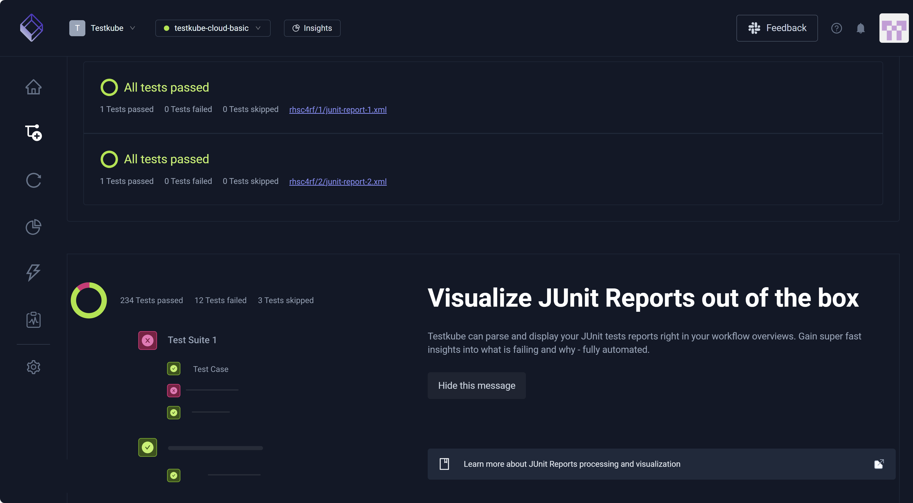

## Executions Tab

The **Executions** tab displays **Test Execution Insights for the Last Week** along with **Search** and **Add a filter**. You can hover over each
Execution to reveal additional metrics.

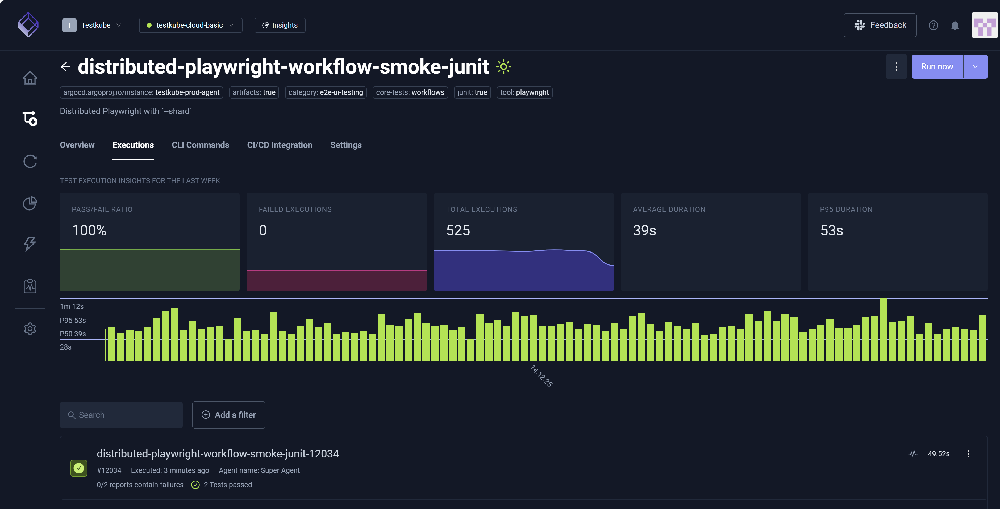

You can identify and select a Workflow Execution then choose More Options (three vertical dots) to view and make other selections.

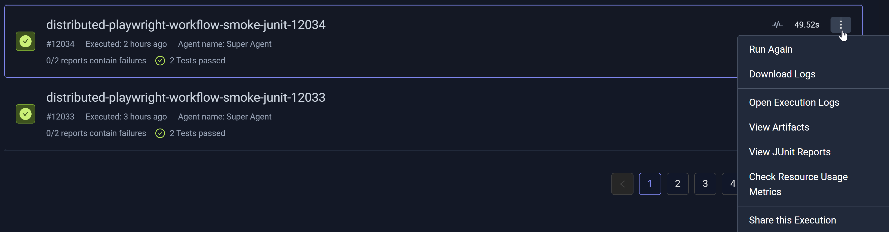

You can also select an Execution from the list to view Execution-specific details. These details open in a new modal that contains the **Log Output**, **JUnit Reports**, **Artifacts**, **Resource Usage**, **Flowchart**, **CLI Commands**,
**Events**, and **Workflow Definition** tabs. **Run again** allows you to re-execute the Workflow.

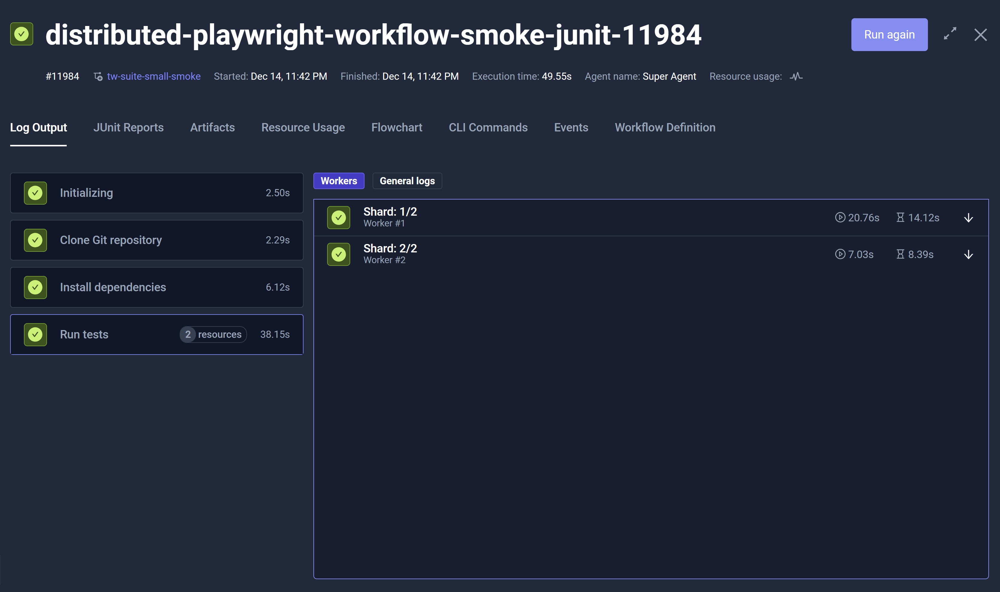 

### Multi-Agent Executions

For Executions that use multiple [Runner Agents](/articles/agents-overview#runner-agents),
an expandable section includes those Executions. Use the arrows to expand and collapse these Executions. 

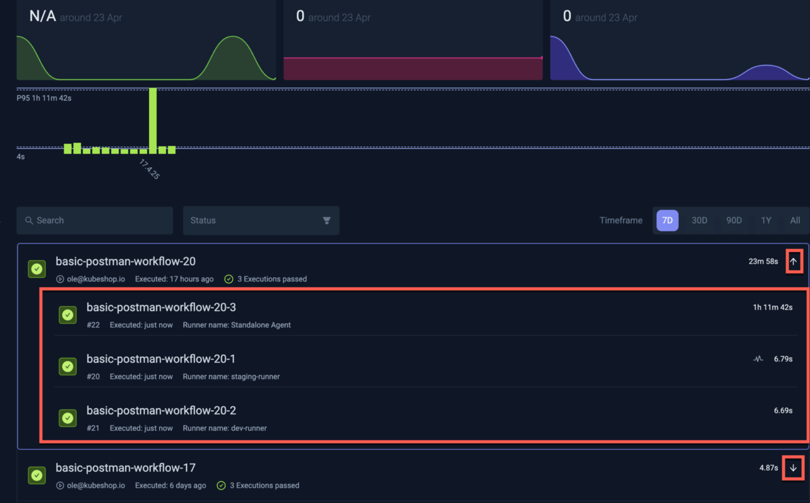

## CLI Commands Tab

The **CLI Commands** tab displays CLI commands you can run to interact with the Workflow directly from the command line. You can execute **Run Test Workflow**, **Get Test Workflow**,
**List Executions**, and **Delete Test Workflow**. For additional information, read [Testkube CLI](/articles/cli).

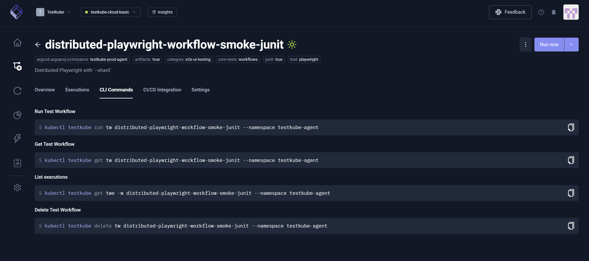

## CI/CD Integrations Tab

The **CI/CD Integration** tab provides insight into how to trigger the Workflow from common CI/CD tools and includes ready-to-use examples for each.
For additional information, read [Testkube Integrations Overview](/articles/integrations).

You commonly run Workflows via this tab and **Scheduling**, accessible via **Settings**.

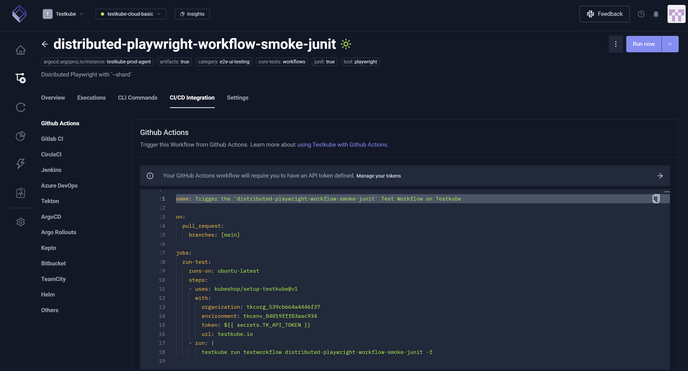

## Workflow Settings Tabs

The **Settings** tab is the primary interface for building the YAML **Definition**, encompassing configurable settings such as **General**, **Execution**, **Test Content**, **Resource Usage**, 
**Variables & Secrets**, **Resource Group**, **Scheduling**, and **Definition**. More specifically, configuring these settings dynamically generates and updates the YAML visible 
via **Definition**. For example, designating **333** in the **CPU** field in the **Resource Limits** section of **Resource Usage** populates the corresponding *resource/limits* 
in the YAML file. You can configure **Definition** using the **Settings** configurations, or you can edit the YAML **Definition** directly.

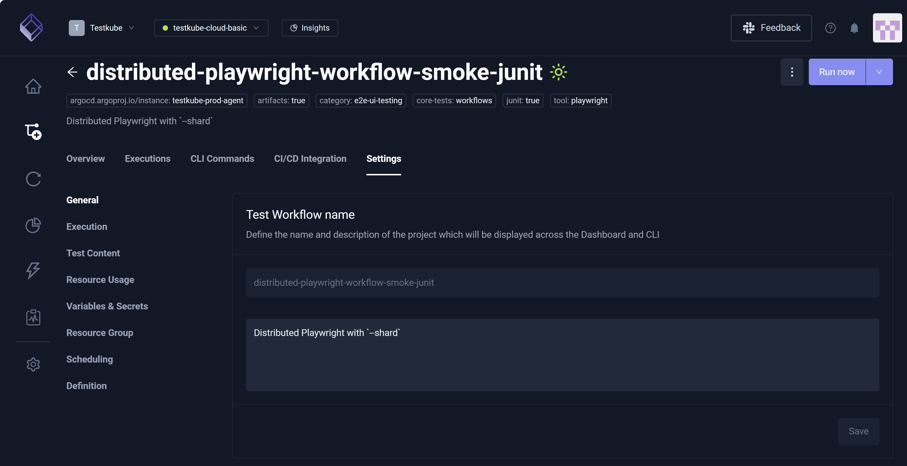

### General

The **General** setting allows you to update:

* **Test Workflow name** – Title or designation you use to identify the Workflow.
* **Labels** – Tag you add to the Workflow for actions such as filtering and searching.
* **Timeout** – Workflow Execution expiration.

**General** also allows you to **Delete this Test Workflow** and **Purge Past Executions**; the latter makes database/storage space available
if you have several old Executions for this Workflow.

Due to Kubernetes constraints, it is not possible to change the Workflow name.
Instead, you must create a copy of the Workflow with the new name and delete the old one.

### Execution

:::warning

The **Execution** setting only applies to Workflows that use a single image and a single step – generally recommended when
editing the Workflow YAML directly in the **Definition** setting to ensure changes are compatible with 
other constructs in your Workflow.

:::

The **Execution** setting allows you to define **Container configuration** which includes **Image**, **Tag**, **Command**, and **Args** along with the **Working directory**.
Collectively, you can use these settings to run your tests.

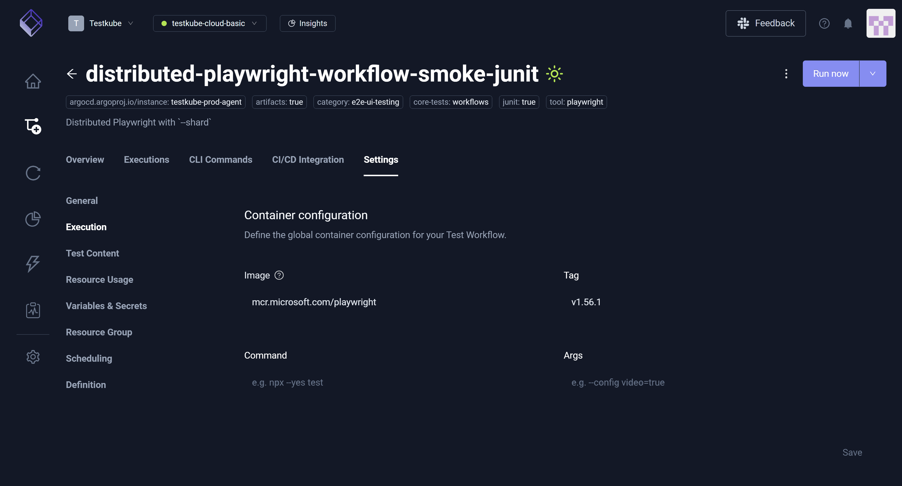

### Test Content

The **Test Content** setting only applies to Workflows that use a content Source for their tests. Use the **Definition** setting to 
edit the Workflow YAML directly if your Workflow uses more than one Source for its tests.

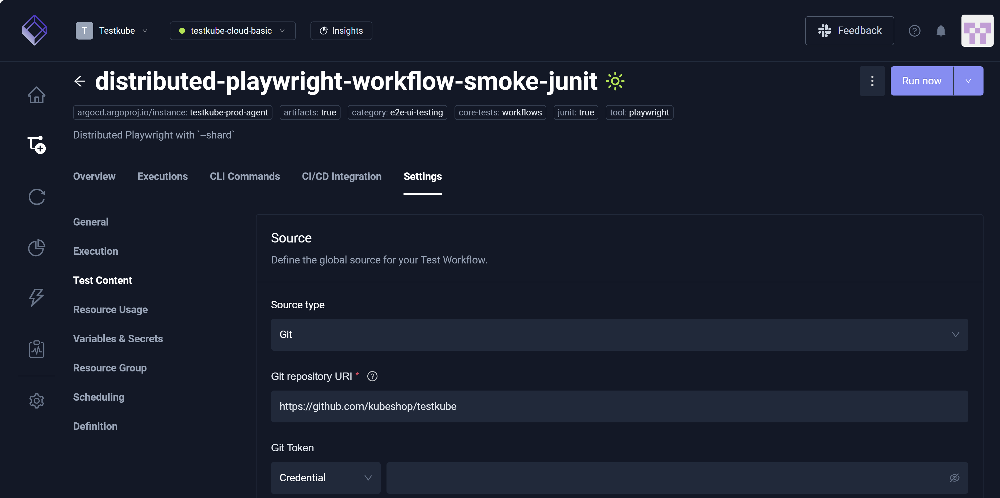

### Resource Usage

The **Resource Usage** setting allows you to establish **CPU**, **Memory**, and **Ephemeral Storage** for **Resource Limits** and **Resource Requests**.

The **Resource Usage** setting establishes global limits for resource usage within your Workflow. If you want to fine-tune these
limits per image or Workflow step, you can do so directly in the Workflow YAML via the **Definition** setting.

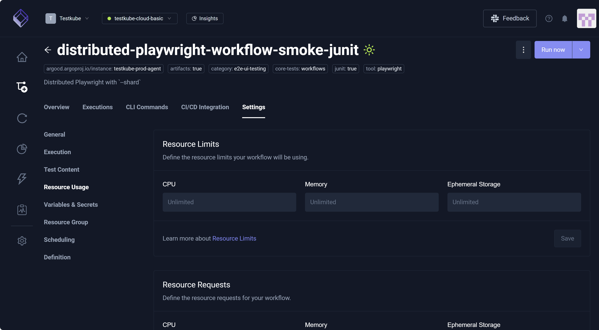

### Variables and Secrets

The **Variables & Secrets** setting allows you to define global variables and secrets used throughout the Workflow.
You can also reference global credentials created at the **Organization** or **Environment** level.

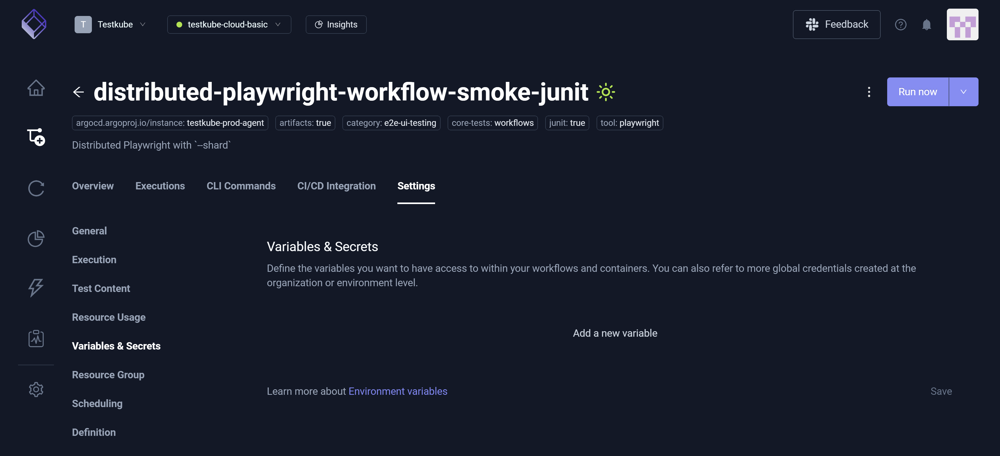

### Resource Group

The **Resource Group** setting allows you to assign this Workflow to a Resource Group. For additional information, read [Resource Groups](/articles/resource-groups#managing-resources-in-a-resource-group).

### Scheduling

The **Scheduling** setting allows you to configure a single schedule for your Workflow, designating *when* and *how often* the Workflow runs. If you want to define
multiple schedules, you can do so directly in the Workflow YAML via the **Definition** setting.

You commonly run Workflows via this setting and the **CI/CD Integration** tab.

For additional information, read [Scheduling Workflows](/articles/scheduling-tests).

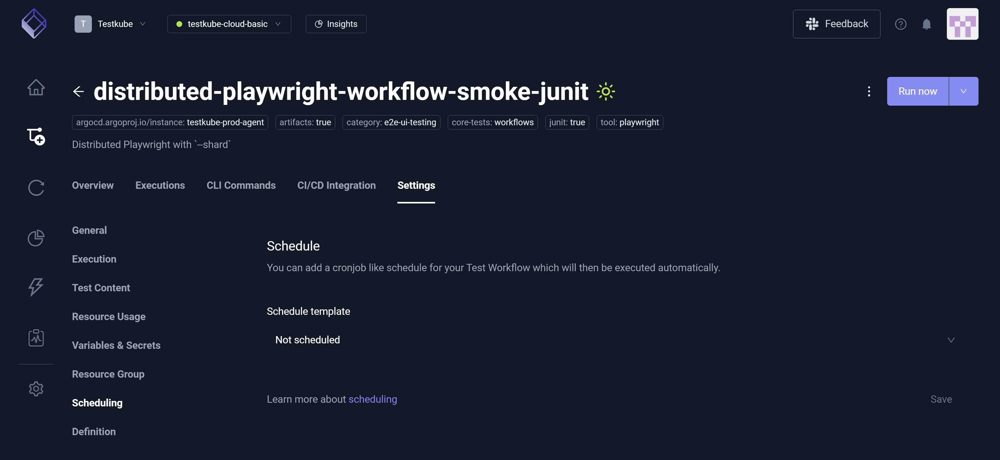

### Definition

The **Definition** setting provides a powerful YAML editor for modifying your Workflows. As you designate various configurations via **General**, **Execution**, **Test Content**, **Resource Usage**,
**Variables & Secrets**, **Resource Group**, and **Scheduling**, your specifications are automatically reflected in the YAML file. These settings, therefore, dynamically build this file. Some changes, however, you must make
manually in the YAML file itself. For additional information, read [Workflow YAML Editor](testkube-dashboard-workflow-editor). 

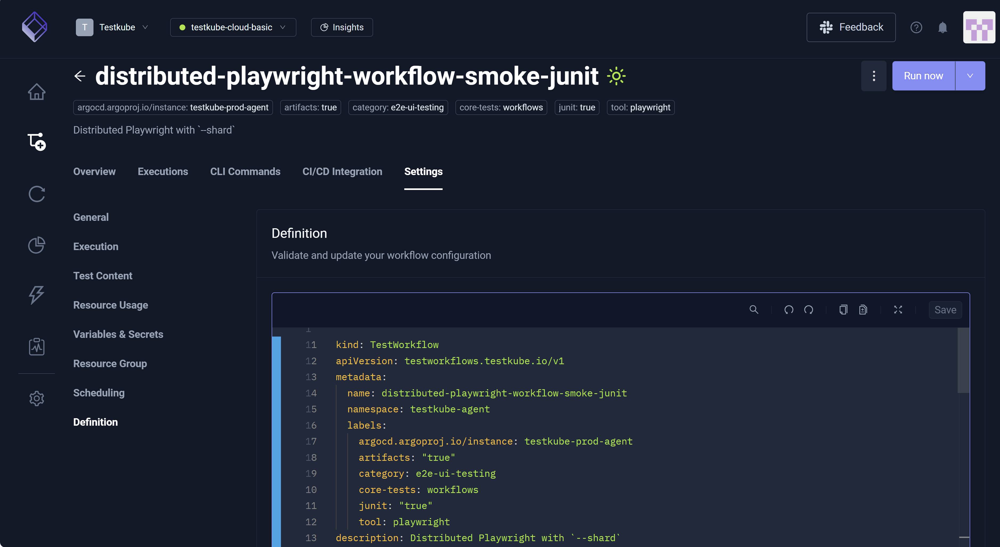
