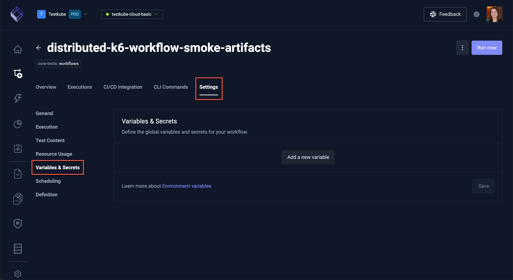

# Workflow Details

Selecting a Workflow in the Workflows Overview reveals a number of tabs to work with the selected Workflow.

## Overview Tab

Shows details for the latest execution of the Workflow, selecting an item will open the corresponding log tab in 
the [Execution Details](testkube-dashboard-execution-details).

Click **Open Detail & Logs** to see the [Execution Details](testkube-dashboard-execution-details)

## Executions Tab

The **Executions** tab has the list of the workflow executions together with corresponding high-level
execution metrics. 

A green checkmark denotes a successful execution, a red 'x' denotes a failed execution and circling dots denotes a current run.

Selecting a specific execution will open the corresponding [Execution Details](testkube-dashboard-execution-details)
panels.

## CI/CD Integrations Tab

The **CI/CD Integration** tab shows how to integrate the Workflow with common CI/CD tools, with 
ready-to-use examples for each tool.

:::tip

Read more about these and other available integrations under the [Integrations](/articles/integrations) section.

:::

## CLI Commands Tab

The **CLI Commands** tab shows commands you can run to interact with the Workflow using the [Testkube CLI](/articles/install/cli):

## Workflow Settings Tabs

The **Settings** tab contains a number of panels for configuring your Workflow.

:::info

Almost all the settings in these panels can be configured directly in the Workflow YAML under the 
Definition panel (see below) 

:::

### General Settings

The General Settings allow you to update the following for your Workflow:

- **Test Workflow name**: update the description (the name can only be changed in the YAML Definition panel)
- **Labels**: labels that you want to add to this Workflow for filtering/searching/etc.
- **Timeout**: the execution timeout for this Workflow

Below these settings there are actions to:

- Delete the Workflow
- Purge past executions: frees up database/storage space if you have a large number old executions for this Workflow

### Execution Settings

:::warning

The execution settings only apply for Workflows that use a single image and step. It is generally recommended to
edit the Workflow YAML directly in the Definition panel to ensure that changes are compatible with any 
other constructs in your Workflow

:::

The execution settings allow you to define which Docker image/tag, corresponding command and working directory to use to run your tests.

### Test Content Settings

:::tip

These settings only apply for Workflows that use a content source for their tests. Use the Definition panel to 
edit the Workflow YAML directly if your Workflow uses more than one source for it's tests.

:::

### Resource Usage Settings

:::tip

These settings set global limits for resource usage within your Workflow - if you want to fine-tune these
limits per image or Workflow step you can do this directly in the Workflow YAML under the Definition panel.

:::

### Variables and Secrets

This panel allows you to configure global variables and secrets used by your Workflow.

### Scheduling

:::tip

This panel allows you to configure a single schedule for your Workflow - if you want to define
multiple schedules you can do this directly in the Workflow YAML under the Definition panel.

Read more about Workflow Scheduling in the [Scheduling Workflows](/articles/scheduling-tests) article.
:::

Use this panel to define a single execution schedule for your Workflow.

### Definition

This panel provides a powerful YAML editor for editing your Workflows - [Read More](testkube-dashboard-workflow-editor) 
