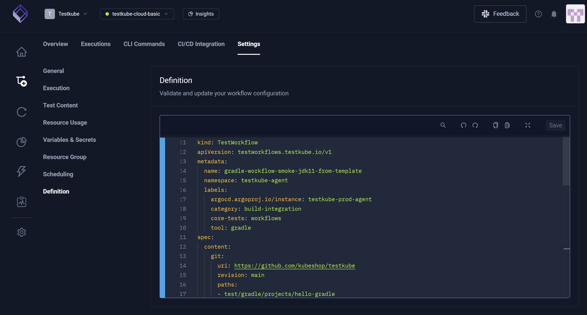
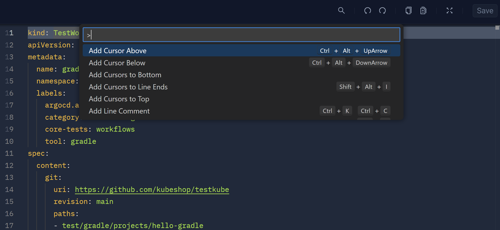
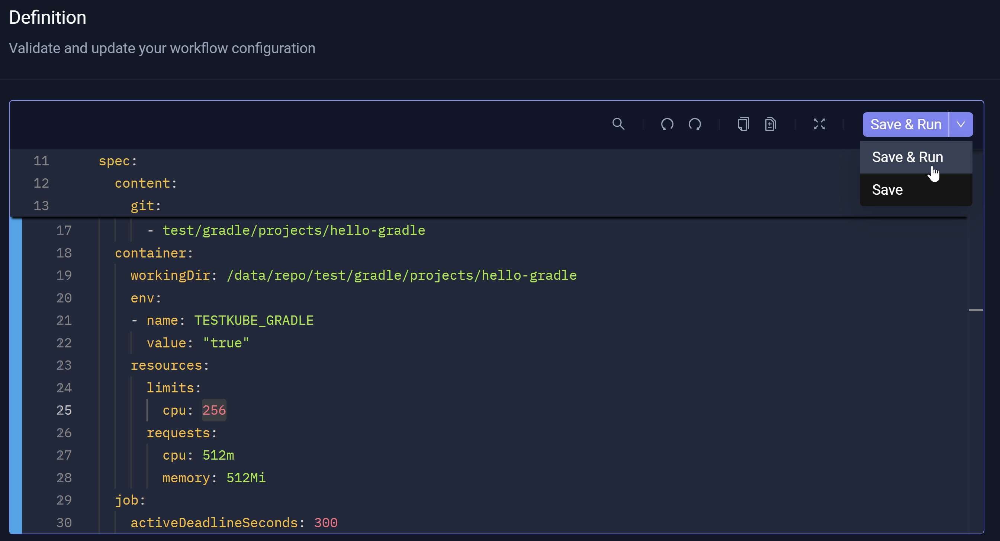
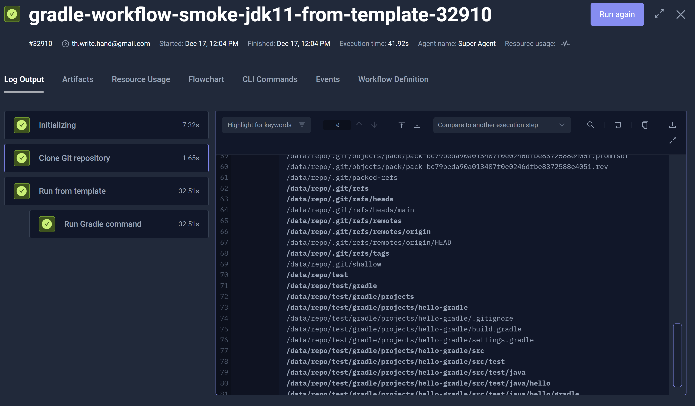
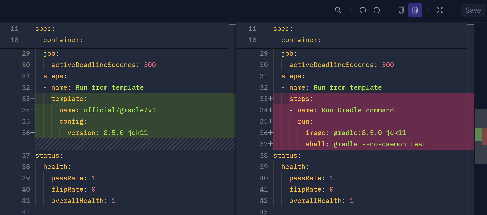
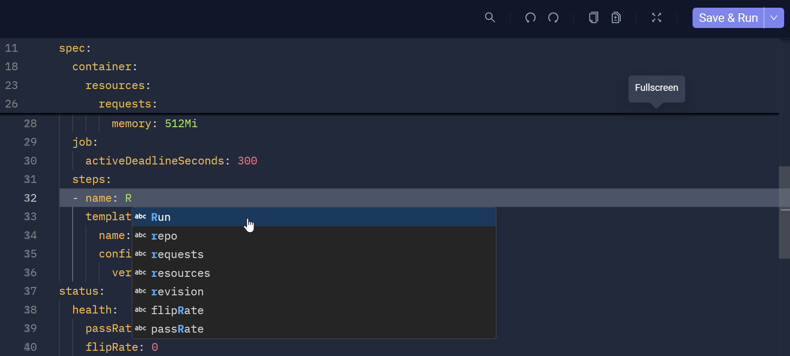
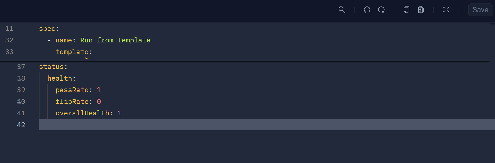

# Workflow YAML Editor

The **Workflow Editor** allows you to configure your Workflows via YAML.

The **Settings** tab [Workflows | Select Workflow from Dashboard | Settings] is the primary interface for building the YAML file, encompassing configurable settings 
such as **General**, **Execution**, **Test Content**, **Resource Usage**, **Variables & Secrets**, **Resource Group**, **Scheduling**, and **Definition**. 
More specifically, configuring these settings dynamically generates and updates the YAML file in the **Definition** setting. Some changes, however, you must make
manually in the YAML file itself. 

:::tip
The **Workflow Editor** uses the same technology that powers VS Code, allowing you to use the same editing features and mirroring your user experience.
:::

## Editor Actions

The toolbar (YAML file top right) provides:

* **Search** – Finds specific text or keywords within the YAML configuration.
* **Undo** – Reverts your most recent edit or change.
* **Redo** – Re-applies an action previously reversed.
* **Copy** – Duplicates selection to clipboard for later use, such as paste.
* **Inline Templates** – Displays two YAML files, one abbreviated and the other extended with more details.
* **Fullscreen** – Enlarges the **Workflow Editor** for easier viewing and editing.
* **Save** – Updates the Workflow configuration.

You can select text within the YAML configuration then press F1 to view and use other **Workflow Editor** actions.

When you edit the YAML directly, the previously disabled **Save** button (YAML file top right) becomes an enabled **Save & Run** button with an attached drop-down arrow. After you complete YAML updates, 
you can select **Save** from the drop-down list box to update the Workflow configuration or select **Save & Run** to update the Workflow configuration and trigger the Execution. 

When you select **Save & Run**, you can view the [Execution Details](../articles/testkube-dashboard-execution-details.md) in the modal that opens. From this modal, you may also **Run again**.

## Template Inlining

This tool allows you to preview two versions of the same YAML file: one (left) is abbreviated; the other (right) displays a more complete and extended YAML version. Re-select 
**Template Inlining** to remove these previews.

## Workflow-Specific Editor Intelligence

The **Workflow Editor** includes several features.

### Hover Documentation 

This feature helps you understand the purpose and usage of the corresponding Workflow property.

### Autocomplete for Applicable Properties

This feature predicts or suggests YAML keywords or values as you type, allowing you to select the suggestion(s) as appropriate.

### Error Indicators for Invalid Properties

The feature adds an underline (sometimes called an *error squiggle*) below a keyword or **Property** which indicates, for example, a misspelling. This feature allows you to readily identify and correct this and similar errors.

### Autocomplete for Template Names

This feature helps you select valid template(s) used in your Workflows, particularly when you are expected to enter a Workflow template name.

### Template References for Selection

This feature helps you navigate and open existing templates.

## Ignored Changes

Testkube associates the current Workflow health metrics with the **Status** property, which is visible in the **Workflow Editor**. Since Workflow health is based on underlying metrics,
the **Workflow Editor** disregards any changes you make in this section when you **Save** the YAML file configuration.

