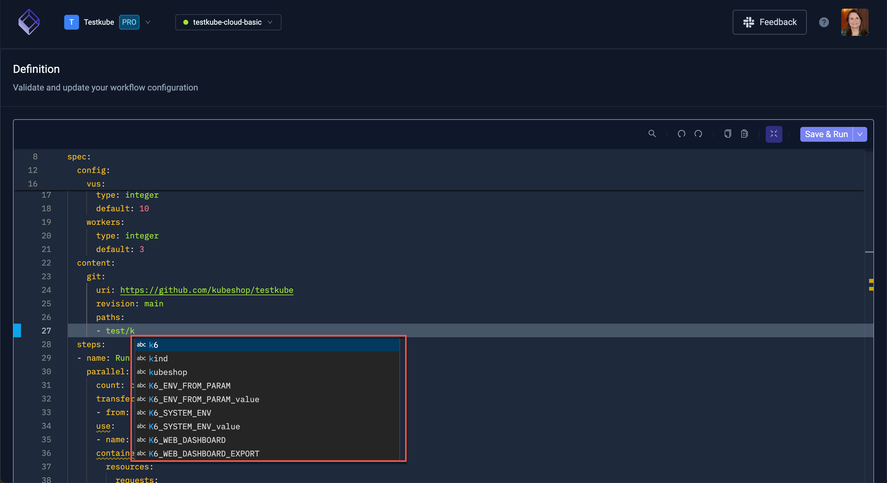

# Workflow YAML Editor

This Definition panel under the Workflow settings provides a powerful YAML editor for editing your Workflows. 

:::tip
The editor uses the same editing component as VS-Code, so any editing features you are
familiar with from there should apply here also.
:::

## Editor Actions

The toolbar at the top right provides the following actions (left to right):

- Search - global search and replace functionality, with regex, capitalization, etc.
- Undo / Redo / Copy
- Inline templates - to help you understand how used templates "play into" your Workflow by showing a side-by-side
  diff view of your Workflow with and without expanded templates (see example below).
- Full-screen mode - opens the editor in a larger panel, helpful for editing larger Workflows.

Furthermore, the editor provides an F1-popup menu with an extensive list of editor actions:

Once you're happy with your changes, use the Save & Run option to the top right to immediately trigger an execution
after saving, the corresponding Execution Details will be opened automatically.

## Template Inlining

The below screenshot shows the Inline-Templates view in Full-screen mode:
- the left panel shows the actual workflow with the `use` clause
- the right part shows the steps inlined by the `official--artillery--v1` template

## Workflow Specific Editor Intelligence

The Workflow YAML editor in the Definition panel described above the has a number of 
features that help you work specifically with Workflow YAML:

### Documentation Hovers 

Helps you understand the purpose/usage of the corresponding Workflow property.

### Autocomplete for Applicable Properties

Helps you craft valid Workflow YAMLs

### Error Indicators for Invalid Properties

Helps you find and correct Workflow YAML errors, in the below screenshot the `service` property is marked
(it should be `services`)

### Autocomplete for Template Names

Helps you select valid template(s) used in your Workflows wherever a template name is expected:

### Clickable Template References

Helps you navigate/open used templates for editing:

## Ignored Changes

Testkube stores the current health metrics of a Workflow under the status property, which is also visible in the editor:

Any changes made to this section will be ignored when saving.

