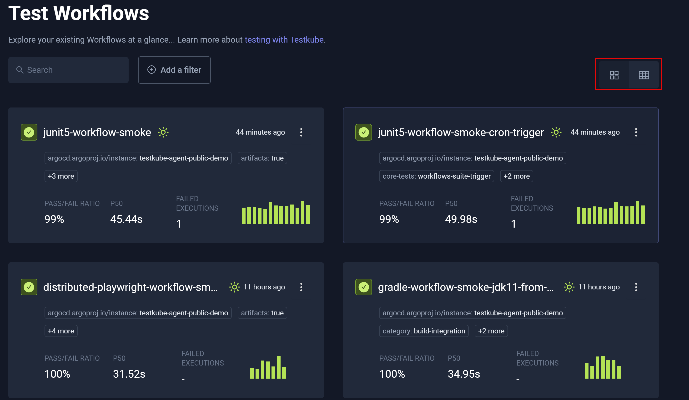
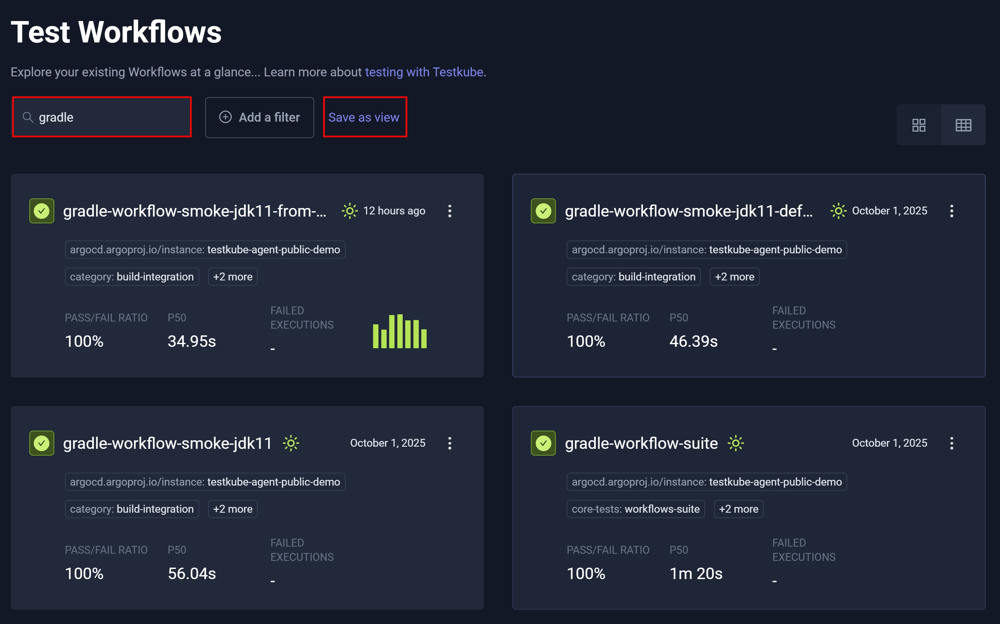
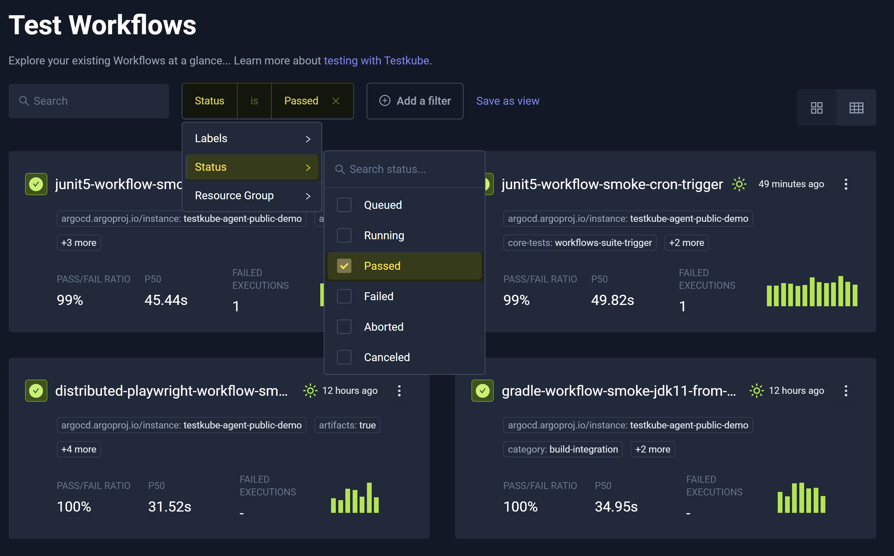
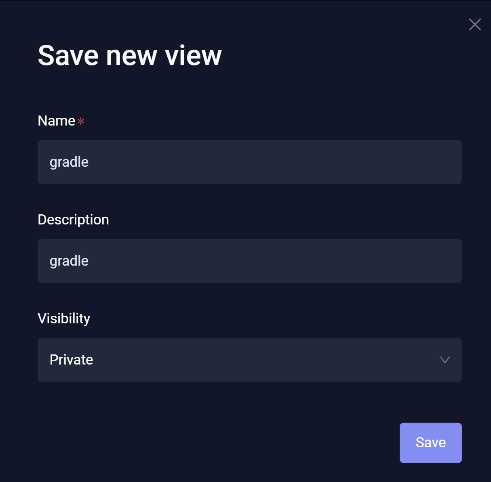

# Workflows Overview

The Workflows Overview displays all workflows (automated tests) in the **Environment** you selected, which includes the most
recent and the execution status of each. 

## Views

You can switch from the **Grid view** to the **Table view** for all workflows.

## Search and Filter

You can **Search** and **Filter** your workflows to narrow the output. When you search for a workflow, 
**Save as view** becomes visible.

You can filter workflows by separately selecting **Labels**, **Status**, and **Resource Group** and choosing one or more parameters specific to each.

## Custom Views

Custom views are saved filters that allow you to:

* Access and reuse these filters, which become visible within **Workflows Overview**.
* Establish **Private** views (Default) such that only you have view access.
* Set views to **Shared across environment**, which allows you to make these custom views available to team members.

When you click **Save as view**, **Save new view** opens – allowing you to establish, retain, and share these custom views.

