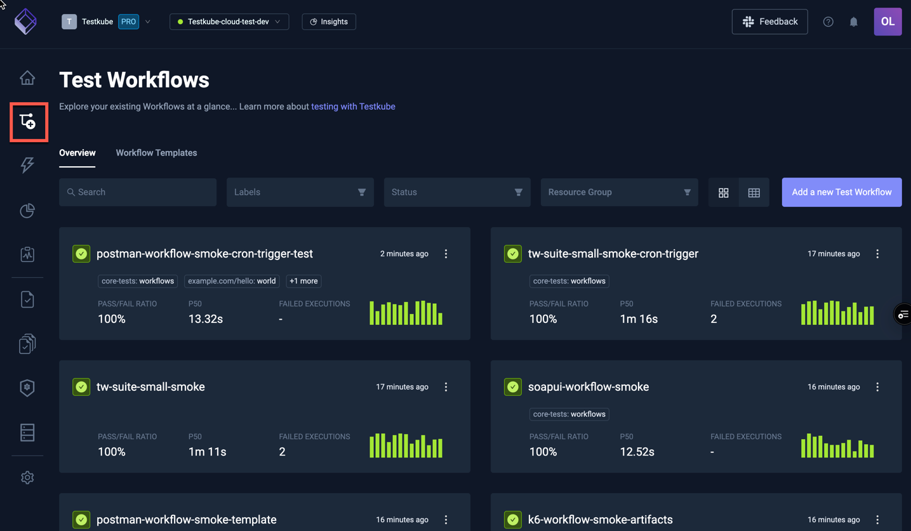

# Workflows Overview

The Workflows Overview displays all Workflows in your currently selected Environment, including
their latest and overall execution status. 

- Selecting a Workflow in either of these views takes you to the [Workflow Details](/articles/testkube-dashboard-workflow-details)
- Selecting the "Add new test workflow" button on the top right opens the [Workflow Wizard](test-workflows-create-wizard) for
  creating a new Workflow.

## Workflows Grid View

You can also switch from the Grid view to a Table view of all workflows in the selected environment:

## Workflow Filtering

You can search / filter your Workflows using the corresponding input fields at the top of the panel:

