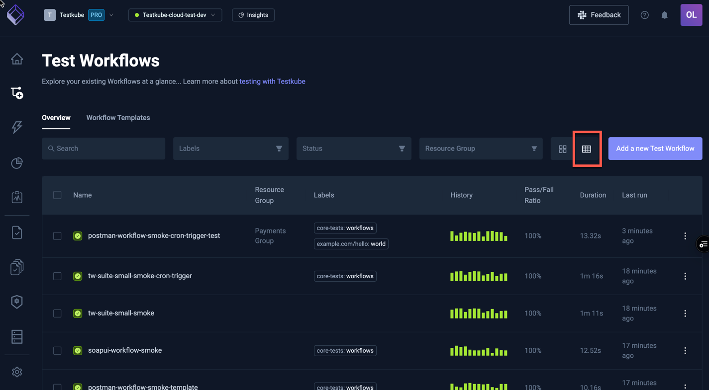

# Workflows Overview

:::info

Test Workflows are Testkubes way of defining how to execute your tests - [Read More](/articles/test-workflows)

:::

The Workflows Overview displays all Workflows in your currently selected Environment, including
their latest and overall execution status.

Use the Search box and the Labels and Status filters to easily locate certain workflows.

You can also switch from the Grid view to a Table view of all workflows in the selected environment.

Selecting a Workflow in either the grid or list view will open the [Workflow Details](testkube-dashboard-workflow-details)

## Workflow Templates

:::info

Workflow Templates provide a powerful mechanism for defining shared / reusable Workflow configurations - [Read More](/articles/test-workflow-templates)

:::

On the **Workflow Templates** tab, you will find a list of available Workflow Templates in your environment.

## Adding a new Workflow Template

Click the **Add a new template** button to create a new Workflow Template. The options are:

- **Git content**: Create a template to use a git source across multiple test workflows.
- **Static content**: Create a template to use a static file across multiple test workflows.
- **Testing tool**: Create a template with a
container/runnable testing tool across to base your test workflows on.
- **Import from YAML**: Create a template from scratch or copy/paste YAML examples.

