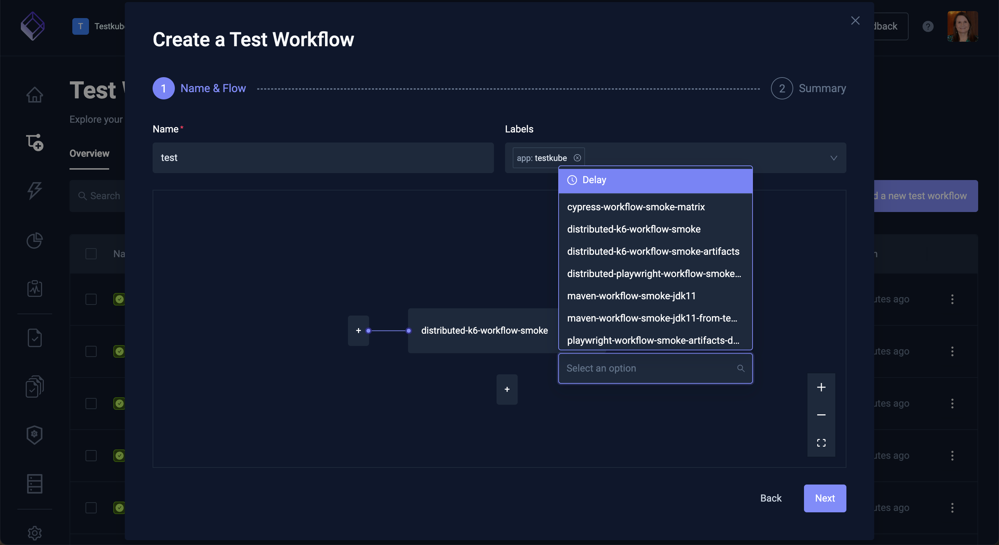
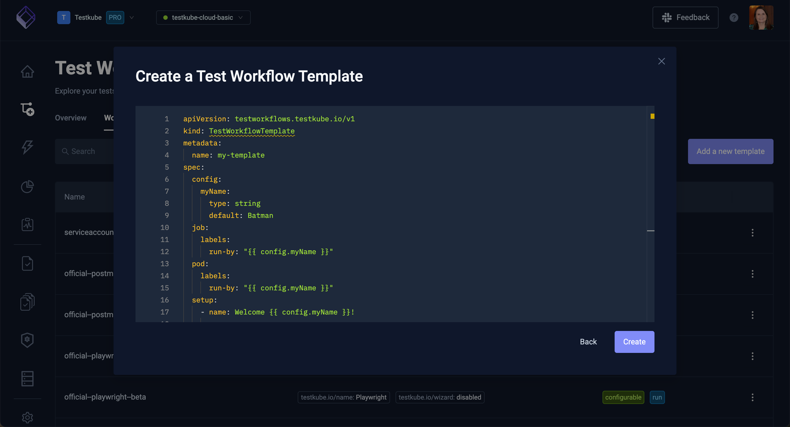

# Workflows Overview

:::info

Test Workflows are Testkubes way of defining how to execute your tests - [Read More](/articles/test-workflows)

:::

The Workflows Overview displays all Workflows in your currently selected Environment, including
their latest and overall execution status.

Use the Search box and the Labels and Status filters to easily locate certain workflows.

You can also switch from the Grid view to a Table view of all workflows in the selected environment.

## Creating a New Workflow

Selecting the "Add new test workflow" button on the top right opens the following dialog:

The different options are described below.

### Creating a Workflow Using the Wizard

This wizard will walk you through creating a Workflow to run your tests, broken down into the following 4 steps:

1) The Name and testing tool/template to use, with corresponding settings
2) The Content of the test to run
3) The actual command to run your test and from where Testkube should scrape the generated artifacts
4) A Summary showing the creating Workflow YAML

#### Workflow Name & Type

The first page shown below prompts you for:

- **Name**: the name of your workflow
- **Labels**: optional labels you want to add to your workflow, helpful for searching/filtering/reporting
- **Template**: which testing tool to use in this workflow 

The options below this will depend on which Testing Tool you select, default values are shown in grey - override
if you need to (for example the default Artillery version is 2.0.9 in the screenshot above)

Selecting **Next** moves you to the next page of the Wizard.

#### Workflow Content

This page allows you to optionally specify the testing script/content that will be executed by the Testing Tool/Template
selected in the first step. Selecting one of the options will show its corresponding settings, for example in 
the screenshot below the Git option has been selected, prompting for the corresponding Git properties.

Selecting Next moves you to the next page of the Wizard.

#### Workflow Run Command and Artifacts

This page specifies which command to use to actually run your tests with the specified testing tool
and test content.

Here you can also specify: 

- **Execution Directory**: in which directory of the retrieved content to run the command (only applies if you used a Git Source)
- **Artifacts**: where Testkube can find artifacts created by your testing tool (reports, videos, etc.).
- **Environment Variables**: any environment variables that need to be passed to your testing tool for test execution

Selecting Next moves you to the last page of the Wizard.

#### Worklow Summary

This shows the generated Workflow YAML based on all the input provided in the previous steps. You can 
make adjustments to the YAML as needed, or go back to the previous steps to update accordingly.

Use the "Inline Template Definitions" checkbox in the bottom left to inline any used Templates into the generated YAML

:::tip

Use this option if you want to make more detailed changes to how the underlying testing tool is used and that won't 
affect other workflows using the same template.

:::

When you're happy with the created Workflow select either "Create & Run" or just "Create" from the button in the bottom 
right to create your Workflow.

### Creating a Workflow from an Example

Use this option if you want to start from one of Testkubes many example Workflows which you can then further modify
for your specific needs.

- The selector at the top allows you to filter which examples are shown
- The list in the middle shows the available examples
- The YAML at the bottom shows the selected example 

You can edit the selected example before using either the Create or Create & Run option to create it. 

:::tip

You will most likely want to change the name of the created workflow, do this by updating the 
`metadata.name` property in the YAML example before creating the Workflow.

:::

### Creating a Workflow by Combining Existing Workflows

This Wizard allows you to create a Workflow that orchestrates multiple existing Workflows to run either in sequence or parallel. 

Start by specifying the name and optional labels that you want to add to this workflow, then select the 
"Add the first workflow" button to select an initial workflow. Once added you can add more existing Workflows
and organize them to execute in any desired order/combination:

Once done, select the Next button to see the corresponding YAML for your Workflow.

Select either the Create or Create & Run option to create your workflow accordingly.

### Creating a Workflow from YAML

This final option allows you to paste/edit your Workflow YAML from scratch:

Once done, select either the Create or Create & Run option to create your workflow accordingly.
