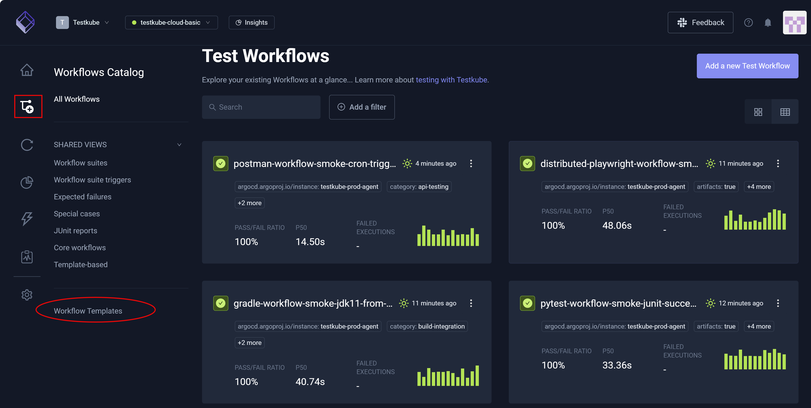
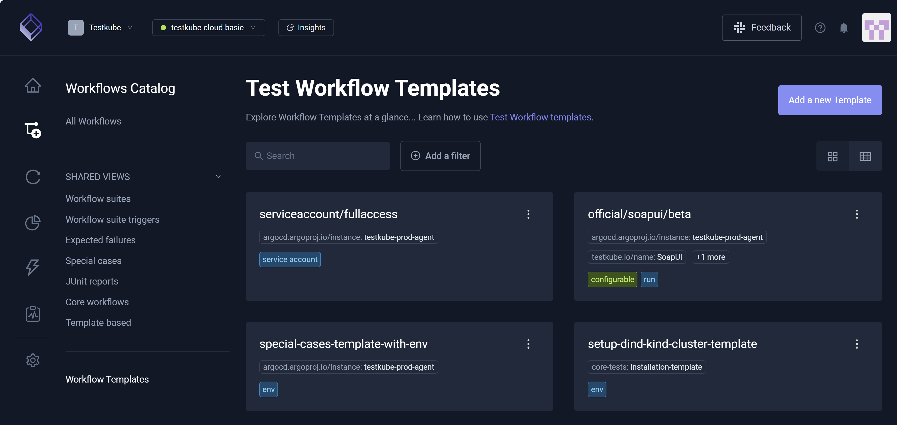
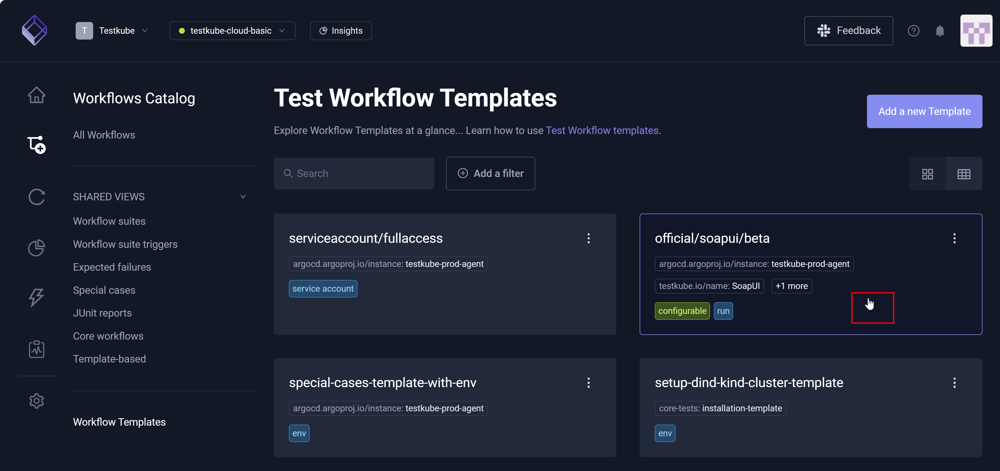
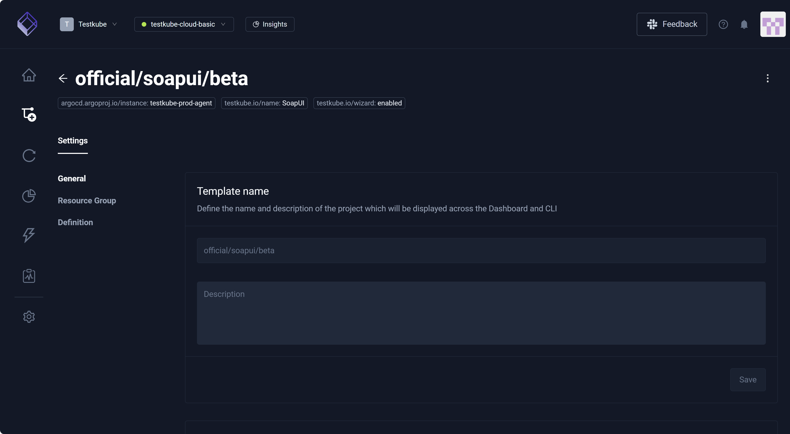
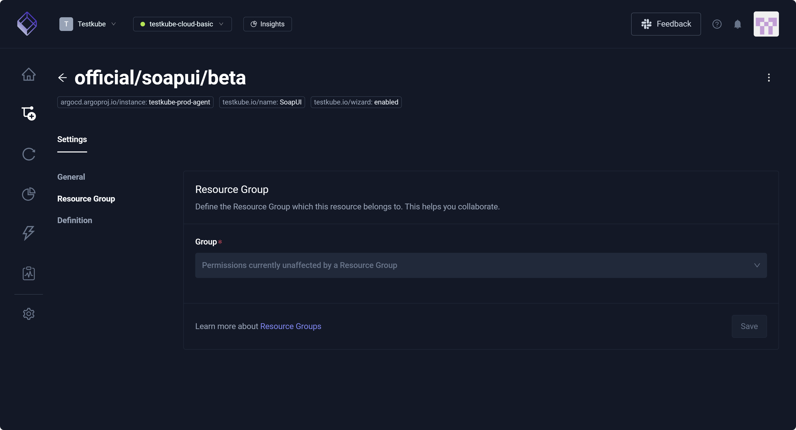
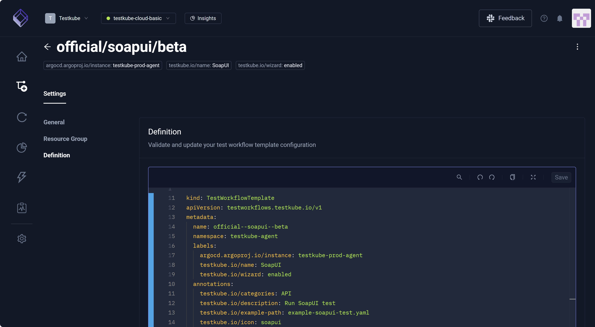
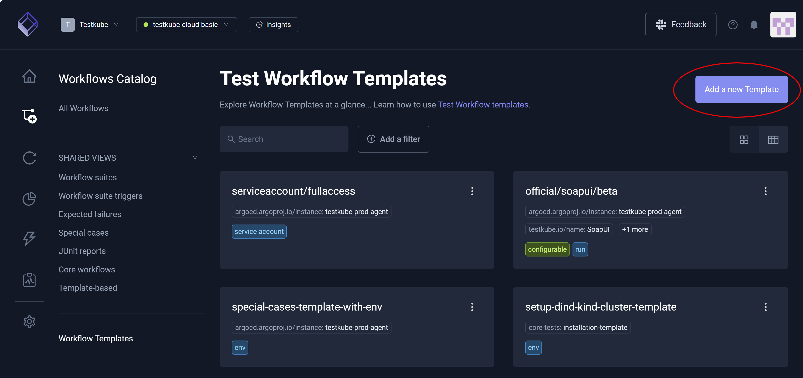
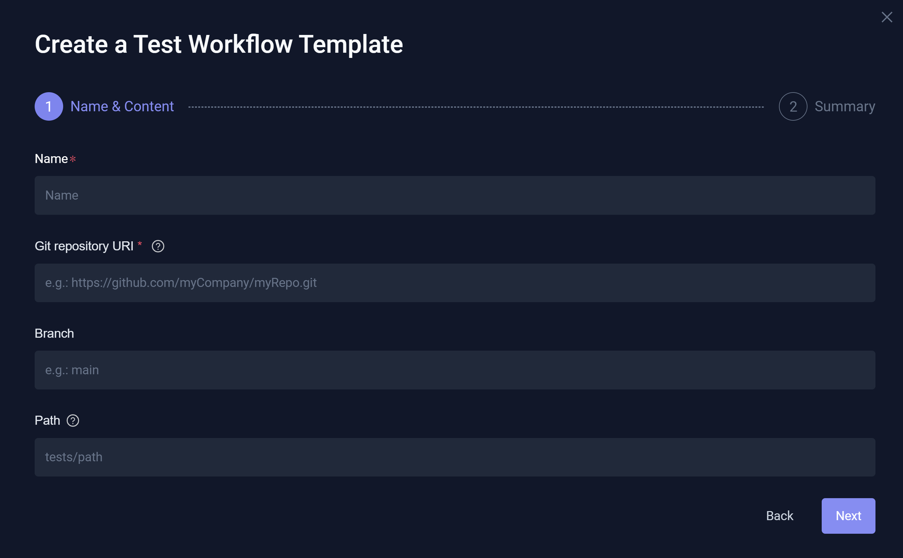
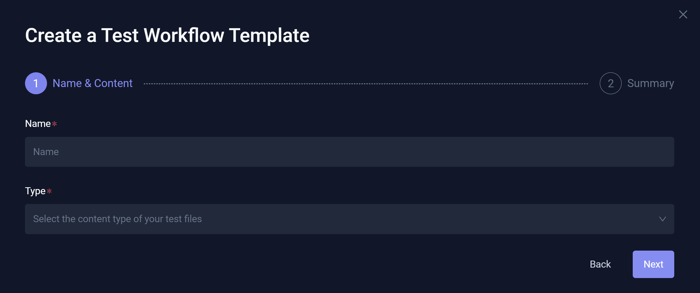
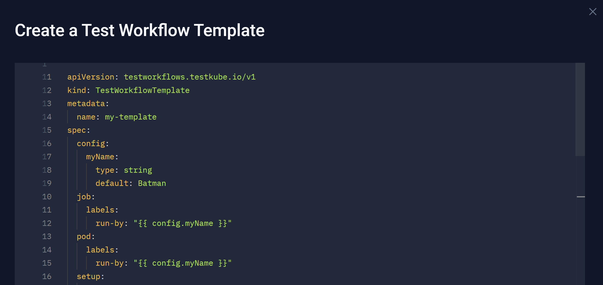

# Workflow Templates
 
**Workflow Templates** are reusable configuration blocks for your Workflows that you can use to ensure your Workflows follow specific patterns or best practices, such as when using tools like Playwright and Selenium. 
With a standard set of instructions for testing tools, you do not have to start your test instructions with a *blank page* of sorts. Instead, you can start with a **Workflow Template** –
tailoring this baseline to align with your current configuration requirements. These templates are powerful mechanisms for defining, sharing, and reusing Workflow configurations.
Leveraging these templates allows you to save time by using and tweaking existing configurations as opposed to building each new set of instructions from scratch. For additional information,
read [Test Workflow Templates](/articles/test-workflow-templates).

You can select **Workflow Templates** to view the list available in your **Environment**.

:::info

The [Workflow Wizard](/articles/test-workflows-create-wizard#create-with-wizard) uses templates named `official/...` to help you create Workflows for the corresponding testing tools.

:::

Similar to Workflows, you can toggle between **Grid view** and **Table view**. You can also [Add a New Template](#add-a-new-template).

## Workflow Template Settings

When you select a **Workflow Template**, **Settings** opens with emphasis on **General**.

### General Settings

**General** allows you to enter a **Description**. The three vertical dots – More Options (top right) – allow you to **Edit** or **Delete** the **Workflow Template**. Deleting the **Workflow Template**
is an irreversible action. **General** also includes a **Usage example** which displays YAML, depicting how to include this template in your **Test Workflow**.

:::info
Kubernetes constraints prevent you from changing the **Template Name**. Instead, you must create a copy of the **Workflow Template** with the new name 
and delete the old one.
::: 

### Resource Group

This setting allows you to assign this **Workflow Template** to a **Resource Group**, facilitating your ability to collaborate. For additional information, read [Managing Resources in a Resource Group](/articles/resource-groups#managing-resources-in-a-resource-group).

### Definition

This setting allows you to edit the **Workflow Template** by updating its configuration via a dedicated YAML editor.

:::warning

Changing templates impacts all Workflows that use them. Please ensure updates do not disrupt existing usage.

:::

## Add a New Template

Select **Add a new template** to create **Workflow Templates** specific to:

* **Git Content** – Create a template to use a Git Source across multiple **Test Workflows**.
* **Static Content** – Create a template to use a static file across multiple **Test Workflows**.
* **Testing Tool** – Create a template with a container/runnable testing tool on which to base your **Test Workflows**.
* **Import from YAML** – Create a template from scratch or copy/paste YAML examples.

### Git Content

This option creates a **Workflow Template** that ensures your Workflows use the same Git Source as its content. For example, all Workflows might use the same Git repository/branch or even the same access method
such as SSH or HTTPS.

### Static Content

This option creates a **Workflow Template** that ensures your Workflows use the same static content for the same scenarios. For example, Deployment Workflows might use the same template such that
the production setup text is identical. Similarly, Onboarding Workflows might reference the same static instructions for new users.

### Testing Tool

This option creates a **Workflow Template** that ensures your Workflows use the same testing tool or script the same way.

### Import from YAML

You can paste YAML directly, or you can create a new template using YAML.

