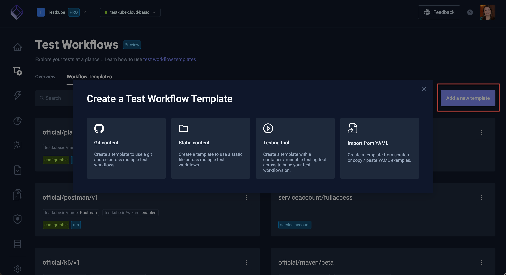

# Workflow Templates

:::tip

Workflow Templates provide a powerful mechanism for defining shared / reusable Workflow configurations - [Read More](/articles/test-workflow-templates)

:::

Under the **Workflow Templates** tab, you will find a list of available Workflow Templates in your environment.

:::info

Templates named `offical/...` are used by the [Workflow Wizard](/articles/testkube-dashboard-workflows-overview#creating-a-workflow-using-the-wizard) to help you create Workflows for the corresponding
testing tools.

:::

Just like with Workflow - you can toggle between grid and list layouts:

## Workflow Template Settings

Selecting a Workflow Template opens the Settings tab for the Template:

The General settings shown above allow you to specify the name and description of the template, and below that
shows an example of how to use this template in a workflow.

The Definition pane allows you to edit the Workflow Template.

:::warning

Remember that changing your templates will affect all Workflows that use them - be sure to not break any usage!

:::

## Adding a New Workflow Template

Click the **Add a new template** button in the Workflows Template overview (shown above) to create a new Workflow Template. 
The options are:

- **Git content**: Create a template to use a git source across multiple test workflows.
- **Static content**: Create a template to use a static file across multiple test workflows.
- **Testing tool**: Create a template with a
container/runnable testing tool across to base your test workflows on.
- **Import from YAML**: Create a template from scratch or copy/paste YAML examples.

### Creating a Git Content Template

The Git Content template wizard helps you create a Workflow Template that you can use across your workflows to ensure
they are all using the same Git Source as their content.

### Creating a Static Content Template

The Static content template wizard helps you create a Workflow Template that you can use across your workflows to ensure 
they are all using the same static content in corresponding scenarios.

### Creating a Testing Tool Template

The Testing Tool template wizard helps you create a Workflow Template that you can use across your workflows to ensure
they are all using a specific testing tool or script in a consistent way.

### Creating a Template from YAML Content 

This wizard allows you to paste or create any Workflow Template from YAML.

