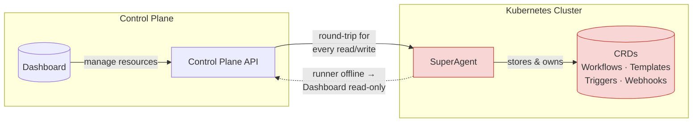
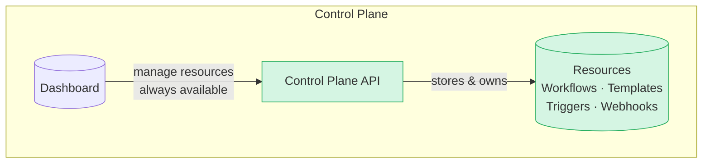

# Testkube Resource Management

Testkube defines a number of Resources for its core functionality:

- TestWorkflows / TestWorkflowTemplates for defining how to run and orchestrate your tests - [Read More](/articles/test-workflows).
- Webhooks / WebhookTemplates for integrating external tools into the TestWorkflow lifecycle - [Read More](/articles/webhooks).
- TestTriggers for integrating Test Orchestration with Kubernetes Events - [Read More](/articles/test-triggers).

While these were all originally stored as CRDs where the Testkube Runner was deployed (see below), starting in Testkube `v2.7` these resources are stored directly in the Testkube Control Plane. As a consequence, the concept of a "superagent" has been retired in favor of discrete Runners/capabilities - [Read More](/articles/agents-overview).

:::note
Resources can still be provided to the Testkube Control Plane using CRDs in a GitOps setup, see [GitOps with Testkube](/articles/gitops-overview).
:::

## Background

### The Testkube Runner as the Source-of-Truth (Legacy) {#the-testkube-agent-as-the-source-of-truth-legacy}

Up until version 2.7.0 of the Testkube, all Testkube Resources available in an Environment were stored and managed as CRDs in the
namespace where the initial Environment Runner ("Superagent") was deployed. This design works well for [standalone runner deployments](/articles/install/standalone-agent), but became increasingly problematic for complex deployments when connecting the Runner to the Testkube Control Plane:

- Whenever the Runner became unavailable (for example for networking reasons), the Control Plane and Dashboard would no longer have access to
  the Testkube Resources in that Environment, resulting in the "Read Only" behaviour in the Dashboard.
- Any action in the Testkube Dashboard that involved the retrieval/update of a Testkube Resources (for example updating a Workflow), would require
  a round-trip to the Runner where the Resource was actually stored - which in large deployment would result in sluggish and sometimes fragile functionality.
- Performing bulk actions on Testkube Resources in the Dashboard (for example search or find/replace across Workflows) was not technically feasible as all
  Resources would first have to be retrieved from the Runner, and updating them atomically would not be possible.
- RBAC controls for Testkube Resources in the Testkube Dashboard could be bypassed by modifying corresponding Kubernetes resources directly with kubectl/etc.

### Testkube Control Plane as the Source-of-Truth

The new architecture introduced with 2.7.0 moves the storage and management of all Testkube Resources from the Runner to the Control Plane itself, resulting in:

- A runner is no longer required to create and manage an Environment and its resources in the Testkube Dashboard, it is first when you actually want to
  run a Workflow, or start listening to Kubernetes Events that you will need to deploy a Runner or runner with the listener capability - [Read More about Testkube Runners](/articles/agents-overview)
- The Dashboard will no longer exhibit "Read Only" behaviour - it is always connected to the Control Plane where all Resources are stored.
- Latency and reliability for working with Testkube Resources in large deployments should be greatly improved.
- RBAC controls for Testkube Resource are now much harder to bypass, ensuring integrity of your resources in a regulated/audited environment.
- Bulk actions on Resources is now possible - which will allow us to add corresponding functionality going forward.

## What happens when migrating to 2.7.0

When connecting a Standalone Runner to the Control Plane, or upgrading an already connected Runner to the 2.7.0 version, it will automatically migrate existing Testkube resources to the Control Plane, in line with the new architecture described above. This migration will be transparent to users.

The Testkube Resources migrated are

- `TestWorkflow` (`testworkflows.testkube.io/v1`)
- `TestWorkflowTemplate` (`testworkflows.testkube.io/v1`)
- `TestTrigger` (`tests.testkube.io/v1`)
- `Webhook` (`executor.testkube.io/v1`)
- `WebhookTemplate` (`executor.testkube.io/v1`)

This gives existing environments a consistent starting point when moving to Control Plane ownership.

Once migrated, the (Super)Runner will show up in the list of Runners as a Runner with all 4 runner capabilities enabled; runner, listener, gitops and webhook.
This is functionality equivalent to its pre-migration state, so users can continue using Testkube as before without having to perform any further tasks
for the migration to finish.

:::tip
If you want to continue syncing Testkube resources into the Control Plane after the migration, read the [GitOps with Testkube article](/articles/gitops-overview).
:::

## What This Means for Users

### Simplified Operations

For most users, this change simplifies day-to-day operations:

- Workflow updates made in the Control Plane are the authoritative connected state.
- Environment health no longer depends on continuous connection to SuperAgent.
- Environments no longer automatically switch to read-only mode when the SuperAgent connection is unavailable.
- Scheduling is managed centrally from the Control Plane.
- Webhooks and Kubernetes-event triggers continue to execute through runners via the runner capability model (for triggers, see [runners with the listener capability](/articles/agents-overview#listener-agents)).
- Control Plane metrics are available by default for observability (see [Control Plane Metrics](/articles/control-plane-metrics)).

Furthermore, the fact that Testkube Resources are now natively managed in the Control Plane will provide significant performance and stability improvements to the
Testkube Dashboard in large-scale deployments.

### Scheduling Changes

Scheduled Workflows are now managed by the Control Plane by default in connected mode.

See [Scheduling Workflows](/articles/scheduling-tests) for schedule syntax and usage, and [Control Plane Metrics](/articles/control-plane-metrics) for scheduler observability.

### Webhooks and Triggers

The execution model for Webhooks and Trigger listeners remains runner-based:

- During SuperAgent migration, SuperAgent keeps the webhook capability so webhook-driven workflow execution continues through the runner path.
- Test Triggers are still handled by runners with the listener capability.

Related docs:

- [Webhooks](/articles/webhooks)
- [Kubernetes Event Triggers](/articles/test-triggers)
- [runners with the listener capability](/articles/agents-overview#listener-agents)

:::note
The "webhook capability" naming is currently an internal implementation detail and may change in future releases.
:::

### Prometheus Metrics

Runner and runners with the webhooks capability expose the Prometheus metrics as before, while the Control Plane itself exposes its own (improved) metrics for Testkube monitoring,
read more at [Control Plane Metrics](/articles/control-plane-metrics).
