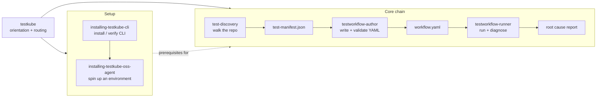

import Tabs from "@theme/Tabs";
import TabItem from "@theme/TabItem";

# Testkube Agent Skills

**Testkube Agent Skills** teach your AI coding agent what Testkube is and how to create, run, and
debug tests on Kubernetes with it. Instead of explaining the platform, TestWorkflow syntax, or CLI
conventions to your agent on every request, you install a set of skills once and the agent picks up
the right one when it needs it.

The skills are open source (MIT) and live at
[github.com/kubeshop/testkube-skills](https://github.com/kubeshop/testkube-skills). They follow the
[Agent Skills](https://agentskills.io) open standard, so they work with any compatible AI agent —
including Claude Code, GitHub Copilot in VS Code, Codex, and Cursor.

:::note
Skills and the [Testkube MCP Server](/articles/mcp-overview) solve different halves of the same
problem. The MCP Server gives your agent **access** to Testkube — tools to list workflows, run
executions, and fetch logs. Skills give it **knowledge**: how to structure a valid TestWorkflow,
which container image matches your dependency versions, and how to read an exit code. They are
complementary, and each works without the other.
:::

Skills work against both Testkube Cloud and open source environments. One of them,
`installing-testkube-oss-agent`, exists specifically to create a local open source environment for
you.

## Available Skills

### Start Here

One general skill acts as the entry point. It carries the platform knowledge the others assume, and
routes to whichever specialist fits the request.

| Skill      | What it does                                                                                                                                                                                                                                                                                                  | Use when                                                                                                                                                                                       |
| ---------- | ------------------------------------------------------------------------------------------------------------------------------------------------------------------------------------------------------------------------------------------------------------------------------------------------------------- | ---------------------------------------------------------------------------------------------------------------------------------------------------------------------------------------------- |
| `testkube` | Explains what Testkube is, how Control Plane and open source standalone differ, and the core concepts — TestWorkflows, templates, executions, agents, triggers, webhooks, expressions. Carries a curated index of the documentation, CLI orientation, and decision trees that route to the specialist skills. | Your agent needs context on Testkube itself, you are asking where something is documented, or you want to run tests somewhere local execution cannot reach and are not sure what to reach for. |

It orients and routes — it never installs, authors YAML, or runs executions itself. Two behaviors
are worth calling out:

- For topics no skill covers — webhooks, triggers, integrations, resource CRUD — it points at the
  relevant documentation page and `testkube ... --help` rather than guessing.
- When your tests should simply be run locally, it says so and stops. Asking an agent to "run my k6
  tests" on your own machine should get you `k6 run`, not a Kubernetes cluster.

### Setup

These two get your tooling ready. Skip them if you already have a working CLI and an environment.

| Skill                           | What it does                                                                                                                                                                                    | Use when                                                                                                                               |
| ------------------------------- | ----------------------------------------------------------------------------------------------------------------------------------------------------------------------------------------------- | -------------------------------------------------------------------------------------------------------------------------------------- |
| `installing-testkube-cli`       | Installs, upgrades, or verifies the Testkube CLI (`testkube` / `tk` / `kubectl-testkube`) on Linux, macOS, and Windows via the install script, Homebrew, APT, Chocolatey, or a manual download. | The CLI is missing (`testkube: command not found`), a specific version is required, or another skill needs to shell out to `testkube`. |
| `installing-testkube-oss-agent` | Checks prerequisites, creates a cluster (k3d by default when a fresh local one is needed), and deploys a Testkube open source standalone agent into the `testkube` namespace.                   | You need a local open source environment to run tests against and none is running yet.                                                 |

Both skills are conservative by design: they check for an existing installation first and reuse it
rather than replacing it, and they confirm each step with you before changing anything.
`installing-testkube-oss-agent` detects an existing agent in the current cluster of any type —
minikube, kind, k3d, or remote — and reuses that too.

### Core Chain

These three are the working loop: find the tests, turn them into a workflow, run it.

| Skill                 | What it does                                                                                                                                                                                                                                              | Use when                                                                                                 |
| --------------------- | --------------------------------------------------------------------------------------------------------------------------------------------------------------------------------------------------------------------------------------------------------- | -------------------------------------------------------------------------------------------------------- |
| `test-discovery`      | Walks a cloned repository, detects language and framework from marker files and content signals, and groups findings into suites — each with evidence, a confidence level, a framework version resolved from lock files, and a suggested container image. | You have a repository locally and need to know what tests exist, what runs them, and with which command. |
| `testworkflow-author` | Creates and validates TestWorkflow YAML: shell steps, container run steps, `execute` composition, templates, services, artifacts, config parameters, and cron triggers. Reads lock files to pin dependency versions and match container images.           | You are writing a TestWorkflow, choosing step types, or configuring workflow behavior.                   |
| `testworkflow-runner` | Runs executions and diagnoses them — create, run, monitor, retrieve logs, download artifacts, and analyze root causes against a failure pattern reference of exit codes, symptoms, and fixes.                                                             | A workflow has been authored and needs to run, or a previous execution failed and needs explaining.      |

Each skill stays inside its lane, which keeps the agent predictable:

- `test-discovery` never executes a test or installs a dependency — it observes and reports.
  It handles polyglot monorepos and flags anything genuinely ambiguous instead of guessing.
- `testworkflow-author` validates every workflow against the CRD schema before it finishes, and
  ships 22 worked examples covering Playwright, Cypress, k6, Go, JMeter, Postman, Selenium,
  Gradle, Maven, Artillery, Locust, and Robot Framework.
- `testworkflow-runner` never edits YAML. If the diagnosis points at a configuration problem, it
  reports the finding for `testworkflow-author` to fix.

`test-discovery` emits either a JSON manifest — for `testworkflow-author`, API ingestion, or CI —
or a Markdown report for a person to read. JSON is the default; Markdown is produced when you ask
for it or when the output path ends in `.md`.

## How They Work Together



Start with `testkube` when you do not yet know which skill you need — it works out what the request
actually requires and hands off.

From there, get the tooling ready first: `installing-testkube-cli` makes sure the `testkube` command exists,
and `installing-testkube-oss-agent` gives you something to run against — skip it if you already
have a Testkube Cloud or open source environment.

Then the core chain runs end to end. Discovery reports what tests exist and hands off a manifest,
authoring turns that into a runnable TestWorkflow, and the runner executes it and reports back on
what happened. You can also enter the chain at any point — for example, invoke
`testworkflow-author` directly if you already know what you want to build.

## Prerequisites

- **Testkube CLI** — the `installing-testkube-cli` skill installs it for you, or install it
  yourself following the [CLI installation guide](/articles/install/cli).
- **Access to a Testkube environment** — Cloud or open source. The
  `installing-testkube-oss-agent` skill can create a local open source one for you.
- **Authentication for Testkube Cloud** — run `testkube login`
  ([managing CLI context](/articles/managing-cli-context)).
- **An AI Tool supporting the [Agent Skills](https://agentskills.io) standard** — see the
  installation options below.

If you plan to use `installing-testkube-oss-agent`, you also need a Kubernetes cluster with
`kubectl` access, or Docker so the skill can create a k3d cluster for you. Standalone open source
mode is CLI-driven and has no dashboard — see
[Standalone Agent](/articles/install/standalone-agent) for what that includes.

## Installation

<Tabs groupId="skills-install">
<TabItem value="claude-plugin" label="Claude Code (plugin)" default>

The quickest path — no clone required. In Claude Code, add the marketplace and install the plugin:

```
/plugin marketplace add kubeshop/testkube-skills
/plugin install testkube-skills@testkube-skills
```

Installed this way, the skills are namespaced:

```
/testkube-skills:testkube
/testkube-skills:installing-testkube-cli
/testkube-skills:installing-testkube-oss-agent
/testkube-skills:test-discovery
/testkube-skills:testworkflow-author
/testkube-skills:testworkflow-runner
```

They also load automatically when Claude Code matches your request to a skill description, so you
rarely need to name one explicitly.

</TabItem>
<TabItem value="claude-manual" label="Claude Code (manual)">

Clone the repository, then copy the skill directories into your Claude Code skills folder:

```bash
git clone https://github.com/kubeshop/testkube-skills
cd testkube-skills
mkdir -p ~/.claude/skills

cp -r plugins/testkube-skills/skills/testkube ~/.claude/skills/
cp -r plugins/testkube-skills/skills/installing-testkube-cli ~/.claude/skills/
cp -r plugins/testkube-skills/skills/installing-testkube-oss-agent ~/.claude/skills/
cp -r plugins/testkube-skills/skills/test-discovery ~/.claude/skills/
cp -r plugins/testkube-skills/skills/testworkflow-author ~/.claude/skills/
cp -r plugins/testkube-skills/skills/testworkflow-runner ~/.claude/skills/
```

Copy only the ones you need — each skill directory is self-contained. Skills installed this way are
invoked without a namespace prefix, for example `/testworkflow-author`.

</TabItem>
<TabItem value="copilot" label="VS Code / GitHub Copilot">

Clone the repository somewhere outside your project, then copy the skill directories into your
project's `.github/skills/` folder. Run this from the root of the project you want the skills
available in:

```bash
git clone https://github.com/kubeshop/testkube-skills /tmp/testkube-skills

mkdir -p .github/skills
SKILLS=/tmp/testkube-skills/plugins/testkube-skills/skills
cp -r $SKILLS/testkube .github/skills/
cp -r $SKILLS/installing-testkube-cli .github/skills/
cp -r $SKILLS/installing-testkube-oss-agent .github/skills/
cp -r $SKILLS/test-discovery .github/skills/
cp -r $SKILLS/testworkflow-author .github/skills/
cp -r $SKILLS/testworkflow-runner .github/skills/
```

Commit `.github/skills/` to share the skills with everyone working on the repository. Use them from
Copilot agent mode in VS Code.

</TabItem>
<TabItem value="codex" label="Codex">

The repository ships a Codex marketplace manifest at `.agents/plugins/marketplace.json`, with the
per-plugin manifest at `plugins/testkube-skills/.codex-plugin/plugin.json`.

From a clone of the repository, enable the plugin through the Codex `/plugins` interface, or install
it locally following the
[Codex plugin build guide](https://developers.openai.com/codex/plugins/build).

Codex caches plugins under `~/.codex/plugins/cache/testkube-skills/testkube-skills/local/`.

</TabItem>
<TabItem value="cursor" label="Cursor">

The repository follows the official
[cursor/plugin-template](https://github.com/cursor/plugin-template) layout: the marketplace manifest
at `.cursor-plugin/marketplace.json` lists the plugin, and its own manifest lives at
`plugins/testkube-skills/.cursor-plugin/plugin.json`.

Point Cursor at this repository or marketplace to install `testkube-skills`.

</TabItem>
</Tabs>

## Usage

Invoke a skill directly with a slash command and a short instruction:

```text
/testkube What is Testkube and where do I start?
/installing-testkube-cli Install the Testkube CLI if it isn't already present
/installing-testkube-oss-agent Spin up a local OSS Testkube environment
/test-discovery Analyze the repository at /path/to/repo
/testworkflow-author Create a Playwright workflow for the login page
/testworkflow-runner Run the workflow and diagnose any failures
```

Or just describe what you want — the agent matches your request against the skill descriptions and
loads the relevant one on demand:

```text
Find the tests in this repo and get them running in Testkube
```

```text
My checkout tests keep failing in Testkube. Figure out why.
```

You do not have to mention Testkube at all. The `testkube` skill also picks up requests to run
tests somewhere a local run cannot reach:

```text
Run my k6 load test against the staging cluster, not my laptop
```

### From Zero to a Running Test

A green-field walkthrough, one prompt at a time. Each step uses a different skill, and the agent
picks them up in order as the work progresses:

```text
I want to run this repository's tests in Testkube. Start by making sure the CLI is installed.
```

```text
I don't have a Testkube environment yet — set up a local open source one.
```

```text
Now look through this repository and tell me what tests exist and what framework runs them.
```

```text
Create a TestWorkflow for the end-to-end suite you found.
```

```text
Run it and tell me what happened.
```

If the run fails, `testworkflow-runner` reports the root cause and hands the finding back so
`testworkflow-author` can adjust the workflow — then run it again.

## Using Skills with the MCP Server

Skills and the [Testkube MCP Server](/articles/mcp-overview) compose well. With both installed,
your agent knows _how_ to work with Testkube and can _act_ on your environment directly — querying
executions, reading logs, and running workflows without shelling out to the CLI.

- [Testkube MCP Server Overview](/articles/mcp-overview) — what the MCP Server offers and how to
  set it up
- [Configuration Examples](/articles/mcp-configuration) — wiring the MCP Server into Claude Code,
  Cursor, and VS Code

For AI that runs inside Testkube rather than in your editor, see
[Testkube AI](/articles/testkube-ai-overview) — Dashboard-based assistants, custom AI Agents, and
event-driven triggers.

## Need Help?

:::info
Don't hesitate to reach out to us on [Slack](https://join.slack.com/t/testkubeworkspace/shared_invite/zt-3kfpny0gx-apPMq9_Swu4KG3uwz6Bk2g) if you run into any issues!
:::
