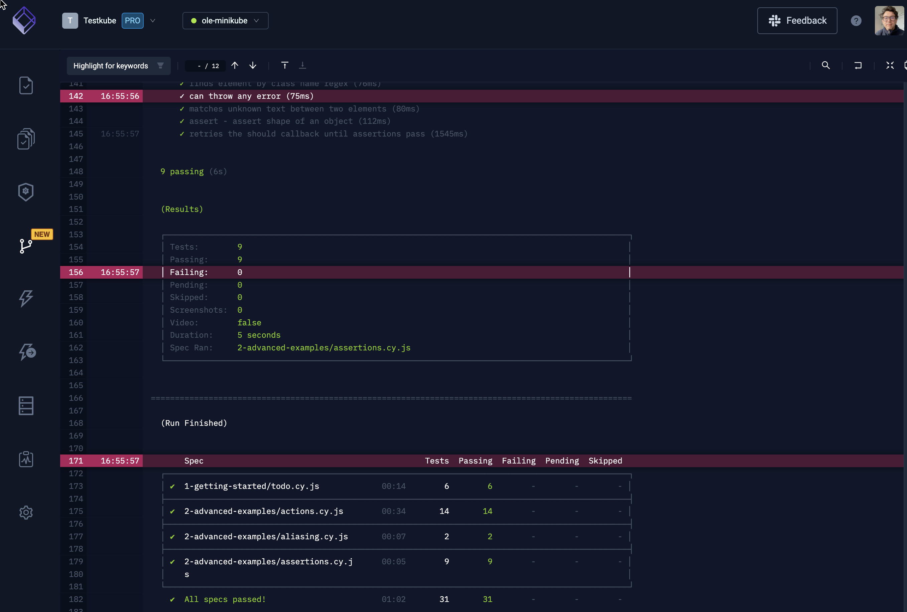

# Troubleshooting Tests

Troubleshooting failed tests is key to the testing pipeline - unless of course your tests never fail - hats off!

Before troubleshooting you of course need to find out that a test has failed - preferably via some kind of notification in your CI/CD tool or collaboration platform. To then efficiently troubleshoot a failed test you will need access to:

- Logs/reports/artifacts created by the testing tool itself. 
- Logs/traces from the component(s) under test to help understand what could have caused the failure.
- Metrics from the hosting infrastructure to troubleshoot performance and/or network-related issues.

In a traditional CI/CD environment collecting all this data is a daunting task. Different testing tools generate different types of logs and artifacts, and working with these efficiently requires either custom scripting or usage of separate tools for searching, comparison and troubleshooting. 

Collecting logs from the component(s) under test is something that will have to be done manually after the test has been completed, using your favorite log aggregation/APM tool, which is generally difficult since you need to find both the affected components and the correct time window in your logs - and the same goes for infrastructure metrics. 

Once you have collected the necessary artifacts, there is usually some “digging” required:
- Weeding out relevant/important content from the general “noise” in your logs.
- Looking for specific error codes or messages.
- Comparing logs or results to previous (successful) runs to understand what might have changed.

## Troubleshooting Tests with Testkube

Testkube has multiple features to help with consistent troubleshooting of failed tests:

- Testkube automatically collects logs and artifacts from your test executions and makes these available in the Testkube Dashboard.
- If your testing tool outputs standard JUnit reports, Testkube will capture those and further help you analyze their contents.
- To further help users identify relevant content in test logs the dashboard has functionality for Keyword Highlighting and Log Comparison.
- Testkube includes an AI Insights module that will use GPT to analyze and understand test logs.

Read on about [Analyzing Test Results](../articles/analyzing-results.mdx).
