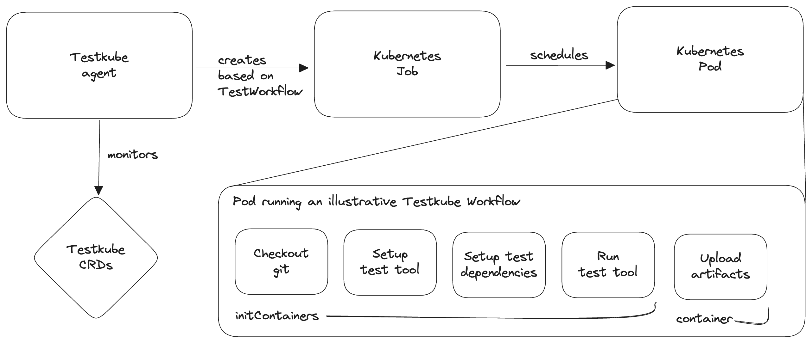

# Introduction

Welcome to Testkube!

Testkube is a Test Orchestration Platform allowing you to 
orchestrate both simple and complex multi-tool testing scenarios and analyse all of your executions and their results in one centralised place.

## Key Features

#### Test Workflows within your own Kubernetes clusters

Testkube runs tests right from within Kubernetes clusters located on your own premise.
You can reduce the gap between testing and production environments and
leverage the Kubernetes scheduler to run tests on a large scale.

Test Workflows make it simple to orchestrate both simple and complex tests.
Our aim is to let everyone contribute to assuring quality instead of putting all the effort on a single group.

#### Centralized & Actionable

Growing products make it challenging to keep up with the sheer amount of tests and test data generated. We built a centralised Dashboard that acts as a single pane of glass for everything test related.

Our analysis tools facilitate developers and testers with troubleshooting failed tests
and gives engineering managers strategic insights into their current testing practices.
That way everyone can make better decisions faster.

#### Integrate within the Larger Software Testing Life Cycle

Test execution is a small part of a bigger picture. Testkube integrates into the bigger ecosystem. You can run executions from external tools through triggers, events and use webhooks to keep other tools in the loop.

## How does it work?

The Test Workflow is the bread and butter of Testkube. It's a Kubernetes Custom Resource which defines how your tests are orchestrated on one or multiple clusters. The user experience feels similar to modern CI tools but with a dedicated focus on testing.

When Test Workflows are triggered, the Testkube Agent will spawn a Kubernetes Job.
The Kubernetes scheduler will then create a pod which runs the workflow.
All steps are sequentially executed as containers within the same pod and thus share the file system.
