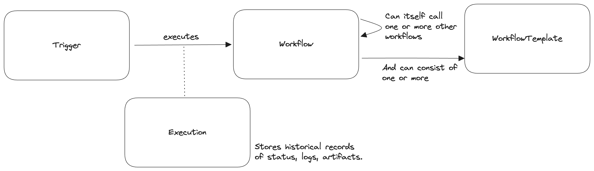

# Welcome

Happy testing!

## What is Testkube?

Testkube is a test orchestration and execution framework.
You can use it to consolidate your tests and other marketing slogans come here.
This section should be written by Ole or Bruno.

Key Features and Benefits to be written here.

## Concepts

Test Workflows are the bread and butter of Testkube.
They are Kubernetes Custom Resource Definitions (CRDs) which define and control how your tests are orchestrated on one or multiple clusters. While Kubernetes is at the heart of Testkube, its dashboard makes it simple to operate on these conceptual objects without prior Kubernetes knowledge.

The primary Testkube resources are TestWorkflows, TestWorkflowTemplates, Triggers and Executions:

- Workflows: This resource is a configurable, automated test process made up of one or more steps. Use it to fetch tests and source code, run any testing tool and store resulting artifacts. Beyond that you can start services on which your test depends such as a database, run (load) tests in parallel and more.
- Triggers: This resource maps an event to execute one or more workflows. Incoming events can be HTTP Triggers, Cron Triggers, Manual Triggers within the dashboard or Kubernetes events such as a updated deployment.
- Executions: This resource represents a single run of a Test Workflow. It contains the status, logs, artifacts of all your steps. Executions are immutable objects and can be used to troubleshoot failing test.
- Templates: This resource is a reusable building block for your workflow. Use it to pick up an off-the-shelve template of popular testing tools, manage testing toolchains at scale, write reusable integrations, and more. A workflow can be composed of multiple templates.

## How does it work?

Test Workflows can be triggered, in which case a Testkube Agent will get the signal to start working.
Behind the scenes, a Kubernetes job will be created based on the specification of the workflow.
This job in turn will spawn a Kubernetes Pod which runs the workflow's steps.

Steps are consecutive containers run. This gives the flexibility to use the right image for the current step. Testkube leverages init containers for this, which means that the file system can be shared between steps.
