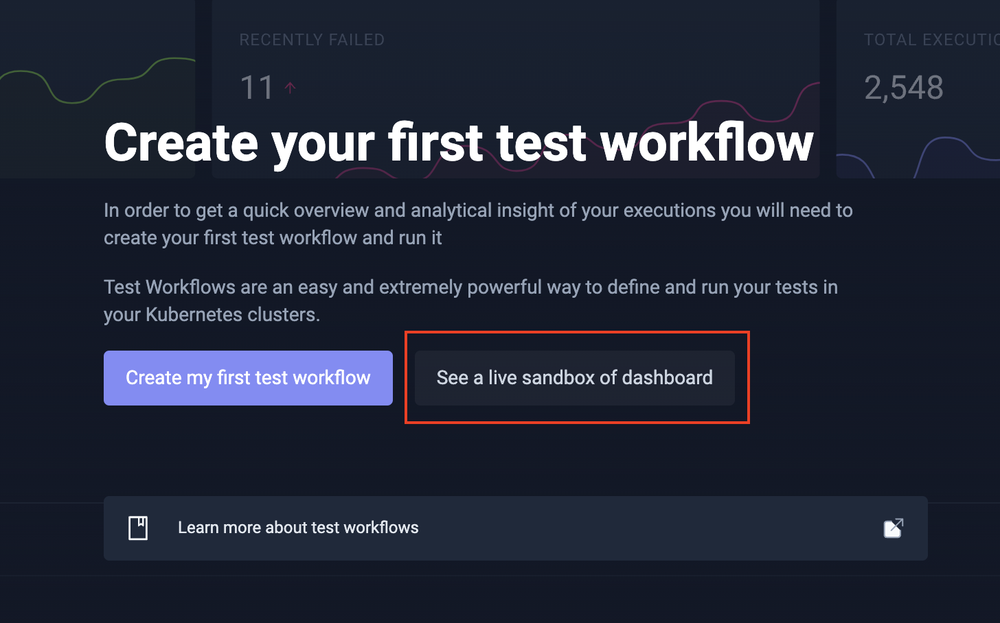

import Tabs from "@theme/Tabs";
import TabItem from "@theme/TabItem";

# Quickstart

In this tutorial you will learn how to install Testkube, run your first test workflow and inspect its artifacts and logs.

## 1. Installing the CLI

The Testkube CLI can be used to conveniently install Testkube and manage your tests.

<Tabs groupId="dashboard-cli">
<TabItem value="macos" label="MacOS" default>

```sh
brew install testkube
```

</TabItem>

<TabItem value="windows" label="Windows">

```sh
choco source add --name=kubeshop_repo --source=https://chocolatey.kubeshop.io/chocolatey
choco install testkube -y
```

</TabItem>

<TabItem value="ubuntu" label="Ubuntu">

To install Testkube CLI you'll need the following tools:

- [Kubectl](https://kubernetes.io/docs/tasks/tools/), Kubernetes command-line tool
- [Helm](https://helm.sh/)

```sh
wget -qO - https://repo.testkube.io/key.pub | sudo apt-key add -
echo "deb https://repo.testkube.io/linux linux main" | sudo tee -a /etc/apt/sources.list
sudo apt-get update
sudo apt-get install -y testkube
```

</TabItem>

<TabItem value="script" label="Script">

To install Testkube CLI you'll need the following tools:

- [Kubectl](https://kubernetes.io/docs/tasks/tools/), Kubernetes command-line tool
- [Helm](https://helm.sh/)

```bash
curl -sSLf https://get.testkube.io | sh
```

</TabItem>

<TabItem value="manual" label="Manual Download">

To install Testkube CLI you\'ll need the following tools:

- [Kubectl](https://kubernetes.io/docs/tasks/tools/), Kubernetes command-line tool
- [Helm](https://helm.sh/)

1. Download the binary for the version and platform of your choice [here](https://github.com/kubeshop/testkube/releases).
2. Unpack it. For example, in Linux use `tar -zxvf testkube_1.5.1_Linux_x86_64.tar.gz`.
3. Move it to a location in the PATH. For example:

```sh
mv  testkube_1.5.1_Linux_x86_64/kubectl-testkube /usr/local/bin/kubectl-testkube
```

For Windows, you will need to unpack the binary and add it to the `%PATH%` as well.

:::note
If you use a package manager that we don't support, please let us know here [#161](https://github.com/kubeshop/testkube/issues/161).
:::

</TabItem>
</Tabs>

## 2. Installing Testkube

Testkube has flexibility in its deployments.
The Testkube agents are our test runners and always run in your cluster.
Because of this, your source code will never hit our servers.
Whether the control plane is self-hosted or managed by Testkube Cloud is up to you.

<Tabs groupId="tutorial-install-cli">
<TabItem value="on-prem" label="On-Prem" default>

1. Request a free license on https://testkube.io/download.
2. Run the `testkube init demo` command in your terminal.
3. Run the `testkube dashboard` command to open Testkube without configuring ingress.
4. Log in to Testkube with the credentials from the second step.

You will now see the dashboard:


:::info
Looking for more details or customization? You can learn more in [our installation documentation][testkube-installing].
:::

</TabItem>

<TabItem value="cloud" label="Cloud">

1. Login to [app.testkube.io](https://app.testkube.io).
2. Click on the `Let's get started` button.
3. Enter an environment name and click `Create environment`.
4. Run the generated `testkube pro init` command in your terminal.

You will now see the dashboard:


</TabItem>

<TabItem value="demo" label="Demo without Install">

1. Login to Testkube.
2. [Go to the demo environment.](https://app.testkube.io/demo-environment)
3. Alternatively, you can access the demo environment from multiple places throughout the app like:




You will now see the dashboard without having to install an agent.


</TabItem>
</Tabs>

## 3. Defining your First Test Workflow

Let's take a look at a K6 load test to familiarize ourselves with Testkube's workflows:

```yaml
# The workflow is a Kubernetes CRD with the usual apiVersion, kind and metadata.
# It configures the steps for your test automation pipeline.
apiVersion: testworkflows.testkube.io/v1
kind: TestWorkflow
metadata:
  # The workflow will have a name that you define here.
  name: my-test
  # By default, workflows should be applied to the namespace of the Testkube agent.
  namespace: testkube
  # Labels allow you to filter and group within the dashboard and CLI.
  labels:
    app.kubernetes.io/name: my-api
    app.kubernetes.io/part-of: my-cms
    testkube.io/test-tool: k6s
    testkube.io/test-category: load-test
spec:
  # The content property allows you to fetch your test cases and source code.
  # You can check out content from Git or create specific files from strings.
  # In this case, we'll go for an inline test for simplicity.
  content:
    files:
      - path: k6.js
        content: |
          import http from "k6/http";
          import {
            textSummary,
            jUnit,
          } from "https://jslib.k6.io/k6-summary/0.0.2/index.js";

          export const options = {
            thresholds: {
              http_req_failed: ["rate<0.01"],
            },
          };
          export default function () {
            http.get("http://test.k6.io");
          }
          export function handleSummary(data) {
            return {
              stdout: textSummary(data, { indent: " ", enableColors: true }),
              "junit.xml": jUnit(data),
            };
          }
  # Workflows default to the container image's working directory. Often you will want
  # to update this to the directory of your content, but be mindful as some testing
  # tools might malfunction when their container's working directory is changed.
  # Git content is put in `/data/repo`, whereas relative file content in `/data`.
  container:
    workingDir: /data
  # Steps are the main building blocks in workflows. Each step is executed in sequential order.
  # You can use steps to setup or teardown your testing tool and test dependencies.
  steps:
    # Each step can run with their own image, yet the file system is shared across steps.
    # In this case, we'll run K6 on our test defined above.
    - name: Run k6 tests
      run:
        image: grafana/k6:latest
        shell: k6 run k6.js --iterations 100
    # Logs of steps are automatically stored whereas artifacts will require an explicit step.
    # You can give us the location of the artifacts and Testkube takes care of the rest.
    - name: Saving artifacts
      artifacts:
        paths: ["junit.xml"]
```

While this only scratches the surface of workflows,
we can now attempt to run this workflow.
You can learn more about workflows in the next steps.

## 4. Run your Test Workflow

<Tabs groupId="tutorial-cli">

<TabItem value="dashboard" label="Using the Dashboard">

1. Choose import from YAML.
2. Copy and paste the test workflow above.
3. Click the `Create` button.
4. View the status and logs of the workflow as it is executing.

:::info
Alternatively, you can use the test workflow wizard to create your own test workflow from scratch leveraging test workflow templates for a variety of tools such as Postman, Artillery, Cypress, Playwright and more.
:::

</TabItem>

<TabItem value="cli" label="Using the CLI">

1. Create a file named _my-workflow.yaml_.
2. Copy and paste the test workflow above.
3. Execute the command below.
4. View the status and logs of the workflow as it is executing.

```bash
kubectl apply -f my-workflow.yaml && kubectl testkube run tw my-test --watch
```

</TabItem>
</Tabs>

## 5. Looking at Past Executions

<Tabs groupId="tutorial-cli">
<TabItem value="dashboard" label="Using the dashboard" default>

1. Go to the dashboard and open your recent execution.
2. You can see this execution's logs right away.
3. View the execution's artifacts by going to the `Artifacts` tab.
4. Click the download icon to download it.


</TabItem>

<TabItem value="cli" label="Using the CLI">

```bash
# List recent executions.
kubectl testkube get twe

# List artifacts of this execution.
kubectl testkube get artifacts 664dbae9924211bb076bd58e

# Download the artifact of this execution.
kubectl testkube download artifact 6655cc6d7d0abf889e531168 junit.xml .

# Download the logs of this execution.
kubectl testkube get twe 664dbae9924211bb076bd58e --logs-only
```

</TabItem>
</Tabs>

## 6. Integrate within your Pipeline

Tests can be integrated in your CI workflow, run on a cron schedule or trigger on a Kubernetes event.
For example, I want to run this test every time my deployment's image updates.

<Tabs groupId="tutorial-integrate">
<TabItem value="kubernetes" label="Trigger on a Kubernetes event">

1. Use the sidebar on the left to browse to your triggers.
2. Click the `Create a new trigger` button.
3. Follow the instructions on the form.


</TabItem>

<TabItem value="ci" label="Trigger in CI">

1. Browse to your test workflow within the dashboard.
2. Click the `CI/CD Integrations` tab.
3. You can see the instructions where all variables have been prefilled for you.
4. Follow these instructions to run it on your favourite provider.

Testkube currently comes with instructions for GitHub Actions, GitLab CI, CircleCI, Jenkins and Azure DevOps.

</TabItem>

<TabItem value="cron" label="Trigger on a schedule">

1. Browse to your test workflow.
2. Click "Edit Workflow" in the dotted menu top-right.
3. Make the following changes and save the workflow:

```diff
apiVersion: testworkflows.testkube.io/v1
kind: TestWorkflow
metadata: …
spec:
+  events:
+  - cronjob:
+      crob: '*/5 * * * *'
  content: …
  steps: …
```

</TabItem>
</Tabs>

## Next steps

Congratulations on running your first test workflow!
At this point you should have installed Testkube, run a sample test and integrated that within your pipeline.
Our recommended next step is to write run one of your own tests within Testkube.

To learn how to do this we recommend you either:

- [Follow a tutorial which adds tests to a sample application.][upnext-tutorial]
- [Create your test based on one of our workflow examples.][upnext-examples]
- [Dive deeper into the workflow documentation.][upnext-docs]

[testkube-installing]: /articles/install/overview
[upnext-tutorial]: /articles/tutorial/example
[upnext-examples]: https://github.com/kubeshop/testkube/tree/develop/test
[upnext-docs]: /articles/test-workflows
