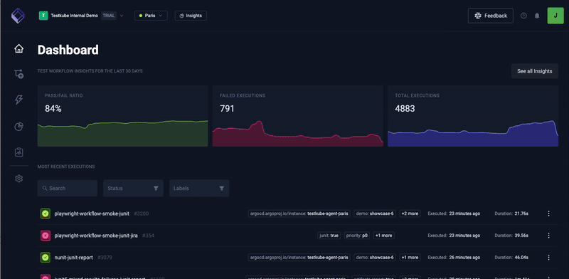

import Tabs from "@theme/Tabs";
import TabItem from "@theme/TabItem";
import CliInstallation from '../../_cli_installation.mdx';

# Testkube Individual Evaluation

This step-by-step tutorial provides you with a simplified Testkube On Prem installation that deploys both the Testkube Control Plane and Agent
within the same namespace, in less than 10 minutes.  

:::note
This demo installation is for a **single/local user only**, on a individual workstation. It does not create an Ingress configuration, and is not configured to be used by others.
It comes with a preconfigured admin account, Organization and Environment for running your tests.

For evaluations suitable for **team usage**, please follow the [Team Evaluation quickstart guide][team-evaluation-quickstart].
:::

## 1. Prerequisites

Before you can get started with the quickstart deployment, you will need the following:

- A running local Kubernetes cluster like [Minikube][minikube-docs]
- Docker CLI authenticated against Docker Hub (or a registry mirroring Docker Hub)
- The Testkube CLI for the quickstarter. For instructions, see the next section.
- [The kubectl CLI][install-kubectl] to run commands against Kubernetes clusters (optional). 

A trial license will be required during installation. You can either [request a trial license](https://testkube.io/download) through our web form, or you can **[schedule time with our Solutions Engineering team](https://meetings.hubspot.com/jonathan-fortunati)** if you prefer to talk to a person. They can generate a license for you, and help you get started.

## 2. Install the Testkube CLI

You can choose one of the following methods to install the CLI:

<CliInstallation/>

## 3. Run the Testkube Installer

The installer will complete these steps:

- Check if you have chosen the right Kubernetes environment.
- Ask for some information, such as the trial license requested as noted above.
- Install Testkubes Control Plane and Agent, both within the same namespace.

The whole process takes 3-5 minutes and can be started with the following command:

```bash
testkube init demo
```

Once installed, you will be asked if you want to `testkube dashboard` to conveniently access all relevant services on your localhost.
You can always execute this yourself afterward should you close this terminal after installation. The admin in this demo has
the following e-mail and password: `admin@example.com/password`.

:::info
In case of issues with license please try `testkube diag license` command for license validation.
:::

## 4. Create and Run a Testkube Workflow 

Navigate to the Test Workflows catalogue, and click "Add a new Test Workflow" to select a pre-built workflow from our library of examples. Click "save and run" to start the Test Workflow



## 5. See the Results

Once the Execution of the Test Workflow completes, click into the execution 

[install-kubectl]: https://kubernetes.io/docs/tasks/tools/
[install-helm]: https://helm.sh/docs/intro/install/
[install-oss]: /articles/install/standalone-agent
[team-evaluation-quickstart]: /articles/tutorial/quickstart/team-evaluation
[minikube-docs]: https://minikube.sigs.k8s.io/docs/
