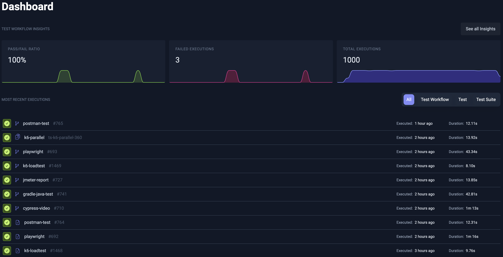

import React from "react";
import DocCard from "@site/src/theme/DocCard";
import clsx from "clsx";

export function KV({items}) {
  const wrap = { marginTop: '.75rem' };
  const row  = { margin: '0 0 .35rem', fontSize: '0.95rem', lineHeight: 1.5 };
  const key  = { fontWeight: 700 }; // bold label

  return (
    

      {items.map(([k, v]) => (
        

          {k}: {v}
        

      ))}
    

  );
}

# Quickstart Overview

Get started with Testkube in 2 steps:

1. Select which installation path below that is right for you.
2. Schedule a call with our Solutions Engineering team to get your evaluation license and answers to any outstanding questions.

## 1. Select an Installation Path

Select which installation path is right for you from the below options:

export const QuickstartCardList = (input) => (
  <section className={clsx("row indent--min")}>
    {[
      {
        icon: "🛠",
        label: "Individual Evaluation: Local Deployment, Full Potential",
        description: (
          <>
            

              Best for individual evaluators investigating Testkube before sharing it with others.
              Requires a local Kubernetes runtime, like Minikube.
            

            <KV items={[
              ['Goal', 'Run a test locally with minimal friction'],
              ['Persona', 'Individual developer / technical evaluator'],
              ['Intended for', 'UI exploration, manual triggers, sample workflows'],
              ['Time to value', '≤ a day'],
            ]}/>
          </>
        ),
        href: "/articles/tutorial/quickstart/individual-evaluation",
        type: "intro",
      },
    ].map((item, i) => (
      <article key={i} className="col padding--sm intro__card">
        <DocCard item={item} />
      </article>
    ))}
  </section>
);

<QuickstartCardList />

export const QuickstartCardList2 = (input) => (
  <section className={clsx("row indent--min")}>
    {[
      {
        icon: "🛠",
        label: "Team Evaluation: Your Cluster, Real Tests",
        description: (
          <>
            

              Best for teams investigating Testkube in real-life scenarios. Requires Kubernetes cluster access with sufficient permissions for deployment and debugging
            

            <KV items={[
              ['Goal', 'Install the full Testkube platform into a shared environment, running real tests'],
              ['Persona', 'Team Lead, Senior DevOps Engineer, QA Lead'],
              ['Intended for', 'Orchestrating existing tests, tying into CICD, event triggers, and getting a real-world feel for the tool'],
              ['Time to value', '≤ a sprint'],
            ]}/>
          </>
        ),
        href: "/articles/tutorial/quickstart/team-evaluation",
        type: "intro",
      },
    ].map((item, i) => (
      <article key={i} className="col padding--sm intro__card">
        <DocCard item={item} />
      </article>
    ))}
  </section>
);

<QuickstartCardList2 />

export const QuickstartCardList3 = (input) => (
  <section className={clsx("row indent--min")}>
    {[
      {
        icon: "🛠",
        label: "Enterprise POC: Strategic Pilot, Global Roll-out",
        description: (
          <>
            

              Best for enterprise architecture or central tooling teams evaluating tooling to support strategic initiatives
            

            <KV items={[
              ['Goal', 'Evaluate Testkube against enterprsie requirements like security, scalability, reporting, integrations, and in line with formal POC best practices'],
              ['Persona', 'Engineering, DevOps, QA Leadership'],
              ['Intended for', 'Integrating test orchestration into strategic intiatives around quality, speed of delivery, and cost reduction'],
              ['Time to value', '≤ a quarter'],
            ]}/>
          </>
        ),
        href: "/articles/tutorial/quickstart/enterprise-poc",
        type: "intro",
      },
    ].map((item, i) => (
      <article key={i} className="col padding--sm intro__card">
        <DocCard item={item} />
      </article>
    ))}
  </section>
);

<QuickstartCardList3 />

## 2. Schedule a call with our Solutions Engineering team

Once you've decided on your path (or if you're not sure), [Schedule time with our Solutions Engineering team!](https://testkube.io/demo) to get your evaluation license 
and get answers to any outstanding questions.

:::info
Don't worry - this isn't a sales call - we just want to make sure you get off on a good start with Testkube and answer any questions you have.
:::

## Looking try Testkube without installation?

The Testkube Sandbox environment available in the Testkube Cloud Control Plane is a great way to explore the functionality provided by
Testkube without having to install anything in your infrastructure. It contains a large collection of Workflows for
different testing tools, with corresponding execution results and Test Insights for you to explore.

:::info
The Sandbox Environment won't allow you to create or update Test Workflows - to get the full experience, deploy the control plane today!
:::

1. Sign in to the [Testkube Cloud Control Plane](https://app.testkube.io).
2. Once authenticated, [go to the sandbox environment.](https://app.testkube.io/organization/testkube-demo/environment/testkube-demo/dashboard/home) - (there are multiple in-app
  prompts for this also).

You will now see the Dashboard without having to install an agent, and are free to explore/run existing Workflows,
look at execution results, etc.

