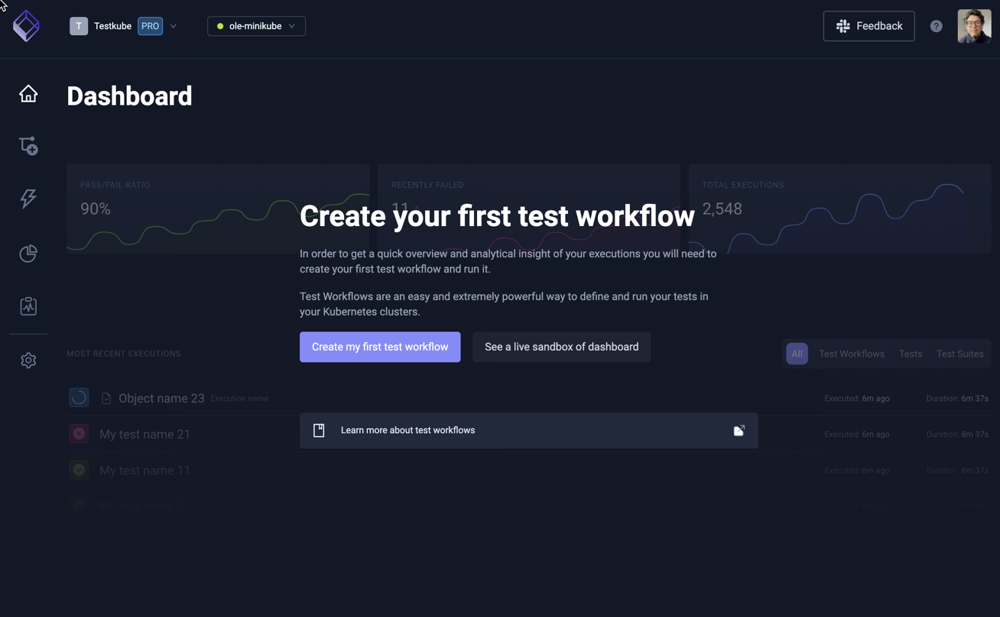
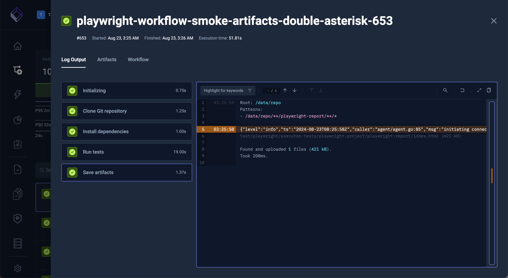
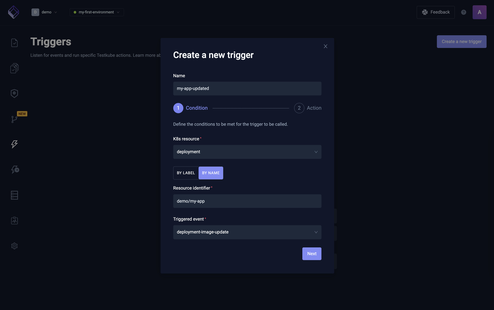

import Tabs from "@theme/Tabs";
import TabItem from "@theme/TabItem";

# Testkube Team Evaluation

In this tutorial you will learn how to get started with Testkube, run your first Test Workflow, inspect its executions, and
integrate it with your CI/CD pipeline(s).

If you don't already have a license or Testkube Cloud account, **[schedule time with our Solutions Engineering team](https://testkube.io/demo)** to get your license/account 
and answers to any questions you have.

:::note
This demo installation is for a **team evaluation**, using a Kubernetes cluster a real Kubernetes cluster. Customization of the deployment may be required (ex. using S3) but can be implemented over time. 

For evaluations suitable for **individual usage**, please follow the [Individual Evaluation quickstart guide](/articles/tutorial/quickstart/individual-evaluation). \
For information on conducting **enterprise proof of concepts**, please review the [Enterprise POC guide](/articles/tutorial/quickstart/enterprise-poc).
:::

## 1. Install or Sign in to Testkube

Testkube has flexibility in its deployments (learn more in the [Installation Overview](/articles/install/overview)).
- **Testkube On-Prem** runs both the Control Plane and Test Execution Agents in your infrastructure.
- **Testkube Cloud Control Plane** runs the Control Plane in our cloud and the Test Execution Agents in your infrastructure.

<Tabs groupId="tutorial-install-cli">
<TabItem value="on-prem" label="Testkube On-Prem" default>

1. [Install the Testkube CLI](/articles/install/cli)
2. Deploy Testkube via Helm:
```bash
helm upgrade --install \
  --create-namespace \
  --namespace testkube \
   -f values.yaml \
  testkube oci://registry-1.docker.io/kubeshop/testkube-enterprise --version <version>
```
*For more information on baseline configuration of the Testkube Control Plane deployment, please visit [our base installation documentation ][base-install]*

3. Run the `testkube dashboard` command to open Testkube without configuring Ingress.
4. Log in to Testkube with the credentials from the second step.

You will now see the Testkube Dashboard for the default environment created in your on-prem installation:



</TabItem>
<TabItem value="cloud" label="Testkube Cloud Control Plane">

  1. Sign in to the [Testkube Cloud Control Plane](https://app.testkube.io).
  2. Click on the `Let's get started` button.
  3. Enter an environment name and click `Create environment`.
  4. Run the provided commands in your terminal to install the Testkube Agent.

  You will now see the Testkube Dashboard for your new environment:

  

</TabItem>
</Tabs>

:::info
Looking for more installation details or customization? You can learn more in [our installation documentation][testkube-installing].
:::

## 2. Define your First Test Workflow test

Let's take a look at a K6 load test to familiarize ourselves with Testkube's Workflows:

```yaml
# The workflow is a Kubernetes CRD with the usual apiVersion, kind and metadata.
# It configures the steps for your test automation pipeline.
apiVersion: testworkflows.testkube.io/v1
kind: TestWorkflow
metadata:
  # The workflow will have a name that you define here.
  name: my-test
  # By default, workflows should be applied to the namespace of the Testkube agent.
  namespace: testkube
  # Labels allow you to filter and group within the Dashboard and CLI.
  labels:
    app.kubernetes.io/name: my-api
    app.kubernetes.io/part-of: my-cms
    testkube.io/test-tool: k6s
    testkube.io/test-category: load-test
spec:
  # The content property allows you to fetch your test cases and source code.
  # You can check out content from Git or create specific files from strings.
  # In this case, we'll go for an inline test for simplicity.
  content:
    files:
      - path: k6.js
        content: |
          import http from "k6/http";
          import {
            textSummary,
            jUnit,
          } from "https://jslib.k6.io/k6-summary/0.0.2/index.js";

          export const options = {
            thresholds: {
              http_req_failed: ["rate<0.01"],
            },
          };
          export default function () {
            http.get("http://test.k6.io");
          }
          export function handleSummary(data) {
            return {
              stdout: textSummary(data, { indent: " ", enableColors: true }),
              "junit.xml": jUnit(data),
            };
          }
  # Workflows default to the container image's working directory. Often you will want
  # to update this to the directory of your content, but be mindful as some testing
  # tools might malfunction when their container's working directory is changed.
  # Git content is put in `/data/repo`, whereas relative file content in `/data`.
  # A few useful hints about the `workingDir` resolution:
  # - without `workingDir` (or with empty) in step - it will use the parent's working dir (down the workflow specification tree)
  # - without `workingDir` (or with empty) at all in the workflow specification tree - it will use working dir from the image default
  # - with relative `workingDir` in step - it will go further from parent's working dir (down the workflow specification tree)
  # - with relative `workingDir` in step, but no other in a workflow specification tree - it will go further from the image default
  # - the parent is whatever is found in the workflow specification tree, for example, the Global Template's `spec.container.workingDir`
  # goes down to Test Workflows `spec.container.workingDir` (unless overridden).
  container:
    workingDir: /data
  # Steps are the main building blocks in workflows. Each step is executed in sequential order.
  # You can use steps to setup or teardown your testing tool and test dependencies.
  steps:
    # Each step can run with their own image, yet the file system is shared across steps.
    # In this case, we'll run K6 on our test defined above.
    - name: Run k6 tests
      run:
        image: grafana/k6:latest
        shell: k6 run k6.js --iterations 100
    # Logs of steps are automatically stored whereas artifacts will require an explicit step.
    # You can give us the location of the artifacts and Testkube takes care of the rest.
    - name: Saving artifacts
      artifacts:
        paths: ["junit.xml"]
```

While this only scratches the surface of Workflows, we can now attempt to run this Workflow.
You can learn more about how to create and run you Workflows in the next steps.

:::info
Learn more about Workflows functionality and configuration in the [Workflow Documentation](/articles/test-workflows).
:::

## 3. Run your Test Workflow

1. Choose "Import from YAML" in the [Workflow Wizard](/articles/test-workflows-create-wizard)
2. Copy and paste the Test Workflow above.
3. Click the `Create` button.
4. View the status and logs of the Workflow as it is executing.

:::info
Alternatively, you can use the "Create from Wizard" option in the Workflow Wizard to create your own Test Workflow from
scratch leveraging Test Workflow Templates for a variety of tools such as K6, Postman, Artillery, Cypress, Playwright and more.
:::

## 4. Looking at Past Executions

1. Go to the Dashboard and open your recent execution.
2. You can see this execution's logs right away.
3. View the execution's artifacts by going to the `Artifacts` tab.
4. Click the download icon to download it.



## 5. Integrate with your CI/CD Pipelines

Testkube Workflow execution can easily be integrated in your CI pipelines, run on a cron schedule or trigger on a Kubernetes event.
For example, if I want to run this test every time my deployment's image updates.

<Tabs groupId="tutorial-integrate">

<TabItem value="ci" label="Trigger from CI/CD">

1. Browse to your Test Workflow within the Dashboard - [Read More](/articles/testkube-dashboard-workflows-overview).
2. Click the `CI/CD Integrations` tab under your [Workflow Details](/articles/testkube-dashboard-workflow-details).
3. You can see the instructions where all variables have been prefilled for you.
4. Follow these instructions to run it on your favourite provider.

:::info
Testkube currently shows instructions for GitHub Actions, GitLab CI, CircleCI, Jenkins, Azure DevOps, Tekton and ArgoCD, but can
  be integrated into any CI/CD pipeline by automating the [Testkube CLI](/articles/cli) or the [Testkube API](/openapi/overview).

  Read more about [Testkube Integrations](/articles/integrations)
:::
</TabItem>

<TabItem value="cron" label="Trigger on a schedule">

1. Browse to your Test Workflow.
2. Click "Edit Workflow" in the dotted menu top-right.
3. Make the following changes and save the Workflow:

```yaml
apiVersion: testworkflows.testkube.io/v1
kind: TestWorkflow
metadata: …
spec:
+  events:
+  - cronjob:
+      crob: '*/5 * * * *'
  content: …
  steps: …
```

:::info
Learn more about [Scheduled Execution](/articles/scheduling-tests) in the documentation.
:::

</TabItem>

<TabItem value="kubernetes" label="Trigger on a Kubernetes event">

  1. Use the sidebar on the left to browse to your triggers.
  2. Click the `Create a new trigger` button.
  3. Follow the instructions on the form.

  

  :::info
  Learn more about [Kubernetes Event Triggers](/articles/test-triggers) in the documentation.
  :::

</TabItem>

<TabItem value="more-triggers" label="More Triggers..">

Other ways to trigger a Test Workflow in Testkube include:

- By creating an [Execution CRD](/articles/test-executions)
- Via the [Testkube CLI](/cli/testkube-run)
- Via the [REST API](/openapi/overview)
- From another Workflow - as described in [Test Workflows - Test Suites](/articles/test-workflows-test-suites)

</TabItem>


</Tabs>

## Next steps

_Congratulations on running your first Test Workflow!_

At this point you should have installed Testkube, run a sample test and integrated that within your pipeline.
Our recommended next step is to run one of your own tests within Testkube.

To learn how to do this we recommend you either:

- [Follow a tutorial which adds tests to a sample application.][upnext-tutorial]
- [Create your test based on one of our workflow examples.][upnext-examples]
- [Dive deeper into the workflow documentation.][upnext-docs]

:::tip
Want to speak with a human? Don't hesitate to reach out for help by:
- [Scheduling time with our Solutions Engineering team](https://testkube.io/demo)
- Joining our [Slack Community](https://bit.ly/testkube-slack)
- [Reaching out to sales](https://testkube.io/contact)
:::

[testkube-installing]: /articles/install/overview
[upnext-tutorial]: /articles/tutorial/example
[upnext-examples]: /articles/examples/overview
[upnext-docs]: /articles/test-workflows
[base-install]: /articles/install/3-install-with-helm.md