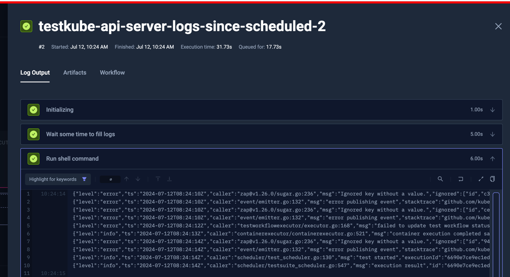

# Capturing Logs from your Application

When troubleshooting your (failed) tests, it can be helpful to have access to the logs of the components
that were actually being tested, as opposed to just the logs of the testing tool itself. For example, if 
you're running API or E2E tests against a microservice-based application, troubleshooting a failed test 
could entail looking into the logs of included services/pods to find correlated stack traces or error messages.

This is easilty achievable with Workflows, here is a simple example that just collects the logs from the Testkube API Server itself:

```yaml 
kind: TestWorkflow
apiVersion: testworkflows.testkube.io/v1
metadata:
  name: testkube-api-server-logs-since-scheduled
spec:
  steps:
  - name: Wait some time to fill logs to simulate tests
    delay: 5s
  - run:
      image: bitnami/kubectl
      shell: |
        kubectl logs -l 'app.kubernetes.io/name=api-server' --since-time {{ shellquote(execution.scheduledAt) }}
```

As you can see, this Workflow simply waits for 5 seconds and then runs 
kubectl to retrieve logs from pods labeled with `app.kubernetes.io/name=api-server` since the Workflow 
was scheduled. 

The output of running this Workflow: 



Not immediately helpful, but this shows how you could potentially collect logs from any component and expose
those in the Testkube Dashboard to help with troubleshooting.

## Using a Workflow Template for log collection

Since this can be useful in any Workflow, let's move this to a WorkflowTemplate that takes the target label
as a configuration parameter and use that from this Workflow instead.

The template:

```yaml
kind: TestWorkflowTemplate
apiVersion: testworkflows.testkube.io/v1
metadata:
  name: fetch-pod-logs
spec:
  config:
    selector:
      type: string
  steps:
  - run:
      image: bitnami/kubectl
      shell: |
        kubectl logs -l {{ shellquote(config.selector) }} --since-time {{ shellquote(execution.scheduledAt) }}
```

and the modified Workflow:

```yaml
kind: TestWorkflow
apiVersion: testworkflows.testkube.io/v1
metadata:
  name: testkube-api-server-logs-since-scheduled
spec:
  steps:
  - name: Wait some time to fill logs to simulate tests
    delay: 5s
  - template:
      name: fetch-pod-logs
      config:
        selector: 'app.kubernetes.io/name=api-server'
```

If you need to collect logs from multiple components, simply use the template multiple times:

```yaml
kind: TestWorkflow
apiVersion: testworkflows.testkube.io/v1
metadata:
  name: multiple-logs-since-scheduled
spec:
  steps:
  - name: Wait some time to fill logs to simulate tests
    delay: 5s
  - name: Get Testkube API Server logs 
    template: 
      name: fetch-pod-logs
      config:
        selector: 'app.kubernetes.io/name=api-server'
  - name: Get Testkube NATS logs  
    template:
      name: fetch-pod-logs
      config:
        selector: 'app.kubernetes.io/name=nats'
```
