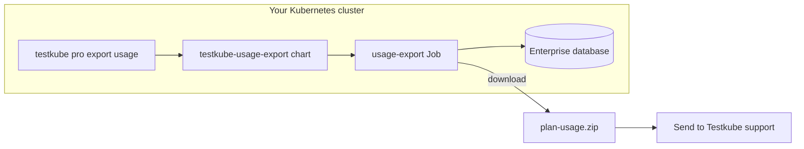

# Offline Usage Export

Generate an encrypted usage report from your on-prem Testkube Enterprise control plane when the online licensing path is not available. The export runs as a one-shot Kubernetes Job, reads your Enterprise database (MongoDB or PostgreSQL), and produces a `.zip` file containing encrypted usage data for license reporting.

:::info Who this is for
This flow targets **on-prem Enterprise installs** with MongoDB or PostgreSQL. Hosted Testkube Cloud organizations use the online licensing path instead — see [Commercial Licensing](/articles/licensing).
:::



## Prerequisites

Before you export usage, confirm the following:

1. [Install the Testkube CLI](/articles/install/cli) on your workstation.
2. Install `kubectl` and `helm` — the export CLI command uses both.
3. Configure `kubectl` for the cluster where Testkube Enterprise runs.
4. Deploy Testkube Enterprise in the target namespace (the control plane API must be running).
5. The export must use the **same** database connection, credentials master password, and enterprise license key as the control plane. When you use the CLI without a values file, these settings are **auto-configured** from your Enterprise deployment — you do not need to supply them manually.
6. Ensure database hostnames resolve **from inside the cluster** (Kubernetes service names, not `localhost` or a laptop port-forward address). Auto-config reads the same in-cluster connection settings the control plane uses.

:::warning In-cluster database URLs
The export Job runs inside the cluster. Connection strings must use in-cluster service names (for example `mongodb://testkube-enterprise-mongodb:27017`), not `localhost`.
:::

## Export with the CLI (recommended)

When Testkube Enterprise is already installed, run:

```bash
testkube pro export usage -n testkube --output ./plan-usage.zip
```

The command:

1. Discovers database and license settings from your Enterprise deployment (when no values file is passed).
2. Installs the standalone `testkube-usage-export` Helm chart as a one-shot Job.
3. Waits for the Job to finish and downloads the zip to `--output`.
4. Removes the Helm release automatically (unless you pass `--keep-release`).
5. Prints next steps.

For custom or air-gapped installs, pass a values file and disable auto-discovery:

```bash
testkube pro export usage \
  -n <namespace> \
  -f <your-values.yaml> \
  --no-auto-config \
  --output ./plan-usage.zip
```

See [Parameters and configuration](#parameters-and-configuration) for all CLI flags and Helm values.

## Manual Helm workflow (optional)

If you prefer Helm directly:

```bash
helm repo add testkubeenterprise https://kubeshop.github.io/testkube-cloud-charts
helm repo update

helm upgrade --install testkube-usage-export testkubeenterprise/testkube-usage-export \
  -n <namespace> --create-namespace \
  -f <your-values.yaml>
```

Then:

1. Watch Job logs until you see `usage export complete`:

   ```bash
   kubectl -n <namespace> logs -f -l app.kubernetes.io/component=usage-export -c usage-export
   ```

2. Copy the zip **while the pod is still Running** (the Job keeps the pod alive briefly after export):

   ```bash
   kubectl -n <namespace> cp <pod>:/output/plan-usage-<name>-<timestamp>.zip ./plan-usage.zip
   ```

3. Uninstall when finished:

   ```bash
   helm uninstall testkube-usage-export -n <namespace>
   ```

## Parameters and configuration

### Configuration rules

Read these before customizing values:

1. **One database backend** — enable MongoDB **or** PostgreSQL, never both. Helm fails at render time if both or neither are enabled.
2. **Match Enterprise** — database DSN, database name, credentials master password, and license key must match the running control plane. The CLI auto-configures these from the control-plane deployment by default; use a values file with `--no-auto-config` only when auto-discovery does not apply.
3. **In-cluster connectivity** — DSNs and hostnames must resolve from inside the export Job pod.
4. **Postgres precedence** — if both `API_POSTGRES_URL` and `API_MONGO_DSN` are set, the export connects to Postgres.
5. **License key required** — the export cannot run without `ENTERPRISE_LICENSE_KEY`. An offline license _file_ mount alone is not enough unless the key is also available as an environment variable or secret.
6. **Secrets over inline values** — inline passwords and license keys in Helm values work for testing; use `secretKeyRef` in production.

### CLI flags

Full reference for `testkube pro export usage`:

| Flag                 | Type          | Default                    | Description                                                                                                  |
| -------------------- | ------------- | -------------------------- | ------------------------------------------------------------------------------------------------------------ |
| `-n`, `--namespace`  | string        | `testkube`                 | Namespace where Testkube Enterprise is installed and where the export Job runs                               |
| `--context`          | string        | current kubeconfig context | Override Kubernetes context                                                                                  |
| `--release`          | string        | `testkube-usage-export`    | Helm release name; also used to label and find the export Job                                                |
| `-f`, `--values`     | string array  | none                       | One or more Helm values files. **Passing any `-f` disables auto-config** unless `--auto-config` is also set  |
| `--no-auto-config`   | bool          | `false`                    | Require explicit `-f` values; do not read settings from the Enterprise deployment                            |
| `--auto-config`      | bool          | `false`                    | Force auto-config even when `-f` is passed (discovered values are merged; CLI `--helm-set` wins on conflict) |
| `--helm-set`         | key=value map | none                       | Extra Helm `--set` overrides (for example `usageExport.weeks=8`, `image.tag=2.12.0`)                         |
| `--helm-arg`         | key=value map | none                       | Pass raw Helm flags (for example `timeout=30m` becomes `--timeout 30m`)                                      |
| `--chart-version`    | string        | latest from repo           | Pin the `testkube-usage-export` chart version                                                                |
| `--chart-path`       | string        | none                       | Local chart directory (air-gapped mirror); skips the remote chart repo                                       |
| `--output`           | string        | basename of remote zip     | Local filesystem path for the downloaded export file                                                         |
| `--timeout`          | duration      | `15m`                      | Maximum time to wait for the Job pod and export completion                                                   |
| `--create-namespace` | bool          | `true`                     | Create the namespace if missing; auto-config sets this to `false`                                            |
| `--keep-release`     | bool          | `false`                    | Do not run `helm uninstall` after download                                                                   |
| `--dry-run`          | bool          | `false`                    | Print Helm and kubectl commands without creating resources                                                   |

#### Auto-config behavior

When no `-f` is passed, the CLI:

- Finds the `testkube-cloud-api` Deployment in the target namespace (by label, then by name).
- Maps control-plane environment variables to Helm `--set` values:
  - **Postgres**: `API_POSTGRES_URL` (literal or secret ref), or component secrets (`DATABASE_USERNAME`, `DATABASE_PASSWORD`, `DATABASE_HOST`, `DATABASE_NAME`)
  - **MongoDB** (if Postgres is not configured): `API_MONGO_DSN`, `API_MONGO_DB`, `API_MONGO_READ_PREFERENCE`
  - **Credentials**: `CREDENTIALS_MASTER_PASSWORD` (secret ref preferred; inline values trigger a warning)
  - **License**: `ENTERPRISE_LICENSE_KEY` (secret ref preferred; inline values trigger a warning)
  - **Custom CA**: `SSL_CERT_DIR` and mounted CA secret (if present on the control plane)
- Prints: `Auto-configured usage export from deployment/<name>`

Use `--no-auto-config` when:

- Enterprise is in a different namespace than expected.
- The control plane uses non-standard environment wiring the CLI cannot map.
- The cluster is air-gapped and cannot reach the public chart repo (use `--chart-path` with a values file).
- Multiple control-plane deployments exist in one namespace.

#### CLI override without a values file

```bash
testkube pro export usage -n testkube \
  --helm-set usageExport.weeks=8 \
  --helm-set image.tag=<your-enterprise-version>
```

### Helm values reference

#### Chart and release

| Value              | Default | Description                             |
| ------------------ | ------- | --------------------------------------- |
| `nameOverride`     | `""`    | Short name override for chart resources |
| `fullnameOverride` | `""`    | Fully qualified resource name override  |

#### Image

| Value              | Default                          | Description                                     |
| ------------------ | -------------------------------- | ----------------------------------------------- |
| `image.registry`   | `docker.io` (when empty)         | Container registry                              |
| `image.repository` | `kubeshop/testkube-usage-export` | Image repository                                |
| `image.tag`        | chart `appVersion`               | Image tag; should match your Enterprise release |
| `image.tagSuffix`  | `""`                             | Appended to tag                                 |
| `image.digest`     | `""`                             | Pull by digest instead of tag                   |
| `image.pullPolicy` | `IfNotPresent`                   | Kubernetes pull policy                          |
| `imagePullSecrets` | `[]`                             | Pull secrets for private registries             |

#### MongoDB (`mongo.enabled: true`)

| Value                  | Required                  | Default              | Description                                          |
| ---------------------- | ------------------------- | -------------------- | ---------------------------------------------------- |
| `mongo.enabled`        | yes (one backend)         | `false`              | Enable MongoDB backend                               |
| `mongo.dsn`            | one of dsn / dsnSecretRef | `""`                 | Full MongoDB connection string                       |
| `mongo.dsnSecretRef`   | one of dsn / dsnSecretRef | `""`                 | Secret containing DSN; chart expects key `MONGO_DSN` |
| `mongo.database`       | no                        | `testkubecloud`      | Database name (`API_MONGO_DB`)                       |
| `mongo.readPreference` | no                        | `secondaryPreferred` | Mongo read preference                                |

#### PostgreSQL (`postgres.enabled: true`)

| Value                            | Required            | Default            | Description                                                            |
| -------------------------------- | ------------------- | ------------------ | ---------------------------------------------------------------------- |
| `postgres.enabled`               | yes (one backend)   | `false`            | Enable PostgreSQL backend                                              |
| `postgres.dsn`                   | one connection mode | `""`               | Full `API_POSTGRES_URL` connection string                              |
| `postgres.dsnSecretRef`          | one connection mode | `""`               | Secret name for full DSN                                               |
| `postgres.dsnSecretKey`          | with dsnSecretRef   | `API_POSTGRES_URL` | Key inside DSN secret                                                  |
| `postgres.secretRef.name`        | component mode      | `""`               | Secret with username, password, and endpoint keys                      |
| `postgres.secretRef.usernameKey` | component mode      | `username`         | Username key in secret                                                 |
| `postgres.secretRef.passwordKey` | component mode      | `password`         | Password key in secret                                                 |
| `postgres.secretRef.endpointKey` | component mode      | `endpoint`         | Host/port key in secret                                                |
| `postgres.username`              | if no usernameKey   | `""`               | Inline username (component mode)                                       |
| `postgres.endpoint`              | if no endpointKey   | `""`               | Inline host (component mode)                                           |
| `postgres.database`              | no                  | `testkubecloud`    | Database name                                                          |
| `postgres.queryParams`           | no                  | `""`               | Query string appended to the built URL (for example `sslmode=require`) |

Component mode builds `API_POSTGRES_URL` inside the pod from separate environment variables — the same pattern as Enterprise.

#### Credentials and license

| Value                                          | Required                    | Default    | Description                                             |
| ---------------------------------------------- | --------------------------- | ---------- | ------------------------------------------------------- |
| `credentials.masterPassword.value`             | one of value / secretKeyRef | `""`       | Inline master password (not recommended for production) |
| `credentials.masterPassword.secretKeyRef.name` | one of value / secretKeyRef | `""`       | Secret containing master password                       |
| `credentials.masterPassword.secretKeyRef.key`  | with secretKeyRef           | `password` | Key inside secret                                       |
| `enterpriseLicenseKey`                         | one of key / secretRef      | `""`       | Inline enterprise license key                           |
| `enterpriseLicenseSecretRef`                   | one of key / secretRef      | `""`       | Secret name; chart reads key `LICENSE_KEY`              |

#### Export options

| Value                          | Default   | Description                                       |
| ------------------------------ | --------- | ------------------------------------------------- |
| `usageExport.weeks`            | `4`       | Weeks of usage history in the export              |
| `usageExport.output.mountPath` | `/output` | Directory inside the pod where the zip is written |

#### TLS / custom CA

For external databases signed by a private CA:

| Value               | Default               | Description                                      |
| ------------------- | --------------------- | ------------------------------------------------ |
| `customCaSecretRef` | `""`                  | Secret containing CA certificate                 |
| `customCaSecretKey` | `ca.crt`              | Key or filename within secret                    |
| `customCaDirPath`   | `/etc/testkube/certs` | Mount path; sets `SSL_CERT_DIR` in the container |

#### Job and pod

| Value                                         | Default | Description                                        |
| --------------------------------------------- | ------- | -------------------------------------------------- |
| `job.ttlSecondsAfterFinished`                 | `86400` | Seconds before Kubernetes deletes the finished Job |
| `job.backoffLimit`                            | `0`     | Job retries (`0` = no retries)                     |
| `job.resources`                               | `{}`    | CPU and memory limits for the export container     |
| `job.annotations`                             | `{}`    | Job metadata annotations                           |
| `podAnnotations`                              | `{}`    | Pod annotations                                    |
| `nodeSelector`                                | `{}`    | Schedule the Job on specific nodes                 |
| `tolerations`                                 | `[]`    | Tolerations for tainted nodes                      |
| `affinity`                                    | `{}`    | Pod affinity or anti-affinity                      |
| `serviceAccount.create`                       | `true`  | Create a dedicated ServiceAccount                  |
| `serviceAccount.name`                         | auto    | Override ServiceAccount name                       |
| `serviceAccount.automountServiceAccountToken` | `false` | API token mount (not needed for export)            |

### Container environment variables

When debugging with `kubectl describe pod`, these are the variables the export binary reads:

| Variable                      | Set by                         | Required        | Description                                           |
| ----------------------------- | ------------------------------ | --------------- | ----------------------------------------------------- |
| `API_POSTGRES_URL`            | postgres values                | one of PG/Mongo | PostgreSQL connection string                          |
| `API_MONGO_DSN`               | mongo values                   | one of PG/Mongo | MongoDB connection string                             |
| `API_MONGO_DB`                | `mongo.database`               | with Mongo      | Mongo database name                                   |
| `API_MONGO_READ_PREFERENCE`   | `mongo.readPreference`         | no              | Mongo read preference                                 |
| `CREDENTIALS_MASTER_PASSWORD` | credentials values             | yes             | Master password for encrypted database fields         |
| `ENTERPRISE_LICENSE_KEY`      | license values                 | yes             | License key; encrypts the export file                 |
| `USAGE_EXPORT_WEEKS`          | `usageExport.weeks`            | no              | Weeks to export (default `4`)                         |
| `USAGE_EXPORT_OUTPUT_DIR`     | `usageExport.output.mountPath` | no              | Output directory (default `/output`)                  |
| `SSL_CERT_DIR`                | `customCaSecretRef`            | no              | Trust custom CA for database TLS                      |
| `POD_NAME` / `POD_NAMESPACE`  | downward API                   | auto            | Enables post-export keepalive for manual `kubectl cp` |

Startup validation errors in pod logs:

| Log / error                                     | Meaning                                    |
| ----------------------------------------------- | ------------------------------------------ |
| `API_POSTGRES_URL or API_MONGO_DSN is required` | No database configured                     |
| `ENTERPRISE_LICENSE_KEY is required`            | License key missing                        |
| `failed to connect to database`                 | DSN wrong or database unreachable from pod |
| `no plans found`                                | Database empty or wrong database name      |
| `failed to resolve canonical plan`              | Plan data missing                          |

### Example values

**PostgreSQL via component secret** (common Enterprise pattern):

```yaml
postgres:
  enabled: true
  secretRef:
    name: my-postgres-credentials
    usernameKey: username
    passwordKey: password
    endpointKey: endpoint
  database: testkubecloud
  queryParams: sslmode=require

credentials:
  masterPassword:
    secretKeyRef:
      name: my-credentials-master
      key: password

enterpriseLicenseSecretRef: my-enterprise-license

usageExport:
  weeks: 4
```

**MongoDB via DSN secret**:

```yaml
mongo:
  enabled: true
  dsnSecretRef: my-mongo-credentials
  database: testkubeEnterpriseDB
  readPreference: secondaryPreferred

credentials:
  masterPassword:
    secretKeyRef:
      name: my-credentials-master
      key: password

enterpriseLicenseSecretRef: my-enterprise-license
```

### Output file

- **Filename pattern**: `plan-usage-<plan-name>-<timestamp>.zip` (written under `/output` in the pod).
- **Contents**: encrypted usage data for license reporting (not human-readable CSV).
- **Handling**: keep the file confidential; treat it like credential material.

## Troubleshooting

### General diagnostics

Replace `<namespace>` with your Enterprise namespace:

```bash
# Job status
kubectl -n <namespace> get jobs -l app.kubernetes.io/component=usage-export

# Pod logs (export binary output)
kubectl -n <namespace> logs -l app.kubernetes.io/component=usage-export -c usage-export

# Pod events
kubectl -n <namespace> describe pod -l app.kubernetes.io/component=usage-export

# Helm release
helm list -n <namespace> | grep usage-export
```

When the CLI command fails, it prints an **Export logs** section from the pod when available.

Successful export logs include:

- `usage export complete` with `outputPath`, `planId`, `weeksExported`, and `sizeBytes`
- `Download: kubectl -n … cp …` (for manual workflows)

### CLI and auto-config errors

| Message / symptom                                                               | Likely cause                                                              | Fix                                                                                                                                                                |
| ------------------------------------------------------------------------------- | ------------------------------------------------------------------------- | ------------------------------------------------------------------------------------------------------------------------------------------------------------------ |
| `Testkube Enterprise cloud-api deployment not found`                            | Wrong `-n`, Enterprise not installed, or RBAC blocks `kubectl get deploy` | Verify `kubectl get deploy -n <namespace> -l app.kubernetes.io/name=testkube-cloud-api`; pass `-f` and `--no-auto-config` if Enterprise uses a non-standard layout |
| `cloud-api has neither postgres nor mongo configuration`                        | Auto-config cannot find database env on control plane                     | Inspect control-plane deployment env; provide a values file with `mongo.enabled` or `postgres.enabled`                                                             |
| `CREDENTIALS_MASTER_PASSWORD not found on cloud-api deployment`                 | Master password not exposed as env on control plane                       | Add to values file under `credentials.masterPassword`                                                                                                              |
| `ENTERPRISE_LICENSE_KEY not found on cloud-api deployment`                      | License only in file mount, not env                                       | Set `enterpriseLicenseKey` or `enterpriseLicenseSecretRef` in values                                                                                               |
| `offline license file installs require ENTERPRISE_LICENSE_KEY for usage export` | `ENTERPRISE_LICENSE_FILE` mount without key env                           | Provide license key via Helm values (see [Advanced Installation — offline license](/articles/install/advanced-install#offline-license))                            |
| `Could not derive usage-export config from cloud-api`                           | Partial or unmapped control-plane env                                     | Use `--no-auto-config` with a complete values file                                                                                                                 |
| `Helm command failed`                                                           | Chart repo unreachable, bad version, or install timeout                   | Add `--chart-version`; use `--helm-arg timeout=30m`; for air-gapped clusters, use `--chart-path`                                                                   |
| `Usage export Job not found`                                                    | Helm install succeeded but Job not created yet, or wrong `--release`      | Check `helm status`; verify release name matches Job labels                                                                                                        |
| `Invalid timeout`                                                               | Malformed `--timeout`                                                     | Use duration syntax: `15m`, `30m`, `1h`                                                                                                                            |

### Helm render and install errors

| Message / symptom                                                                                         | Likely cause                                   | Fix                                                       |
| --------------------------------------------------------------------------------------------------------- | ---------------------------------------------- | --------------------------------------------------------- |
| `Enable exactly one database backend`                                                                     | Neither `mongo.enabled` nor `postgres.enabled` | Set exactly one to `true`                                 |
| `Enable only one database backend … not both`                                                             | Both backends enabled                          | Disable one backend                                       |
| `Mongo configuration missing: provide mongo.dsnSecretRef or mongo.dsn`                                    | Mongo enabled without connection               | Add DSN or secret ref                                     |
| `Postgres configuration missing: provide postgres.secretRef.name, postgres.dsnSecretRef, or postgres.dsn` | Postgres enabled without connection            | Add one of the three Postgres connection modes            |
| `credentials.masterPassword is required`                                                                  | Missing master password in values              | Set `credentials.masterPassword.secretKeyRef` or `.value` |

### Job runtime and export errors

| Message / symptom                                                      | Likely cause                                  | Fix                                                                                                            |
| ---------------------------------------------------------------------- | --------------------------------------------- | -------------------------------------------------------------------------------------------------------------- |
| `invalid configuration: API_POSTGRES_URL or API_MONGO_DSN is required` | Env not injected into pod                     | Fix Helm values; re-run                                                                                        |
| `invalid configuration: ENTERPRISE_LICENSE_KEY is required`            | License not injected                          | Set `enterpriseLicenseKey` or `enterpriseLicenseSecretRef`                                                     |
| `failed to connect to postgres` / `failed to connect to mongo`         | Wrong DSN, network policy, or TLS             | Verify in-cluster hostname; add `customCaSecretRef` for private CA; check NetworkPolicy                        |
| `connect to mongo: … connection refused … localhost:27017`             | DSN points to localhost                       | Replace with in-cluster MongoDB service name                                                                   |
| `lookup <host>: no such host`                                          | Wrong service name or database not in cluster | Align DSN with actual MongoDB or Postgres service ([external MongoDB guide](/articles/mongodb-administration)) |
| `no plans found`                                                       | Wrong database name or fresh/empty install    | Match `mongo.database` / `postgres.database` to Enterprise; confirm plan data exists                           |
| `failed to resolve canonical plan`                                     | Plan record missing in database               | Verify Enterprise has completed initial setup                                                                  |
| Job `Failed`, pod `Error` / `CrashLoopBackOff`                         | Binary exited on validation or database error | Read pod logs (see [General diagnostics](#general-diagnostics))                                                |

### Download and timeout errors

| Message / symptom                                                | Likely cause                                  | Fix                                                                                           |
| ---------------------------------------------------------------- | --------------------------------------------- | --------------------------------------------------------------------------------------------- |
| `Timed out waiting for usage export pod`                         | Job slow to schedule, image pull, or pending  | `kubectl describe job`; check node capacity, image pull, and taints                           |
| `Timed out waiting for usage export`                             | Export or database query exceeded `--timeout` | Increase `--timeout`; check database performance                                              |
| `Failed to stream pod logs`                                      | RBAC or pod not ready                         | Verify `kubectl logs` access; wait and retry                                                  |
| `Usage export did not produce a downloadable zip`                | Job failed before writing output              | Inspect pod logs for binary errors                                                            |
| `Could not locate usage export zip in pod`                       | Export failed or wrong output path            | Check `/output` in pod; verify `usageExport.output.mountPath`                                 |
| `kubectl cp` / `cannot exec into a container in a completed pod` | Manual copy after pod reached Succeeded       | Re-run export; copy while Running, or use the CLI which streams logs and copies automatically |
| `tar: executable file not found` (manual cp only)                | Old image without `tar`                       | Use a current `testkube-usage-export` image tag matching Enterprise                           |

:::tip Post-export keepalive
The export pod stays alive for about **60 seconds** after success to allow manual `kubectl cp`. The CLI copies as soon as `usage export complete` appears in logs.
:::

### Image and registry errors

| Message / symptom                   | Likely cause                                    | Fix                                                                                                   |
| ----------------------------------- | ----------------------------------------------- | ----------------------------------------------------------------------------------------------------- |
| `ImagePullBackOff` / `ErrImagePull` | Tag missing, wrong registry, or no pull access  | Pin `image.tag` to your Enterprise version; configure `imagePullSecrets`; mirror the image internally |
| Wrong or incomplete export data     | Export image version differs from control plane | Align `image.tag` with your Enterprise release ([Image Inventory](/articles/inventory/images))        |

### Common misconfiguration patterns

:::warning Checklist

1. **Port-forward DSN in values** — works on your laptop, fails in the cluster. Use an in-cluster service URL.
2. **Different database than Enterprise** — export connects but returns `no plans found`. Use the same `database` name and DSN as the control plane.
3. **Wrong master password** — export fails reading encrypted credentials. Use the exact same secret as the control plane.
4. **License key mismatch** — export succeeds but Testkube cannot process the file. Use the same key as your Enterprise install; support can confirm which key applies.
5. **Re-running without a new Helm revision** — each `helm upgrade` creates a new Job. For manual Helm, upgrade again to re-run; the CLI handles this automatically.
6. **Leftover release** — from `--keep-release` or a failed CLI run after install. Run `helm uninstall testkube-usage-export -n <namespace>`.
   :::

### When to contact support

If issues persist after checking this guide, gather:

- CLI `--output` path (if any)
- Export pod logs
- Output of `helm list -n <namespace>`
- Enterprise version
- `--timeout` value used

Contact [Testkube support](https://testkube.io/contact) with the encrypted zip and the context above.

## What to do next

1. Confirm the zip was saved to your `--output` path.
2. **Send the file to Testkube support or your account team** for license usage processing. Use [Contact Testkube](https://testkube.io/contact) if you are unsure where to submit it.
3. Store and transmit the file securely; it is tied to your license key.
4. If you used `--keep-release` or manual Helm, clean up: `helm uninstall testkube-usage-export -n <namespace>`.

## Related topics

- [Commercial Licensing](/articles/licensing)
- [Custom Installation](/articles/install/advanced-install)
- [Using an external MongoDB](/articles/mongodb-administration)
- [Testkube Licensing FAQ](/articles/testkube-licensing-FAQ)
- [Image Inventory](/articles/inventory/images)
