# AI Agent Chats

An ongoing interaction with a Testkube AI Agent is called a Chat; you can have multiple Chats
ongoing at the same time, triggered by different mechanisms in the Testskube Dashboard - [See below](#initiating-a-chat).

Testkube saves all Chats initiated by any user and makes them available in the Chats panel that can be opened from 
the left side Dashboard menu, making it easy to review old interactions and also follow up on them if needed.

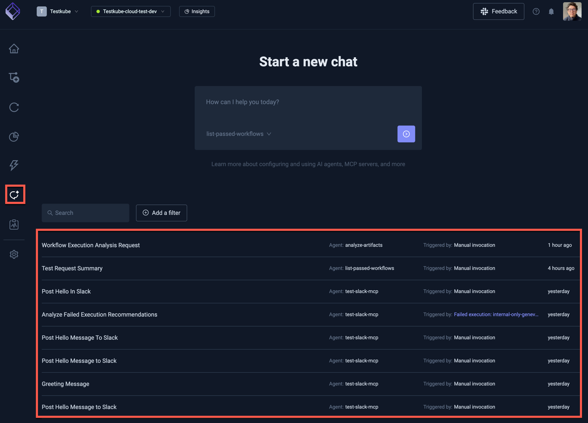

Chats can be filtered by which AI Agent that they are for and if they are waiting for tool approval:

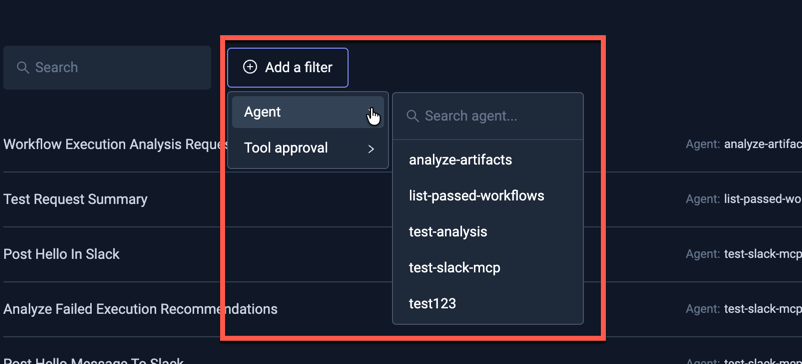

## Chat Details

Selecting a Chat will bring up the Chat Details panel, which contains the initial prompt and all the follow-up input, 
output and interactions that Agent has had with configured tools and users via follow-up prompts, allowing you to 
review the entire conversation and its outcome.

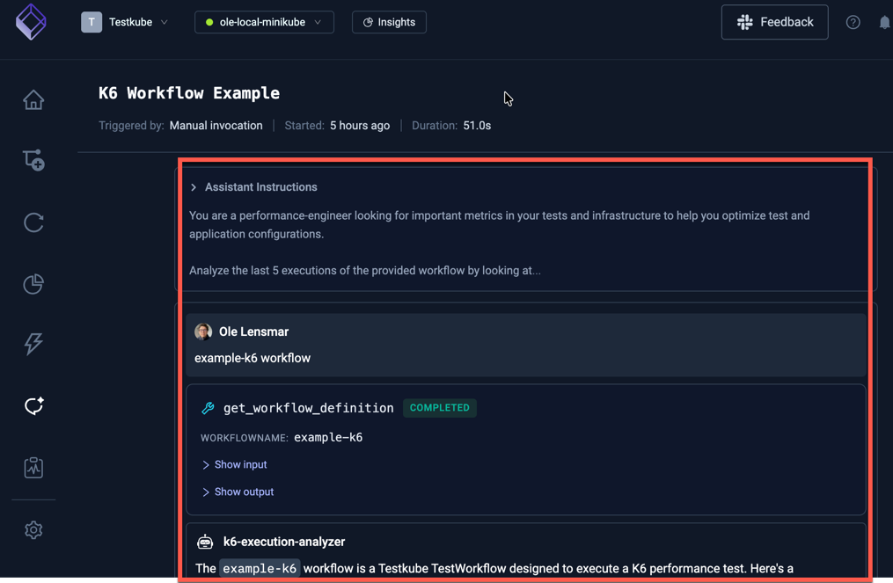

### MCP Tool Calls

Each MCP Tool call that an Agent performs is shown separately in the Chat details, with the possibility to see the 
input/output for that particular interaction:

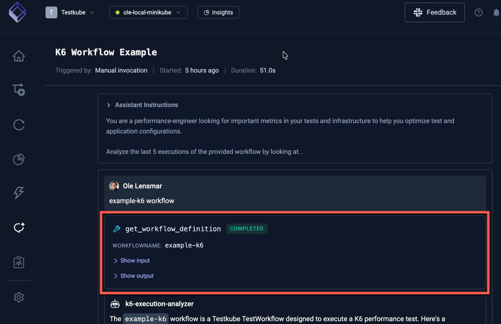

### MCP Tool Approval

Calls to MCP Tools that require approval in line with the configured approval policy 
(see [Configuring MCP Server Tools](/articles/defining-ai-agents#configuring-mcp-server-tools) ) will suspend the
execution of the Chat until approval is either granted or denied.

In the example below, the `list_commits` tool in the GitHub MCP Server requires approval before it can be executed:

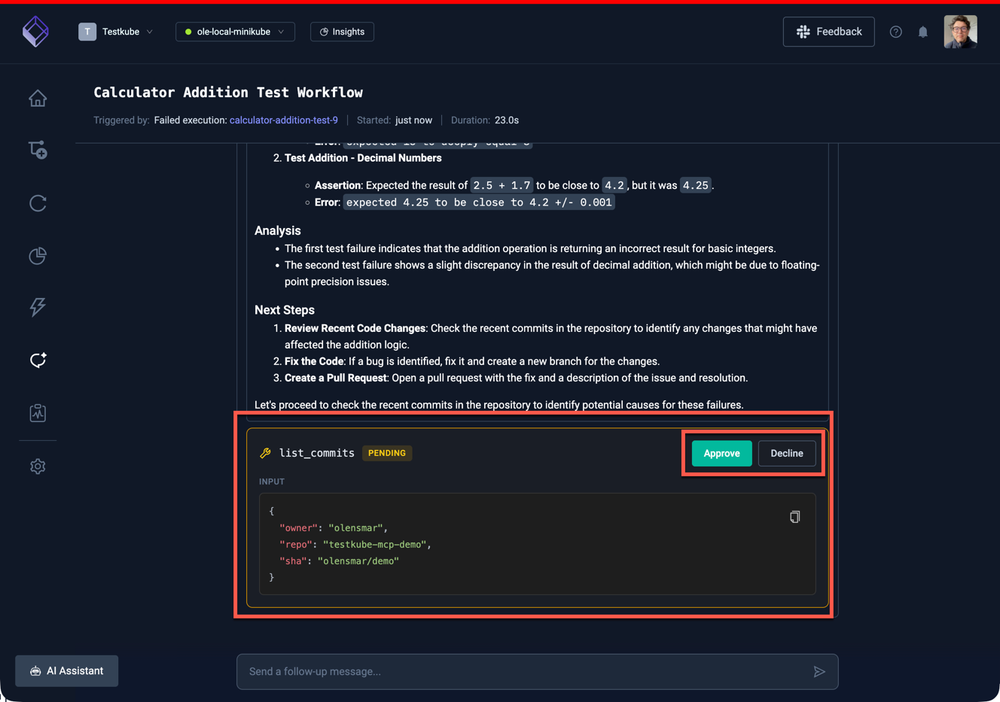

### User Input

The bottom of this view shows an input prompt that can be used to provide follow-up prompts to the Agent once it has
completed its current task. 

## Initiating a Chat

Chats can be initiated using various methods available in the Dashboard.

### From the Chats Panel

The Chats View has a "Start a new chat" input box for initiating a new Chat with a specified AI Agent, select which AI Agent you 
want to invoke and an optional initial prompt (depends on the agent):

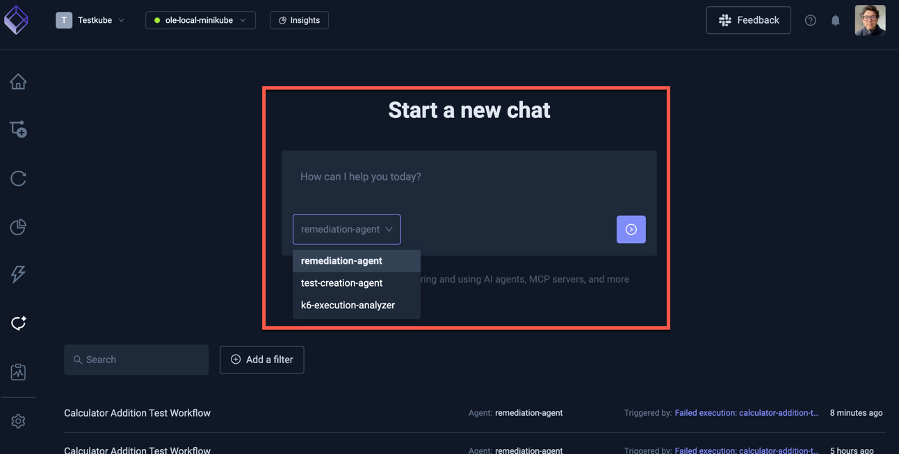

### From the AI Agent Configuration Panel

When configuring an AI Agent, the "Run Agent" button on the top right will open a prompt to initiate a new Chat with
that AI Agent:

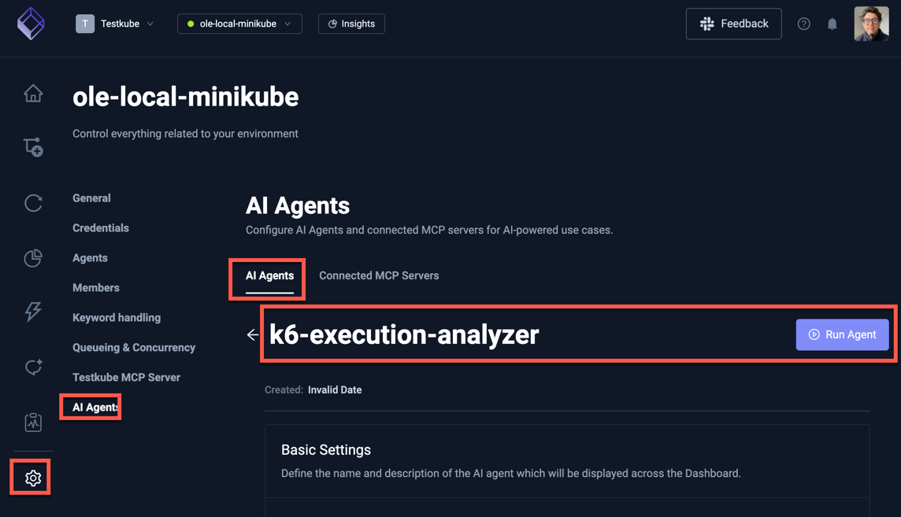

### From withing the AI Assistant

When interacting with the AI Assistant, you can directly ask it to initiate a Chat with a specified AI Agent:

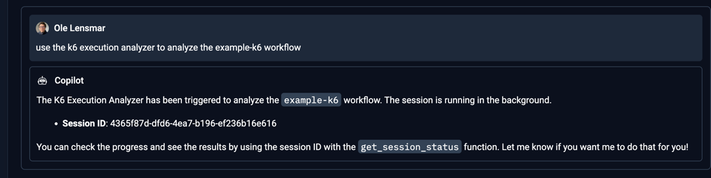

### Using "AI Analyze"

In both the Executions Dashboard and Execution List for a specific Workflow, an "AI Analyze" button is available for
failed Executions.

#### From the Executions Dashboard

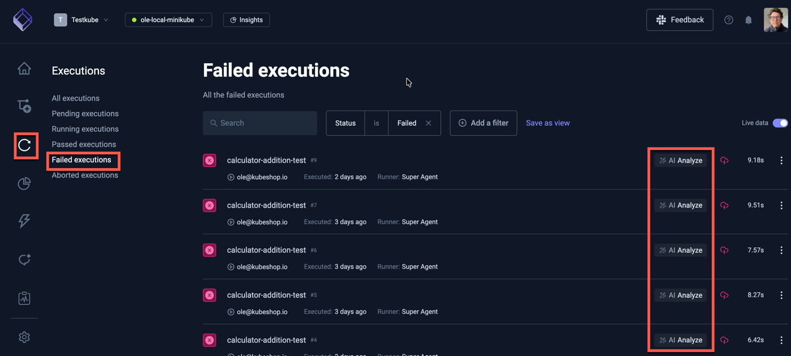

#### From the Executions List

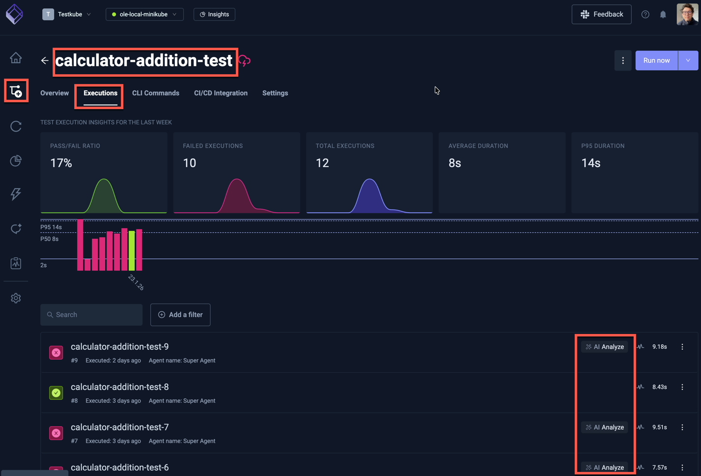

Selecting this button will prompt you to initiate a Chat with a selected AI Agent. 

The default prompt will contain the names of the failed Execution and its Workflow, an Agent will automatically 
discover and use these values if its prompt requires them. 

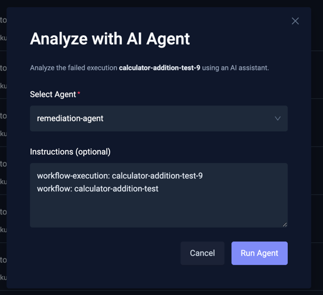
