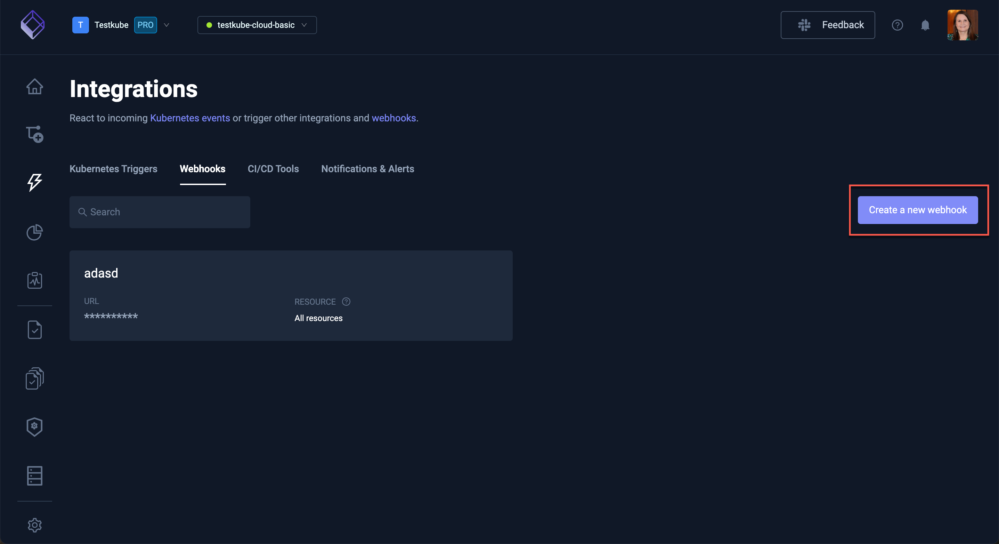
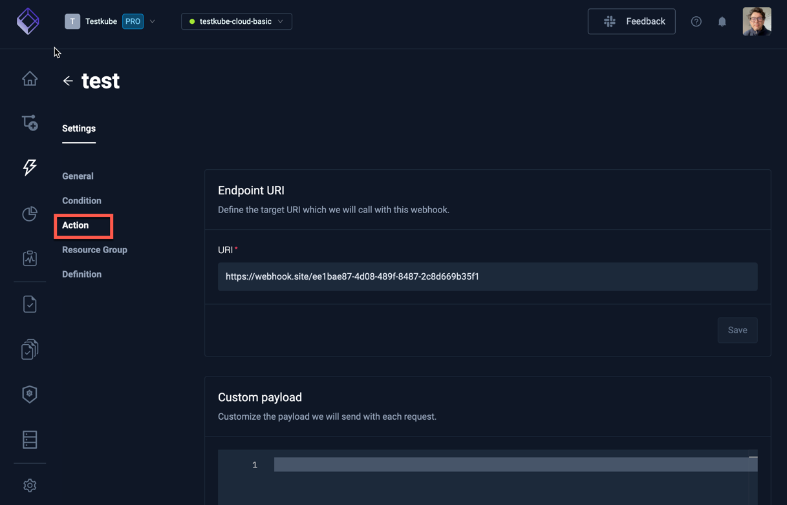

import Tabs from "@theme/Tabs";
import TabItem from "@theme/TabItem";

# Webhooks

Webhooks allow you to integrate Testkube with external systems by sending HTTP POST payloads containing information about Testkube executions and their current state when specific events occur. To set up webhooks in Testkube, you'll need to have an HTTPS endpoint to receive the events and a payload template to be sent along with the data.

:::note
Please visit our Blog, [Empowering Kubernetes Tests with Webhooks](https://testkube.io/blog/empowering-kubernetes-tests-with-webhooks) for a tutorial on setting up webhooks for Slack and Grafana Dashboard.
:::

## Benefits of using Webhooks in Testkube

Testkube uses webhooks to integrate with external systems, allowing you to effortlessly synchronize your testing workflows with other tools and platforms. These webhooks are designed to carry critical information regarding your tests as HTTP POST payloads. The information can include the execution and real-time status depending on how you configure it.

To leverage webhooks, you need to ensure that the platform that you want to send information to has an HTTPS endpoint to receive the events. Testkube also allows you to customize the payloads.

You can create a webhook from the dashboard, use the CLI, or create it as a custom resource. Before we show how it’s done, let’s understand a few scenarios where Webhooks in Testkube shine:

- **Incident Management & Response**: Webhooks can be used to create incidents and alert on-call teams when a critical test fails. This ensures a timely response and avoids any potential disruption due to failures and bugs. With Testkube, you can configure incident management tools like PagerDuty and OpsGenie to receive alerts based on critical events for your tests.

- **Communication and Collaboration**: You can configure Webhooks in Testkube to send alerts to your teams in your communication tool. This will notify your team of any critical event that needs attention and attend to it before the issue escalates. Some of the popular communications tools like Slack and MS Teams can be configured to receive alerts from Testkube.

- **Monitoring and Observability**: Webhooks can also be used to send alerts and notifications to your monitoring and observability tools like Prometheus and Grafana. This provides visibility into your tests, alerts you, and ensures that timely corrective actions can be taken.

## Creating a Webhook

The webhook can be created using the Dashboard, CLI, or a Custom Resource.

<Tabs>
<TabItem value="dash" label="Dashboard">
The Testkube Dashboard allows you to create Webhooks interactively from the Integrations / Webhooks tab - [Read More](/articles/integrations-webhooks#creating-a-new-webhook):

  
</TabItem>

<TabItem value="cli" label="CLI">
Webhooks can be created with Testkube CLI using the `create webhook` command.

```sh
testkube create webhook --name example-webhook --events start-testworkflow --events end-testworkflow-success --events end-testworkflow-failed --uri <YOUR_ENDPOINT_URL>
```

- `--name` - Your webhook name (in this case `example-webhook`).
- `--events` - Event that will trigger a webhook. Multiple `--events` can be defined (in this case `--events start-testworkflow --events end-testworkflow-success --events end-testworkflow-failed`). All available trigger events can be found in the [Supported Event types](#supported-event-types) section.
- `--uri` - The HTTPS endpoint where you want to receive the webhook events.

</TabItem>

<TabItem value="crd" label="Custom Resource">

```yaml title="webhook.yaml"
apiVersion: executor.testkube.io/v1
kind: Webhook
metadata:
  name: example-webhook
  namespace: testkube
spec:
  uri: <YOUR_ENDPOINT_URL>
  events:
    - start-testworkflow
    - end-testworkflow-success
    - end-testworkflow-failed
  selector: ""
```

Where `<YOUR_ENDPOINT_URL>` should be replaced with the HTTPS endpoint URL where you want to receive the webhook events.

And then apply with:

```sh
kubectl apply -f webhook.yaml
```

</TabItem>

</Tabs>

### Resource Selector (labels)

In order to limit webhook triggers to a specific resource, or resources, the Resource Selector can be used. It allows you to select the specific resource by label, or labels.

<Tabs>
<TabItem value="dash" label="Dashboard">

In the Dashboard - [Read More](/articles/integrations-webhooks#condition).


</TabItem>

<TabItem value="cli" label="CLI">

The Resource Selector can be set with `--selector`.
For example, `--selector test-type=postman-collection` will limit the resources to the postman tests (label: `test-type=postman-collection`)

</TabItem>

<TabItem value="crd" label="Custom Resource">

```yaml
spec:
  selector: test-type=postman-collection
```

So, the complete definition may look like this:

```yaml title="webhook.yaml"
apiVersion: executor.testkube.io/v1
kind: Webhook
metadata:
  name: example-webhook
  namespace: testkube
spec:
  uri: <YOUR_ENDPOINT_URL>
  events:
    - start-testworkflow
    - end-testworkflow-success
    - end-testworkflow-failed
  selector: test-type=postman-collection
```

</TabItem>
</Tabs>

### Webhook Payload

Webhook payload can be configured - in this example, `event id`:

```
{"text": "event id {{ .Id }}"}
```

<Tabs>
<TabItem value="dash" label="Dashboard">
When you have selected an existing Webhook, its payload can be configured in Webhook Settings/Action tab - [Read More](/articles/integrations-webhooks#action--payload)

  

</TabItem>

<TabItem value="cli" label="CLI">
Create a webhook payload template file:

```json title="template.json"
{
  "text": "event id {{ .Id }}"
}
```

And set it with `--payload-template template.json`.

```sh
testkube create webhook --name example-webhook --events start-testworkflow --events end-testworkflow-passed --events end-testworkflow-failed --payload-template template.json --uri <YOUR_ENDPOINT_URL>
```

Where `<YOUR_ENDPOINT_URL>` should be replaced with the HTTPS endpoint URL where you want to receive the webhook events.

```sh title="Expected output:"
Webhook created example-webhook 🥇
```

</TabItem>

<TabItem value="crd" label="Custom Resource">

Payload template can be configured with `spec.payloadTemplate`.

```
  payloadTemplate: |
    {"text": "event id {{ .Id }}"}
```

Example:

```
apiVersion: executor.testkube.io/v1
kind: Webhook
metadata:
  name: example-webhook
  namespace: testkube
spec:
  uri: <YOUR_ENDPOINT_URL>
  events:
    - start-testworkflow
    - end-testworkflow-success
    - end-testworkflow-failed
  selector: ""
  payloadObjectField: ""
  payloadTemplate: |
    {"text": "event id {{ .Id }}"}
```

</TabItem>

</Tabs>

### Webhook Payload Variables

Webhook payload can contain **event-specific** variables - they will be replaced with actual data when the events occurs. In the above examples, only the event `Id` is being sent.
However, any of these [supported Event Variables](#supported-event-variables) can be used.

For example, the following payload:

```json
{"text": "Event {{ .Type_ }} - Test '{{ .TestWorkflowExecution.TestName }}' execution ({{ .TestWorkflowExecution.Number }}) finished with '{{ .TestWorkflowExecution.ExecutionResult.Status }}' status"}
```

will result in:

```json
{"text": "Event end-testworkflow-success - Test 'postman-executor-smoke' execution (948) finished with 'passed' status"}
```

### Helper methods

We also provide special helper methods to use in the webhook template:
- `testworkflowstatustostring` is the method to convert a pointer to a test workflow status to a string type.

Usage example:

```yaml
  - name: TEXT_COLOUR
    value: {{ if eq (.TestWorkflowExecution.Result.Status | testworkflowstatustostring ) "passed" }}"00FF00"{{ else }}"FF0000"{{ end }}
```

You can use Sprig golang template functions if you need to have some special logic in your templates.
You can find a full list of them [here](https://masterminds.github.io/sprig/)

#### Using API Server Environment Variables in Webhooks

In addition to event-specific variables, it's possible to use environment variables from the Testkube API server in your webhook payloads and configurations.
This feature is particularly useful for including sensitive information like API keys or URIs without exposing them in your webhook definitions.

##### Configuring API Server Environment Variables

To set up extra environment variables for the API Server, you can use the `testkube-api.extraEnvVars` field in your Helm chart configuration.
This allows you to define environment variables, including those that reference Kubernetes secrets:

```yaml
testkube-api:
  extraEnvVars:
    - name: "SLACK_WEBHOOK_URI"
      valueFrom:
        secretKeyRef:
          name: my-secret
          key: slack-uri
```

##### Using Environment Variables in Webhook Payloads

Once configured, you can access these environment variables in your webhook payload templates using the `.Envs` object:

```
{{ index .Envs "SLACK_WEBHOOK_URI" }}
```

For example:

```sh title="template.txt"
TESTKUBE_PRO_URL: {{ index .Envs "TESTKUBE_PRO_URL" }}
```

#### Using Environment Variables in Webhook URIs

You can also use environment variables to set the webhook URI itself, allowing you to keep sensitive URIs out of your version control:

```yaml
apiVersion: executor.testkube.io/v1
kind: Webhook
metadata:
  name: slack-notification
  namespace: testkube
spec:
  # ...
  uri: '{{ index .Envs "SLACK_WEBHOOK_URI" }}'
  # ...
```

:::info
Make sure to double-escape brackets when specifying values that themselves specify template syntax.
:::

#### Using Config and Parameters to specify Webhook variables

If you want to specify variables to use inside of Webhook fields, you can specify `config` section.
They can be defined in the Webhook specification or taken from the Kubernetes secret.
You can reference them using builtin `Config` dictionary and golang template expression:

```yaml
apiVersion: executor.testkube.io/v1
kind: Webhook
metadata:
  name: webhook-jira
  namespace: testkube
spec:
  config:
    priority:
      value: "5"
    token:
      secret:
        name: somevars
        key: apitoken
  events:
  - end-testworkflow-success
  uri: https://webhook.site
  payloadTemplate: "Priority: {{ index .Config "priority" }}"
  headers:
    Authorization: "Basic {{ index .Config \"token\" }}"
```

If you want to validate your config variables before executing a webhook, you can specify `parameters` section.

```yaml
spec:
  parameters:
    - name: priority
      description: priority id variable
      required: false
      example: "3"
      default: "3"
      pattern: "^[0-9]*$"
```

### URI and HTTP Headers

You can add additional HTTP headers like `Authorization` or `x-api-key` to have a secret token.
It's possible to use a Golang based template string as the header or URI value.

<Tabs>
<TabItem value="dash" label="Dashboard">

Webhook headers can be configured in Webhook Settings->Action.


</TabItem>

<TabItem value="cli" label="CLI">
Custom headers can be set using `--header` - for example:

`--header X-Token="12345"`

</TabItem>

<TabItem value="crd" label="Custom Resource">

```yaml
spec:
  headers:
    X-Token: "12345"
```

```yaml title="webhook.yaml"
apiVersion: executor.testkube.io/v1
kind: Webhook
metadata:
  name: example-webhook
  namespace: testkube
spec:
  uri: <YOUR_ENDPOINT_URL>
  events:
    - start-testworkflow
    - end-testworkflow-success
    - end-testworkflow-failed
  selector: ""
  headers:
    X-Token: "12345"
```

</TabItem>
</Tabs>

## Supported Event types

Webhooks can be triggered on any of the following events:

### Workflow Events

- queue-testworkflow
- start-testworkflow
- end-testworkflow-success
- end-testworkflow-failed
- end-testworkflow-aborted
- end-testworkflow-canceled
- end-testworkflow-not-passed

### Create/Update/Delete Events

- created
- updated
- deleted

They can be triggered by the following resources:

- testworkflow
- trigger
- webhook

### Events for State Changes

It is possible to get notified by webhooks only when the latest execution's outcome differs from the previous one. This way you can see instantly when one of your scheduled tests was healed or when they got broken. It could also help prevent alert fatigue by deduplicating the alerts and therefore decreasing the load on your monitoring systems.
Testkube supports special webhook event types to track changes between current and previous execution states.

For Test Workflows:

- become-testworkflow-up (from any error state to succeed one)
- become-testworkflow-down (from succeed state to any error one)
- become-testworkflow-failed (from any state to failed one)
- become-testworkflow-aborted (from any state to aborted one)

## Supported Event Variables

### Event-specific variables

- `Id` - event ID (for example, `2a20c7da-3b77-4ea9-a33d-403187d3e9e6`)
- `Resource`
- `ResourceId`
- `Type_` - event Type (for example, `start-testworkflow`, `end-testworkflow-success`, etc. All available trigger events can be found in the [Supported Event types](#supported-event-types) section).
- `TestWorkflowExecution` - Test Workflow execution details (example: [TestWorkflowExecution](#testworkflowexecution) section)
- `ClusterName` - cluster name
- `Envs` (API-server ENV variables) - list of Testkube API-Server ENV variables

The full Event Data Model can be found [here](https://github.com/kubeshop/testkube/blob/main/pkg/api/v1/testkube/model_event.go).

### TestWorkflowExecution

- `Id` - TestWorkflowExecution ID (for example, `64f8d5b2712890925aea51dc`)
- `Name` - TestWorkflow execution name (for example, `wf-postman-smoke-tests-1`)
- `Namepace` - TestWorkflowExecution namespace (for example, `my-testkube`)
- `Number` - TestWorkflowExecution sequence number
- `ScheduledAt` - TestWorkflow scheduled time (for example, `2023-09-06 19:23:34.543433547 +0000 UTC`)
- `StatusAt` - Time when the execution result's status has changed last time (for example, `2023-09-06 19:23:42.221493031 +0000 UTC`)
- `Signature` - Structured tree of TestWorkflow steps
- `Result` - TestWorkflow execution result
- `Output` - Additional information from the steps, like referenced executed tests or artifacts
- `Reports` - TestWorklow reports generated from the steps, like junit
- `Workflow` - TestWorkflow definition
- `ResolvedWorkflow` - TestWorkflow definition with resolved fields

The full TestWorkflowExecution data model can be found [here](https://github.com/kubeshop/testkube/blob/main/pkg/api/v1/testkube/model_test_workflow_execution.go).

#### TestWorkflow for TestWorkflowExecution Workflow and ResolvedWorkflow fields

- `Workflow.Name` - TestWorkflow name (for example, `wf-postman-smoke-tests`)
- `Workflow.Description` - TestWorkflow description (for example, `postman smoke tests to run after application deployment`)

The full TestWorkflow data model can be found [here](https://github.com/kubeshop/testkube/blob/main/pkg/api/v1/testkube/model_test_workflow.go).

#### TestWorkflowResult for TestWorkflowExecution Result field

- `Result.FinishedAt` - TestWorkflow execution finished time(for example, `2024-11-15 11:24:37.129 +0000 UTC`)
- `Result.Duration` - TestWorkflow execution duration (for example, `8.504s`)
- `Result.Status` - TestWorkflow execution status (for example, `passed`)

The full TestWorkflowResult data model can be found [here](https://github.com/kubeshop/testkube/blob/main/pkg/api/v1/testkube/model_test_workflow_result.go).

### Additional Top-level Variables

- `ExecutionCommand` - The CLI command to access the execution (example: `kubectl testkube get execution 6679893e3b11f4e4900e17a5`).
- `ExecutionURL` - The Dashboard URL to look at the execution (example: `https://app.testkube.io/organization/tkcorg_9deb42dda2197657/environment/tkcenv_1145999f3c4d1115/dashboard/tests/git-zap-api-test/executions/6679893e3b11f4e4900e17a5`).
- `ArtifactCommand` - The CLI command to access the artifacts (example: `kubectl testkube get artifacts 6679893e3b11f4e4900e17a5`).
- `ArtifactURL` - The Dashboard URL to look at the artifacts directly (example: `https://app.testkube.io/organization/tkcorg_9deb42dda2197657/environment/tkcenv_1145999f3c4d1115/dashboard/tests/git-zap-api-test/executions/6679893e3b11f4e4900e17a5/artifacts`).
- `LogsCommand` - The CLI command to access the logs (example: `kubectl testkube get execution 6679893e3b11f4e4900e17a5 --logs-only`).
- `LogsURL` - The Dashboard URL to look at the logs (example: `https://app.testkube.io/organization/tkcorg_9deb42dda2197657/environment/tkcenv_1145999f3c4d1115/dashboard/tests/git-zap-api-test/executions/6679893e3b11f4e4900e17a5/log-output`).

Make sure that the value `testkube-api.dashboardUri` in the helm-charts is set to `app.testkube.io`, or your remote Dashboard URL, so that the variables above can be populated with the correct values.

### Payload Example

Here is Webhook JSON payload example

```json
{
  "id": "2e2ffe66-0f13-4f0f-9fa3-1036e47916ba",
  "resource": "testworkflowexecution",
  "resourceId": "6835aabaecd4e4a1447e0287",
  "type": "end-testworkflow-success",
  "testWorkflowExecution": {
    "id": "6835aabaecd4e4a1447e0287",
    "groupId": "6835aabaecd4e4a1447e0287",
    "runnerId": "tkcroot_6fdb6bedebc61297",
    "runnerTarget": {},
    "runnerOriginalTarget": {},
    "name": "pytest-workflow-smoke-junit-success-only-133",
    "number": 133,
    "scheduledAt": "2025-05-27T12:06:18.446Z",
    "assignedAt": "2025-05-27T12:06:18.474Z",
    "statusAt": "2025-05-27T12:06:45.690926889Z",
    "signature": [
      {
        "ref": "rvcjww5",
        "category": "Clone Git repository"
      },
      {
        "ref": "rvc7j59",
        "name": "Run test",
        "children": [
          {
            "ref": "r4kzlmb",
            "category": "Run shell command"
          },
          {
            "ref": "r2v48sd",
            "category": "Upload artifacts"
          }
        ]
      }
    ],
    "result": {
      "status": "passed",
      "predictedStatus": "passed",
      "queuedAt": "2025-05-27T12:06:18.446Z",
      "startedAt": "2025-05-27T12:06:18.446Z",
      "finishedAt": "2025-05-27T12:06:45.690926889Z",
      "duration": "27.245s",
      "totalDuration": "27.245s",
      "durationMs": 27244,
      "pausedMs": 0,
      "totalDurationMs": 27244,
      "initialization": {
        "status": "passed",
        "queuedAt": "2025-05-27T12:06:18.446Z",
        "startedAt": "2025-05-27T12:06:19.371727926Z",
        "finishedAt": "2025-05-27T12:06:20.238548057Z"
      },
      "steps": {
        "r2v48sd": {
          "status": "passed",
          "queuedAt": "2025-05-27T12:06:45.448914778Z",
          "startedAt": "2025-05-27T12:06:45.449040908Z",
          "finishedAt": "2025-05-27T12:06:45.690926889Z"
        },
        "r4kzlmb": {
          "status": "passed",
          "queuedAt": "2025-05-27T12:06:21.188826191Z",
          "startedAt": "2025-05-27T12:06:23.730489947Z",
          "finishedAt": "2025-05-27T12:06:45.448914778Z"
        },
        "rvc7j59": {
          "status": "passed",
          "queuedAt": "2025-05-27T12:06:21.188826191Z",
          "startedAt": "2025-05-27T12:06:21.188848491Z",
          "finishedAt": "2025-05-27T12:06:45.690926889Z"
        },
        "rvcjww5": {
          "status": "passed",
          "queuedAt": "2025-05-27T12:06:20.238548057Z",
          "startedAt": "2025-05-27T12:06:20.239657977Z",
          "finishedAt": "2025-05-27T12:06:21.188826191Z"
        }
      }
    },
    "output": [
      {
        "ref": "tktw-init",
        "name": "pod",
        "value": {
          "agent": "0.0.0-SNAPSHOT-a467e28",
          "init": "",
          "name": "6835aabaecd4e4a1447e0287-zhfjg",
          "namespace": "enterprise-sandbox-webhook",
          "nodeName": "gke-testkube-cloud-edg-spot-node-pool-66738c92-hblm",
          "serviceAccountName": "testkube-api-server-tests-job",
          "toolkit": ""
        }
      }
    ],
    "reports": [
      {
        "ref": "r2v48sd",
        "kind": "junit",
        "file": "artifacts/pytest-report.xml",
        "summary": {
          "tests": 9,
          "passed": 9,
          "duration": 16009
        }
      }
    ],
    "workflow": {
      "name": "pytest-workflow-smoke-junit-success-only",
      "namespace": "enterprise-sandbox-webhook",
      "labels": {
        "argocd.argoproj.io/instance": "webhook-testkube-agent",
        "core-tests": "workflows",
        "tool": "pytest"
      },
      "annotations": {
        "kubectl.kubernetes.io/last-applied-configuration": "{\"apiVersion\":\"testworkflows.testkube.io/v1\",\"kind\":\"TestWorkflow\",\"metadata\":{\"annotations\":{},\"labels\":{\"argocd.argoproj.io/instance\":\"webhook-testkube-agent\",\"core-tests\":\"workflows\",\"tool\":\"pytest\"},\"name\":\"pytest-workflow-smoke-junit-success-only\",\"namespace\":\"enterprise-sandbox-webhook\"},\"spec\":{\"container\":{\"image\":\"python:3.12.6-alpine3.20\",\"resources\":{\"requests\":{\"cpu\":\"256m\",\"memory\":\"256Mi\"}},\"workingDir\":\"/data/repo/test/pytest/pytest-project\"},\"content\":{\"git\":{\"paths\":[\"test/pytest/pytest-project\"],\"revision\":\"main\",\"uri\":\"https://github.com/kubeshop/testkube\"}},\"job\":{\"activeDeadlineSeconds\":180},\"steps\":[{\"artifacts\":{\"paths\":[\"/data/artifacts/**\"]},\"name\":\"Run test\",\"shell\":\"pip install -r requirements.txt\\nmkdir /data/artifacts\\npytest tests/success --junit-xml=/data/artifacts/pytest-report.xml\\n\"}]}}\n"
      },
      "created": "2025-05-16T10:21:45Z",
      "updated": "2025-05-16T10:21:45Z",
      "spec": {
        "content": {
          "git": {
            "uri": "https://github.com/kubeshop/testkube",
            "revision": "main",
            "paths": [
              "test/pytest/pytest-project"
            ]
          }
        },
        "container": {
          "workingDir": {
            "value": "/data/repo/test/pytest/pytest-project"
          },
          "image": "python:3.12.6-alpine3.20",
          "resources": {
            "requests": {
              "cpu": "256m",
              "memory": "256Mi"
            }
          }
        },
        "job": {
          "activeDeadlineSeconds": {
            "value": 180
          }
        },
        "steps": [
          {
            "name": "Run test",
            "shell": "pip install -r requirements.txt\nmkdir /data/artifacts\npytest tests/success --junit-xml=/data/artifacts/pytest-report.xml\n",
            "artifacts": {
              "paths": [
                "/data/artifacts/**"
              ]
            }
          }
        ]
      }
    },
    "resolvedWorkflow": {
      "name": "pytest-workflow-smoke-junit-success-only",
      "namespace": "enterprise-sandbox-webhook",
      "labels": {
        "argocd.argoproj.io/instance": "webhook-testkube-agent",
        "core-tests": "workflows",
        "tool": "pytest"
      },
      "annotations": {
        "kubectl.kubernetes.io/last-applied-configuration": "{\"apiVersion\":\"testworkflows.testkube.io/v1\",\"kind\":\"TestWorkflow\",\"metadata\":{\"annotations\":{},\"labels\":{\"argocd.argoproj.io/instance\":\"webhook-testkube-agent\",\"core-tests\":\"workflows\",\"tool\":\"pytest\"},\"name\":\"pytest-workflow-smoke-junit-success-only\",\"namespace\":\"enterprise-sandbox-webhook\"},\"spec\":{\"container\":{\"image\":\"python:3.12.6-alpine3.20\",\"resources\":{\"requests\":{\"cpu\":\"256m\",\"memory\":\"256Mi\"}},\"workingDir\":\"/data/repo/test/pytest/pytest-project\"},\"content\":{\"git\":{\"paths\":[\"test/pytest/pytest-project\"],\"revision\":\"main\",\"uri\":\"https://github.com/kubeshop/testkube\"}},\"job\":{\"activeDeadlineSeconds\":180},\"steps\":[{\"artifacts\":{\"paths\":[\"/data/artifacts/**\"]},\"name\":\"Run test\",\"shell\":\"pip install -r requirements.txt\\nmkdir /data/artifacts\\npytest tests/success --junit-xml=/data/artifacts/pytest-report.xml\\n\"}]}}\n"
      },
      "created": "2025-05-16T10:21:45Z",
      "updated": "2025-05-16T10:21:45Z",
      "spec": {
        "content": {
          "git": {
            "uri": "https://github.com/kubeshop/testkube",
            "revision": "main",
            "paths": [
              "test/pytest/pytest-project"
            ]
          }
        },
        "container": {
          "workingDir": {
            "value": "/data/repo/test/pytest/pytest-project"
          },
          "image": "python:3.12.6-alpine3.20",
          "resources": {
            "requests": {
              "cpu": "256m",
              "memory": "256Mi"
            }
          }
        },
        "job": {
          "activeDeadlineSeconds": {
            "value": 180
          }
        },
        "steps": [
          {
            "name": "Run test",
            "shell": "pip install -r requirements.txt\nmkdir /data/artifacts\npytest tests/success --junit-xml=/data/artifacts/pytest-report.xml\n",
            "artifacts": {
              "paths": [
                "/data/artifacts/**"
              ]
            }
          }
        ]
      }
    },
    "runningContext": {
      "interface": {
        "type": "ui"
      },
      "actor": {
        "name": "admin@example.com",
        "email": "admin@example.com",
        "executionReference": "6835910fecd4e4a1447e023f",
        "type": "user"
      }
    }
  },
  "external": true
}
```

## Webhook templates

In order to re-use the Webhook specification, you can define a special Testkube resource - WebhookTemplate.
It contains all the same fields as the Webhook resource, except `webhookTemplateRef` one, which is used for referencing a template in the webhook.
WebhookTemplate can be used only as a part of the calling Webhook. Its content is merged into the Webhook specification.

:::tip
Check out the [JIRA Integration](jira-integration) document for a complete example of how to use WebhookTemplates with your Webhooks.
:::

### Simple WebhookTemplate example

Here is a simple WebhookTemplate

```yaml
apiVersion: executor.testkube.io/v1
kind: WebhookTemplate
metadata:
  name: example-template
  namespace: testkube
spec:
  events:
  - end-testworkflow-success
  uri: https://webhook.site
```

And here comes a Webhook that uses ´webhookTemplateRef´ to refer to this template.

```yaml
apiVersion: executor.testkube.io/v1
kind: Webhook
metadata:
  name: example-webhook
  namespace: testkube
spec:
  webhookTemplateRef:
    name: example-template
```

### Managing WebhookTemplate Resources

Testkube WebhookTemplates are CRDs that must be created in the same Kubernetes namespace where your Testkube agent is running. While the Testkube dashboard does not expose these resources for management, you can access the corresponding Kubernetes namespace and work with them directly, there. Below are some commands for working with WebhookTemplate resources.

- List existents: `kubectl get webhooktemplates -n <namespace>`
- Create new: `kubectl apply -f <webhook-template-manifest-file>.yaml -n <namespace>`
- Edit one: `kubectl edit webhooktemplates <name-of-webhook-template> -n <namespace>`
- Delete: `kubectl delete webhooktemplates <name-of-webhook-template> -n <namespace>`

## Testing Webhooks

If you are just getting started and want to test your webhook configuration, you can use public and free services that act as HTTP catch-all apps. Here are a couple of options:

1. [Beeceptor](https://beeceptor.com/): Beeceptor allows you to quickly capture HTTP payloads, review them in real time, and send desired HTTP responses as you test your webhooks. You can use its local-tunnel feature when you want to test payloads against a service running on localhost.
2. [Webhook.Site](https://webhook.site/): Webhook.Site provides an easy way to capture HTTP payloads, review the headers and body for the incoming requests, and automatically respond with a `200 OK` status code.

By using these services, you can quickly set up an HTTP endpoint to receive webhook payloads during your testing/development process.

## URL Masking

In the “Organization Management” section, under the "Product Features" tab, there is an option called “Webhooks URL Masking.”
When this toggle is enabled, the Testkube Dashboard will no longer display any settings/configuration related to Webhook URLs.


## Disabling Webhooks

Disabling webhooks can be helpful to make sure your team does not get spammed with notifications during development. Testkube lets you disable them via the CLI, the API or modifying the CRD directly. By default, webhooks are enabled on creation.

<Tabs>
<TabItem value="cli" label="CLI">

The easiest way to operate on webhooks in Testkube is to use the official CLI.

#### Set on Creation

To disable:

```bash
testkube create webhook --disable --name "${WEBHOOK_NAME}" ...
```

To enable it explicitly:

```bash
testkube create webhook --disable=false --name "${WEBHOOK_NAME}" ...
```

#### Set on Update

To disable:

```bash
testkube update webhook --disable --name "${WEBHOOK_NAME}"
```

To enable:

```bash
testkube update webhook --disable=false --name "${WEBHOOK_NAME}"
```

</TabItem>

<TabItem value="api" label="API">

When automating your operations on webhooks, you can also use the Testkube REST API. For more details, please consult the [Testkube OpenAPI Definitions](/openapi/overview) page.

The field specifying this on the webhooks is called `disabled` and is expecting a value of type `boolean`.

Keep in mind, that enabling the webhook again from the API will require specifying `"disabled":false`, simply deleting the field from the object is interpreted as not setting any value on it.

</TabItem>

<TabItem value="crd" label="Custom Resource">

Using the webhook from the example in creation, you can add the field `disabled` set to `"true"` to the specification:

```yaml title="webhook.yaml"
apiVersion: executor.testkube.io/v1
kind: Webhook
metadata:
  name: example-webhook
  namespace: testkube
spec:
  uri: <YOUR_ENDPOINT_URL>
  events:
    - start-testworkflow
    - end-testworkflow-success
    - end-testworkflow-failed
  selector: ""
  disabled: "true"
```

Apply with:

```sh
kubectl apply -f webhook.yaml
```

To enable a webhook again, you can either set the field `disabled` to `"false"` explicitly, or delete it altogether from the specification.

</TabItem>

</Tabs>

### Disabling for Workflow Executions

Disabling webhooks can also be done directly when executing a TestWorkflow. This way the notifications can be disabled temporarily 
during running the execution. The CLI offers the flag `--disable-webhooks`, the API the parameter `disableWebhooks`. When not set 
explicitly, webhooks will be enabled by default.

<Tabs>

<TabItem value="cli" label="CLI">

Use the flag `--disable-webhooks` on the CLI:

```bash
testkube run testworkflow test-workflow --disable-webhooks
```

</TabItem>

<TabItem value="api" label="API">

The API expects the following object set under the `spec` attribute:

```json
{
  "disableWebhooks": true
}
```

</TabItem>

</Tabs>

The examples show only the `create` operations, however, these instructions work the same for `update` and `run` as well.

<Tabs>

<TabItem value="cli" label="CLI">

```bash
testkube update webhook --name example-webhook
```

</TabItem>

<TabItem value="api" label="API">

```json
{
  "name": "example-webhook",
  "namespace": "testkube",
  "uri": "https://webhook.url/",
  "events": ["start-testworkflow", "end-testworkflow-success", "end-testworkflow-failed"],
  "disabled": false
}
```

</TabItem>

<TabItem value="crd" label="Custom Resource">

```yaml
apiVersion: executor.testkube.io/v1
kind: Webhook
metadata:
  name: example-webhook-enabled
  namespace: testkube
spec:
  events:
    - start-testworkflow
    - end-testworkflow-success
    - end-testworkflow-failed
  uri: https://webhook.url/
```

</TabItem>

</Tabs>

:::tip
You can also use [Silent Executions](/articles/test-workflows-running#silent-executions) to disable Webhooks for a specific Workflow execution.
:::
